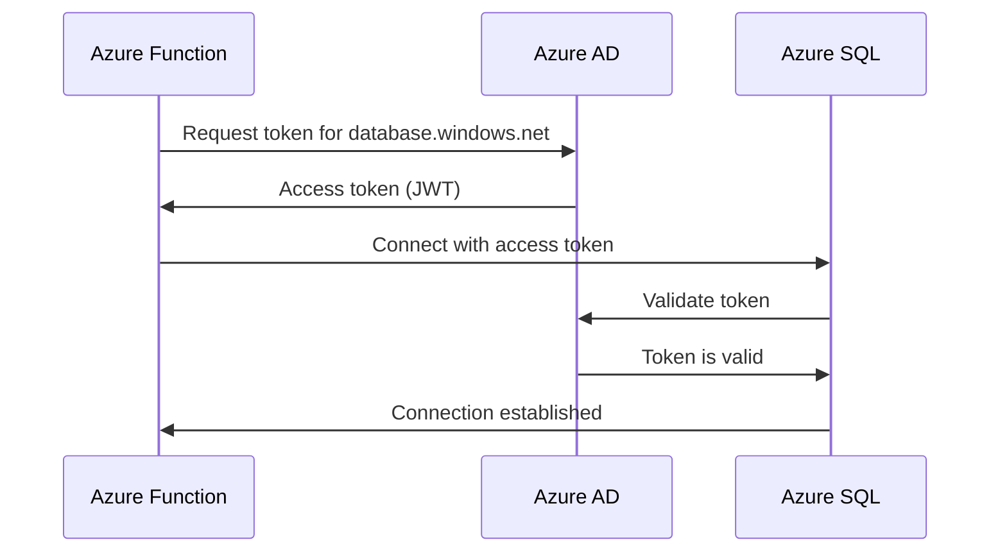

# How to Connect Azure Functions to Azure SQL Database with Managed Identity

Author: [nawazdhandala](https://www.github.com/nawazdhandala)

Tags: Azure Functions, Azure SQL, Managed Identity, Security, Passwordless, Azure, Authentication

Description: Eliminate connection string passwords by connecting Azure Functions to Azure SQL Database using managed identity for passwordless authentication.

---

Storing database passwords in connection strings is a security liability. Even when you put them in Azure Key Vault, you still have a secret to manage, rotate, and worry about. Managed identity eliminates this problem entirely by letting your Azure Function authenticate to Azure SQL Database using its Azure AD identity - no passwords involved.

In this post, I will walk through the complete setup from enabling managed identity on your function app to writing the code that uses it.

## How Managed Identity Authentication Works

When you enable managed identity on an Azure Function, Azure creates an identity for your function app in Azure Active Directory. Your function can then request an access token from Azure AD for any service that supports Azure AD authentication, including Azure SQL Database. The token is short-lived (usually 1 hour) and automatically refreshed by the runtime.



No password is stored anywhere. No secret needs to be rotated. The entire authentication flow is handled by the platform.

## Step 1: Enable Managed Identity

You can use either a system-assigned or user-assigned managed identity. System-assigned is simpler (it is tied to the lifecycle of the function app), but user-assigned gives you more flexibility if you have multiple function apps that need the same identity.

```bash
# Enable system-assigned managed identity on your function app
az functionapp identity assign \
  --name my-function-app \
  --resource-group my-resource-group

# The output includes the principal ID - save this for the next step
# Example output:
# {
#   "principalId": "abcd1234-5678-9012-3456-789012345678",
#   "tenantId": "your-tenant-id",
#   "type": "SystemAssigned"
# }
```

Note the `principalId` from the output. You will need it to grant database access.

## Step 2: Grant Database Access

This is the step that trips up most people. You need to create a user in the SQL database that maps to the managed identity, and then grant that user the appropriate permissions.

Connect to your Azure SQL Database using a tool like Azure Data Studio or sqlcmd. You need to connect as an Azure AD admin for this step.

```sql
-- Run these commands in the target database (not master)
-- Replace 'my-function-app' with your actual function app name

-- Create a user mapped to the function app's managed identity
CREATE USER [my-function-app] FROM EXTERNAL PROVIDER;

-- Grant the appropriate role
-- db_datareader and db_datawriter are suitable for most function apps
ALTER ROLE db_datareader ADD MEMBER [my-function-app];
ALTER ROLE db_datawriter ADD MEMBER [my-function-app];

-- If your function needs to execute stored procedures
GRANT EXECUTE TO [my-function-app];
```

For this to work, your SQL server must have an Azure AD administrator configured.

```bash
# Set an Azure AD admin on the SQL server
az sql server ad-admin create \
  --server-name my-sql-server \
  --resource-group my-resource-group \
  --display-name "SQL Admin" \
  --object-id <YOUR_AAD_USER_OBJECT_ID>
```

## Step 3: Update the Connection String

The connection string changes when you switch to managed identity. You remove the password and add `Authentication=Active Directory Default` instead.

```bash
# Set the connection string in your function app settings
# Note: no password, no User ID - just the server and database
az functionapp config appsettings set \
  --name my-function-app \
  --resource-group my-resource-group \
  --settings "SqlConnectionString=Server=tcp:my-sql-server.database.windows.net,1433;Database=mydb;Authentication=Active Directory Default;Encrypt=True;TrustServerCertificate=False;"
```

The `Authentication=Active Directory Default` setting tells the Microsoft.Data.SqlClient driver to use the `DefaultAzureCredential` chain, which automatically picks up the managed identity when running in Azure and your developer credentials when running locally.

## Step 4: Write the Function Code

Here is a complete example of a function that queries Azure SQL using managed identity.

```csharp
using Microsoft.Azure.Functions.Worker;
using Microsoft.Azure.Functions.Worker.Http;
using Microsoft.Data.SqlClient;
using Microsoft.Extensions.Logging;
using System.Text.Json;

public class UserApi
{
    private readonly ILogger<UserApi> _logger;
    private readonly string _connectionString;

    public UserApi(ILogger<UserApi> logger, IConfiguration configuration)
    {
        _logger = logger;
        // The connection string uses Active Directory Default authentication
        _connectionString = configuration["SqlConnectionString"];
    }

    [Function("GetUsers")]
    public async Task<HttpResponseData> GetUsers(
        [HttpTrigger(AuthorizationLevel.Function, "get")] HttpRequestData req)
    {
        _logger.LogInformation("Fetching users from Azure SQL");

        var users = new List<User>();

        // SqlConnection will automatically use managed identity
        // because the connection string specifies Active Directory Default
        using var connection = new SqlConnection(_connectionString);
        await connection.OpenAsync();

        using var command = new SqlCommand("SELECT Id, Name, Email FROM Users", connection);
        using var reader = await command.ExecuteReaderAsync();

        while (await reader.ReadAsync())
        {
            users.Add(new User
            {
                Id = reader.GetInt32(0),
                Name = reader.GetString(1),
                Email = reader.GetString(2)
            });
        }

        _logger.LogInformation("Retrieved {Count} users", users.Count);

        var response = req.CreateResponse(System.Net.HttpStatusCode.OK);
        await response.WriteAsJsonAsync(users);
        return response;
    }
}
```

## Using Entity Framework Core

If you prefer Entity Framework Core, the managed identity setup works seamlessly.

```csharp
// In Program.cs - register the DbContext with managed identity connection
var host = new HostBuilder()
    .ConfigureFunctionsWebApplication()
    .ConfigureServices((context, services) =>
    {
        // Register the DbContext
        services.AddDbContext<AppDbContext>(options =>
        {
            var connectionString = context.Configuration["SqlConnectionString"];
            options.UseSqlServer(connectionString);
        });
    })
    .Build();

host.Run();
```

```csharp
// The DbContext - nothing special needed for managed identity
public class AppDbContext : DbContext
{
    public AppDbContext(DbContextOptions<AppDbContext> options) : base(options) { }

    public DbSet<User> Users { get; set; }
    public DbSet<Order> Orders { get; set; }
}
```

```csharp
// Using EF Core in the function
public class OrderApi
{
    private readonly AppDbContext _db;
    private readonly ILogger<OrderApi> _logger;

    public OrderApi(AppDbContext db, ILogger<OrderApi> logger)
    {
        _db = db;
        _logger = logger;
    }

    [Function("GetOrders")]
    public async Task<HttpResponseData> GetOrders(
        [HttpTrigger(AuthorizationLevel.Function, "get")] HttpRequestData req)
    {
        // EF Core uses the same managed identity connection under the hood
        var orders = await _db.Orders
            .Include(o => o.Items)
            .Where(o => o.Status == "Active")
            .OrderByDescending(o => o.CreatedAt)
            .Take(100)
            .ToListAsync();

        var response = req.CreateResponse(System.Net.HttpStatusCode.OK);
        await response.WriteAsJsonAsync(orders);
        return response;
    }
}
```

## Local Development

When running locally, the `Active Directory Default` authentication uses your developer credentials. Make sure you are signed into the Azure CLI or Visual Studio with an account that has access to the SQL database.

```bash
# Sign in to Azure CLI - your local identity will be used for SQL access
az login

# Verify your identity
az account show
```

You also need to create a database user for your developer identity.

```sql
-- Run this in the target database for each developer
CREATE USER [developer@company.com] FROM EXTERNAL PROVIDER;
ALTER ROLE db_datareader ADD MEMBER [developer@company.com];
ALTER ROLE db_datawriter ADD MEMBER [developer@company.com];
```

## Troubleshooting Common Issues

The most common error is "Login failed for user 'NT AUTHORITY\ANONYMOUS LOGON'." This usually means the managed identity user has not been created in the database, or the function app name in the `CREATE USER` statement does not match exactly.

Another common issue is the token cache. If you recently enabled managed identity and the connection fails, wait a few minutes for the identity to propagate through Azure AD.

If you are using VNET integration with a private SQL endpoint, make sure the DNS resolution is working correctly. The function app needs to resolve the SQL server hostname to its private IP address.

```bash
# Test DNS resolution from the function app's Kudu console
# Navigate to https://your-function-app.scm.azurewebsites.net/DebugConsole
nameresolver my-sql-server.database.windows.net
```

## Security Benefits

Switching to managed identity provides several concrete security improvements. There are no passwords to leak in source code, logs, or configuration files. There is no secret rotation to manage. Access can be audited through Azure AD sign-in logs. And you can use Conditional Access policies to add additional security controls.

This approach works with other Azure services too - Cosmos DB, Key Vault, Storage, Event Hubs, and Service Bus all support managed identity authentication. Once you start using it for SQL, you will likely want to adopt it across your entire Azure infrastructure.

## Summary

Connecting Azure Functions to Azure SQL with managed identity is a straightforward process: enable managed identity, create the database user, update the connection string, and use `Active Directory Default` authentication. The result is a passwordless connection that is more secure and easier to maintain than traditional connection strings with embedded credentials. The same pattern works across most Azure services, making managed identity a foundational building block for secure cloud applications.
