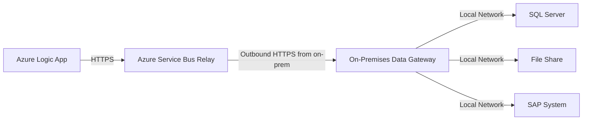

# How to Connect Azure Logic Apps to On-Premises Systems Using the Data Gateway

Author: [nawazdhandala](https://www.github.com/nawazdhandala)

Tags: Azure, Logic Apps, On-Premises Data Gateway, Hybrid Integration, SQL Server, File System, Enterprise

Description: Step-by-step guide to installing and configuring the on-premises data gateway so Azure Logic Apps can connect to databases, file shares, and APIs in your data center.

---

Azure Logic Apps can connect to hundreds of cloud-based services out of the box, but many enterprises still have critical systems running on-premises: SQL Server databases, file shares, SAP systems, Oracle databases, SharePoint on-premises, and custom APIs sitting behind a corporate firewall. The on-premises data gateway bridges this gap by creating a secure channel between Azure Logic Apps and your internal network, without requiring you to open inbound firewall ports or set up a VPN.

In this post, I will walk through how the data gateway works, how to install and configure it, and how to use it in your Logic App workflows.

## How the On-Premises Data Gateway Works

The gateway is a Windows service that you install on a machine inside your corporate network. It creates an outbound connection to Azure Service Bus, which acts as the relay. When a Logic App needs to access an on-premises resource, the request goes through Azure to the Service Bus relay, then down to the gateway, which executes the query or operation against your on-premises system and sends the result back.



Key points:
- The gateway only makes outbound connections (HTTPS to Azure). No inbound firewall rules needed.
- All data in transit is encrypted.
- The gateway supports multiple concurrent Logic App connections.
- One gateway installation can be used by multiple Logic Apps.

## Prerequisites

- A machine running Windows Server 2016 or later (or Windows 10/11 for dev/test)
- .NET Framework 4.8 or later
- The machine must have reliable network access to both your on-premises systems and the internet
- At least 8 GB RAM and 2 CPU cores recommended
- A Microsoft work or school account (the same Azure AD tenant as your Azure subscription)

## Step 1: Install the Gateway Software

Download the latest gateway installer from the Microsoft download center and run it on the machine that will host the gateway.

During installation:

1. Accept the default installation path or choose your own
2. Sign in with your Azure AD account
3. Choose "Register a new gateway on this computer"
4. Give the gateway a name (e.g., "gw-datacenter-east")
5. Create a recovery key and store it securely (you will need this if you ever need to move or restore the gateway)
6. Click Configure

The installer sets up a Windows service called "On-premises data gateway service" that starts automatically.

## Step 2: Create the Gateway Resource in Azure

After installing the gateway software, create a corresponding resource in Azure that Logic Apps can reference:

```bash
# Create the on-premises data gateway resource in Azure
# The gateway must already be installed and registered
az resource create \
  --resource-group rg-workflows \
  --resource-type Microsoft.Web/connectionGateways \
  --name gw-datacenter-east \
  --location eastus \
  --properties '{
    "connectionGatewayInstallation": {
      "id": "/subscriptions/<sub-id>/providers/Microsoft.Web/locations/eastus/connectionGatewayInstallations/<installation-id>"
    }
  }'
```

Alternatively (and more commonly), create it through the portal:

1. Search for "On-premises data gateways" in the Azure portal
2. Click "+ Create"
3. Select your subscription and resource group
4. Choose the installation name from the dropdown (it should show the gateway you just installed)
5. Click Create

## Step 3: Create an API Connection Using the Gateway

Before you can use the gateway in a Logic App, you need to create an API connection that references it. Let me walk through the most common scenario: connecting to an on-premises SQL Server.

### In the Portal

1. Go to your Logic App designer
2. Add a new action and search for "SQL Server"
3. Select an action like "Get rows" or "Execute a SQL query"
4. When prompted for a connection, you will see an option to "Connect via on-premises data gateway"
5. Fill in the connection details:
   - **Connection Name**: A descriptive name like "sql-erp-database"
   - **Authentication Type**: Windows or SQL Server Authentication
   - **SQL server name**: The hostname or IP as seen from the gateway machine (e.g., `sqlserver01.internal.company.com`)
   - **SQL database name**: The database name
   - **Username and Password**: Credentials for the database
   - **Gateway**: Select the gateway you created in Step 2
6. Click Create

### Using an ARM Template

For repeatable deployments, define the connection in an ARM template:

```json
{
  "type": "Microsoft.Web/connections",
  "apiVersion": "2016-06-01",
  "name": "sql-onprem-connection",
  "location": "eastus",
  "properties": {
    "displayName": "On-Prem SQL Server - ERP Database",
    "api": {
      "id": "/subscriptions/<sub-id>/providers/Microsoft.Web/locations/eastus/managedApis/sql"
    },
    "parameterValues": {
      "server": "sqlserver01.internal.company.com",
      "database": "ERPDatabase",
      "authType": "windows",
      "username": "DOMAIN\\serviceaccount",
      "password": "<password>",
      "gateway": {
        "id": "/subscriptions/<sub-id>/resourceGroups/rg-workflows/providers/Microsoft.Web/connectionGateways/gw-datacenter-east"
      }
    }
  }
}
```

## Step 4: Use the Connection in Your Logic App

Now you can use on-premises SQL Server actions in your Logic App just like you would use any cloud connector.

Example workflow - sync on-premises data to Azure:

1. **Trigger**: Recurrence (every hour)
2. **Action**: SQL Server - Execute a SQL query (via gateway)
   - Query: `SELECT * FROM Orders WHERE ModifiedDate >= DATEADD(hour, -1, GETDATE())`
3. **Action**: For each row in the results
4. **Action**: Azure SQL Database - Insert row (cloud database)

The gateway handles all the networking transparently. Your Logic App workflow does not need to know anything about firewalls, VPNs, or network topology.

## Supported Connectors

The on-premises data gateway supports these connectors in Logic Apps:

- **SQL Server** - query and modify data in on-premises SQL databases
- **File System** - read, create, and manage files on network shares
- **SharePoint** - interact with SharePoint on-premises lists and libraries
- **Oracle Database** - query Oracle databases
- **SAP** - integrate with SAP ERP systems
- **IBM DB2** - connect to DB2 databases
- **IBM MQ** - send and receive messages from IBM MQ queues
- **MySQL** - connect to on-premises MySQL databases
- **PostgreSQL** - connect to on-premises PostgreSQL databases
- **BizTalk Server** - integrate with BizTalk workflows

## Working with the File System Connector

The File System connector is particularly useful for integrating with legacy systems that drop files to shared folders:

```json
{
  "type": "ApiConnection",
  "inputs": {
    "host": {
      "connection": {
        "name": "@parameters('$connections')['filesystem']['connectionId']"
      }
    },
    "method": "get",
    "path": "/datasets/default/files",
    "queries": {
      "folderId": "\\\\fileserver\\incoming"
    }
  }
}
```

A common pattern is to watch a folder for new files, process them, and then move them to an archive folder:

1. **Trigger**: File System - When a file is created (polling trigger)
   - Folder: `\\fileserver\incoming`
2. **Action**: File System - Get file content
3. **Action**: Parse the file content (CSV, XML, JSON)
4. **Action**: Process the data (insert into database, call an API, etc.)
5. **Action**: File System - Copy file to `\\fileserver\archive`
6. **Action**: File System - Delete original file from incoming folder

## Gateway High Availability

For production workloads, you do not want a single gateway machine as a point of failure. Set up a gateway cluster:

1. Install the gateway on a second machine
2. During installation, choose "Add to an existing gateway cluster"
3. Enter the recovery key from the first gateway installation
4. The two gateways form a cluster

When both are running, Logic Apps automatically distributes requests across them. If one goes down, all traffic routes to the other.

You can add up to 7 machines to a single gateway cluster.

## Performance Tuning

### Gateway Machine Sizing

The gateway machine should be dedicated to the gateway role. Do not run other heavy workloads on it. For moderate traffic (50-100 requests per minute), allocate:

- 4 CPU cores
- 16 GB RAM
- SSD storage

### Network Latency

Place the gateway machine as close to the on-premises data source as possible. If your SQL Server is in a specific data center, run the gateway in that same data center, not across a WAN link.

### Connection Pooling

The SQL Server connector reuses connections, but if you are running many concurrent workflows, you may need to increase the SQL Server connection pool size in the gateway configuration.

### Monitoring Gateway Health

Monitor the gateway through the portal:

1. Go to "On-premises data gateways" in the portal
2. Select your gateway
3. Check the status (online/offline), version, and cluster members

Set up an alert so you know if the gateway goes offline:

```bash
# Create a simple availability check for the gateway
# This queries the gateway resource status
az monitor metrics alert create \
  --resource-group rg-workflows \
  --name "GatewayOffline" \
  --scopes "/subscriptions/<sub-id>/resourceGroups/rg-workflows/providers/Microsoft.Web/connectionGateways/gw-datacenter-east" \
  --description "Alert when on-premises data gateway goes offline" \
  --condition "count status < 1" \
  --action-group "/subscriptions/<sub-id>/resourceGroups/rg-monitoring/providers/Microsoft.Insights/actionGroups/ag-ops-team"
```

## Troubleshooting Common Issues

**Gateway shows offline in the portal:** Check that the Windows service is running on the gateway machine. Open Services and look for "On-premises data gateway service." If it is stopped, start it. Check the gateway logs in `C:\Users\<gateway-user>\AppData\Local\Microsoft\On-premises data gateway\`.

**Connection timeout errors:** Verify the gateway machine can reach the on-premises resource. Test with a direct connection from the gateway machine (e.g., `sqlcmd` for SQL Server). If direct access works but the gateway connection fails, it is likely a credential or configuration issue.

**Slow query performance:** Check the network latency between the gateway machine and the data source. Also check whether the query itself is slow by running it directly on the data source.

**Gateway version mismatch:** Microsoft releases gateway updates monthly. Keep the gateway software updated, as old versions may not support newer connector features.

## Wrapping Up

The on-premises data gateway is the key to making Azure Logic Apps work in hybrid environments. It provides a secure, managed channel to your internal resources without exposing them to the internet or requiring complex VPN configurations. Install the gateway on a machine near your data sources, set up a cluster for high availability, and you have a reliable bridge between your cloud workflows and on-premises systems.
