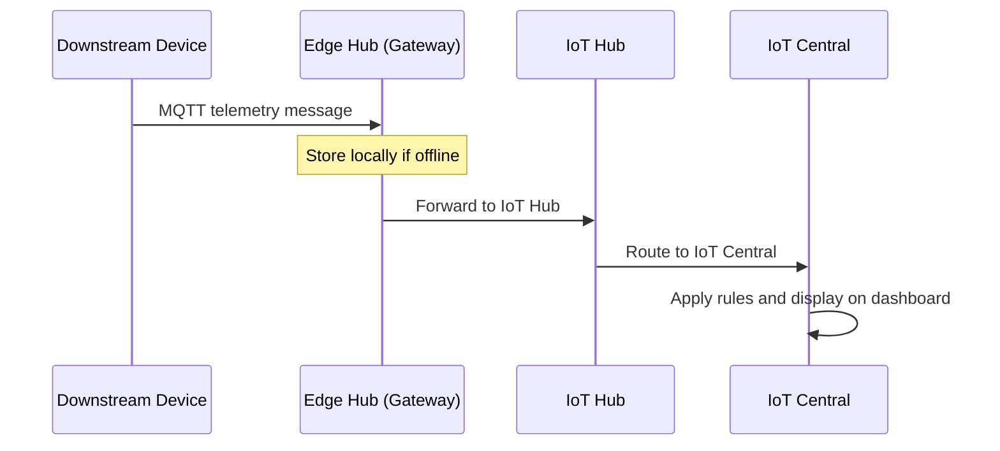

# How to Connect Downstream Devices to Azure IoT Central Through an IoT Edge Gateway

Author: [nawazdhandala](https://www.github.com/nawazdhandala)

Tags: Azure IoT Edge, IoT Central, Gateway Devices, Downstream Devices, Edge Computing, IoT Architecture, Device Connectivity

Description: Learn how to connect downstream IoT devices to Azure IoT Central through an IoT Edge gateway for protocol translation and local processing.

---

Not every IoT device can connect directly to the cloud. Some use protocols that IoT Central does not support natively, like Modbus or BLE. Others sit on isolated networks without internet access. Some are legacy devices with no TLS stack at all. In these situations, an Azure IoT Edge gateway acts as the intermediary - downstream devices connect to the gateway over their native protocol, and the gateway handles the cloud communication on their behalf.

This guide walks through setting up an IoT Edge device as a transparent gateway in IoT Central, connecting downstream devices through it, and managing the telemetry flow.

## Gateway Patterns

Azure IoT Edge supports three gateway patterns:

1. **Transparent gateway** - Downstream devices have their own identity in IoT Hub/Central and connect through the gateway as if it were a network proxy. The gateway forwards messages without modifying them.
2. **Protocol translation gateway** - The gateway presents itself as a single device and translates from downstream protocols (Modbus, OPC-UA, BLE) into IoT Hub messages. Downstream devices do not have individual identities in the cloud.
3. **Identity translation gateway** - Downstream devices have their own cloud identities but cannot authenticate directly. The gateway handles authentication and identity mapping.

For this tutorial, we will focus on the transparent gateway pattern since it gives downstream devices their own identity and is the most common starting point.

## Step 1: Create the Edge Device Template in IoT Central

First, create a device template for the gateway device itself.

In IoT Central, go to Device Templates and click New. Select Azure IoT Edge and choose a deployment manifest. For a basic transparent gateway, use a manifest that includes the `edgeHub` and `edgeAgent` system modules.

Here is a minimal deployment manifest for a transparent gateway.

```json
{
  "modulesContent": {
    "$edgeAgent": {
      "properties.desired": {
        "schemaVersion": "1.1",
        "runtime": {
          "type": "docker",
          "settings": {
            "minDockerVersion": "v1.25"
          }
        },
        "systemModules": {
          "edgeAgent": {
            "type": "docker",
            "settings": {
              "image": "mcr.microsoft.com/azureiotedge-agent:1.4"
            }
          },
          "edgeHub": {
            "type": "docker",
            "status": "running",
            "restartPolicy": "always",
            "settings": {
              "image": "mcr.microsoft.com/azureiotedge-hub:1.4"
            },
            "env": {
              "OptimizeForPerformance": {
                "value": "false"
              }
            }
          }
        },
        "modules": {}
      }
    },
    "$edgeHub": {
      "properties.desired": {
        "schemaVersion": "1.1",
        "routes": {
          "upstream": "FROM /messages/* INTO $upstream"
        },
        "storeAndForwardConfiguration": {
          "timeToLiveSecs": 7200
        }
      }
    }
  }
}
```

The `storeAndForwardConfiguration` is important - it tells the Edge Hub to buffer messages for up to 2 hours if the cloud connection is down. This is one of the main benefits of using a gateway: downstream devices keep working even during cloud connectivity outages.

## Step 2: Create the Downstream Device Template

Create a separate device template for the downstream devices. This is a regular (non-Edge) device template with the telemetry, properties, and commands that the downstream devices support.

For example, if your downstream devices are temperature sensors.

```json
{
  "@id": "dtmi:myorg:TemperatureSensor;1",
  "@type": "Interface",
  "@context": "dtmi:dtdl:context;2",
  "displayName": "Downstream Temperature Sensor",
  "contents": [
    {
      "@type": ["Telemetry", "Temperature"],
      "name": "temperature",
      "schema": "double",
      "unit": "degreeCelsius"
    },
    {
      "@type": "Telemetry",
      "name": "batteryVoltage",
      "schema": "double"
    },
    {
      "@type": "Property",
      "name": "firmwareVersion",
      "schema": "string",
      "writable": false
    }
  ]
}
```

## Step 3: Set Up the IoT Edge Runtime on the Gateway

Install and configure IoT Edge on the gateway device. This is typically a Linux machine on the local network.

```bash
# Install IoT Edge runtime on Ubuntu 22.04
wget https://packages.microsoft.com/config/ubuntu/22.04/packages-microsoft-prod.deb -O packages-microsoft-prod.deb
sudo dpkg -i packages-microsoft-prod.deb
rm packages-microsoft-prod.deb

# Install the IoT Edge runtime
sudo apt-get update
sudo apt-get install -y aziot-edge

# Provision the Edge device with a connection string from IoT Central
sudo iotedge config mp --connection-string "HostName=..."

# Apply the configuration
sudo iotedge config apply
```

## Step 4: Configure the Gateway for Transparent Mode

For downstream devices to connect through the gateway, the Edge Hub needs to accept connections from non-Edge devices. This requires generating gateway certificates.

```bash
# Generate test CA certificates for the gateway
# In production, use your organization's PKI

# Clone the IoT Edge certificate generation scripts
git clone https://github.com/Azure/iotedge.git
cd iotedge/tools/CACertificates

# Generate root CA
./certGen.sh create_root_and_intermediate

# Generate the Edge device CA certificate
./certGen.sh create_edge_device_ca_certificate "my-gateway"
```

Update the IoT Edge configuration to use these certificates.

```bash
# Edit the IoT Edge config file
sudo nano /etc/aziot/config.toml
```

Add the certificate paths to the configuration.

```toml
# Trust bundle - the root CA certificate
trust_bundle_cert = "file:///path/to/certs/azure-iot-test-only.root.ca.cert.pem"

[edge_ca]
cert = "file:///path/to/certs/iot-edge-device-ca-my-gateway-full-chain.cert.pem"
pk = "file:///path/to/private/iot-edge-device-ca-my-gateway.key.pem"
```

Apply the configuration and verify.

```bash
sudo iotedge config apply
sudo iotedge check
```

The `iotedge check` command validates the configuration and reports any issues with certificates, connectivity, or module deployment.

## Step 5: Register Downstream Devices with Gateway Relationship

In IoT Central, create the downstream devices and associate them with the gateway.

1. Go to Devices and click New
2. Select the downstream device template
3. Enter a device name and ID
4. Under "Attach to gateway," select your Edge gateway device
5. Click Create

This establishes the parent-child relationship between the gateway and the downstream device.

## Step 6: Connect the Downstream Device Through the Gateway

The downstream device connects to the Edge Hub on the gateway using the same MQTT or AMQP protocol it would use to connect to IoT Hub directly. The key difference is the hostname - it points to the gateway instead of IoT Hub.

```javascript
// downstream-device.js - Connect through the Edge gateway
const { Client } = require('azure-iot-device');
const { Mqtt } = require('azure-iot-device-mqtt');
const fs = require('fs');

// The connection string points to IoT Hub but the device connects via the gateway
const connectionString = 'HostName=my-iot-central-hub.azure-devices.net;DeviceId=downstream-sensor-01;SharedAccessKey=...;GatewayHostName=my-gateway.local';

const client = Client.fromConnectionString(connectionString, Mqtt);

// Trust the gateway's CA certificate
client.setOptions({
  ca: fs.readFileSync('/path/to/azure-iot-test-only.root.ca.cert.pem', 'utf8')
});

async function main() {
  await client.open();
  console.log('Connected through gateway');

  // Send telemetry - this flows through the Edge Hub to IoT Central
  const { Message } = require('azure-iot-common');

  setInterval(async () => {
    const data = {
      temperature: 20 + Math.random() * 10,
      batteryVoltage: 3.2 + Math.random() * 0.3
    };

    const msg = new Message(JSON.stringify(data));
    msg.contentType = 'application/json';
    msg.contentEncoding = 'utf-8';

    await client.sendEvent(msg);
    console.log(`Sent: temp=${data.temperature.toFixed(1)}`);
  }, 10000);
}

main().catch(console.error);
```

Notice the `GatewayHostName` parameter in the connection string. This tells the device SDK to connect to the gateway instead of directly to IoT Hub. The gateway then forwards the messages upstream.

## Understanding the Message Flow

Here is how telemetry flows from a downstream device through the gateway to IoT Central.



## Offline Buffering

One of the primary reasons to use a gateway is offline resilience. When the gateway loses its cloud connection, the Edge Hub buffers messages from downstream devices. The buffer size and duration are configurable in the deployment manifest.

```json
{
  "$edgeHub": {
    "properties.desired": {
      "storeAndForwardConfiguration": {
        "timeToLiveSecs": 86400
      }
    }
  }
}
```

Setting `timeToLiveSecs` to 86400 gives you 24 hours of buffering. Keep in mind that messages are stored on disk, so make sure the gateway has sufficient storage. A rough estimate: if downstream devices generate 1 KB per message at 10-second intervals, each device produces about 8.6 MB per day.

## Managing Gateway Relationships in IoT Central

IoT Central displays the gateway-downstream relationship in the device explorer. When you click on the gateway device, you can see all downstream devices associated with it. This makes it easy to manage the entire local network from the cloud.

You can also create device groups based on the gateway relationship, which is useful for dashboards that show all sensors in a specific facility (all connected through the same gateway).

## Troubleshooting Common Issues

**Downstream device cannot connect to the gateway.** Check that the gateway hostname resolves from the downstream device's network. Ensure the root CA certificate is trusted by the downstream device. Verify that port 8883 (MQTT) or 5671 (AMQP) is open on the gateway.

**Messages reach the gateway but not IoT Central.** Check the Edge Hub logs with `sudo iotedge logs edgeHub`. Look for routing errors or authentication failures. Verify the upstream route is configured correctly in the deployment manifest.

**High latency in telemetry.** If the gateway is buffering messages unnecessarily, check its cloud connectivity. Edge Hub batches messages for efficiency, which can add a few seconds of latency even when online.

## Wrapping Up

Using an IoT Edge gateway with IoT Central gives you the best of both worlds: the managed cloud experience of IoT Central for monitoring, rules, and dashboards, combined with the local processing and offline resilience of IoT Edge for devices that cannot connect directly to the cloud. The transparent gateway pattern is the simplest starting point, and you can evolve toward protocol translation or identity translation as your needs grow. The key is getting the certificate chain right and understanding the message flow from downstream device through Edge Hub to IoT Central.
