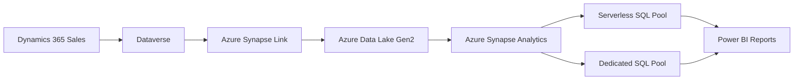

# How to Connect Dynamics 365 Sales Data to Azure Synapse Analytics for Advanced Reporting

Author: [nawazdhandala](https://www.github.com/nawazdhandala)

Tags: Dynamics 365, Azure Synapse Analytics, Reporting, Data Analytics, Power BI, Dataverse, SQL

Description: Connect Dynamics 365 Sales data to Azure Synapse Analytics using Azure Synapse Link for Dataverse to enable advanced reporting and analytics.

---

Dynamics 365 is great at managing sales processes - leads, opportunities, quotes, and orders. But when the sales team asks for complex cross-entity reports, year-over-year trend analysis, or predictions based on historical data, Dynamics 365's built-in reporting tools start to feel limiting. You need an analytics platform that can handle large data volumes, complex queries, and joins across multiple entities without affecting your production CRM performance.

Azure Synapse Analytics is that platform, and with Azure Synapse Link for Dataverse, you can get your Dynamics 365 data flowing into Synapse with near real-time sync and zero-code setup. In this guide, I will walk through setting up the data pipeline, building analytics queries, and creating Power BI reports on top of Synapse.

## Architecture



Azure Synapse Link continuously exports Dataverse tables to Azure Data Lake Storage Gen2 in Delta Lake format. Synapse Analytics reads from the data lake using either serverless SQL pools (pay per query) or dedicated SQL pools (provisioned capacity). Power BI connects to Synapse for the reporting layer.

## Setting Up Azure Synapse Link for Dataverse

First, enable Azure Synapse Link in your Dynamics 365 environment:

1. Go to the Power Platform admin center
2. Select your environment
3. Navigate to Settings, then Data management, then Azure Synapse Link

Or set it up programmatically:

```bash
# Create the Azure Data Lake Storage account
az storage account create \
  --name stdataverse365 \
  --resource-group rg-d365-analytics \
  --location eastus \
  --sku Standard_LRS \
  --kind StorageV2 \
  --hns true  # Enable hierarchical namespace for Data Lake Gen2

# Create a container for Dataverse data
az storage container create \
  --name dataverse-d365-sales \
  --account-name stdataverse365

# Create the Synapse workspace
az synapse workspace create \
  --name synapse-d365-analytics \
  --resource-group rg-d365-analytics \
  --storage-account stdataverse365 \
  --file-system dataverse-d365-sales \
  --sql-admin-login-user sqladmin \
  --sql-admin-login-password "YourSecurePassword123!" \
  --location eastus
```

## Configuring Synapse Link Tables

Select the Dynamics 365 entities you want to sync to Synapse. For sales analytics, these are the key tables:

- **account** - Customer accounts
- **contact** - Individual contacts
- **lead** - Sales leads
- **opportunity** - Sales opportunities
- **quote** - Price quotes
- **salesorder** - Sales orders
- **product** - Product catalog
- **opportunityproduct** - Line items on opportunities
- **systemuser** - Sales reps (users)
- **team** - Sales teams
- **businessunit** - Business units / divisions

After configuration, Synapse Link performs an initial sync (which can take hours for large datasets) and then continuously streams changes with a latency of around 15-30 minutes.

## Querying Dataverse Tables with Serverless SQL

Once the data is flowing, you can query it using Synapse's serverless SQL pool. The data is stored as Delta Lake files in the data lake, and Synapse provides views to access them as regular SQL tables:

```sql
-- Create a database for the sales analytics
CREATE DATABASE SalesAnalytics;
GO

USE SalesAnalytics;
GO

-- Create an external data source pointing to the Dataverse export
CREATE EXTERNAL DATA SOURCE DataverseExport
WITH (
    LOCATION = 'https://stdataverse365.dfs.core.windows.net/dataverse-d365-sales'
);
GO

-- Query the opportunity table directly from the data lake
SELECT
    o.name AS OpportunityName,
    o.estimatedvalue AS EstimatedValue,
    o.actualvalue AS ActualValue,
    o.statecode AS State,
    o.statuscode AS Status,
    o.actualclosedate AS CloseDate,
    a.name AS AccountName,
    u.fullname AS SalesRepName
FROM
    OPENROWSET(
        BULK 'opportunity/*.parquet',
        DATA_SOURCE = 'DataverseExport',
        FORMAT = 'DELTA'
    ) AS o
LEFT JOIN
    OPENROWSET(
        BULK 'account/*.parquet',
        DATA_SOURCE = 'DataverseExport',
        FORMAT = 'DELTA'
    ) AS a ON o.parentaccountid = a.accountid
LEFT JOIN
    OPENROWSET(
        BULK 'systemuser/*.parquet',
        DATA_SOURCE = 'DataverseExport',
        FORMAT = 'DELTA'
    ) AS u ON o.ownerid = u.systemuserid
WHERE
    YEAR(o.actualclosedate) = 2026;
```

## Building Views for Common Analytics Queries

Create reusable views that the analytics team can use without writing complex OPENROWSET queries:

```sql
-- View: Sales pipeline summary by stage
CREATE VIEW vw_PipelineSummary AS
SELECT
    CASE o.salesstage
        WHEN 0 THEN 'Qualify'
        WHEN 1 THEN 'Develop'
        WHEN 2 THEN 'Propose'
        WHEN 3 THEN 'Close'
        ELSE 'Unknown'
    END AS SalesStage,
    COUNT(*) AS OpportunityCount,
    SUM(o.estimatedvalue) AS TotalPipelineValue,
    AVG(o.estimatedvalue) AS AvgDealSize,
    AVG(o.closeprobability) AS AvgWinProbability
FROM
    OPENROWSET(
        BULK 'opportunity/*.parquet',
        DATA_SOURCE = 'DataverseExport',
        FORMAT = 'DELTA'
    ) AS o
WHERE
    o.statecode = 0  -- Open opportunities only
GROUP BY
    o.salesstage;
GO

-- View: Sales rep performance with quota attainment
CREATE VIEW vw_SalesRepPerformance AS
SELECT
    u.fullname AS SalesRep,
    t.name AS Team,
    COUNT(CASE WHEN o.statecode = 1 THEN 1 END) AS WonDeals,
    COUNT(CASE WHEN o.statecode = 2 THEN 1 END) AS LostDeals,
    SUM(CASE WHEN o.statecode = 1 THEN o.actualvalue ELSE 0 END) AS TotalRevenue,
    AVG(CASE WHEN o.statecode = 1
        THEN DATEDIFF(day, o.createdon, o.actualclosedate)
        ELSE NULL END) AS AvgDaysToClose,
    CASE
        WHEN COUNT(CASE WHEN o.statecode IN (1,2) THEN 1 END) > 0
        THEN CAST(COUNT(CASE WHEN o.statecode = 1 THEN 1 END) AS FLOAT) /
             COUNT(CASE WHEN o.statecode IN (1,2) THEN 1 END) * 100
        ELSE 0
    END AS WinRatePercent
FROM
    OPENROWSET(BULK 'systemuser/*.parquet', DATA_SOURCE = 'DataverseExport', FORMAT = 'DELTA') AS u
LEFT JOIN
    OPENROWSET(BULK 'opportunity/*.parquet', DATA_SOURCE = 'DataverseExport', FORMAT = 'DELTA') AS o
    ON o.ownerid = u.systemuserid
LEFT JOIN
    OPENROWSET(BULK 'team/*.parquet', DATA_SOURCE = 'DataverseExport', FORMAT = 'DELTA') AS t
    ON u.teamid = t.teamid
GROUP BY
    u.fullname, t.name;
GO

-- View: Monthly revenue trend
CREATE VIEW vw_MonthlyRevenueTrend AS
SELECT
    YEAR(o.actualclosedate) AS Year,
    MONTH(o.actualclosedate) AS Month,
    COUNT(*) AS DealsWon,
    SUM(o.actualvalue) AS Revenue,
    AVG(o.actualvalue) AS AvgDealSize
FROM
    OPENROWSET(BULK 'opportunity/*.parquet', DATA_SOURCE = 'DataverseExport', FORMAT = 'DELTA') AS o
WHERE
    o.statecode = 1  -- Won opportunities
    AND o.actualclosedate IS NOT NULL
GROUP BY
    YEAR(o.actualclosedate),
    MONTH(o.actualclosedate);
GO
```

## Lead Conversion Analysis

One of the most valuable analytics you can build is lead-to-opportunity conversion tracking:

```sql
-- View: Lead conversion funnel analysis
CREATE VIEW vw_LeadConversionFunnel AS
SELECT
    YEAR(l.createdon) AS Year,
    MONTH(l.createdon) AS Month,
    l.leadsourcecode AS LeadSource,
    COUNT(*) AS TotalLeads,
    COUNT(CASE WHEN l.statecode = 1 THEN 1 END) AS QualifiedLeads,
    COUNT(CASE WHEN l.statecode = 2 THEN 1 END) AS DisqualifiedLeads,
    CASE
        WHEN COUNT(*) > 0
        THEN CAST(COUNT(CASE WHEN l.statecode = 1 THEN 1 END) AS FLOAT) / COUNT(*) * 100
        ELSE 0
    END AS ConversionRatePercent,
    AVG(CASE WHEN l.statecode = 1
        THEN DATEDIFF(day, l.createdon, l.modifiedon)
        ELSE NULL END) AS AvgDaysToQualify
FROM
    OPENROWSET(BULK 'lead/*.parquet', DATA_SOURCE = 'DataverseExport', FORMAT = 'DELTA') AS l
GROUP BY
    YEAR(l.createdon),
    MONTH(l.createdon),
    l.leadsourcecode;
GO
```

## Connecting Power BI to Synapse

Create a Power BI report that connects to the Synapse serverless SQL pool:

```
Connection type: Azure Synapse Analytics SQL
Server: synapse-d365-analytics-ondemand.sql.azuresynapse.net
Database: SalesAnalytics
Authentication: Azure AD (for SSO)
```

In Power BI, import the views you created:

```dax
// DAX measure: Year-over-year revenue growth
Revenue Growth % =
VAR CurrentYearRevenue = [Total Revenue]
VAR PreviousYearRevenue =
    CALCULATE(
        [Total Revenue],
        DATEADD('vw_MonthlyRevenueTrend'[Date], -1, YEAR)
    )
RETURN
    IF(
        PreviousYearRevenue > 0,
        DIVIDE(CurrentYearRevenue - PreviousYearRevenue, PreviousYearRevenue) * 100,
        BLANK()
    )
```

## Handling Data Freshness

Synapse Link typically has a 15-30 minute lag. For real-time dashboards, add a data freshness indicator:

```sql
-- Check the last sync time for each table
SELECT
    name AS TableName,
    last_modified AS LastSyncTime,
    DATEDIFF(MINUTE, last_modified, GETUTCDATE()) AS MinutesSinceSync
FROM
    sys.external_tables
ORDER BY
    last_modified DESC;
```

## Cost Optimization

Serverless SQL pools charge per terabyte of data scanned. Here are ways to keep costs down:

- Use specific column projections in your SELECT statements instead of SELECT *.
- Partition your data by date when creating materialized views.
- Cache frequently accessed queries in a dedicated SQL pool if the cost justifies it.
- Use Power BI's import mode with scheduled refresh instead of DirectQuery for dashboards that do not need real-time data.

## Wrapping Up

Connecting Dynamics 365 Sales data to Azure Synapse Analytics through Synapse Link for Dataverse gives your analytics team the ability to run complex queries, build historical trend reports, and perform cross-entity analysis without putting any load on your production CRM. The serverless SQL pool keeps costs proportional to actual usage, and the views you create provide a clean, reusable interface for Power BI and other reporting tools. Once the pipeline is set up, new data flows automatically, and your reports stay current with minimal maintenance.
