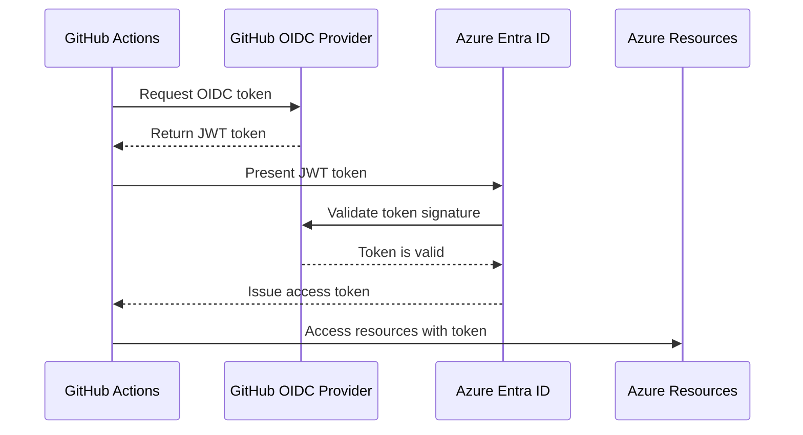

# How to Connect GitHub Actions to Azure Using OIDC for Passwordless Authentication

Author: [nawazdhandala](https://www.github.com/nawazdhandala)

Tags: GitHub Actions, Azure, OIDC, Passwordless Authentication, CI/CD, Security, Federated Credentials

Description: Set up OpenID Connect between GitHub Actions and Azure to eliminate stored secrets and enable passwordless deployments.

---

If you are using GitHub Actions to deploy to Azure, there is a good chance you have a client secret or service principal password stored as a GitHub secret. It works, but it comes with problems. Secrets expire, they can be leaked, they need to be rotated, and managing them across dozens of repositories is tedious.

OpenID Connect (OIDC) federation solves this by letting GitHub Actions authenticate to Azure without any stored credentials. Instead of presenting a secret, the GitHub Actions runner presents a short-lived token issued by GitHub, and Azure validates it using a trust relationship. No secrets to rotate, no credentials to leak.

In this post, I will walk through setting up OIDC federation from scratch, configuring the Azure side, updating your GitHub Actions workflow, and handling the common gotchas.

## How OIDC Federation Works

The flow is straightforward once you understand the pieces:

1. Your GitHub Actions workflow requests an OIDC token from GitHub's token service
2. The workflow presents this token to Azure Active Directory (now Entra ID)
3. Azure validates the token against the trust relationship you configured
4. If valid, Azure issues a short-lived access token
5. Your workflow uses this access token to interact with Azure resources

The key insight is that GitHub acts as the identity provider, and Azure trusts it because you explicitly configured that trust.



## Step 1: Create an Azure App Registration

First, you need an app registration in Azure Entra ID that will represent your GitHub Actions identity.

The following Azure CLI commands create the app registration and service principal.

```bash
# Create the app registration for GitHub Actions
az ad app create --display-name "github-actions-oidc"

# Get the app ID (you will need this later)
APP_ID=$(az ad app list --display-name "github-actions-oidc" --query "[0].appId" -o tsv)

# Create a service principal for the app
az ad sp create --id $APP_ID

# Get the service principal object ID
SP_OBJECT_ID=$(az ad sp show --id $APP_ID --query "id" -o tsv)
```

## Step 2: Add Federated Credentials

This is where you establish the trust relationship between Azure and GitHub. You are telling Azure: "When a token comes from GitHub Actions running in this specific repository, trust it."

The following commands create federated credentials for different scenarios.

```bash
# Create federated credential for the main branch
az ad app federated-credential create --id $APP_ID --parameters '{
  "name": "github-main-branch",
  "issuer": "https://token.actions.githubusercontent.com",
  "subject": "repo:myorg/myrepo:ref:refs/heads/main",
  "description": "GitHub Actions - main branch",
  "audiences": ["api://AzureADTokenExchange"]
}'

# Create federated credential for pull requests
az ad app federated-credential create --id $APP_ID --parameters '{
  "name": "github-pull-requests",
  "issuer": "https://token.actions.githubusercontent.com",
  "subject": "repo:myorg/myrepo:pull_request",
  "description": "GitHub Actions - pull requests",
  "audiences": ["api://AzureADTokenExchange"]
}'

# Create federated credential for a specific environment
az ad app federated-credential create --id $APP_ID --parameters '{
  "name": "github-production-env",
  "issuer": "https://token.actions.githubusercontent.com",
  "subject": "repo:myorg/myrepo:environment:production",
  "description": "GitHub Actions - production environment",
  "audiences": ["api://AzureADTokenExchange"]
}'
```

The `subject` claim is critical. It determines which GitHub Actions runs can authenticate. You can scope it to:

- A specific branch: `repo:org/repo:ref:refs/heads/main`
- Pull requests: `repo:org/repo:pull_request`
- A specific environment: `repo:org/repo:environment:production`
- A specific tag: `repo:org/repo:ref:refs/tags/v1.0`

## Step 3: Assign Azure RBAC Roles

The service principal needs permissions to access your Azure resources. Assign roles based on the principle of least privilege.

```bash
# Get your subscription ID
SUBSCRIPTION_ID=$(az account show --query "id" -o tsv)

# Assign Contributor role at the resource group level
az role assignment create \
  --assignee $APP_ID \
  --role "Contributor" \
  --scope "/subscriptions/$SUBSCRIPTION_ID/resourceGroups/my-resource-group"
```

Avoid assigning Contributor at the subscription level unless you genuinely need it. Scope the role to the specific resource group or resources that your workflow needs to access.

## Step 4: Configure GitHub Secrets

Even though you are going passwordless, you still need to tell your workflow the Azure identifiers. These are not secrets in the traditional sense - they are just identifiers.

Add these as GitHub secrets (or variables) in your repository:

- `AZURE_CLIENT_ID`: The app registration's application (client) ID
- `AZURE_TENANT_ID`: Your Azure Entra ID tenant ID
- `AZURE_SUBSCRIPTION_ID`: Your Azure subscription ID

## Step 5: Update Your GitHub Actions Workflow

Now update your workflow to use OIDC authentication. The critical piece is the `permissions` block, which must include `id-token: write`.

The following workflow demonstrates OIDC login and deploying to Azure.

```yaml
# .github/workflows/deploy.yml
name: Deploy to Azure

on:
  push:
    branches: [main]

# These permissions are required for OIDC token generation
permissions:
  id-token: write   # Required for requesting the OIDC JWT
  contents: read     # Required for actions/checkout

jobs:
  deploy:
    runs-on: ubuntu-latest
    environment: production  # Must match the federated credential subject

    steps:
      # Check out the repository code
      - uses: actions/checkout@v4

      # Authenticate to Azure using OIDC
      - name: Azure Login
        uses: azure/login@v2
        with:
          client-id: ${{ secrets.AZURE_CLIENT_ID }}
          tenant-id: ${{ secrets.AZURE_TENANT_ID }}
          subscription-id: ${{ secrets.AZURE_SUBSCRIPTION_ID }}

      # Verify the login worked
      - name: Verify login
        run: |
          az account show
          az group list --output table

      # Deploy your application
      - name: Deploy to Web App
        uses: azure/webapps-deploy@v3
        with:
          app-name: 'my-web-app'
          package: './dist'
```

Notice that there is no `creds` parameter in the login step. Instead, you pass the three individual identifiers, and the action handles the OIDC token exchange behind the scenes.

## Handling Multiple Environments

If you deploy to multiple environments (staging, production), you need separate federated credentials for each. The cleanest approach is to use GitHub Environments.

```yaml
# .github/workflows/deploy.yml
name: Multi-Environment Deploy

on:
  push:
    branches: [main]

permissions:
  id-token: write
  contents: read

jobs:
  deploy-staging:
    runs-on: ubuntu-latest
    environment: staging  # Matches federated credential for staging
    steps:
      - uses: actions/checkout@v4
      - name: Azure Login
        uses: azure/login@v2
        with:
          client-id: ${{ secrets.AZURE_CLIENT_ID }}
          tenant-id: ${{ secrets.AZURE_TENANT_ID }}
          subscription-id: ${{ secrets.AZURE_SUBSCRIPTION_ID }}
      - name: Deploy to staging
        run: |
          az webapp deploy --resource-group rg-staging \
            --name myapp-staging --src-path ./dist

  deploy-production:
    runs-on: ubuntu-latest
    needs: deploy-staging
    environment: production  # Matches federated credential for production
    steps:
      - uses: actions/checkout@v4
      - name: Azure Login
        uses: azure/login@v2
        with:
          client-id: ${{ secrets.AZURE_CLIENT_ID }}
          tenant-id: ${{ secrets.AZURE_TENANT_ID }}
          subscription-id: ${{ secrets.AZURE_SUBSCRIPTION_ID }}
      - name: Deploy to production
        run: |
          az webapp deploy --resource-group rg-production \
            --name myapp-production --src-path ./dist
```

## Common Issues and Solutions

**"AADSTS700024: Client assertion is not within its valid time range."** This happens when there is a clock skew between GitHub's OIDC provider and Azure. It usually resolves itself on retry. If it persists, check that your workflow is not caching a stale token.

**"No matching federated identity record found."** This is the most common error. It means the subject claim in the GitHub OIDC token does not match any federated credential on your app registration. Double-check:

- The repository name is exact (case-sensitive)
- The branch, environment, or event type matches
- The organization name is correct

**"Insufficient privileges to complete the operation."** The service principal needs the correct RBAC roles. Remember that OIDC only handles authentication - you still need to set up authorization separately.

**Reusable workflows need special subject claims.** If you are calling a workflow from another repository using `workflow_call`, the subject claim format is different: `repo:org/repo:environment:env-name` becomes based on the calling repository, not the called one.

## Security Best Practices

Scope federated credentials as narrowly as possible. Instead of allowing any branch, restrict to specific branches or environments. Instead of granting Contributor on the entire subscription, scope to specific resource groups.

Use GitHub Environments with protection rules. Combine OIDC with environment-level approvals and branch restrictions for defense in depth.

Audit your federated credentials regularly. Run `az ad app federated-credential list --id $APP_ID` periodically to check for stale or overly broad trust relationships.

## Wrapping Up

OIDC federation between GitHub Actions and Azure eliminates an entire class of security risks. No more secrets to rotate, no more worrying about credential expiration, and no more storing sensitive values in GitHub. The setup takes about 15 minutes, and once it is running, you never have to think about it again. If you are still using service principal secrets for your GitHub Actions deployments, switching to OIDC should be at the top of your to-do list.
