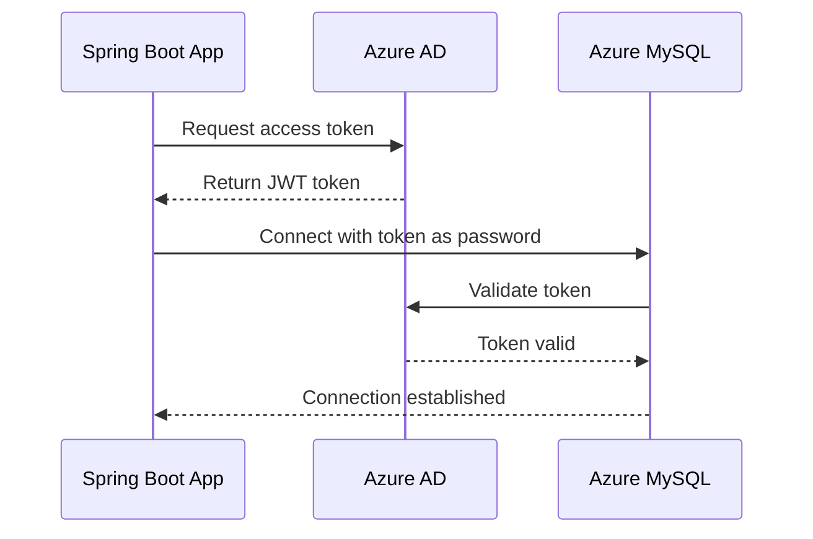

# How to Connect Spring Boot to Azure Database for MySQL with Azure AD Authentication

Author: [nawazdhandala](https://www.github.com/nawazdhandala)

Tags: Spring Boot, Azure Database for MySQL, Azure AD, Authentication, Java, Cloud Database, Security

Description: Learn how to connect a Spring Boot application to Azure Database for MySQL using Azure AD authentication for passwordless and secure database access.

---

Connecting to a database with a username and password is simple, but it comes with operational headaches. Passwords need to be rotated. They get accidentally committed to source control. They end up in plaintext configuration files on developer machines. Azure AD authentication for Azure Database for MySQL eliminates passwords entirely. Your application authenticates using its Azure AD identity, and Azure handles token issuance and rotation.

In this post, we will set up a Spring Boot application that connects to Azure Database for MySQL using Azure AD authentication. We will cover both managed identity authentication (for production) and developer identity authentication (for local development).

## How Azure AD Authentication Works with MySQL

Traditional MySQL authentication uses a username and password. With Azure AD authentication, the flow is different:

1. Your application requests an access token from Azure AD
2. Azure AD validates the identity and issues a short-lived token
3. Your application sends the token to MySQL as the password
4. MySQL validates the token and grants access



The token is short-lived (typically 1 hour), but the MySQL JDBC driver and the Azure identity library handle token refresh automatically.

## Prerequisites

Before we start, you need:

- An Azure Database for MySQL Flexible Server instance
- Azure CLI installed and logged in
- A Spring Boot application

## Setting Up Azure Database for MySQL

Create a MySQL Flexible Server with Azure AD authentication enabled.

```bash
# Create a resource group
az group create --name mysql-demo-rg --location eastus

# Create a MySQL Flexible Server
az mysql flexible-server create \
  --name my-mysql-server \
  --resource-group mysql-demo-rg \
  --location eastus \
  --admin-user mysqladmin \
  --admin-password "TempPassword123!" \
  --sku-name Standard_B1ms \
  --version 8.0.21 \
  --public-access 0.0.0.0

# Enable Azure AD authentication
az mysql flexible-server ad-admin create \
  --server-name my-mysql-server \
  --resource-group mysql-demo-rg \
  --display-name "your-email@domain.com" \
  --object-id "your-azure-ad-object-id"
```

The Azure AD admin can create additional database users that correspond to Azure AD identities.

## Creating an Azure AD Database User

Connect to MySQL as the Azure AD admin and create a user for your application.

```sql
-- Connect as the Azure AD admin first
-- Create a user for a managed identity
CREATE AADUSER 'my-app-identity' IDENTIFIED BY 'your-managed-identity-client-id';

-- Grant permissions to the application database
GRANT ALL PRIVILEGES ON myappdb.* TO 'my-app-identity'@'%';

-- Create the application database
CREATE DATABASE IF NOT EXISTS myappdb;

FLUSH PRIVILEGES;
```

## Project Setup

Add the necessary dependencies to your Spring Boot project.

```xml
<!-- pom.xml -->
<dependencies>
    <dependency>
        <groupId>org.springframework.boot</groupId>
        <artifactId>spring-boot-starter-web</artifactId>
    </dependency>

    <dependency>
        <groupId>org.springframework.boot</groupId>
        <artifactId>spring-boot-starter-data-jpa</artifactId>
    </dependency>

    <!-- MySQL JDBC Driver -->
    <dependency>
        <groupId>com.mysql</groupId>
        <artifactId>mysql-connector-j</artifactId>
        <scope>runtime</scope>
    </dependency>

    <!-- Azure Identity for token acquisition -->
    <dependency>
        <groupId>com.azure</groupId>
        <artifactId>azure-identity</artifactId>
        <version>1.11.1</version>
    </dependency>

    <!-- Azure Spring Boot starter for MySQL integration -->
    <dependency>
        <groupId>com.azure.spring</groupId>
        <artifactId>spring-cloud-azure-starter-jdbc-mysql</artifactId>
        <version>5.8.0</version>
    </dependency>
</dependencies>
```

## Configuring the Connection

The Spring Cloud Azure starter handles token acquisition automatically. Your configuration looks almost like a normal MySQL connection, but without a password.

```yaml
# application.yml
spring:
  datasource:
    url: jdbc:mysql://my-mysql-server.mysql.database.azure.com:3306/myappdb?useSSL=true&requireSSL=true&sslMode=REQUIRED
    username: my-app-identity
    # No password needed - the Azure Identity plugin provides the token

  cloud:
    azure:
      credential:
        # For managed identity in production
        managed-identity-enabled: true
        # Uncomment and set this for user-assigned managed identity
        # client-id: your-managed-identity-client-id

  jpa:
    hibernate:
      ddl-auto: update
    properties:
      hibernate:
        dialect: org.hibernate.dialect.MySQLDialect
    show-sql: true
```

## Manual Token-Based Authentication

If you prefer not to use the Spring Cloud Azure starter, you can implement token acquisition manually using a custom DataSource.

```java
import com.azure.identity.DefaultAzureCredential;
import com.azure.identity.DefaultAzureCredentialBuilder;
import com.azure.core.credential.AccessToken;
import com.azure.core.credential.TokenRequestContext;
import com.zaxxer.hikari.HikariConfig;
import com.zaxxer.hikari.HikariDataSource;
import org.springframework.context.annotation.Bean;
import org.springframework.context.annotation.Configuration;

import javax.sql.DataSource;

@Configuration
public class DataSourceConfig {

    // The scope for Azure Database for MySQL tokens
    private static final String MYSQL_SCOPE = "https://ossrdbms-aad.database.windows.net/.default";

    @Bean
    public DataSource dataSource() {
        DefaultAzureCredential credential = new DefaultAzureCredentialBuilder().build();

        HikariConfig config = new HikariConfig();
        config.setJdbcUrl("jdbc:mysql://my-mysql-server.mysql.database.azure.com:3306/myappdb?useSSL=true&sslMode=REQUIRED");
        config.setUsername("my-app-identity");

        // Get the initial token for the connection pool
        AccessToken token = credential.getToken(
            new TokenRequestContext().addScopes(MYSQL_SCOPE)).block();
        config.setPassword(token.getToken());

        // Connection pool settings
        config.setMaximumPoolSize(10);
        config.setMinimumIdle(2);

        // Set connection max lifetime shorter than token expiry
        // so connections are refreshed before tokens expire
        config.setMaxLifetime(1800000);  // 30 minutes

        return new HikariDataSource(config);
    }
}
```

This approach gives you more control but requires you to manage token refresh. The connection pool's max lifetime setting ensures connections are recycled before the token expires.

## Building the Application Layer

Let's create a simple entity and repository to verify everything works.

```java
import jakarta.persistence.*;

// JPA entity mapped to the 'employees' table
@Entity
@Table(name = "employees")
public class Employee {

    @Id
    @GeneratedValue(strategy = GenerationType.IDENTITY)
    private Long id;

    @Column(nullable = false)
    private String name;

    @Column(nullable = false, unique = true)
    private String email;

    private String department;
    private String title;

    // Default constructor required by JPA
    public Employee() {}

    public Employee(String name, String email, String department, String title) {
        this.name = name;
        this.email = email;
        this.department = department;
        this.title = title;
    }

    // Getters and setters
    public Long getId() { return id; }
    public void setId(Long id) { this.id = id; }
    public String getName() { return name; }
    public void setName(String name) { this.name = name; }
    public String getEmail() { return email; }
    public void setEmail(String email) { this.email = email; }
    public String getDepartment() { return department; }
    public void setDepartment(String department) { this.department = department; }
    public String getTitle() { return title; }
    public void setTitle(String title) { this.title = title; }
}
```

```java
import org.springframework.data.jpa.repository.JpaRepository;
import java.util.List;

// Spring Data JPA repository with derived query methods
public interface EmployeeRepository extends JpaRepository<Employee, Long> {
    List<Employee> findByDepartment(String department);
    List<Employee> findByNameContainingIgnoreCase(String name);
}
```

```java
import org.springframework.http.HttpStatus;
import org.springframework.http.ResponseEntity;
import org.springframework.web.bind.annotation.*;

import java.util.List;

@RestController
@RequestMapping("/api/employees")
public class EmployeeController {

    private final EmployeeRepository repository;

    public EmployeeController(EmployeeRepository repository) {
        this.repository = repository;
    }

    @PostMapping
    public ResponseEntity<Employee> create(@RequestBody Employee employee) {
        Employee saved = repository.save(employee);
        return ResponseEntity.status(HttpStatus.CREATED).body(saved);
    }

    @GetMapping
    public List<Employee> listAll() {
        return repository.findAll();
    }

    @GetMapping("/department/{dept}")
    public List<Employee> byDepartment(@PathVariable String dept) {
        return repository.findByDepartment(dept);
    }
}
```

## Local Development Setup

During local development, you can authenticate using your Azure CLI login.

```bash
# Login to Azure CLI
az login

# Your DefaultAzureCredential will use these credentials
```

Create a development-specific profile that uses your Azure CLI identity.

```yaml
# application-dev.yml
spring:
  datasource:
    url: jdbc:mysql://my-mysql-server.mysql.database.azure.com:3306/myappdb?useSSL=true&sslMode=REQUIRED
    username: your-email@domain.com  # Your Azure AD email
  cloud:
    azure:
      credential:
        managed-identity-enabled: false  # Use Azure CLI instead
```

Make sure your Azure AD user has been added as a MySQL user with the appropriate permissions.

## Firewall Configuration

Azure Database for MySQL has a firewall that blocks all connections by default. Configure it to allow your application.

```bash
# Allow Azure services to connect
az mysql flexible-server firewall-rule create \
  --name allow-azure-services \
  --server-name my-mysql-server \
  --resource-group mysql-demo-rg \
  --start-ip-address 0.0.0.0 \
  --end-ip-address 0.0.0.0

# Allow your development machine
az mysql flexible-server firewall-rule create \
  --name allow-dev-machine \
  --server-name my-mysql-server \
  --resource-group mysql-demo-rg \
  --start-ip-address YOUR_IP \
  --end-ip-address YOUR_IP
```

## Connection Pooling Considerations

When using token-based authentication, connection pooling requires extra attention. Tokens expire after about an hour. If a connection is older than the token, the connection becomes invalid.

Configure your connection pool to recycle connections before token expiry.

```yaml
spring:
  datasource:
    hikari:
      maximum-pool-size: 10
      minimum-idle: 2
      # Recycle connections every 30 minutes (token lasts ~60 minutes)
      max-lifetime: 1800000
      # Validate connections before use
      connection-test-query: SELECT 1
      # How long to wait for a connection from the pool
      connection-timeout: 30000
```

## Wrapping Up

Azure AD authentication for MySQL removes the burden of password management from your Spring Boot application. In production, managed identities provide truly passwordless authentication where no secrets exist to leak. During development, your Azure CLI login keeps things simple. The Spring Cloud Azure starter handles most of the complexity, but understanding the token flow helps when troubleshooting connection issues. Set your connection pool max lifetime shorter than the token expiry, configure your firewall rules correctly, and enjoy not having to rotate database passwords ever again.
