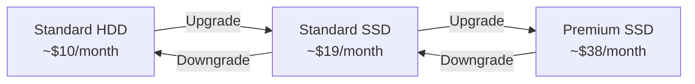

# How to Convert Azure Managed Disks Between Disk Types

Author: [nawazdhandala](https://www.github.com/nawazdhandala)

Tags: Azure, Managed Disks, Disk Conversion, Performance Tuning, Cost Optimization, Cloud Infrastructure

Description: Learn how to convert Azure Managed Disks between Standard HDD, Standard SSD, and Premium SSD to optimize cost and performance for your workloads.

---

Workload requirements change over time. A disk that started as Premium SSD during a launch might be fine as Standard SSD once traffic settles. Or a development server on Standard HDD might need an upgrade to Premium SSD before going to production. Azure lets you convert managed disks between types without losing data, though the process does require a brief VM deallocation. In this post, I will walk through how to convert disks between the standard tiers and what to watch out for.

## Which Conversions Are Supported?

You can convert between these disk types:

- Standard HDD to Standard SSD
- Standard HDD to Premium SSD
- Standard SSD to Standard HDD
- Standard SSD to Premium SSD
- Premium SSD to Standard HDD
- Premium SSD to Standard SSD

Ultra Disk and Premium SSD v2 have more limited conversion options. You generally cannot convert to or from these types directly - you would need to create a new disk and copy the data.

## Converting a Disk with Azure CLI

The basic process is: deallocate the VM, update the disk SKU, then start the VM.

```bash
# Step 1: Deallocate the VM
# The VM must be stopped (deallocated) to change the disk type
az vm deallocate \
  --name my-vm \
  --resource-group my-resource-group

echo "VM deallocated"

# Step 2: Update the disk SKU
# Convert from Standard HDD to Premium SSD
az disk update \
  --name my-data-disk \
  --resource-group my-resource-group \
  --sku Premium_LRS

echo "Disk converted to Premium SSD"

# Step 3: Start the VM
az vm start \
  --name my-vm \
  --resource-group my-resource-group

echo "VM started with converted disk"
```

You can verify the conversion was successful.

```bash
# Check the current disk type
az disk show \
  --name my-data-disk \
  --resource-group my-resource-group \
  --query "{name:name, sku:sku.name, size:diskSizeGb, tier:tier}" \
  --output table
```

## Converting the OS Disk

The process for OS disks is identical. Deallocate the VM, update the OS disk, and restart.

```bash
# Get the OS disk name
OS_DISK=$(az vm show \
  --name my-vm \
  --resource-group my-resource-group \
  --query "storageProfile.osDisk.name" -o tsv)

# Deallocate the VM
az vm deallocate --name my-vm --resource-group my-resource-group

# Convert the OS disk to Standard SSD
az disk update \
  --name "$OS_DISK" \
  --resource-group my-resource-group \
  --sku StandardSSD_LRS

# Restart the VM
az vm start --name my-vm --resource-group my-resource-group
```

## Converting with PowerShell

```powershell
# Stop the VM
Stop-AzVM -ResourceGroupName "my-resource-group" -Name "my-vm" -Force

# Convert a data disk from Standard HDD to Premium SSD
$disk = Get-AzDisk -ResourceGroupName "my-resource-group" -DiskName "my-data-disk"
$disk.Sku = [Microsoft.Azure.Management.Compute.Models.DiskSku]::new("Premium_LRS")
Update-AzDisk -ResourceGroupName "my-resource-group" -DiskName "my-data-disk" -Disk $disk

Write-Output "Disk converted to Premium SSD"

# Start the VM
Start-AzVM -ResourceGroupName "my-resource-group" -Name "my-vm"
```

## Converting All Disks on a VM

If you want to convert all disks attached to a VM (OS disk and all data disks), here is a script that handles them all.

```bash
#!/bin/bash
# Convert all disks on a VM to a target SKU

VM_NAME="my-vm"
RESOURCE_GROUP="my-resource-group"
TARGET_SKU="Premium_LRS"

echo "Deallocating VM $VM_NAME..."
az vm deallocate --name "$VM_NAME" --resource-group "$RESOURCE_GROUP"

# Get the OS disk name
OS_DISK=$(az vm show --name "$VM_NAME" --resource-group "$RESOURCE_GROUP" \
  --query "storageProfile.osDisk.name" -o tsv)

echo "Converting OS disk: $OS_DISK to $TARGET_SKU"
az disk update --name "$OS_DISK" --resource-group "$RESOURCE_GROUP" --sku "$TARGET_SKU"

# Get all data disk names
DATA_DISKS=$(az vm show --name "$VM_NAME" --resource-group "$RESOURCE_GROUP" \
  --query "storageProfile.dataDisks[].name" -o tsv)

# Convert each data disk
for DISK in $DATA_DISKS; do
  echo "Converting data disk: $DISK to $TARGET_SKU"
  az disk update --name "$DISK" --resource-group "$RESOURCE_GROUP" --sku "$TARGET_SKU"
done

echo "Starting VM $VM_NAME..."
az vm start --name "$VM_NAME" --resource-group "$RESOURCE_GROUP"

echo "All disks converted to $TARGET_SKU"
```

## Batch Converting Multiple VMs

For converting disks across an entire fleet, you can iterate over VMs.

```python
from azure.identity import DefaultAzureCredential
from azure.mgmt.compute import ComputeManagementClient

credential = DefaultAzureCredential()
subscription_id = "your-subscription-id"
compute = ComputeManagementClient(credential, subscription_id)

resource_group = "my-resource-group"
target_sku = "StandardSSD_LRS"

# List of VMs to convert
vms_to_convert = ["dev-vm-01", "dev-vm-02", "dev-vm-03"]

for vm_name in vms_to_convert:
    print(f"\nProcessing {vm_name}...")

    # Deallocate the VM
    print(f"  Deallocating {vm_name}")
    compute.virtual_machines.begin_deallocate(resource_group, vm_name).result()

    # Get the VM to find its disks
    vm = compute.virtual_machines.get(resource_group, vm_name)

    # Convert OS disk
    os_disk_name = vm.storage_profile.os_disk.name
    os_disk = compute.disks.get(resource_group, os_disk_name)
    os_disk.sku.name = target_sku
    print(f"  Converting OS disk {os_disk_name}")
    compute.disks.begin_create_or_update(resource_group, os_disk_name, os_disk).result()

    # Convert data disks
    for data_disk in vm.storage_profile.data_disks:
        disk = compute.disks.get(resource_group, data_disk.name)
        disk.sku.name = target_sku
        print(f"  Converting data disk {data_disk.name}")
        compute.disks.begin_create_or_update(resource_group, data_disk.name, disk).result()

    # Start the VM
    print(f"  Starting {vm_name}")
    compute.virtual_machines.begin_start(resource_group, vm_name).result()
    print(f"  {vm_name} complete")
```

## VM Size Compatibility

Premium SSD disks require a Premium-storage-capable VM size. If you convert disks to Premium SSD but your VM does not support it, the disk will not mount.

```bash
# Check if your VM size supports Premium storage
az vm show \
  --name my-vm \
  --resource-group my-resource-group \
  --query "hardwareProfile.vmSize" -o tsv

# Check the capabilities of that VM size
az vm list-sizes --location eastus \
  --query "[?name=='Standard_B2s'].{Name:name, MaxDisks:maxDataDiskCount}" \
  --output table
```

If the VM size does not support Premium storage, you need to resize the VM first (which also requires deallocation).

## Cost Impact of Conversion

Here is a rough comparison of monthly costs for a 256 GiB disk.



Converting to a lower tier saves money but reduces performance. Converting to a higher tier costs more but improves IOPS, throughput, and latency. There is no data transfer charge for the conversion itself - you only pay the difference in the monthly disk rate going forward.

## Performance Tier Overrides

For Premium SSD disks, you can set a performance tier independently of the disk size. This lets you get higher performance without changing the disk type.

```bash
# Set a 256 GiB (P15) disk to P30 performance tier
# This gives P30 IOPS and throughput without resizing the disk
az disk update \
  --name my-data-disk \
  --resource-group my-resource-group \
  --set tier=P30
```

This can be a useful alternative to converting disk types when you just need more IOPS.

## Best Practices

Schedule conversions during maintenance windows. Even though the process is quick, the VM must be deallocated, which means downtime.

Test the conversion on non-production VMs first. Verify that performance meets expectations before converting production disks.

Monitor disk metrics after conversion. Use Azure Monitor to compare IOPS, throughput, and latency before and after the change.

Consider converting back after peak periods. If you upgraded to Premium SSD for a seasonal traffic spike, convert back to Standard SSD when the spike is over to save money.

Disk type conversion is a practical tool for matching your storage costs and performance to your actual workload needs. The process is simple and data-safe - just remember to plan for the brief deallocation window.
