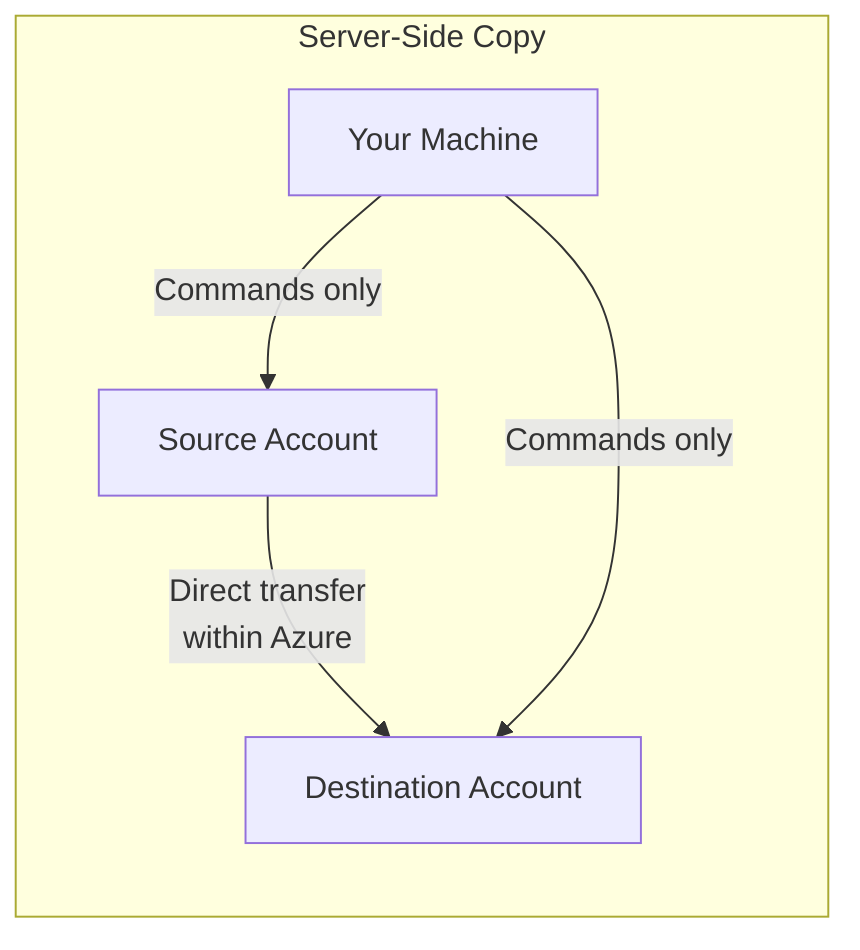

# How to Copy Data Between Two Azure Storage Accounts Using AzCopy

Author: [nawazdhandala](https://www.github.com/nawazdhandala)

Tags: Azure, AzCopy, Blob Storage, Data Migration, Azure Storage, Cloud Migration, Data Transfer

Description: Step-by-step guide to copying blobs between Azure Storage accounts using AzCopy, including server-side copy, cross-region transfers, and large-scale migrations.

---

Moving data between Azure Storage accounts is a common task. You might be migrating to a new account with different redundancy settings, splitting a monolithic storage account into multiple accounts per team, consolidating data from several accounts into one, or copying production data to a staging environment. AzCopy handles all of these scenarios efficiently.

The best part about using AzCopy for account-to-account copies is that data can flow server-side, meaning it does not route through your local machine. This makes transfers significantly faster and uses zero local bandwidth.

## Server-Side Copy vs. Client-Side Copy

When copying between two Azure Storage accounts, AzCopy uses server-side copy by default. The data flows directly between the storage accounts within Azure's network. Your machine only orchestrates the copy - it sends the commands but the data does not pass through it.



If server-side copy is not possible (for example, when copying between different Azure clouds or when the source requires special authentication), AzCopy falls back to downloading data to your machine and re-uploading it. You can force this behavior or avoid it with specific flags.

## Authentication Setup

For account-to-account copies, you need credentials for both the source and destination. There are several approaches:

### Using Azure AD (Recommended)

Log in with Azure AD credentials that have access to both storage accounts:

```bash
# Log in with Azure AD - this works for both source and destination
azcopy login
```

Your identity needs the "Storage Blob Data Reader" role on the source and "Storage Blob Data Contributor" role on the destination.

### Using SAS Tokens

Generate SAS tokens for both accounts and include them in the URLs:

```bash
# Generate SAS tokens for source (read) and destination (write)
# Source SAS needs read and list permissions
SOURCE_SAS=$(az storage container generate-sas \
  --account-name sourceaccount \
  --name sourcecontainer \
  --permissions rl \
  --expiry $(date -u -d "24 hours" '+%Y-%m-%dT%H:%MZ') \
  --output tsv)

# Destination SAS needs write, create, and list permissions
DEST_SAS=$(az storage container generate-sas \
  --account-name destaccount \
  --name destcontainer \
  --permissions wcl \
  --expiry $(date -u -d "24 hours" '+%Y-%m-%dT%H:%MZ') \
  --output tsv)
```

### Mixed Authentication

You can use Azure AD for one account and SAS for the other. This is common when you have AD access to your own account but received a SAS token from another team:

```bash
# Log in with Azure AD for the source account
azcopy login

# Use a SAS token for the destination (append to URL)
azcopy copy "https://sourceaccount.blob.core.windows.net/sourcecontainer/" \
  "https://destaccount.blob.core.windows.net/destcontainer/?$DEST_SAS" \
  --recursive
```

## Copying an Entire Container

To copy all blobs from one container to another:

```bash
# Copy all blobs from source container to destination container
azcopy copy \
  "https://sourceaccount.blob.core.windows.net/sourcecontainer/?$SOURCE_SAS" \
  "https://destaccount.blob.core.windows.net/destcontainer/?$DEST_SAS" \
  --recursive
```

The `--recursive` flag ensures subdirectories (virtual folders) are included.

## Copying Specific Blobs or Directories

You can copy individual blobs or specific paths:

```bash
# Copy a single blob
azcopy copy \
  "https://sourceaccount.blob.core.windows.net/container/reports/annual-2025.pdf?$SOURCE_SAS" \
  "https://destaccount.blob.core.windows.net/container/reports/annual-2025.pdf?$DEST_SAS"
```

```bash
# Copy a specific directory (virtual folder)
azcopy copy \
  "https://sourceaccount.blob.core.windows.net/container/logs/2025/?$SOURCE_SAS" \
  "https://destaccount.blob.core.windows.net/container/logs/2025/?$DEST_SAS" \
  --recursive
```

## Using Pattern Matching

Filter which files to copy using include and exclude patterns:

```bash
# Copy only CSV files
azcopy copy \
  "https://sourceaccount.blob.core.windows.net/data/?$SOURCE_SAS" \
  "https://destaccount.blob.core.windows.net/data/?$DEST_SAS" \
  --recursive \
  --include-pattern "*.csv"
```

```bash
# Copy everything except log files and temp directories
azcopy copy \
  "https://sourceaccount.blob.core.windows.net/container/?$SOURCE_SAS" \
  "https://destaccount.blob.core.windows.net/container/?$DEST_SAS" \
  --recursive \
  --exclude-pattern "*.log;*.tmp" \
  --exclude-path "temp;cache"
```

## Changing the Blob Tier During Copy

You can set the destination blob's access tier during the copy:

```bash
# Copy blobs and set them to Cool tier in the destination
azcopy copy \
  "https://sourceaccount.blob.core.windows.net/container/?$SOURCE_SAS" \
  "https://destaccount.blob.core.windows.net/container/?$DEST_SAS" \
  --recursive \
  --block-blob-tier Cool
```

This is useful when migrating data to a storage account where you want different tiering.

## Syncing Between Accounts

Instead of copying everything every time, use sync to only transfer changes:

```bash
# Sync between two storage accounts (only transfer changes)
azcopy sync \
  "https://sourceaccount.blob.core.windows.net/container/?$SOURCE_SAS" \
  "https://destaccount.blob.core.windows.net/container/?$DEST_SAS" \
  --delete-destination=false
```

Sync compares the source and destination by timestamp and size, then only copies new or modified blobs. This is much faster for incremental updates.

## Copying Across Regions

When source and destination accounts are in different Azure regions, the copy still works server-side, but data transfer costs apply. Azure charges for outbound data transfer between regions.

```bash
# Cross-region copy (same command, costs apply for bandwidth)
azcopy copy \
  "https://eastusaccount.blob.core.windows.net/data/?$SOURCE_SAS" \
  "https://westeuropeaccount.blob.core.windows.net/data/?$DEST_SAS" \
  --recursive
```

For large cross-region transfers, consider the cost implications. Transferring 1 TB between regions can cost $20-80 depending on the regions involved.

## Preserving Blob Properties and Metadata

By default, AzCopy preserves blob metadata and tags during server-side copies. To also preserve the access tier:

```bash
# Copy and preserve the original blob tier
azcopy copy \
  "https://sourceaccount.blob.core.windows.net/container/?$SOURCE_SAS" \
  "https://destaccount.blob.core.windows.net/container/?$DEST_SAS" \
  --recursive \
  --s2s-preserve-access-tier=true
```

The `--s2s-preserve-access-tier` flag ensures blobs maintain their original tier (Hot, Cool, Cold, Archive) in the destination.

## Handling Large-Scale Migrations

For migrations involving millions of blobs or terabytes of data, follow these steps:

### 1. Plan the Transfer

Estimate the total data size and number of blobs:

```bash
# Get the total size and count of blobs in the source container
az storage blob list \
  --account-name sourceaccount \
  --container-name sourcecontainer \
  --query "[].{Size:properties.contentLength}" \
  --output json | python3 -c "
import json, sys
data = json.load(sys.stdin)
total = sum(item['Size'] for item in data)
print(f'Total blobs: {len(data)}')
print(f'Total size: {total / (1024**3):.2f} GB')
"
```

### 2. Run the Copy with Monitoring

```bash
# Run the large-scale copy with detailed logging
azcopy copy \
  "https://sourceaccount.blob.core.windows.net/container/?$SOURCE_SAS" \
  "https://destaccount.blob.core.windows.net/container/?$DEST_SAS" \
  --recursive \
  --log-level INFO \
  --output-level essential
```

### 3. Verify the Transfer

After the copy completes, verify that the destination has the expected data:

```bash
# Compare blob counts between source and destination
echo "Source count:"
az storage blob list --account-name sourceaccount --container-name container --query "length(@)" --output tsv

echo "Destination count:"
az storage blob list --account-name destaccount --container-name container --query "length(@)" --output tsv
```

### 4. Handle Failures

Check for failed transfers and retry them:

```bash
# List jobs and check for failures
azcopy jobs list

# Show failed transfers from a specific job
azcopy jobs show <job-id> --with-status=Failed

# Resume the failed job
azcopy jobs resume <job-id>
```

## Forcing Client-Side Copy

In some cases, you might need to force AzCopy to download and re-upload data instead of using server-side copy. This is necessary when:

- Copying between different Azure clouds (public to government, for example)
- Server-side copy is throttled or blocked by network policies

```bash
# Force client-side copy (data flows through your machine)
azcopy copy \
  "https://sourceaccount.blob.core.windows.net/container/?$SOURCE_SAS" \
  "https://destaccount.blob.core.windows.net/container/?$DEST_SAS" \
  --recursive \
  --s2s-detect-source-changed=true
```

Be aware that client-side copy uses your machine's bandwidth and is significantly slower for large transfers.

## Cost Optimization Tips

**Use server-side copy.** It is free for same-region transfers and only incurs bandwidth costs for cross-region.

**Copy to the cheapest appropriate tier.** Use `--block-blob-tier` to set the destination tier during copy instead of copying to Hot and then changing the tier later (which incurs two sets of transaction costs).

**Use sync for incremental updates.** If you copy data regularly between accounts, sync only transfers changes, saving on transaction costs.

**Schedule large transfers during off-peak hours.** While Azure does not have peak pricing, your storage accounts may perform better when competing workloads are lower.

## Wrapping Up

AzCopy makes copying data between Azure Storage accounts fast and efficient. Server-side copy keeps data within Azure's network, eliminating local bandwidth concerns. Whether you are doing a one-time migration or setting up regular data distribution between accounts, AzCopy handles the heavy lifting. Authenticate with Azure AD for production workflows, use SAS tokens for cross-team scenarios, and always verify the transfer results before decommissioning the source data.
