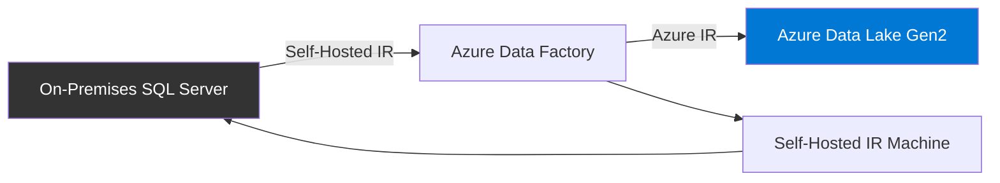

# How to Copy Data from On-Premises SQL Server to Azure Data Lake Using Data Factory

Author: [nawazdhandala](https://www.github.com/nawazdhandala)

Tags: Azure Data Factory, SQL Server, Azure Data Lake, Data Migration, Self-Hosted IR, On-Premises

Description: A complete walkthrough for copying data from an on-premises SQL Server database to Azure Data Lake Storage Gen2 using Azure Data Factory.

---

One of the most common data integration tasks is moving data from on-premises databases to the cloud. Whether you are building a data lake, migrating to a cloud-based analytics platform, or creating a backup, Azure Data Factory makes this straightforward - even when your SQL Server is behind a corporate firewall.

In this post, I will walk through the entire process of copying data from an on-premises SQL Server to Azure Data Lake Storage Gen2. We will cover setting up the self-hosted integration runtime, configuring the connections, building the pipeline, and handling incremental loads for ongoing synchronization.

## Architecture

Here is the high-level architecture for this data movement pattern.



The self-hosted integration runtime acts as the bridge between your on-premises network and Azure Data Factory. It runs on a Windows machine in your network that has access to the SQL Server.

## Prerequisites

1. Azure Data Factory instance
2. Azure Data Lake Storage Gen2 account with a filesystem (container) created
3. On-premises SQL Server with the database you want to copy
4. A Windows machine in your network for the self-hosted integration runtime
5. Network connectivity from the IR machine to both the SQL Server and the internet

## Step 1: Set Up the Self-Hosted Integration Runtime

If you do not already have a self-hosted IR, create one.

1. In ADF Studio, go to **Manage** > **Integration runtimes** > **New**
2. Select **Self-Hosted** and give it a name
3. Copy the authentication key
4. Download and install the integration runtime software on your Windows machine
5. Register it with the authentication key
6. Verify the status shows "Running" in ADF Studio

For production, install the IR on at least two machines for high availability.

## Step 2: Create the Linked Service for On-Premises SQL Server

Create a linked service that connects to your SQL Server through the self-hosted IR.

```json
// Linked service for on-premises SQL Server
{
  "name": "ls_onprem_sqlserver",
  "properties": {
    "type": "SqlServer",
    "typeProperties": {
      // Connection string to your on-premises SQL Server
      "connectionString": "Server=DBSERVER01;Database=SalesDB;Integrated Security=False;",
      "userName": "adf_reader",
      "password": {
        "type": "SecureString",
        "value": "<password>"
      }
    },
    // Route through the self-hosted IR
    "connectVia": {
      "referenceName": "SelfHostedIR",
      "type": "IntegrationRuntimeReference"
    }
  }
}
```

Test the connection to make sure ADF can reach your SQL Server through the IR.

## Step 3: Create the Linked Service for Azure Data Lake Storage Gen2

```json
// Linked service for Azure Data Lake Storage Gen2
{
  "name": "ls_adls_gen2",
  "properties": {
    "type": "AzureBlobFS",
    "typeProperties": {
      // Use the ADLS Gen2 endpoint
      "url": "https://<storageaccount>.dfs.core.windows.net",
      // Recommended: use managed identity for authentication
      "accountKey": {
        "type": "SecureString",
        "value": "<storage-account-key>"
      }
    }
  }
}
```

For production, I recommend using managed identity instead of account keys. It is more secure and eliminates key rotation concerns.

## Step 4: Create the Datasets

### SQL Server Source Dataset

```json
// Dataset for the SQL Server source table
{
  "name": "ds_sql_orders",
  "properties": {
    "type": "SqlServerTable",
    "linkedServiceName": {
      "referenceName": "ls_onprem_sqlserver",
      "type": "LinkedServiceReference"
    },
    "typeProperties": {
      "tableName": "dbo.Orders"
    }
  }
}
```

### Data Lake Sink Dataset

```json
// Dataset for Parquet files in ADLS Gen2
{
  "name": "ds_adls_orders_parquet",
  "properties": {
    "type": "Parquet",
    "linkedServiceName": {
      "referenceName": "ls_adls_gen2",
      "type": "LinkedServiceReference"
    },
    "typeProperties": {
      "location": {
        "type": "AzureBlobFSLocation",
        "fileSystem": "raw",
        "folderPath": "sql-server/orders"
      },
      "compressionCodec": "snappy"
    }
  }
}
```

I am using Parquet as the output format because it is columnar, compressed, and schema-aware. This makes downstream analytics much more efficient than working with CSV files.

## Step 5: Build the Full Load Pipeline

Let us start with a full load pipeline that copies the entire table.

1. In ADF Studio, create a new pipeline named `pl_full_load_orders`
2. Add a **Copy data** activity
3. Configure the source to use `ds_sql_orders`
4. Configure the sink to use `ds_adls_orders_parquet`

Here is the pipeline definition.

```json
// Full load pipeline - copies entire table
{
  "name": "pl_full_load_orders",
  "properties": {
    "activities": [
      {
        "name": "CopyOrdersToDataLake",
        "type": "Copy",
        "inputs": [
          {
            "referenceName": "ds_sql_orders",
            "type": "DatasetReference"
          }
        ],
        "outputs": [
          {
            "referenceName": "ds_adls_orders_parquet",
            "type": "DatasetReference"
          }
        ],
        "typeProperties": {
          "source": {
            "type": "SqlServerSource",
            // Optionally use a query instead of full table
            "sqlReaderQuery": "SELECT OrderId, CustomerId, OrderDate, TotalAmount, Status FROM dbo.Orders"
          },
          "sink": {
            "type": "ParquetSink",
            "storeSettings": {
              "type": "AzureBlobFSWriteSettings"
            }
          },
          // Enable staging for better performance through self-hosted IR
          "enableStaging": false
        }
      }
    ]
  }
}
```

## Step 6: Build an Incremental Load Pipeline

A full load works for the initial migration, but for ongoing synchronization you want incremental loads - copying only new or changed records since the last run.

The standard pattern uses a watermark column (like a `LastModifiedDate` or an auto-incrementing ID) to track what has already been copied.

### Create a Watermark Table

First, create a table in your SQL Server (or in Azure SQL) to store the last watermark value.

```sql
-- Create a watermark table to track incremental load progress
CREATE TABLE dbo.WatermarkTable (
    TableName VARCHAR(255),
    WatermarkValue DATETIME2,
    LastUpdated DATETIME2 DEFAULT GETUTCDATE()
);

-- Insert initial watermark (start of time)
INSERT INTO dbo.WatermarkTable (TableName, WatermarkValue)
VALUES ('Orders', '1900-01-01');
```

### Build the Incremental Pipeline

The incremental pipeline has these steps:

1. Look up the current watermark value
2. Look up the maximum value in the source table
3. Copy rows between the old and new watermark
4. Update the watermark table

```json
// Incremental load pipeline
{
  "name": "pl_incremental_load_orders",
  "properties": {
    "activities": [
      {
        // Step 1: Get the current watermark
        "name": "GetCurrentWatermark",
        "type": "Lookup",
        "typeProperties": {
          "source": {
            "type": "SqlServerSource",
            "sqlReaderQuery": "SELECT WatermarkValue FROM dbo.WatermarkTable WHERE TableName = 'Orders'"
          },
          "dataset": {
            "referenceName": "ds_sql_watermark",
            "type": "DatasetReference"
          }
        }
      },
      {
        // Step 2: Get the max modified date from source
        "name": "GetMaxModifiedDate",
        "type": "Lookup",
        "typeProperties": {
          "source": {
            "type": "SqlServerSource",
            "sqlReaderQuery": "SELECT MAX(LastModifiedDate) AS MaxModifiedDate FROM dbo.Orders"
          },
          "dataset": {
            "referenceName": "ds_sql_orders",
            "type": "DatasetReference"
          }
        }
      },
      {
        // Step 3: Copy only new/modified rows
        "name": "CopyIncrementalData",
        "type": "Copy",
        "dependsOn": [
          { "activity": "GetCurrentWatermark", "dependencyConditions": ["Succeeded"] },
          { "activity": "GetMaxModifiedDate", "dependencyConditions": ["Succeeded"] }
        ],
        "typeProperties": {
          "source": {
            "type": "SqlServerSource",
            // Query only rows modified since last watermark
            "sqlReaderQuery": {
              "value": "SELECT * FROM dbo.Orders WHERE LastModifiedDate > '@{activity('GetCurrentWatermark').output.firstRow.WatermarkValue}' AND LastModifiedDate <= '@{activity('GetMaxModifiedDate').output.firstRow.MaxModifiedDate}'",
              "type": "Expression"
            }
          },
          "sink": {
            "type": "ParquetSink"
          }
        },
        "inputs": [{ "referenceName": "ds_sql_orders", "type": "DatasetReference" }],
        "outputs": [{ "referenceName": "ds_adls_orders_parquet", "type": "DatasetReference" }]
      },
      {
        // Step 4: Update the watermark
        "name": "UpdateWatermark",
        "type": "SqlServerStoredProcedure",
        "dependsOn": [
          { "activity": "CopyIncrementalData", "dependencyConditions": ["Succeeded"] }
        ],
        "typeProperties": {
          "storedProcedureName": "usp_UpdateWatermark",
          "storedProcedureParameters": {
            "TableName": { "value": "Orders", "type": "String" },
            "WatermarkValue": {
              "value": { "value": "@activity('GetMaxModifiedDate').output.firstRow.MaxModifiedDate", "type": "Expression" },
              "type": "DateTime"
            }
          }
        }
      }
    ]
  }
}
```

## Step 7: Partition Output by Date

For large tables, partition the output files by date. This makes downstream queries much faster because analytics tools can skip entire partitions.

Use a parameterized dataset with dynamic folder paths.

```json
// Parameterized sink dataset with date partitioning
{
  "name": "ds_adls_orders_partitioned",
  "properties": {
    "type": "Parquet",
    "parameters": {
      "year": { "type": "String" },
      "month": { "type": "String" },
      "day": { "type": "String" }
    },
    "linkedServiceName": {
      "referenceName": "ls_adls_gen2",
      "type": "LinkedServiceReference"
    },
    "typeProperties": {
      "location": {
        "type": "AzureBlobFSLocation",
        "fileSystem": "raw",
        // Dynamic folder path based on date
        "folderPath": {
          "value": "sql-server/orders/year=@{dataset().year}/month=@{dataset().month}/day=@{dataset().day}",
          "type": "Expression"
        }
      }
    }
  }
}
```

## Performance Optimization Tips

When copying large volumes of data through a self-hosted IR, keep these tips in mind:

1. **Increase parallelism** - set the `parallelCopies` property on the Copy activity to use multiple threads (default is auto, which usually works well)
2. **Use staging** - for large datasets, enable staging through Azure Blob Storage to reduce pressure on the self-hosted IR
3. **Select only needed columns** - use a SQL query instead of copying the entire table if you only need specific columns
4. **Compress the output** - Parquet with Snappy compression reduces storage and improves read performance
5. **Scale up the IR machine** - more CPU cores and memory means more concurrent copy threads
6. **Use partitioned reads** - if your table is large, use physical partitions or a partition column to parallelize the read

```json
// Enable parallel partition reads for large tables
{
  "source": {
    "type": "SqlServerSource",
    "partitionOption": "DynamicRange",
    "partitionSettings": {
      "partitionColumnName": "OrderId",
      "partitionUpperBound": 10000000,
      "partitionLowerBound": 1
    }
  }
}
```

## Wrapping Up

Copying data from on-premises SQL Server to Azure Data Lake using Azure Data Factory is a well-established pattern. The self-hosted integration runtime bridges the network gap securely, and ADF handles the heavy lifting of data movement and format conversion. Start with a full load to get the initial data into the lake, then implement incremental loading with watermark tracking for ongoing synchronization. Partition your output files by date for efficient downstream analytics, and tune the copy performance based on your data volumes. This foundation sets you up for building a proper data lakehouse with bronze, silver, and gold layers on top of the raw data you ingest.
