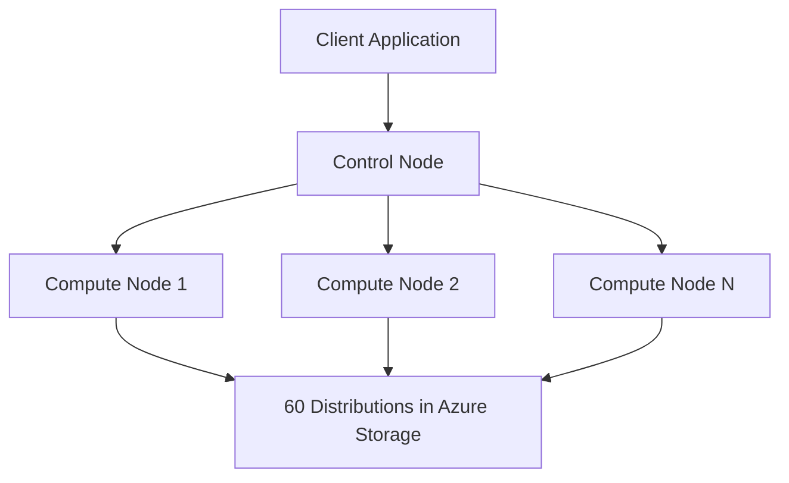

# How to Create a Dedicated SQL Pool in Azure Synapse Analytics

Author: [nawazdhandala](https://www.github.com/nawazdhandala)

Tags: Azure, Synapse Analytics, Dedicated SQL Pool, Data Warehouse, SQL, Azure Synapse, Analytics

Description: Step-by-step guide to creating and configuring a dedicated SQL pool in Azure Synapse Analytics for enterprise data warehousing workloads.

---

Azure Synapse Analytics dedicated SQL pool (formerly Azure SQL Data Warehouse) is Microsoft's massively parallel processing (MPP) data warehouse. It distributes your data and queries across multiple compute nodes, allowing you to query terabytes to petabytes of data with fast response times. This guide walks through creating a dedicated SQL pool, choosing the right configuration, and getting it ready for data loading.

## What Is a Dedicated SQL Pool?

A dedicated SQL pool is a provisioned resource within an Azure Synapse workspace that provides T-SQL-based data warehousing capabilities. Unlike the serverless SQL pool (which is pay-per-query), a dedicated SQL pool has reserved compute and storage that you pay for as long as it is running.

The architecture splits compute and storage:
- **Compute**: One control node and multiple compute nodes. The control node receives your query, creates a distributed execution plan, and coordinates the compute nodes.
- **Storage**: Data is stored in Azure Storage and distributed across 60 distributions.



## Prerequisites

- An Azure subscription
- An Azure Synapse workspace (we will create one if you do not have it)
- Azure CLI or Azure Portal access
- Appropriate RBAC permissions (Contributor or Synapse Administrator)

## Step 1: Create a Synapse Workspace

If you already have a Synapse workspace, skip to Step 2.

```bash
# Create a resource group
az group create --name rg-synapse --location eastus

# Create a storage account for the Synapse workspace
# This is the primary data lake storage for the workspace
az storage account create \
  --name synapsedatalake2026 \
  --resource-group rg-synapse \
  --location eastus \
  --sku Standard_LRS \
  --kind StorageV2 \
  --hns true  # Enable hierarchical namespace (Data Lake Storage Gen2)

# Create a container in the storage account for Synapse
az storage container create \
  --name synapse-data \
  --account-name synapsedatalake2026

# Create the Synapse workspace
az synapse workspace create \
  --name my-synapse-workspace \
  --resource-group rg-synapse \
  --location eastus \
  --storage-account synapsedatalake2026 \
  --file-system synapse-data \
  --sql-admin-login-user sqladmin \
  --sql-admin-login-password '<StrongPassword123!>'
```

The workspace takes a few minutes to provision. The `--sql-admin-login-user` and `--sql-admin-login-password` will be the admin credentials for your dedicated SQL pool.

## Step 2: Create the Dedicated SQL Pool

Now create the dedicated SQL pool within the workspace. The key decision here is the performance level (DWU).

```bash
# Create a dedicated SQL pool at DW100c performance level
az synapse sql pool create \
  --name myDataWarehouse \
  --workspace-name my-synapse-workspace \
  --resource-group rg-synapse \
  --performance-level DW100c
```

### Choosing the Right DWU Level

DWU (Data Warehouse Units) determines the compute power of your pool. Higher DWU means more compute nodes and faster queries, but also higher cost.

| DWU Level | Compute Nodes | Max Concurrent Queries | Use Case |
|-----------|--------------|----------------------|----------|
| DW100c | 1 | 4 | Development and testing |
| DW200c | 1 | 8 | Small workloads |
| DW500c | 1 | 20 | Medium workloads |
| DW1000c | 2 | 32 | Production - moderate |
| DW2000c | 4 | 32 | Production - heavy |
| DW5000c | 10 | 32 | Large-scale analytics |
| DW30000c | 60 | 128 | Maximum performance |

Start with DW100c for development and scale up for production. You can change the DWU level at any time without losing data.

## Step 3: Configure the Firewall

By default, the Synapse workspace blocks all incoming connections. You need to configure firewall rules for your client applications.

```bash
# Allow your current IP address to connect
MY_IP=$(curl -s ifconfig.me)
az synapse workspace firewall-rule create \
  --name AllowMyIP \
  --workspace-name my-synapse-workspace \
  --resource-group rg-synapse \
  --start-ip-address $MY_IP \
  --end-ip-address $MY_IP

# Allow Azure services to connect (needed for pipelines, Power BI, etc.)
az synapse workspace firewall-rule create \
  --name AllowAzureServices \
  --workspace-name my-synapse-workspace \
  --resource-group rg-synapse \
  --start-ip-address 0.0.0.0 \
  --end-ip-address 0.0.0.0
```

## Step 4: Connect to the SQL Pool

You can connect using SSMS, Azure Data Studio, or the Synapse Studio web interface.

**Connection details:**
- Server: `my-synapse-workspace.sql.azuresynapse.net`
- Database: `myDataWarehouse`
- Authentication: SQL authentication with the admin credentials you set up

**Using sqlcmd:**

```bash
# Connect using sqlcmd
sqlcmd -S my-synapse-workspace.sql.azuresynapse.net \
  -d myDataWarehouse \
  -U sqladmin \
  -P '<StrongPassword123!>' \
  -N  # Encrypt connection
```

## Step 5: Create Your First Tables

Dedicated SQL pool tables are distributed across 60 distributions. You need to choose a distribution strategy for each table.

```sql
-- Create a fact table with hash distribution
-- Hash distribution is best for large tables that are frequently joined
CREATE TABLE dbo.FactSales (
    SalesId BIGINT NOT NULL,
    ProductId INT NOT NULL,
    CustomerId INT NOT NULL,
    OrderDate DATE NOT NULL,
    Quantity INT NOT NULL,
    UnitPrice DECIMAL(10, 2) NOT NULL,
    TotalAmount DECIMAL(12, 2) NOT NULL
)
WITH (
    DISTRIBUTION = HASH(CustomerId),  -- Distribute rows by CustomerId
    CLUSTERED COLUMNSTORE INDEX       -- Best for analytical queries
);

-- Create a dimension table with replication
-- Replicate small dimension tables to avoid shuffle operations during joins
CREATE TABLE dbo.DimProduct (
    ProductId INT NOT NULL,
    ProductName NVARCHAR(200) NOT NULL,
    Category NVARCHAR(100) NOT NULL,
    SubCategory NVARCHAR(100),
    Brand NVARCHAR(100),
    ListPrice DECIMAL(10, 2)
)
WITH (
    DISTRIBUTION = REPLICATE,         -- Copy to all compute nodes
    CLUSTERED COLUMNSTORE INDEX
);

-- Create another dimension table
CREATE TABLE dbo.DimCustomer (
    CustomerId INT NOT NULL,
    CustomerName NVARCHAR(200) NOT NULL,
    Email NVARCHAR(200),
    City NVARCHAR(100),
    Country NVARCHAR(100),
    Segment NVARCHAR(50)
)
WITH (
    DISTRIBUTION = REPLICATE,
    CLUSTERED COLUMNSTORE INDEX
);

-- Create a staging table with round-robin distribution
-- Round-robin is good for staging/loading tables
CREATE TABLE dbo.StagingSales (
    SalesId BIGINT,
    ProductId INT,
    CustomerId INT,
    OrderDate VARCHAR(10),
    Quantity INT,
    UnitPrice DECIMAL(10, 2)
)
WITH (
    DISTRIBUTION = ROUND_ROBIN,       -- Evenly spread across all distributions
    HEAP                               -- No index, fastest for bulk loading
);
```

### Distribution Strategy Guide

Choosing the right distribution is crucial for query performance:

- **HASH**: Distribute rows based on a column value. Use for large fact tables. Choose a column with high cardinality that is frequently used in JOIN and GROUP BY clauses.
- **REPLICATE**: Copy the entire table to every compute node. Use for small dimension tables (under a few hundred MB). Eliminates data movement during joins.
- **ROUND_ROBIN**: Distribute rows evenly across all distributions without using a specific column. Use for staging tables or when no good hash column exists. Default if you do not specify a distribution.

## Step 6: Load Sample Data

Use the COPY INTO command to load data efficiently from Azure Storage.

```sql
-- Load data from a CSV file in Azure Data Lake
COPY INTO dbo.StagingSales
FROM 'https://synapsedatalake2026.dfs.core.windows.net/synapse-data/raw/sales/*.csv'
WITH (
    FILE_TYPE = 'CSV',
    FIRSTROW = 2,                     -- Skip header row
    FIELDTERMINATOR = ',',
    ROWTERMINATOR = '\n',
    CREDENTIAL = (IDENTITY = 'Managed Identity')
);

-- Insert from staging into the fact table with transformations
INSERT INTO dbo.FactSales (SalesId, ProductId, CustomerId, OrderDate, Quantity, UnitPrice, TotalAmount)
SELECT
    SalesId,
    ProductId,
    CustomerId,
    CAST(OrderDate AS DATE),
    Quantity,
    UnitPrice,
    Quantity * UnitPrice AS TotalAmount
FROM dbo.StagingSales;
```

## Step 7: Pause and Resume

One of the best features of dedicated SQL pool is the ability to pause compute when you do not need it. While paused, you only pay for storage.

```bash
# Pause the SQL pool (stops compute billing)
az synapse sql pool pause \
  --name myDataWarehouse \
  --workspace-name my-synapse-workspace \
  --resource-group rg-synapse

# Resume when you need it
az synapse sql pool resume \
  --name myDataWarehouse \
  --workspace-name my-synapse-workspace \
  --resource-group rg-synapse
```

This is extremely useful for development and test environments. Pause at end of day, resume in the morning.

## Step 8: Scale Up or Down

You can change the DWU level without any data loss or downtime preparation:

```bash
# Scale up to DW500c for production workload
az synapse sql pool update \
  --name myDataWarehouse \
  --workspace-name my-synapse-workspace \
  --resource-group rg-synapse \
  --performance-level DW500c
```

Scaling takes a few minutes. Existing connections will be dropped during the scale operation, so implement retry logic in your applications.

## Common Mistakes When Starting Out

1. **Not choosing a distribution key**: If you accept the default (round-robin) for fact tables, every join operation requires a data shuffle across nodes. This kills query performance.

2. **Distributing on a low-cardinality column**: If you distribute on a column with only 10 unique values, your data will cluster on 10 of the 60 distributions, leaving 50 empty. This creates skew.

3. **Not pausing development pools**: A DW100c pool costs money every hour it runs. Pause it when you are not using it.

4. **Using row store indexes for analytics**: Clustered columnstore indexes compress data 10x and are dramatically faster for analytical queries. Use them on all tables except small staging tables.

5. **Running too many concurrent queries at low DWU**: DW100c only supports 4 concurrent queries. If you need more concurrency, scale up.

## Wrapping Up

Creating a dedicated SQL pool in Azure Synapse Analytics is straightforward, but the configuration choices you make - DWU level, distribution strategy, and index type - have a massive impact on performance and cost. Start with DW100c for development, use hash distribution on your large fact tables, replicate your small dimensions, and pause the pool when you are not using it. These basics will get you a well-performing data warehouse that does not break the budget.
