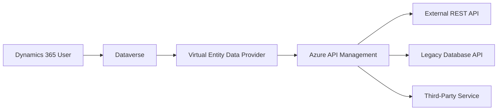

# How to Create a Dynamics 365 Virtual Entity Backed by Azure API Management and External APIs

Author: [nawazdhandala](https://www.github.com/nawazdhandala)

Tags: Dynamics 365, Virtual Entities, Azure API Management, REST API, Dataverse, Integration, CRM

Description: Create Dynamics 365 virtual entities that display external API data in the CRM interface using Azure API Management as the gateway layer.

---

Virtual entities in Dynamics 365 let you display data from external systems directly in the CRM without importing or syncing it. The data stays in the source system, and Dynamics 365 queries it on demand. Users see virtual entity records alongside native Dataverse records, and they can use them in views, forms, charts, and even relationships.

This is powerful for scenarios where you need to show inventory data from a warehouse system, pricing from an ERP, or customer information from a legacy database - all without duplicating the data into Dataverse. Azure API Management (APIM) acts as a gateway between Dynamics 365 and your external APIs, handling authentication, rate limiting, and response transformation.

## Architecture



When a user opens a view or form that includes virtual entity data, Dataverse calls the custom data provider. The data provider queries Azure API Management, which routes the request to the appropriate backend API. The response flows back through the same chain and appears in the Dynamics 365 UI.

## Setting Up Azure API Management

Create the APIM instance and configure it as the gateway for your external APIs:

```bash
# Create the API Management instance
az apim create \
  --name apim-d365-gateway \
  --resource-group rg-d365-virtual-entities \
  --publisher-name "Your Company" \
  --publisher-email admin@yourcompany.com \
  --sku-name Developer \
  --location eastus

# Import your external API
az apim api import \
  --resource-group rg-d365-virtual-entities \
  --service-name apim-d365-gateway \
  --api-id inventory-api \
  --path /inventory \
  --specification-format OpenAPI \
  --specification-url "https://api.warehouse.yourcompany.com/openapi.json"
```

Add a policy that transforms the API responses into the format Dataverse expects:

```xml
<!-- APIM policy that transforms external API responses for Dataverse consumption -->
<policies>
    <inbound>
        <base />
        <!-- Validate the Dataverse caller using a subscription key -->
        <check-header name="Ocp-Apim-Subscription-Key" failed-check-httpcode="401" />

        <!-- Add backend authentication -->
        <authentication-managed-identity resource="https://api.warehouse.yourcompany.com" />
    </inbound>
    <outbound>
        <base />
        <!-- Transform the response to match the virtual entity schema -->
        <set-body>
        @{
            var response = context.Response.Body.As<JObject>();
            var items = response["items"] as JArray;

            // Transform each item to match the Dataverse entity schema
            var transformed = new JArray();
            foreach (var item in items)
            {
                transformed.Add(new JObject(
                    new JProperty("cr_inventoryid", item["id"]),
                    new JProperty("cr_productname", item["name"]),
                    new JProperty("cr_sku", item["sku"]),
                    new JProperty("cr_quantity", item["quantity_on_hand"]),
                    new JProperty("cr_warehouse", item["warehouse_name"]),
                    new JProperty("cr_lastupdated", item["last_updated"])
                ));
            }

            return new JObject(
                new JProperty("value", transformed),
                new JProperty("@odata.count", response["total_count"])
            ).ToString();
        }
        </set-body>
    </outbound>
</policies>
```

## Creating the Virtual Entity in Dataverse

Define the virtual entity table in Dataverse. You can do this through the Power Apps Maker portal or programmatically:

```csharp
// Create the virtual entity definition using the Organization Service
public class VirtualEntitySetup
{
    public void CreateInventoryVirtualEntity(IOrganizationService service)
    {
        // Create the entity metadata
        var entity = new EntityMetadata
        {
            SchemaName = "cr_inventory",
            DisplayName = new Label("Inventory", 1033),
            DisplayCollectionName = new Label("Inventory Items", 1033),
            Description = new Label("Virtual entity for warehouse inventory data", 1033),
            OwnershipType = OwnershipTypes.OrganizationOwned,
            IsActivity = false,

            // Virtual entity specific settings
            DataProviderId = new Guid("your-data-provider-id"),
            ExternalName = "inventory_items",
            ExternalCollectionName = "inventory_items"
        };

        // Define the primary key attribute
        var primaryKey = new StringAttributeMetadata
        {
            SchemaName = "cr_inventoryid",
            DisplayName = new Label("Inventory ID", 1033),
            RequiredLevel = new AttributeRequiredLevelManagedProperty(
                AttributeRequiredLevel.SystemRequired),
            MaxLength = 100,
            ExternalName = "id"
        };

        // Create the entity
        var request = new CreateEntityRequest
        {
            Entity = entity,
            PrimaryAttribute = primaryKey,
            HasActivities = false
        };

        service.Execute(request);

        // Add additional attributes
        CreateAttribute(service, "cr_inventory", new StringAttributeMetadata
        {
            SchemaName = "cr_productname",
            DisplayName = new Label("Product Name", 1033),
            MaxLength = 256,
            ExternalName = "name"
        });

        CreateAttribute(service, "cr_inventory", new StringAttributeMetadata
        {
            SchemaName = "cr_sku",
            DisplayName = new Label("SKU", 1033),
            MaxLength = 50,
            ExternalName = "sku"
        });

        CreateAttribute(service, "cr_inventory", new IntegerAttributeMetadata
        {
            SchemaName = "cr_quantity",
            DisplayName = new Label("Quantity on Hand", 1033),
            MinValue = 0,
            MaxValue = 999999,
            ExternalName = "quantity_on_hand"
        });

        CreateAttribute(service, "cr_inventory", new StringAttributeMetadata
        {
            SchemaName = "cr_warehouse",
            DisplayName = new Label("Warehouse", 1033),
            MaxLength = 256,
            ExternalName = "warehouse_name"
        });

        CreateAttribute(service, "cr_inventory", new DateTimeAttributeMetadata
        {
            SchemaName = "cr_lastupdated",
            DisplayName = new Label("Last Updated", 1033),
            ExternalName = "last_updated"
        });
    }

    private void CreateAttribute(
        IOrganizationService service,
        string entityName,
        AttributeMetadata attribute)
    {
        var request = new CreateAttributeRequest
        {
            EntityName = entityName,
            Attribute = attribute
        };

        service.Execute(request);
    }
}
```

## Building a Custom Data Provider Plugin

The data provider is a special plugin that Dataverse calls when it needs to read virtual entity data. It translates Dataverse queries into API calls:

```csharp
// Custom data provider plugin for the inventory virtual entity
public class InventoryDataProvider : IPlugin
{
    private readonly string _apimEndpoint;
    private readonly string _subscriptionKey;

    public InventoryDataProvider(string unsecure, string secure)
    {
        // Parse configuration
        var config = JsonSerializer.Deserialize<DataProviderConfig>(unsecure);
        _apimEndpoint = config.ApimEndpoint;
        _subscriptionKey = config.SubscriptionKey;
    }

    public void Execute(IServiceProvider serviceProvider)
    {
        var context = (IPluginExecutionContext)serviceProvider
            .GetService(typeof(IPluginExecutionContext));
        var tracingService = (ITracingService)serviceProvider
            .GetService(typeof(ITracingService));

        switch (context.MessageName)
        {
            case "RetrieveMultiple":
                HandleRetrieveMultiple(context, tracingService);
                break;
            case "Retrieve":
                HandleRetrieve(context, tracingService);
                break;
        }
    }

    private void HandleRetrieveMultiple(
        IPluginExecutionContext context,
        ITracingService tracingService)
    {
        // Get the query from Dataverse
        var query = context.InputParameters["Query"] as QueryExpression;

        // Build the API request URL from the Dataverse query
        var apiUrl = BuildApiUrl(query);
        tracingService.Trace("Querying API: {0}", apiUrl);

        // Call the APIM endpoint
        using var httpClient = new HttpClient();
        httpClient.DefaultRequestHeaders.Add(
            "Ocp-Apim-Subscription-Key", _subscriptionKey);

        var response = httpClient.GetAsync(apiUrl).Result;
        var responseBody = response.Content.ReadAsStringAsync().Result;

        // Parse the response and build Dataverse entity collection
        var apiData = JsonSerializer.Deserialize<ApiResponse>(responseBody);
        var entityCollection = new EntityCollection();

        foreach (var item in apiData.Value)
        {
            var entity = new Entity("cr_inventory")
            {
                Id = Guid.Parse(item.Id),
                ["cr_inventoryid"] = item.Id,
                ["cr_productname"] = item.ProductName,
                ["cr_sku"] = item.Sku,
                ["cr_quantity"] = item.Quantity,
                ["cr_warehouse"] = item.Warehouse,
                ["cr_lastupdated"] = item.LastUpdated
            };

            entityCollection.Entities.Add(entity);
        }

        entityCollection.TotalRecordCount = apiData.Count;
        context.OutputParameters["BusinessEntityCollection"] = entityCollection;
    }

    private void HandleRetrieve(
        IPluginExecutionContext context,
        ITracingService tracingService)
    {
        var entityId = context.InputParameters["Target"] as EntityReference;
        var apiUrl = $"{_apimEndpoint}/inventory/{entityId.Id}";

        tracingService.Trace("Retrieving single record: {0}", apiUrl);

        using var httpClient = new HttpClient();
        httpClient.DefaultRequestHeaders.Add(
            "Ocp-Apim-Subscription-Key", _subscriptionKey);

        var response = httpClient.GetAsync(apiUrl).Result;
        var responseBody = response.Content.ReadAsStringAsync().Result;

        var item = JsonSerializer.Deserialize<InventoryItem>(responseBody);

        var entity = new Entity("cr_inventory")
        {
            Id = Guid.Parse(item.Id),
            ["cr_inventoryid"] = item.Id,
            ["cr_productname"] = item.ProductName,
            ["cr_sku"] = item.Sku,
            ["cr_quantity"] = item.Quantity,
            ["cr_warehouse"] = item.Warehouse,
            ["cr_lastupdated"] = item.LastUpdated
        };

        context.OutputParameters["BusinessEntity"] = entity;
    }

    private string BuildApiUrl(QueryExpression query)
    {
        var url = $"{_apimEndpoint}/inventory?";
        var queryParams = new List<string>();

        // Convert Dataverse paging to API paging
        if (query.PageInfo != null)
        {
            queryParams.Add($"pageSize={query.PageInfo.Count}");
            queryParams.Add($"page={query.PageInfo.PageNumber}");
        }

        // Convert filter conditions to API query parameters
        if (query.Criteria?.Conditions != null)
        {
            foreach (var condition in query.Criteria.Conditions)
            {
                switch (condition.AttributeName)
                {
                    case "cr_warehouse":
                        queryParams.Add($"warehouse={condition.Values[0]}");
                        break;
                    case "cr_sku":
                        queryParams.Add($"sku={condition.Values[0]}");
                        break;
                }
            }
        }

        return url + string.Join("&", queryParams);
    }
}
```

## Configuring the Data Source

Register the data source in Dynamics 365 that links the virtual entity to your data provider:

```csharp
// Register the data source for the virtual entity
var dataSource = new Entity("cr_inventory_datasource")
{
    ["cr_name"] = "Warehouse Inventory API",
    ["cr_apimendpoint"] = "https://apim-d365-gateway.azure-api.net",
    ["cr_description"] = "External inventory data via Azure API Management"
};

service.Create(dataSource);
```

## Creating a Relationship to Native Entities

You can create relationships between virtual entities and native Dataverse entities. For example, linking inventory to products:

```csharp
// Create a relationship between the virtual inventory entity and the product entity
var relationship = new OneToManyRelationshipMetadata
{
    SchemaName = "cr_product_inventory",
    ReferencedEntity = "product",
    ReferencedAttribute = "productid",
    ReferencingEntity = "cr_inventory",
    ReferencingAttribute = "cr_productid"
};

var request = new CreateOneToManyRequest
{
    OneToManyRelationship = relationship,
    Lookup = new LookupAttributeMetadata
    {
        SchemaName = "cr_productid",
        DisplayName = new Label("Product", 1033)
    }
};

service.Execute(request);
```

## Wrapping Up

Virtual entities backed by Azure API Management give Dynamics 365 users access to external data without the complexity and cost of data synchronization. The data stays in its source system, always current, and Dynamics 365 queries it on demand through the custom data provider. APIM adds a layer of security, transformation, and governance between Dynamics 365 and your backend APIs. This approach works well for data that changes frequently, lives in systems you do not control, or would be too expensive to replicate into Dataverse. The trade-off is query latency - virtual entities are slower than native entities because every query goes over the network. For data that users browse occasionally rather than search heavily, that trade-off is usually acceptable.
