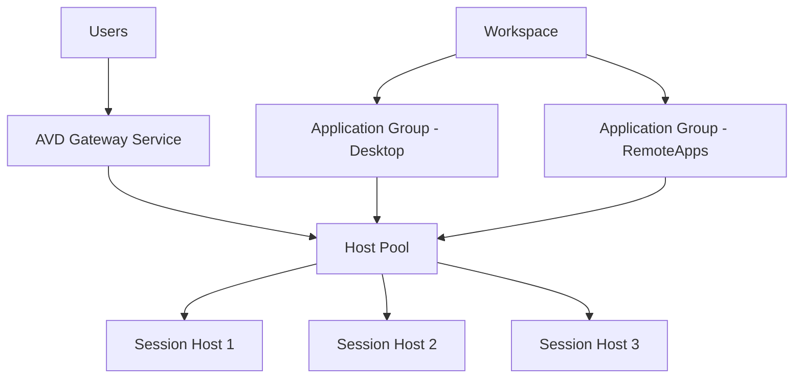

# How to Create a Host Pool and Session Hosts for Azure Virtual Desktop

Author: [nawazdhandala](https://www.github.com/nawazdhandala)

Tags: Azure, Virtual Desktop, Host Pool, Session Hosts, VDI, Remote Work, Windows

Description: Step-by-step guide to creating a host pool and deploying session hosts for Azure Virtual Desktop to deliver virtual desktops to your users.

---

Azure Virtual Desktop (AVD) delivers full Windows desktops and applications to users from the cloud. Instead of managing physical PCs or maintaining traditional VDI infrastructure, you deploy virtual machines in Azure that users connect to from any device. The core building block is the host pool - a collection of session host VMs that serve desktops to your users.

This guide covers creating a host pool, deploying session hosts, and getting your first users connected.

## Understanding AVD Architecture

Azure Virtual Desktop has a few key components:

- **Host Pool** - A collection of Azure VMs (session hosts) that provide desktops.
- **Session Hosts** - The individual VMs users connect to.
- **Application Groups** - Define which applications or desktops are available to users.
- **Workspace** - Groups application groups together for users to discover.



There are two types of host pools:

**Pooled** - Multiple users share session hosts. The system load-balances users across available VMs. More cost-effective because one VM serves several users.

**Personal** - Each user gets their own dedicated VM. The VM persists between sessions with the user's customizations intact. Better for users who need persistent software installations or heavy compute.

## Prerequisites

- An Azure subscription.
- Azure AD (or Entra ID) with user accounts.
- A virtual network in Azure (session hosts need network connectivity).
- For domain join: Azure AD DS or Active Directory Domain Services with network connectivity from the VNet.
- The Azure Virtual Desktop resource provider registered.

## Step 1: Create the Host Pool

Start in the Azure portal. Navigate to Azure Virtual Desktop and click "Create a host pool."

### Basic Settings

- **Host pool name**: avd-pooled-hp
- **Location**: East US (this is the metadata location, not where VMs run)
- **Validation environment**: No (Yes enables preview features for testing)
- **Preferred app group type**: Desktop (or RemoteApp for published applications)
- **Host pool type**: Pooled
- **Load balancing algorithm**: Breadth-first (spreads users across all hosts) or Depth-first (fills one host before moving to the next)
- **Max session limit**: 10 (depends on VM size - adjust based on your workload)

Using the Azure CLI:

```bash
# Create a pooled host pool with breadth-first load balancing
az desktopvirtualization hostpool create \
  --resource-group myResourceGroup \
  --name avd-pooled-hp \
  --location eastus \
  --host-pool-type Pooled \
  --load-balancer-type BreadthFirst \
  --max-session-limit 10 \
  --preferred-app-group-type Desktop \
  --registration-info expiration-time="2026-02-17T00:00:00Z" registration-token-operation="Update"
```

The registration token is important - session hosts use it to join the host pool. It has an expiration date, so set it far enough in the future to complete your deployment.

## Step 2: Deploy Session Host VMs

With the host pool created, deploy the VMs that will serve as session hosts.

### Through the Portal

During host pool creation, the wizard has a "Virtual Machines" tab:

1. **Add virtual machines**: Yes
2. **Resource group**: myResourceGroup
3. **Name prefix**: avd-host (VMs will be named avd-host-0, avd-host-1, etc.)
4. **Virtual machine location**: East US
5. **Number of VMs**: 3
6. **Image**: Windows 11 Enterprise multi-session + Microsoft 365 Apps
7. **VM size**: Standard_D4s_v5 (4 vCPUs, 16 GB RAM)
8. **OS disk type**: Premium SSD
9. **Virtual network**: Select your existing VNet
10. **Subnet**: Select the appropriate subnet
11. **Domain to join**: Azure Active Directory (or AD DS)
12. **Admin account**: Provide credentials

### Using an ARM Template

For repeatable deployments, use an ARM template.

```json
{
  "$schema": "https://schema.management.azure.com/schemas/2019-04-01/deploymentTemplate.json#",
  "contentVersion": "1.0.0.0",
  "parameters": {
    "vmCount": {
      "type": "int",
      "defaultValue": 3,
      "metadata": {
        "description": "Number of session host VMs to deploy"
      }
    },
    "vmSize": {
      "type": "string",
      "defaultValue": "Standard_D4s_v5"
    },
    "hostPoolToken": {
      "type": "secureString",
      "metadata": {
        "description": "Registration token from the host pool"
      }
    }
  },
  "resources": [
    {
      "type": "Microsoft.Compute/virtualMachines",
      "apiVersion": "2023-03-01",
      "name": "[concat('avd-host-', copyIndex())]",
      "location": "[resourceGroup().location]",
      "copy": {
        "name": "vmLoop",
        "count": "[parameters('vmCount')]"
      },
      "properties": {
        "hardwareProfile": {
          "vmSize": "[parameters('vmSize')]"
        },
        "storageProfile": {
          "imageReference": {
            "publisher": "MicrosoftWindowsDesktop",
            "offer": "windows-11",
            "sku": "win11-23h2-avd",
            "version": "latest"
          },
          "osDisk": {
            "createOption": "FromImage",
            "managedDisk": {
              "storageAccountType": "Premium_LRS"
            }
          }
        },
        "osProfile": {
          "computerName": "[concat('avd-host-', copyIndex())]",
          "adminUsername": "avdadmin",
          "adminPassword": "[parameters('adminPassword')]"
        },
        "networkProfile": {
          "networkInterfaces": [
            {
              "id": "[resourceId('Microsoft.Network/networkInterfaces', concat('avd-host-', copyIndex(), '-nic'))]"
            }
          ]
        }
      }
    }
  ]
}
```

## Step 3: Register Session Hosts with the Host Pool

If you deployed VMs separately (not through the host pool wizard), you need to install the AVD agent and register them.

Get the registration token:

```bash
# Generate a new registration token
az desktopvirtualization hostpool update \
  --resource-group myResourceGroup \
  --name avd-pooled-hp \
  --registration-info expiration-time="2026-02-17T00:00:00Z" registration-token-operation="Update"

# Retrieve the token
az desktopvirtualization hostpool retrieve-registration-token \
  --resource-group myResourceGroup \
  --name avd-pooled-hp \
  --query "token" \
  --output tsv
```

On each session host VM, install the AVD agent and bootloader using the registration token.

```powershell
# Download and install the AVD Agent on the session host
$agentUrl = "https://query.prod.cms.rt.microsoft.com/cms/api/am/binary/RWrmXv"
$bootloaderUrl = "https://query.prod.cms.rt.microsoft.com/cms/api/am/binary/RWrxrH"

# Download the installers
Invoke-WebRequest -Uri $agentUrl -OutFile "AVDAgent.msi"
Invoke-WebRequest -Uri $bootloaderUrl -OutFile "AVDBootloader.msi"

# Install the agent with the registration token
$token = "your-registration-token-here"
Start-Process msiexec.exe -ArgumentList "/i AVDAgent.msi /quiet REGISTRATIONTOKEN=$token" -Wait

# Install the bootloader
Start-Process msiexec.exe -ArgumentList "/i AVDBootloader.msi /quiet" -Wait
```

After installation, the session host appears in the host pool within a few minutes.

## Step 4: Create an Application Group

Application groups define what users can access. A Desktop application group gives users a full desktop. A RemoteApp group publishes individual applications.

```bash
# Create a Desktop application group
az desktopvirtualization applicationgroup create \
  --resource-group myResourceGroup \
  --name avd-desktop-ag \
  --host-pool-arm-path "/subscriptions/<sub-id>/resourceGroups/myResourceGroup/providers/Microsoft.DesktopVirtualization/hostpools/avd-pooled-hp" \
  --application-group-type Desktop \
  --location eastus
```

## Step 5: Create a Workspace

The workspace is what users see when they connect. It groups application groups into a discoverable feed.

```bash
# Create a workspace and associate the application group
az desktopvirtualization workspace create \
  --resource-group myResourceGroup \
  --name avd-workspace \
  --location eastus \
  --application-group-references "/subscriptions/<sub-id>/resourceGroups/myResourceGroup/providers/Microsoft.DesktopVirtualization/applicationgroups/avd-desktop-ag"
```

## Step 6: Assign Users

Users need to be assigned to the application group to access the desktop.

```bash
# Assign a user to the Desktop application group
az role assignment create \
  --assignee "user@company.com" \
  --role "Desktop Virtualization User" \
  --scope "/subscriptions/<sub-id>/resourceGroups/myResourceGroup/providers/Microsoft.DesktopVirtualization/applicationgroups/avd-desktop-ag"
```

For groups of users, assign an Azure AD group instead of individual users.

```bash
# Assign an Azure AD group
az role assignment create \
  --assignee-object-id "group-object-id" \
  --assignee-principal-type Group \
  --role "Desktop Virtualization User" \
  --scope "/subscriptions/<sub-id>/resourceGroups/myResourceGroup/providers/Microsoft.DesktopVirtualization/applicationgroups/avd-desktop-ag"
```

## Step 7: Connect to Your Desktop

Users connect through one of the AVD clients:

- **Windows Desktop client** - Download from Microsoft.
- **Web client** - Access at `https://client.wvd.microsoft.com/arm/webclient`.
- **macOS, iOS, Android clients** - Available in respective app stores.

After logging in, users see their assigned workspace with the desktop or applications they have access to.

## Verifying Session Host Health

Check the status of your session hosts from the portal or CLI.

```bash
# List session hosts and their status
az desktopvirtualization hostpool show \
  --resource-group myResourceGroup \
  --name avd-pooled-hp

# List all session hosts in the pool
az desktopvirtualization sessionhost list \
  --resource-group myResourceGroup \
  --host-pool-name avd-pooled-hp \
  --output table
```

Healthy session hosts show status as "Available." If a host shows "Unavailable," check that the VM is running, the AVD agent is installed correctly, and network connectivity is working.

## Sizing Recommendations

Choosing the right VM size depends on your workload:

| Workload Type | VM Size | Users per VM |
|--------------|---------|--------------|
| Light (Office, browsing) | Standard_D4s_v5 | 6-10 |
| Medium (Office + Teams) | Standard_D8s_v5 | 4-6 |
| Heavy (Development, CAD) | Standard_D16s_v5 | 2-4 |
| GPU (Design, 3D) | Standard_NV12s_v3 | 1-2 |

Start conservative and adjust based on monitoring data. Over-provisioning wastes money; under-provisioning frustrates users.

## Summary

Creating a host pool and session hosts for Azure Virtual Desktop follows a logical progression: create the pool, deploy VMs, register them as session hosts, create application groups and workspaces, and assign users. The pooled host pool type works well for most organizations because it shares VMs across users for better cost efficiency. Personal host pools suit users with specialized needs. Once deployed, users connect through the AVD client and get a full Windows desktop running in Azure, accessible from anywhere on any device.
