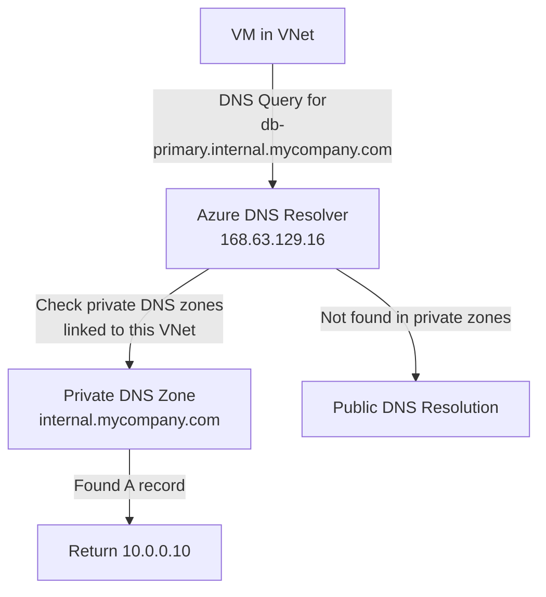

# How to Create a Private DNS Zone and Link It to a Virtual Network in Azure

Author: [nawazdhandala](https://www.github.com/nawazdhandala)

Tags: Azure, Private DNS, DNS Zone, Virtual Network, Name Resolution, Azure Networking

Description: A hands-on guide to creating Azure Private DNS zones and linking them to virtual networks for internal name resolution without custom DNS servers.

---

Name resolution inside Azure virtual networks is something that works automatically for basic scenarios - VMs can find each other by hostname within the same VNet. But as soon as you need custom domain names, resolution across peered VNets, or DNS records for private endpoints, you need Azure Private DNS zones.

Private DNS zones let you use your own domain names (like `internal.mycompany.com`) inside your virtual networks. No need to deploy and manage your own DNS servers. Azure handles the hosting, and you just link the zone to the VNets that need access.

## When You Need Private DNS Zones

There are several scenarios where private DNS zones become essential:

- **Custom internal domains.** You want VMs to be reachable at names like `db-primary.internal.mycompany.com` rather than Azure-generated names.
- **Private endpoints.** When you create private endpoints for Azure PaaS services (Storage, SQL, Key Vault), they require private DNS zones for name resolution.
- **Cross-VNet name resolution.** VMs in peered VNets cannot resolve each other's names by default. Private DNS zones solve this.
- **Split-horizon DNS.** You want `api.mycompany.com` to resolve to a private IP inside the VNet but a public IP from the internet.

## Prerequisites

- An Azure subscription
- A virtual network (we will create one if needed)
- Azure CLI installed

## Step 1: Create a Private DNS Zone

```bash
# Create a resource group
az group create --name rg-privatedns-demo --location eastus

# Create a private DNS zone
az network private-dns zone create \
  --resource-group rg-privatedns-demo \
  --name internal.mycompany.com
```

Note that the location is automatically set to "global" for private DNS zones. They are not region-specific.

You can use any domain name you like, but there are some common patterns:

- `internal.mycompany.com` for general internal resources
- `privatelink.blob.core.windows.net` for Azure Storage private endpoints
- `privatelink.database.windows.net` for Azure SQL private endpoints

## Step 2: Create a Virtual Network

If you do not have a VNet already, create one.

```bash
# Create a virtual network
az network vnet create \
  --resource-group rg-privatedns-demo \
  --name vnet-demo \
  --location eastus \
  --address-prefixes 10.0.0.0/16 \
  --subnet-name subnet-default \
  --subnet-prefixes 10.0.0.0/24
```

## Step 3: Link the DNS Zone to the Virtual Network

This is the key step. Linking the zone to a VNet makes the DNS records in that zone resolvable from VMs in the VNet.

```bash
# Link the private DNS zone to the virtual network
az network private-dns link vnet create \
  --resource-group rg-privatedns-demo \
  --zone-name internal.mycompany.com \
  --name link-vnet-demo \
  --virtual-network vnet-demo \
  --registration-enabled true
```

The `--registration-enabled true` flag is important. It enables auto-registration, which means VMs in the linked VNet will automatically get DNS records (A records) created in the zone. When a VM named `webserver01` is created in the VNet, it will automatically be resolvable at `webserver01.internal.mycompany.com`.

You can link a DNS zone to multiple VNets, but only one link can have auto-registration enabled. Other links will still allow VMs to resolve records in the zone, but they will not auto-register.

## Step 4: Add Manual DNS Records

Besides auto-registration, you can manually create records in the zone.

```bash
# Create an A record
az network private-dns record-set a add-record \
  --resource-group rg-privatedns-demo \
  --zone-name internal.mycompany.com \
  --record-set-name db-primary \
  --ipv4-address 10.0.0.10

# Create another A record for a different service
az network private-dns record-set a add-record \
  --resource-group rg-privatedns-demo \
  --zone-name internal.mycompany.com \
  --record-set-name cache-redis \
  --ipv4-address 10.0.0.20

# Create a CNAME record
az network private-dns record-set cname set-record \
  --resource-group rg-privatedns-demo \
  --zone-name internal.mycompany.com \
  --record-set-name api \
  --cname webserver01.internal.mycompany.com
```

Now, VMs in the linked VNet can resolve `db-primary.internal.mycompany.com` to `10.0.0.10` and `cache-redis.internal.mycompany.com` to `10.0.0.20`.

## Step 5: Link to Additional VNets

If you have multiple VNets (for example, peered VNets in a hub-spoke topology), link the DNS zone to each one.

```bash
# Create a second VNet
az network vnet create \
  --resource-group rg-privatedns-demo \
  --name vnet-spoke1 \
  --location eastus \
  --address-prefixes 10.1.0.0/16 \
  --subnet-name subnet-default \
  --subnet-prefixes 10.1.0.0/24

# Link the DNS zone to the second VNet (without auto-registration)
az network private-dns link vnet create \
  --resource-group rg-privatedns-demo \
  --zone-name internal.mycompany.com \
  --name link-vnet-spoke1 \
  --virtual-network vnet-spoke1 \
  --registration-enabled false
```

VMs in `vnet-spoke1` can now resolve records in `internal.mycompany.com`, but their names will not be auto-registered.

## Step 6: Verify DNS Resolution

SSH into a VM in one of the linked VNets and test name resolution.

```bash
# From inside a VM in the linked VNet
nslookup db-primary.internal.mycompany.com

# Expected output:
# Server: 168.63.129.16
# Address: 168.63.129.16#53
# Name: db-primary.internal.mycompany.com
# Address: 10.0.0.10
```

The DNS server `168.63.129.16` is Azure's internal DNS resolver. It is aware of your private DNS zones and returns the correct private IP addresses.

## Understanding the Resolution Flow



Azure DNS first checks private DNS zones linked to the VNet. If a record is found, it returns the private IP. If not, it falls through to public DNS resolution. This is how split-horizon DNS works in Azure.

## Private DNS Zones for Private Endpoints

When you create a private endpoint for an Azure service, you need a specific private DNS zone for it to work correctly. Here are the common zone names:

| Service | DNS Zone Name |
|---|---|
| Blob Storage | privatelink.blob.core.windows.net |
| Azure SQL | privatelink.database.windows.net |
| Key Vault | privatelink.vaultcore.azure.net |
| Cosmos DB | privatelink.documents.azure.com |
| Azure Container Registry | privatelink.azurecr.io |

```bash
# Example: Create a private DNS zone for blob storage private endpoints
az network private-dns zone create \
  --resource-group rg-privatedns-demo \
  --name privatelink.blob.core.windows.net

# Link it to your VNet
az network private-dns link vnet create \
  --resource-group rg-privatedns-demo \
  --zone-name privatelink.blob.core.windows.net \
  --name link-blob-dns \
  --virtual-network vnet-demo \
  --registration-enabled false
```

When you then create a private endpoint for a storage account, Azure can automatically add the DNS record to this zone.

## Listing Records and Links

You can list all records in a zone and all VNet links to see the current state.

```bash
# List all record sets in the zone
az network private-dns record-set list \
  --resource-group rg-privatedns-demo \
  --zone-name internal.mycompany.com \
  --output table

# List all VNet links
az network private-dns link vnet list \
  --resource-group rg-privatedns-demo \
  --zone-name internal.mycompany.com \
  --output table
```

## Common Pitfalls

**Forgetting to link the zone to the VNet.** Creating a zone without linking it means no VMs can resolve its records. Always verify the link exists.

**Multiple zones with the same name.** If you have multiple private DNS zones with the same name linked to the same VNet, Azure cannot determine which one to use. Avoid this.

**Auto-registration conflicts.** A VNet can be linked with auto-registration to only one private DNS zone. If you try to enable auto-registration on a second link, it will fail.

**On-premises resolution.** VMs on-premises cannot natively resolve Azure Private DNS zone records. You need a DNS forwarder in Azure that on-premises DNS servers forward queries to.

## Cleanup

```bash
# Delete the resource group
az group delete --name rg-privatedns-demo --yes --no-wait
```

## Wrapping Up

Azure Private DNS zones give you a fully managed internal DNS solution without running DNS servers. Create a zone, link it to your VNets, and your VMs can resolve custom domain names immediately. Auto-registration keeps things tidy by automatically creating and removing A records as VMs come and go. For private endpoints, the matching private DNS zones are essential for correct name resolution. The key thing to remember is that a zone does nothing until it is linked to a VNet, so always verify your links after setup.
