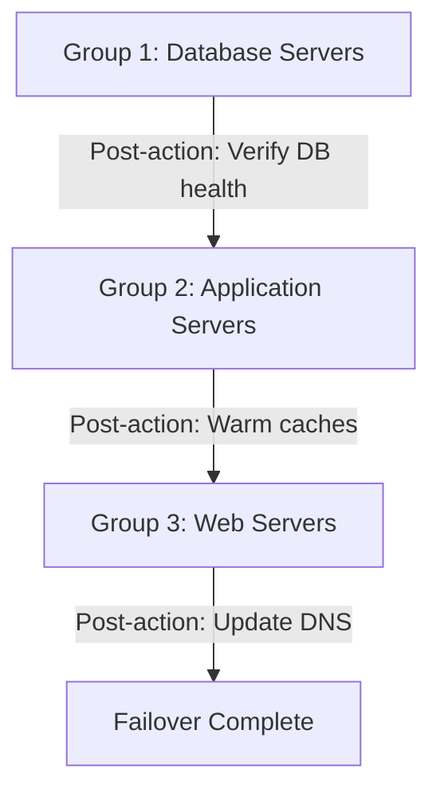

# How to Create a Recovery Plan with Custom Scripts in Azure Site Recovery

Author: [nawazdhandala](https://www.github.com/nawazdhandala)

Tags: Azure Site Recovery, Recovery Plan, Disaster Recovery, Automation, Custom Scripts, Failover, Azure Automation

Description: Learn how to create recovery plans in Azure Site Recovery with custom scripts and manual actions to orchestrate multi-tier application failover in the correct order.

---

When your application is a single VM, failover is straightforward. But most real applications span multiple VMs - web servers, application servers, database servers, caching layers. These need to come up in a specific order, and you often need to run custom scripts between steps to update configurations, warm caches, or switch DNS. That is where recovery plans come in.

Azure Site Recovery recovery plans let you define groups of VMs, set the order they boot in, and insert custom Azure Automation runbooks or manual actions between groups. This turns a chaotic manual failover into a repeatable, automated process.

## Anatomy of a Recovery Plan

A recovery plan consists of:

**Groups** - VMs are organized into numbered groups (Group 1, Group 2, etc.). All VMs in a group start simultaneously. Groups are processed sequentially.

**Pre-actions** - Scripts or manual steps that run before a group starts.

**Post-actions** - Scripts or manual steps that run after a group completes.

**Manual actions** - Pause points where a human must confirm before proceeding.

Here is a typical three-tier application recovery plan:



## Prerequisites

- Azure Site Recovery configured with VMs replicating to the target region
- An Azure Automation account in the target region (for custom scripts)
- The Automation account linked to the Recovery Services vault
- Runbooks created and published in the Automation account

## Step 1: Create the Recovery Plan

1. In the Recovery Services vault, go to "Recovery Plans (Site Recovery)"
2. Click "Create recovery plan"
3. Provide:
   - **Name**: e.g., `rp-erp-application`
   - **Source**: The source region or on-premises site
   - **Target**: The target Azure region
   - **Deployment model**: Resource Manager
4. Select VMs to include
5. Click "Create"

All selected VMs are initially placed in Group 1. You need to reorganize them.

## Step 2: Organize VMs into Groups

Edit the recovery plan to create the proper boot order:

1. Click "Customize" on the recovery plan
2. Select VMs in Group 1 and move them to new groups:
   - **Group 1**: Database servers (SQL Server, PostgreSQL, etc.)
   - **Group 2**: Middle-tier servers (application servers, API servers)
   - **Group 3**: Front-end servers (web servers, load balancers)

You can create up to 7 groups in a recovery plan. For most applications, 3-4 groups are sufficient.

To move VMs between groups, select a VM, click the ellipsis menu, and choose "Move to Group X" or "Create new group."

## Step 3: Set Up an Azure Automation Account

Custom scripts in recovery plans run as Azure Automation runbooks. If you do not already have an Automation account, create one:

```bash
# Create an Azure Automation account in the DR region
az automation account create \
    --resource-group rg-dr-centralus \
    --name auto-dr-scripts-centralus \
    --location centralus \
    --sku Free
```

The Automation account needs a Run As account or managed identity with permissions to manage resources in the target subscription. This is because the runbooks will interact with Azure resources (VMs, DNS zones, load balancers, etc.) during failover.

## Step 4: Create Runbooks for Recovery Actions

Here are common runbooks you would add to a recovery plan:

### Runbook: Update SQL Server Connection Strings

After the database VMs come up in the DR region, application servers need to point to the new database IP addresses. This runbook updates the App Settings on Azure App Services or configuration on VMs:

```powershell
# Runbook: Update-SqlConnectionStrings
# Runs after Group 1 (database servers) completes failover
# Updates connection strings in dependent App Services and VMs

param(
    [Object]$RecoveryPlanContext
)

# Connect using the Automation managed identity
Connect-AzAccount -Identity

# Define the mapping of source DB IPs to target DB IPs
$dbMapping = @{
    "10.1.3.4" = "10.2.3.4"   # Primary SQL Server
    "10.1.3.5" = "10.2.3.5"   # Secondary SQL Server
}

# Update connection strings in App Services
$appServices = @("app-erp-api", "app-erp-web")
foreach ($app in $appServices) {
    $currentSettings = Get-AzWebApp -ResourceGroupName "rg-dr-centralus" -Name $app
    foreach ($setting in $currentSettings.SiteConfig.ConnectionStrings) {
        foreach ($oldIP in $dbMapping.Keys) {
            if ($setting.ConnectionString -like "*$oldIP*") {
                $newConnStr = $setting.ConnectionString -replace [regex]::Escape($oldIP), $dbMapping[$oldIP]
                # Update the connection string with the new DB IP
                Set-AzWebApp -ResourceGroupName "rg-dr-centralus" `
                    -Name $app `
                    -ConnectionStrings @{
                        $setting.Name = @{
                            Type = $setting.Type
                            Value = $newConnStr
                        }
                    }
                Write-Output "Updated $($setting.Name) in $app"
            }
        }
    }
}

Write-Output "Connection string updates completed"
```

### Runbook: Update DNS Records

After all VMs are up, switch DNS to point to the DR region:

```powershell
# Runbook: Update-DnsRecords
# Runs after the final group completes failover
# Updates Azure DNS records to point to the DR region load balancer

param(
    [Object]$RecoveryPlanContext
)

Connect-AzAccount -Identity

# Get the public IP of the DR load balancer
$drPublicIP = Get-AzPublicIpAddress `
    -ResourceGroupName "rg-dr-centralus" `
    -Name "pip-lb-dr-web"

# Update the DNS A record for the application
$dnsZone = "mycompany.com"
$dnsRG = "rg-dns-global"

# Remove existing A record and create new one pointing to DR IP
Remove-AzDnsRecordSet `
    -Name "erp" `
    -RecordType A `
    -ZoneName $dnsZone `
    -ResourceGroupName $dnsRG

$record = New-AzDnsRecordConfig -Ipv4Address $drPublicIP.IpAddress
New-AzDnsRecordSet `
    -Name "erp" `
    -RecordType A `
    -ZoneName $dnsZone `
    -ResourceGroupName $dnsRG `
    -Ttl 60 `
    -DnsRecords $record

Write-Output "DNS updated: erp.$dnsZone -> $($drPublicIP.IpAddress)"
```

### Runbook: Verify Database Health

After database VMs start, verify they are actually accepting connections before proceeding to the next group:

```powershell
# Runbook: Verify-DatabaseHealth
# Runs after Group 1 to confirm databases are online before starting app servers

param(
    [Object]$RecoveryPlanContext
)

Connect-AzAccount -Identity

$dbVMs = @("vm-sql-01", "vm-sql-02")
$maxRetries = 10
$retryDelay = 30  # seconds

foreach ($vmName in $dbVMs) {
    $attempt = 0
    $healthy = $false

    while ($attempt -lt $maxRetries -and -not $healthy) {
        $attempt++
        Write-Output "Checking $vmName - attempt $attempt of $maxRetries"

        # Run a SQL query inside the VM to check database status
        $result = Invoke-AzVMRunCommand `
            -ResourceGroupName "rg-dr-centralus" `
            -VMName $vmName `
            -CommandId "RunPowerShellScript" `
            -ScriptString 'Invoke-Sqlcmd -Query "SELECT 1 AS HealthCheck" -ServerInstance "localhost" | ConvertTo-Json'

        if ($result.Value[0].Message -like "*HealthCheck*") {
            Write-Output "$vmName is healthy"
            $healthy = $true
        } else {
            Write-Output "$vmName not ready yet, waiting $retryDelay seconds..."
            Start-Sleep -Seconds $retryDelay
        }
    }

    if (-not $healthy) {
        throw "Database VM $vmName did not become healthy after $maxRetries attempts"
    }
}

Write-Output "All database VMs verified healthy"
```

## Step 5: Publish and Link Runbooks

After creating each runbook in the Automation account:

1. Click "Publish" on each runbook to make it available
2. Go back to the Recovery Services vault
3. Edit the recovery plan
4. Click "Customize"
5. On a group, click the ellipsis and choose "Add post action" or "Add pre action"
6. Select "Script" and choose the published runbook

Place the runbooks in the right positions:
- **Group 1 post-action**: Verify-DatabaseHealth
- **Group 2 pre-action**: Update-SqlConnectionStrings
- **Group 3 post-action**: Update-DnsRecords

## Step 6: Add Manual Actions

For steps that require human judgment, add manual actions:

1. In the recovery plan customization view, click the ellipsis on a group
2. Choose "Add manual action"
3. Provide a description: e.g., "Verify that the database restore completed successfully and all tables are intact. Check row counts against the last known backup report."

Manual actions pause the recovery plan and display the instructions. An operator must click "Complete" to continue.

Use manual actions sparingly. The goal is automation, but some decisions genuinely need a human.

## Step 7: Test the Recovery Plan

Run a test failover on the entire recovery plan:

1. Click "Test failover" on the recovery plan
2. Select a recovery point
3. Choose the isolated test network
4. Click "OK"

Watch the plan execute step by step. Each group starts in order, and the runbooks execute between groups. Monitor the Automation jobs for any script failures.

After validating, clean up the test failover resources.

## Troubleshooting Recovery Plan Issues

**Runbook fails with authentication error.** The Automation account's managed identity may not have the required permissions. Grant it Contributor access to the target resource group.

**Runbook times out.** The default timeout for a runbook in a recovery plan is 60 minutes. If your script takes longer (e.g., large database verification), increase the timeout in the Automation account.

**VMs in a group start but one fails.** If a single VM in a group fails to start, the recovery plan pauses the entire plan. Fix the issue and resume, or skip the failed VM if it is non-critical.

**Wrong order of execution.** Double-check your group assignments. A common mistake is having the web server in Group 1 instead of Group 3, causing it to start before the database is ready.

## Wrapping Up

Recovery plans transform disaster recovery from a panicked scramble into a controlled, automated process. By organizing VMs into groups, adding automation runbooks for configuration updates, and including health checks between tiers, you ensure that your multi-tier application comes up correctly every time. Test the plan regularly, update the runbooks as your application evolves, and keep the documentation current. When disaster strikes, you want to click one button and watch it work.
