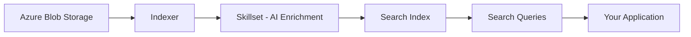

# How to Create a Search Index in Azure AI Search from Azure Blob Storage

Author: [nawazdhandala](https://www.github.com/nawazdhandala)

Tags: Azure, AI Search, Blob Storage, Indexing, Search, Cognitive Services, Cloud

Description: Create a full-text search index in Azure AI Search that automatically indexes documents from Azure Blob Storage with enrichment and querying capabilities.

---

Azure AI Search (formerly Azure Cognitive Search) is a fully managed search service that lets you add powerful search capabilities to your applications. One of its most common use cases is indexing documents stored in Azure Blob Storage - PDFs, Word documents, HTML files, text files, and more. Azure AI Search can automatically extract text from these documents, enrich the content with AI (like extracting key phrases, detecting language, or generating embeddings), and make everything searchable through a REST API. In this post, I will walk through the complete setup from blob storage to a working search index.

## Architecture Overview

The setup involves three main components:

1. **Data source**: An Azure Blob Storage container containing your documents.
2. **Index**: The schema that defines what fields are searchable, filterable, and retrievable.
3. **Indexer**: The automated process that reads documents from the data source, extracts content, and populates the index.



## Prerequisites

You need:

- An Azure Blob Storage account with documents to index
- An Azure AI Search service (Free tier supports up to 3 indexes and 50 MB of storage)
- The Azure SDK for Python

```bash
# Install the required packages
pip install azure-search-documents azure-storage-blob
```

## Step 1: Upload Documents to Blob Storage

If your documents are not already in Blob Storage, upload them first.

```python
from azure.storage.blob import BlobServiceClient
import os

# Connect to the storage account
connection_string = "DefaultEndpointsProtocol=https;AccountName=...;AccountKey=...;EndpointSuffix=core.windows.net"
blob_service = BlobServiceClient.from_connection_string(connection_string)

# Create a container for your documents
container_name = "documents"
try:
    blob_service.create_container(container_name)
    print(f"Container '{container_name}' created")
except Exception:
    print(f"Container '{container_name}' already exists")

# Upload documents from a local folder
def upload_documents(local_folder, container_name):
    """
    Upload all documents from a local folder to a Blob Storage container.
    Supports PDF, DOCX, TXT, HTML, and other text-based formats.
    """
    container_client = blob_service.get_container_client(container_name)
    uploaded = 0

    for filename in os.listdir(local_folder):
        filepath = os.path.join(local_folder, filename)
        if os.path.isfile(filepath):
            with open(filepath, "rb") as f:
                container_client.upload_blob(
                    name=filename,
                    data=f,
                    overwrite=True
                )
            uploaded += 1
            print(f"Uploaded: {filename}")

    print(f"\nTotal uploaded: {uploaded} documents")


upload_documents("./docs/", container_name)
```

## Step 2: Create the Search Index

The index defines the schema for your searchable content. Each field can be searchable, filterable, sortable, and/or facetable.

```python
from azure.search.documents.indexes import SearchIndexClient
from azure.search.documents.indexes.models import (
    SearchIndex,
    SearchField,
    SearchFieldDataType,
    SimpleField,
    SearchableField,
    ComplexField
)
from azure.core.credentials import AzureKeyCredential

# Connect to Azure AI Search
search_endpoint = "https://your-search-service.search.windows.net"
search_admin_key = "your-admin-key"

index_client = SearchIndexClient(
    endpoint=search_endpoint,
    credential=AzureKeyCredential(search_admin_key)
)

# Define the index schema
index_name = "documents-index"

fields = [
    # Unique identifier for each document
    SimpleField(
        name="id",
        type=SearchFieldDataType.String,
        key=True,
        filterable=True
    ),
    # The document content (full-text searchable)
    SearchableField(
        name="content",
        type=SearchFieldDataType.String,
        analyzer_name="en.microsoft"  # English language analyzer
    ),
    # Document metadata
    SimpleField(
        name="metadata_storage_path",
        type=SearchFieldDataType.String,
        filterable=True
    ),
    SearchableField(
        name="metadata_storage_name",
        type=SearchFieldDataType.String,
        filterable=True,
        sortable=True
    ),
    SimpleField(
        name="metadata_storage_size",
        type=SearchFieldDataType.Int64,
        filterable=True,
        sortable=True
    ),
    SimpleField(
        name="metadata_storage_last_modified",
        type=SearchFieldDataType.DateTimeOffset,
        filterable=True,
        sortable=True
    ),
    SimpleField(
        name="metadata_content_type",
        type=SearchFieldDataType.String,
        filterable=True,
        facetable=True
    ),
    # AI-enriched fields (populated by the skillset)
    SearchableField(
        name="keyphrases",
        type=SearchFieldDataType.Collection(SearchFieldDataType.String),
        filterable=True,
        facetable=True
    ),
    SimpleField(
        name="language",
        type=SearchFieldDataType.String,
        filterable=True,
        facetable=True
    )
]

# Create the index
index = SearchIndex(name=index_name, fields=fields)
index_client.create_or_update_index(index)
print(f"Index '{index_name}' created successfully")
```

## Step 3: Create a Data Source Connection

The data source tells the indexer where to find your documents.

```python
from azure.search.documents.indexes import SearchIndexerClient
from azure.search.documents.indexes.models import (
    SearchIndexerDataSourceConnection,
    SearchIndexerDataContainer
)

indexer_client = SearchIndexerClient(
    endpoint=search_endpoint,
    credential=AzureKeyCredential(search_admin_key)
)

# Create the data source connection to Blob Storage
data_source = SearchIndexerDataSourceConnection(
    name="blob-datasource",
    type="azureblob",
    connection_string=connection_string,
    container=SearchIndexerDataContainer(
        name=container_name,         # The blob container name
        query=None                   # Optional: filter to a subfolder like "reports/"
    ),
    description="Documents in Azure Blob Storage"
)

indexer_client.create_or_update_data_source_connection(data_source)
print("Data source connection created")
```

## Step 4: Create an AI Enrichment Skillset (Optional)

A skillset applies AI transformations to your documents during indexing. This is optional but powerful - it can extract key phrases, detect language, recognize entities, and more.

```python
from azure.search.documents.indexes.models import (
    SearchIndexerSkillset,
    KeyPhraseExtractionSkill,
    LanguageDetectionSkill,
    InputFieldMappingEntry,
    OutputFieldMappingEntry
)

# Define the skills to apply during indexing
skills = [
    # Extract key phrases from the document content
    KeyPhraseExtractionSkill(
        name="keyphrases-skill",
        description="Extract key phrases from document content",
        context="/document",
        inputs=[
            InputFieldMappingEntry(name="text", source="/document/content")
        ],
        outputs=[
            OutputFieldMappingEntry(name="keyPhrases", target_name="keyphrases")
        ]
    ),
    # Detect the language of each document
    LanguageDetectionSkill(
        name="language-detection-skill",
        description="Detect the language of each document",
        context="/document",
        inputs=[
            InputFieldMappingEntry(name="text", source="/document/content")
        ],
        outputs=[
            OutputFieldMappingEntry(name="languageCode", target_name="language")
        ]
    )
]

# Create the skillset
skillset = SearchIndexerSkillset(
    name="document-skillset",
    description="AI enrichment for document indexing",
    skills=skills
)

indexer_client.create_or_update_skillset(skillset)
print("Skillset created")
```

## Step 5: Create and Run the Indexer

The indexer ties everything together. It reads from the data source, applies the skillset, and writes to the index.

```python
from azure.search.documents.indexes.models import (
    SearchIndexer,
    FieldMapping,
    IndexingParameters,
    IndexingParametersConfiguration,
    BlobIndexerImageAction
)

# Configure indexing parameters
indexer_parameters = IndexingParameters(
    configuration=IndexingParametersConfiguration(
        # Extract content from supported document formats
        parsing_mode="default",
        # Index the content of blobs as text
        data_to_extract="contentAndMetadata",
        # Handle images within documents
        image_action=BlobIndexerImageAction.NONE
    )
)

# Create the indexer
indexer = SearchIndexer(
    name="blob-indexer",
    description="Indexes documents from Blob Storage",
    data_source_name="blob-datasource",
    target_index_name=index_name,
    skillset_name="document-skillset",
    parameters=indexer_parameters,
    # Map blob metadata fields to index fields
    field_mappings=[
        FieldMapping(
            source_field_name="metadata_storage_path",
            target_field_name="id",
            mapping_function={"name": "base64Encode"}  # Encode the path as a valid key
        ),
        FieldMapping(
            source_field_name="metadata_storage_path",
            target_field_name="metadata_storage_path"
        ),
        FieldMapping(
            source_field_name="metadata_storage_name",
            target_field_name="metadata_storage_name"
        )
    ],
    # Map skillset outputs to index fields
    output_field_mappings=[
        FieldMapping(
            source_field_name="/document/keyphrases",
            target_field_name="keyphrases"
        ),
        FieldMapping(
            source_field_name="/document/language",
            target_field_name="language"
        )
    ]
)

indexer_client.create_or_update_indexer(indexer)
print("Indexer created and running")
```

## Step 6: Monitor Indexer Progress

```python
import time

def monitor_indexer(indexer_name):
    """
    Monitor the indexer status until it completes or fails.
    Prints progress information during indexing.
    """
    while True:
        status = indexer_client.get_indexer_status(indexer_name)
        last_result = status.last_result

        if last_result:
            print(f"Status: {last_result.status}")
            print(f"Documents processed: {last_result.item_count}")
            print(f"Documents failed: {last_result.failed_item_count}")

            if last_result.status in ["success", "transientFailure"]:
                if last_result.errors:
                    print(f"\nErrors:")
                    for error in last_result.errors[:5]:
                        print(f"  {error.key}: {error.error_message}")
                break
        else:
            print("Indexer is starting...")

        time.sleep(5)


monitor_indexer("blob-indexer")
```

## Step 7: Search the Index

Now that the index is populated, you can search it.

```python
from azure.search.documents import SearchClient

# Create a search client
search_client = SearchClient(
    endpoint=search_endpoint,
    index_name=index_name,
    credential=AzureKeyCredential(search_admin_key)
)

def search_documents(query, top=5):
    """
    Search the index with a full-text query.
    Returns matching documents with highlighted snippets.
    """
    results = search_client.search(
        search_text=query,
        top=top,
        include_total_count=True,
        highlight_fields="content",     # Highlight matching text
        select=["metadata_storage_name", "content", "keyphrases", "language"]
    )

    print(f"Found {results.get_count()} results for '{query}':\n")

    for result in results:
        print(f"Document: {result['metadata_storage_name']}")
        print(f"Score: {result['@search.score']:.4f}")

        # Show highlighted snippets if available
        if "@search.highlights" in result:
            for highlight in result["@search.highlights"].get("content", [])[:2]:
                print(f"  Snippet: ...{highlight}...")

        if result.get("keyphrases"):
            print(f"  Key phrases: {', '.join(result['keyphrases'][:5])}")

        print()

    return results


# Run some searches
search_documents("deployment configuration")
search_documents("error handling best practices")
```

## Step 8: Advanced Search Features

Azure AI Search supports filtering, faceting, and sorting in addition to full-text search.

```python
def advanced_search(query, content_type=None, language=None):
    """
    Search with filters and facets for a more refined experience.
    """
    # Build a filter expression
    filters = []
    if content_type:
        filters.append(f"metadata_content_type eq '{content_type}'")
    if language:
        filters.append(f"language eq '{language}'")

    filter_expression = " and ".join(filters) if filters else None

    results = search_client.search(
        search_text=query,
        filter=filter_expression,
        facets=["metadata_content_type", "language", "keyphrases,count:10"],
        order_by=["@search.score desc"],
        top=10,
        include_total_count=True
    )

    print(f"Results: {results.get_count()}")

    # Display facets (useful for building filter UIs)
    facets = results.get_facets()
    if facets:
        print("\nFacets:")
        for facet_name, facet_values in facets.items():
            print(f"  {facet_name}:")
            for fv in facet_values:
                print(f"    {fv['value']}: {fv['count']} documents")

    return results


# Search for PDFs only
advanced_search("security policies", content_type="application/pdf")
```

## Scheduling the Indexer

For documents that are updated regularly, schedule the indexer to run automatically.

```python
from azure.search.documents.indexes.models import IndexingSchedule
import datetime

# Update the indexer with a schedule
indexer.schedule = IndexingSchedule(
    interval=datetime.timedelta(hours=1),  # Run every hour
    start_time=datetime.datetime.now(datetime.timezone.utc)
)

indexer_client.create_or_update_indexer(indexer)
print("Indexer scheduled to run hourly")
```

The indexer uses change detection to only process documents that have been added or modified since the last run, which makes incremental indexing efficient.

## Supported Document Formats

Azure AI Search can extract text from many document formats stored in Blob Storage:

| Format | Extension | Notes |
|--------|-----------|-------|
| PDF | .pdf | Extracts text and can OCR scanned documents |
| Microsoft Word | .docx | Full text extraction |
| Microsoft Excel | .xlsx | Extracts cell content |
| Microsoft PowerPoint | .pptx | Extracts slide text |
| HTML | .html | Strips tags, indexes content |
| Plain text | .txt | Direct indexing |
| CSV | .csv | Each row becomes a document |
| JSON | .json | Configurable field mapping |
| EML/MSG | .eml/.msg | Email content extraction |

## Wrapping Up

Creating a search index from Azure Blob Storage is a common pattern that works well for document search, knowledge bases, and content discovery applications. The combination of automatic text extraction, AI enrichment through skillsets, and powerful full-text search gives you a production-ready search solution without building complex pipelines. Start with a simple index using the default parsing mode, add AI enrichment skills as your requirements grow, and use the scheduled indexer to keep your index current as documents change. The result is a search experience that lets users find information across all your documents using natural language queries.
