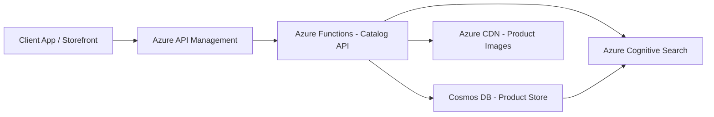

# How to Create a Serverless E-Commerce Product Catalog API with Azure Functions and Cosmos DB

Author: [nawazdhandala](https://www.github.com/nawazdhandala)

Tags: Azure Functions, Cosmos DB, E-Commerce, Serverless, REST API, Product Catalog, Retail

Description: Create a serverless e-commerce product catalog API using Azure Functions for compute and Cosmos DB for flexible product data storage.

---

Product catalogs are deceptively complex. At first glance, it seems straightforward - store some products and let people search them. But then you need to handle thousands of different product attributes, category hierarchies, search filters, pagination, and seasonal traffic spikes that can multiply your load by ten times overnight during a sale.

Serverless architecture handles this well. Azure Functions scale automatically to match demand, and Cosmos DB provides the flexibility to store products with wildly different attribute schemas. You do not need to provision capacity for Black Friday year-round. In this guide, I will build a complete product catalog API.

## Why Serverless for Product Catalogs

Traditional e-commerce platforms run on fixed infrastructure. You provision servers based on expected peak traffic, which means you are paying for idle capacity most of the year. During flash sales or holiday seasons, you scramble to scale up and hope the provisioning finishes before traffic hits.

With Azure Functions, you pay per execution. During quiet periods, costs are minimal. During a sale, Functions spins up as many instances as needed. Cosmos DB with autoscale does the same for the database layer. Your catalog handles 100 requests per second and 100,000 requests per second with the same architecture.

## Architecture



API Management provides rate limiting, authentication, and a clean interface for your frontend. The Functions handle business logic. Cosmos DB stores the product data. Cognitive Search provides full-text and faceted search.

## Step 1 - Design the Cosmos DB Data Model

E-commerce products have variable schemas. A shirt has size and color. A laptop has RAM, CPU, and screen size. A book has author and ISBN. Cosmos DB's schema-less design handles this naturally.

Here is the product document structure.

```json
{
  "id": "prod-12345",
  "sku": "SHIRT-BLU-M",
  "name": "Classic Blue Oxford Shirt",
  "category": "clothing/shirts/dress-shirts",
  "brand": "StyleCo",
  "price": {
    "amount": 59.99,
    "currency": "USD",
    "salePrice": 44.99,
    "saleEnd": "2026-03-01T00:00:00Z"
  },
  "attributes": {
    "color": "Blue",
    "size": "M",
    "material": "100% Cotton",
    "fit": "Regular"
  },
  "inventory": {
    "inStock": true,
    "quantity": 247,
    "warehouse": "east-1"
  },
  "images": [
    {"url": "https://cdn.example.com/prod-12345/main.jpg", "alt": "Blue Oxford Shirt Front"},
    {"url": "https://cdn.example.com/prod-12345/back.jpg", "alt": "Blue Oxford Shirt Back"}
  ],
  "searchKeywords": ["blue", "oxford", "shirt", "dress shirt", "cotton", "formal"],
  "rating": 4.3,
  "reviewCount": 128,
  "createdAt": "2026-01-15T10:00:00Z",
  "updatedAt": "2026-02-10T14:30:00Z"
}
```

Partition by category for queries that browse within a category. If most queries are by product ID, you could partition by ID instead. The choice depends on your access patterns.

```bash
# Create the Cosmos DB container for products
az cosmosdb sql container create \
  --account-name ecommerce-catalog-db \
  --resource-group ecommerce-rg \
  --database-name CatalogDB \
  --name Products \
  --partition-key-path "/category" \
  --throughput 4000 \
  --idx @catalog-index-policy.json
```

## Step 2 - Build the API Functions

Here is the core of the catalog API - an Azure Functions project with endpoints for CRUD operations and search.

The function to get a product by ID is the simplest and most frequently called endpoint.

```python
import azure.functions as func
import json
from azure.cosmos import CosmosClient, exceptions

# Initialize Cosmos DB client outside the function for connection reuse
cosmos_client = CosmosClient.from_connection_string(
    os.environ["COSMOS_CONNECTION_STRING"]
)
container = cosmos_client.get_database_client("CatalogDB").get_container_client("Products")

app = func.FunctionApp()

@app.route(route="products/{product_id}", methods=["GET"])
def get_product(req: func.HttpRequest) -> func.HttpResponse:
    """Retrieve a single product by its ID."""
    product_id = req.route_params.get("product_id")

    try:
        # Cross-partition read since we might not know the category
        query = "SELECT * FROM c WHERE c.id = @id"
        items = list(container.query_items(
            query=query,
            parameters=[{"name": "@id", "value": product_id}],
            enable_cross_partition_query=True
        ))

        if not items:
            return func.HttpResponse(
                json.dumps({"error": "Product not found"}),
                status_code=404,
                mimetype="application/json"
            )

        return func.HttpResponse(
            json.dumps(items[0]),
            status_code=200,
            mimetype="application/json"
        )
    except exceptions.CosmosHttpResponseError as e:
        return func.HttpResponse(
            json.dumps({"error": str(e)}),
            status_code=500,
            mimetype="application/json"
        )
```

The listing endpoint with pagination and filtering is more involved. This is the endpoint your category pages call.

```python
@app.route(route="products", methods=["GET"])
def list_products(req: func.HttpRequest) -> func.HttpResponse:
    """List products with filtering, sorting, and pagination."""
    # Parse query parameters
    category = req.params.get("category")
    brand = req.params.get("brand")
    min_price = req.params.get("min_price")
    max_price = req.params.get("max_price")
    in_stock = req.params.get("in_stock")
    sort_by = req.params.get("sort_by", "name")
    page_size = int(req.params.get("page_size", "20"))
    continuation = req.params.get("continuation")

    # Build the query dynamically based on filters
    conditions = []
    parameters = []

    if category:
        conditions.append("STARTSWITH(c.category, @category)")
        parameters.append({"name": "@category", "value": category})

    if brand:
        conditions.append("c.brand = @brand")
        parameters.append({"name": "@brand", "value": brand})

    if min_price:
        conditions.append("c.price.amount >= @minPrice")
        parameters.append({"name": "@minPrice", "value": float(min_price)})

    if max_price:
        conditions.append("c.price.amount <= @maxPrice")
        parameters.append({"name": "@maxPrice", "value": float(max_price)})

    if in_stock == "true":
        conditions.append("c.inventory.inStock = true")

    # Construct the full query
    where_clause = " AND ".join(conditions) if conditions else "1=1"
    order_clause = get_order_clause(sort_by)
    query = f"SELECT * FROM c WHERE {where_clause} {order_clause}"

    # Execute with pagination using continuation tokens
    query_options = {"max_item_count": page_size}
    if continuation:
        query_options["continuation"] = continuation

    results = container.query_items(
        query=query,
        parameters=parameters,
        enable_cross_partition_query=True,
        max_item_count=page_size
    )

    # Get the page of results
    page = list(results.by_page().next())

    response = {
        "products": page,
        "count": len(page),
        "continuation": results.continuation_token
    }

    return func.HttpResponse(
        json.dumps(response),
        status_code=200,
        mimetype="application/json"
    )

def get_order_clause(sort_by: str) -> str:
    """Convert sort parameter to ORDER BY clause."""
    sort_map = {
        "name": "ORDER BY c.name ASC",
        "price_asc": "ORDER BY c.price.amount ASC",
        "price_desc": "ORDER BY c.price.amount DESC",
        "rating": "ORDER BY c.rating DESC",
        "newest": "ORDER BY c.createdAt DESC"
    }
    return sort_map.get(sort_by, "ORDER BY c.name ASC")
```

## Step 3 - Add Product Search

For full-text search with facets and filters, integrate Azure Cognitive Search. It provides relevance scoring, fuzzy matching, and faceted navigation that Cosmos DB queries alone cannot match.

```python
from azure.search.documents import SearchClient
from azure.core.credentials import AzureKeyCredential

search_client = SearchClient(
    endpoint="https://catalog-search.search.windows.net",
    index_name="products",
    credential=AzureKeyCredential(os.environ["SEARCH_API_KEY"])
)

@app.route(route="products/search", methods=["GET"])
def search_products(req: func.HttpRequest) -> func.HttpResponse:
    """Full-text search across the product catalog with facets."""
    query_text = req.params.get("q", "*")
    category_filter = req.params.get("category")
    page = int(req.params.get("page", "1"))
    page_size = int(req.params.get("page_size", "20"))

    # Build search options
    search_options = {
        "search_text": query_text,
        "top": page_size,
        "skip": (page - 1) * page_size,
        "include_total_count": True,
        "facets": ["brand,count:10", "category,count:10", "attributes/color,count:10"],
        "highlight_fields": "name,description",
        "query_type": "full"
    }

    # Add category filter if specified
    if category_filter:
        search_options["filter"] = f"category eq '{category_filter}'"

    results = search_client.search(**search_options)

    products = []
    for result in results:
        products.append(result)

    response = {
        "products": products,
        "totalCount": results.get_count(),
        "facets": results.get_facets(),
        "page": page,
        "pageSize": page_size
    }

    return func.HttpResponse(
        json.dumps(response, default=str),
        status_code=200,
        mimetype="application/json"
    )
```

Set up a Cosmos DB change feed that automatically syncs product updates to the search index. This way, when a product is added or modified in Cosmos DB, the search index updates within seconds.

## Step 4 - Handle Product Creation and Updates

```python
@app.route(route="products", methods=["POST"])
def create_product(req: func.HttpRequest) -> func.HttpResponse:
    """Create a new product in the catalog."""
    try:
        product = req.get_json()

        # Validate required fields
        required = ["sku", "name", "category", "price"]
        missing = [f for f in required if f not in product]
        if missing:
            return func.HttpResponse(
                json.dumps({"error": f"Missing required fields: {missing}"}),
                status_code=400,
                mimetype="application/json"
            )

        # Generate ID if not provided
        if "id" not in product:
            product["id"] = f"prod-{uuid.uuid4().hex[:8]}"

        # Add timestamps
        now = datetime.utcnow().isoformat() + "Z"
        product["createdAt"] = now
        product["updatedAt"] = now

        # Write to Cosmos DB
        container.create_item(body=product)

        return func.HttpResponse(
            json.dumps(product),
            status_code=201,
            mimetype="application/json"
        )
    except Exception as e:
        return func.HttpResponse(
            json.dumps({"error": str(e)}),
            status_code=500,
            mimetype="application/json"
        )
```

## Step 5 - Deploy and Configure API Management

Wrap the Functions behind API Management for rate limiting, caching, and a clean API surface.

```bash
# Create the Function App
az functionapp create \
  --name catalog-api-func \
  --resource-group ecommerce-rg \
  --consumption-plan-location eastus \
  --runtime python \
  --runtime-version 3.11 \
  --functions-version 4 \
  --storage-account catalogstorage

# Import into API Management
az apim api import \
  --resource-group ecommerce-rg \
  --service-name catalog-apim \
  --path catalog \
  --api-id catalog-api \
  --specification-format OpenApi \
  --specification-url "https://catalog-api-func.azurewebsites.net/api/openapi"
```

Add a caching policy for product detail pages. Products do not change frequently, so a 5-minute cache on GET requests significantly reduces function invocations and Cosmos DB RU consumption.

## Wrapping Up

A serverless product catalog on Azure Functions and Cosmos DB gives you automatic scaling, flexible schema for diverse products, and low operational overhead. The combination of Cosmos DB for transactional queries and Cognitive Search for full-text search covers the two main access patterns any catalog needs. Add API Management for a production-grade API layer with caching and rate limiting. The result is a catalog API that handles steady-state traffic cheaply and scales up instantly for traffic spikes without manual intervention.
