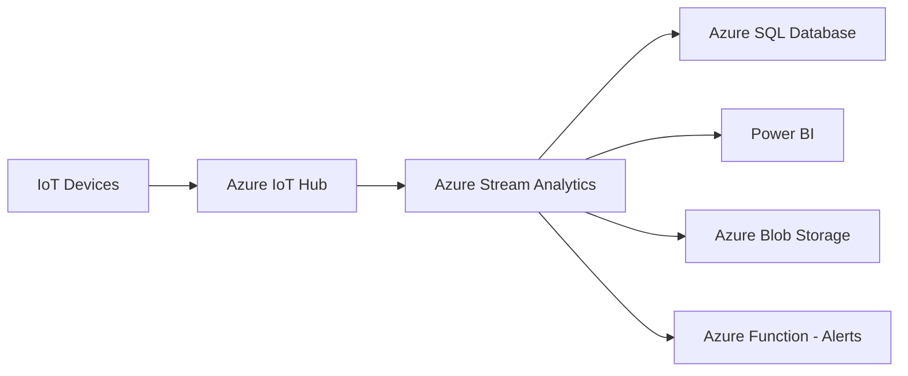

# How to Create a Stream Analytics Job to Process Real-Time IoT Data in Azure

Author: [nawazdhandala](https://www.github.com/nawazdhandala)

Tags: Azure Stream Analytics, IoT, Real-Time Processing, Event Hubs, Azure IoT Hub, Azure

Description: A step-by-step guide to creating an Azure Stream Analytics job that processes real-time IoT device data for monitoring, alerting, and analytics.

---

IoT devices generate data continuously - temperature readings, sensor measurements, GPS coordinates, machine telemetry. Processing this data in real time lets you detect anomalies as they happen, trigger alerts before problems escalate, and build live dashboards that show what is happening right now. Azure Stream Analytics is purpose-built for this kind of real-time data processing.

Stream Analytics is a fully managed service that lets you write SQL-like queries to process streaming data. You define inputs (where data comes from), a query (how to transform it), and outputs (where results go). The service handles scaling, fault tolerance, and exactly-once processing.

In this post, I will walk through creating a complete Stream Analytics job that ingests IoT telemetry from Azure IoT Hub, processes it in real time, and sends results to multiple outputs.

## Architecture Overview

Here is the typical architecture for real-time IoT processing.



IoT devices send telemetry to Azure IoT Hub (or Event Hubs). Stream Analytics reads from the hub, processes the data with SQL queries, and routes results to one or more outputs - a database for persistent storage, Power BI for real-time dashboards, blob storage for archival, or an Azure Function for custom alerting.

## Prerequisites

1. An Azure subscription
2. Azure IoT Hub with devices sending telemetry
3. An output destination (Azure SQL Database, Blob Storage, or Power BI)

If you do not have IoT Hub set up yet, you can use Azure Event Hubs as the input instead. The Stream Analytics configuration is nearly identical.

## Step 1: Create the Stream Analytics Job

1. Go to the Azure portal and search for "Stream Analytics jobs"
2. Click "Create"
3. Fill in the basics:
   - **Job name**: `iot-telemetry-processor`
   - **Resource group**: your resource group
   - **Location**: same region as your IoT Hub for best performance
   - **Hosting environment**: Cloud
   - **Streaming units**: 3 (start small, scale later)

4. Click "Create"

Streaming units determine the processing capacity. 1 SU provides roughly 1 MB/s of throughput. You can scale up to hundreds of SUs for high-volume scenarios.

## Step 2: Configure the Input

The input tells Stream Analytics where to read data from.

1. Open your Stream Analytics job
2. Go to **Inputs** > **Add stream input** > **IoT Hub**
3. Configure:
   - **Input alias**: `iot-input` (you will reference this in your query)
   - **IoT Hub**: select your IoT Hub
   - **Endpoint**: Messaging
   - **Consumer group**: create a dedicated consumer group for Stream Analytics (do not use `$Default`)
   - **Serialization**: JSON with UTF-8 encoding

```json
// Input configuration (JSON representation)
{
  "name": "iot-input",
  "properties": {
    "type": "Stream",
    "datasource": {
      "type": "Microsoft.Devices/IotHubs",
      "properties": {
        "iotHubNamespace": "my-iot-hub",
        "sharedAccessPolicyName": "iothubowner",
        "sharedAccessPolicyKey": "<key>",
        "endpoint": "messages/events",
        "consumerGroupName": "streamanalytics"
      }
    },
    "serialization": {
      "type": "Json",
      "properties": {
        "encoding": "UTF8"
      }
    }
  }
}
```

### Add a Reference Input

Reference inputs provide static or slowly changing data for enriching the stream. For example, a table mapping device IDs to device names and locations.

1. Go to **Inputs** > **Add reference input** > **SQL Database**
2. Configure:
   - **Input alias**: `device-reference`
   - **Database**: your Azure SQL Database with device metadata
   - **Table**: `dbo.DeviceRegistry`
   - **Refresh rate**: every 1 hour (or snapshot)

## Step 3: Configure Outputs

Add one or more outputs for the processed data.

### SQL Database Output

1. Go to **Outputs** > **Add** > **SQL Database**
2. Configure:
   - **Output alias**: `sql-output`
   - **Database**: your Azure SQL Database
   - **Table**: `dbo.ProcessedTelemetry`
   - **Authentication**: SQL authentication or managed identity

### Blob Storage Output (for archival)

1. Go to **Outputs** > **Add** > **Blob storage/ADLS Gen2**
2. Configure:
   - **Output alias**: `archive-output`
   - **Storage account**: your storage account
   - **Container**: `telemetry-archive`
   - **Path pattern**: `{date}/{time}` (partitions by date and time)
   - **Serialization**: Parquet (efficient for analytics)

### Azure Function Output (for alerts)

1. Go to **Outputs** > **Add** > **Azure Function**
2. Configure:
   - **Output alias**: `alert-output`
   - **Function app**: your Azure Function App
   - **Function**: the function that sends alerts

## Step 4: Write the Query

This is where the real processing happens. Stream Analytics uses a SQL-like query language with extensions for temporal operations.

```sql
-- Stream Analytics query for processing IoT telemetry

-- Query 1: Calculate average temperature per device every 5 minutes
-- and write to SQL database
SELECT
    IoTHub.ConnectionDeviceId AS DeviceId,
    ref.DeviceName,
    ref.Location,
    AVG(temperature) AS AvgTemperature,
    MIN(temperature) AS MinTemperature,
    MAX(temperature) AS MaxTemperature,
    AVG(humidity) AS AvgHumidity,
    COUNT(*) AS ReadingCount,
    System.Timestamp() AS WindowEnd
INTO [sql-output]
FROM [iot-input] AS telemetry
TIMESTAMP BY EventEnqueuedUtcTime
-- Join with reference data to enrich the stream
LEFT JOIN [device-reference] AS ref
    ON telemetry.IoTHub.ConnectionDeviceId = ref.DeviceId
-- Group by device in 5-minute tumbling windows
GROUP BY
    IoTHub.ConnectionDeviceId,
    ref.DeviceName,
    ref.Location,
    TumblingWindow(minute, 5)

-- Query 2: Detect temperature anomalies and send alerts
-- Alert when temperature exceeds 80 degrees
SELECT
    IoTHub.ConnectionDeviceId AS DeviceId,
    temperature AS Temperature,
    humidity AS Humidity,
    EventEnqueuedUtcTime AS EventTime,
    'HIGH_TEMPERATURE' AS AlertType
INTO [alert-output]
FROM [iot-input]
TIMESTAMP BY EventEnqueuedUtcTime
WHERE temperature > 80

-- Query 3: Archive all raw telemetry to blob storage
SELECT
    IoTHub.ConnectionDeviceId AS DeviceId,
    temperature,
    humidity,
    pressure,
    EventEnqueuedUtcTime AS EventTime,
    System.Timestamp() AS ProcessedTime
INTO [archive-output]
FROM [iot-input]
TIMESTAMP BY EventEnqueuedUtcTime
```

Note that a single Stream Analytics job can have multiple queries writing to different outputs. Each SELECT...INTO block is an independent query path.

## Step 5: Test the Query

Before starting the job, test your query with sample data.

1. Click **Test query** in the query editor
2. Upload a sample JSON file that represents your IoT telemetry, or use data from the live input
3. Review the results to verify the output matches your expectations

Sample input data format:

```json
[
  {
    "temperature": 72.5,
    "humidity": 45.2,
    "pressure": 1013.25,
    "EventEnqueuedUtcTime": "2026-02-16T10:00:00Z",
    "IoTHub": {
      "ConnectionDeviceId": "device-001"
    }
  },
  {
    "temperature": 85.1,
    "humidity": 38.7,
    "pressure": 1012.80,
    "EventEnqueuedUtcTime": "2026-02-16T10:00:05Z",
    "IoTHub": {
      "ConnectionDeviceId": "device-002"
    }
  }
]
```

## Step 6: Start the Job

1. Click **Overview** > **Start**
2. Choose the output start time:
   - **Now** - start processing from the current time
   - **Custom** - start from a specific time (useful for reprocessing)
   - **Last stopped** - resume from where the job last stopped
3. Click **Start**

The job takes a minute or two to initialize, then begins processing data in real time.

## Step 7: Monitor the Job

Once running, monitor the job's health and performance.

### Key Metrics

- **SU % Utilization** - how much of your allocated capacity is being used. Keep this below 80%.
- **Input Events** - number of events received
- **Output Events** - number of events written to outputs
- **Watermark Delay** - how far behind real time the processing is
- **Runtime Errors** - serialization errors, query errors, etc.

### Set Up Alerts

Create Azure Monitor alerts for:

- SU utilization exceeding 80% (indicates you need to scale up)
- Watermark delay exceeding your SLA threshold
- Runtime errors (indicates data format issues)
- Input events dropping to zero (indicates the source stopped sending)

## Handling Late-Arriving Events

IoT data often arrives late due to network delays or device connectivity issues. Stream Analytics handles this with the late arrival tolerance.

1. Go to **Event ordering** in your job settings
2. Configure:
   - **Out-of-order events**: choose to adjust or drop
   - **Out-of-order tolerance window**: e.g., 5 seconds
   - **Late arrival tolerance window**: e.g., 5 minutes

Events that arrive within the late arrival window are included in the correct time window. Events arriving later than the tolerance are either dropped or adjusted.

## Scaling

If your input volume grows, scale the job by increasing Streaming Units.

- 1 SU handles roughly 1 MB/s throughput
- Scale in increments of 1, 3, or 6 SUs
- The query complexity affects how much data each SU can handle
- Partition your input for better parallelism

For best scalability, design your queries to be embarrassingly parallel. This means partitioning the input and using PARTITION BY in your query.

```sql
-- Partitioned query for better parallelism
SELECT
    IoTHub.ConnectionDeviceId AS DeviceId,
    AVG(temperature) AS AvgTemperature,
    System.Timestamp() AS WindowEnd
INTO [sql-output]
FROM [iot-input]
TIMESTAMP BY EventEnqueuedUtcTime
PARTITION BY IoTHub.ConnectionDeviceId
GROUP BY
    IoTHub.ConnectionDeviceId,
    TumblingWindow(minute, 5)
```

## Wrapping Up

Azure Stream Analytics makes it straightforward to process real-time IoT data without managing infrastructure. Define your input (IoT Hub or Event Hubs), write SQL queries to filter, aggregate, and enrich the data, and route results to one or more outputs. The service handles scaling, fault tolerance, and exactly-once processing. Start with a small number of streaming units, monitor utilization, and scale up as your device fleet and data volume grow. For IoT scenarios, the combination of IoT Hub for ingestion, Stream Analytics for processing, and Power BI or SQL Database for consumption gives you an end-to-end real-time analytics pipeline with minimal operational overhead.
