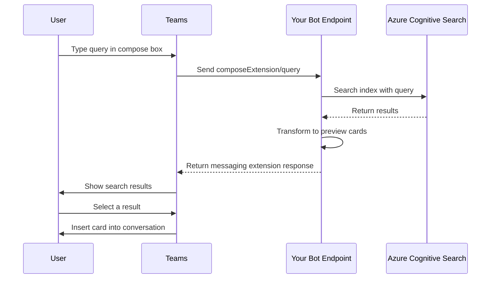

# How to Create a Teams Messaging Extension That Searches Azure Cognitive Search Indexes

Author: [nawazdhandala](https://www.github.com/nawazdhandala)

Tags: Microsoft Teams, Messaging Extensions, Azure Cognitive Search, Bot Framework, Search, Azure, Productivity

Description: Create a Teams messaging extension that lets users search Azure Cognitive Search indexes and share results directly in conversations.

---

Messaging extensions are one of the most useful but underutilized features in Microsoft Teams. They let users search for external content right from the compose box and insert it into a conversation. Instead of switching to another application, copying a link, and pasting it into Teams, users can find and share content without ever leaving the chat.

When you pair a messaging extension with Azure Cognitive Search, you get a powerful combination: your organization's knowledge base, documentation, product catalog, or any indexed content becomes searchable directly from Teams. In this guide, I will build a messaging extension that searches an Azure Cognitive Search index and returns rich preview cards.

## How Messaging Extensions Work

When a user types in the compose box and invokes your messaging extension, Teams sends a search query to your bot endpoint. Your bot queries Azure Cognitive Search, transforms the results into preview cards, and sends them back. The user picks a result, and Teams inserts a rich card into the conversation.



## Setting Up Azure Cognitive Search

First, create a search service and populate an index. For this example, let us build a product catalog search:

```bash
# Create the Azure Cognitive Search service
az search service create \
  --name search-products \
  --resource-group rg-teams-extension \
  --sku basic \
  --location eastus

# Get the admin key for index management
ADMIN_KEY=$(az search admin-key show \
  --service-name search-products \
  --resource-group rg-teams-extension \
  --query primaryKey -o tsv)
```

Create the search index with a schema that matches your product data:

```json
{
    "name": "products",
    "fields": [
        { "name": "id", "type": "Edm.String", "key": true, "filterable": true },
        { "name": "name", "type": "Edm.String", "searchable": true, "filterable": true },
        { "name": "description", "type": "Edm.String", "searchable": true },
        { "name": "category", "type": "Edm.String", "searchable": true, "filterable": true, "facetable": true },
        { "name": "price", "type": "Edm.Double", "filterable": true, "sortable": true },
        { "name": "imageUrl", "type": "Edm.String" },
        { "name": "productUrl", "type": "Edm.String" },
        { "name": "sku", "type": "Edm.String", "filterable": true },
        { "name": "inStock", "type": "Edm.Boolean", "filterable": true }
    ],
    "suggesters": [
        {
            "name": "sg",
            "searchMode": "analyzingInfixMatching",
            "sourceFields": ["name", "category"]
        }
    ]
}
```

## Building the Messaging Extension Bot

The messaging extension is a Teams bot that handles `composeExtension/query` activities:

```typescript
// src/searchExtensionBot.ts - Teams messaging extension that searches Cognitive Search
import {
    TeamsActivityHandler,
    TurnContext,
    MessagingExtensionQuery,
    MessagingExtensionResponse,
    CardFactory
} from 'botbuilder';
import { SearchClient, AzureKeyCredential } from '@azure/search-documents';

export class SearchExtensionBot extends TeamsActivityHandler {
    private searchClient: SearchClient<ProductDocument>;

    constructor() {
        super();

        // Initialize the Azure Cognitive Search client
        this.searchClient = new SearchClient<ProductDocument>(
            process.env.SEARCH_ENDPOINT!,
            'products',
            new AzureKeyCredential(process.env.SEARCH_QUERY_KEY!)
        );
    }

    // Handle messaging extension search queries
    async handleTeamsMessagingExtensionQuery(
        context: TurnContext,
        query: MessagingExtensionQuery
    ): Promise<MessagingExtensionResponse> {

        // Extract the search text from the query parameters
        const searchText = query.parameters?.find(
            p => p.name === 'searchText'
        )?.value || '';

        // Extract optional category filter
        const categoryFilter = query.parameters?.find(
            p => p.name === 'category'
        )?.value;

        try {
            // Build the search options
            const searchOptions: any = {
                top: 10,
                select: ['id', 'name', 'description', 'category', 'price',
                         'imageUrl', 'productUrl', 'sku', 'inStock'],
                highlightFields: 'name,description',
                queryType: 'simple'
            };

            // Add category filter if specified
            if (categoryFilter && categoryFilter !== 'all') {
                searchOptions.filter = `category eq '${categoryFilter}'`;
            }

            // Execute the search query
            const searchResults = await this.searchClient.search(
                searchText, searchOptions
            );

            // Transform search results into messaging extension attachments
            const attachments = [];
            for await (const result of searchResults.results) {
                const product = result.document;

                // Build a preview card (what shows in the search results list)
                const preview = CardFactory.thumbnailCard(
                    product.name,
                    `${product.category} - $${product.price?.toFixed(2)} - ${product.inStock ? 'In Stock' : 'Out of Stock'}`,
                    product.imageUrl ? [{ url: product.imageUrl }] : undefined
                );

                // Build a detailed card (what gets inserted into the conversation)
                const detailCard = this.buildProductCard(product);

                attachments.push({
                    ...CardFactory.adaptiveCard(detailCard),
                    preview: preview
                });
            }

            // Return the results to Teams
            return {
                composeExtension: {
                    type: 'result',
                    attachmentLayout: 'list',
                    attachments: attachments
                }
            };
        } catch (error) {
            console.error('Search error:', error);

            return {
                composeExtension: {
                    type: 'message',
                    text: 'Sorry, the search service is currently unavailable.'
                }
            };
        }
    }

    // Build a rich adaptive card for the selected product
    private buildProductCard(product: ProductDocument): any {
        return {
            type: 'AdaptiveCard',
            version: '1.4',
            body: [
                {
                    type: 'ColumnSet',
                    columns: [
                        {
                            type: 'Column',
                            width: 'auto',
                            items: product.imageUrl ? [{
                                type: 'Image',
                                url: product.imageUrl,
                                size: 'Medium',
                                altText: product.name
                            }] : []
                        },
                        {
                            type: 'Column',
                            width: 'stretch',
                            items: [
                                {
                                    type: 'TextBlock',
                                    text: product.name,
                                    size: 'Large',
                                    weight: 'Bolder',
                                    wrap: true
                                },
                                {
                                    type: 'TextBlock',
                                    text: `SKU: ${product.sku}`,
                                    size: 'Small',
                                    isSubtle: true
                                },
                                {
                                    type: 'FactSet',
                                    facts: [
                                        { title: 'Category', value: product.category },
                                        { title: 'Price', value: `$${product.price?.toFixed(2)}` },
                                        { title: 'Availability', value: product.inStock ? 'In Stock' : 'Out of Stock' }
                                    ]
                                }
                            ]
                        }
                    ]
                },
                {
                    type: 'TextBlock',
                    text: product.description,
                    wrap: true,
                    maxLines: 3
                }
            ],
            actions: [
                {
                    type: 'Action.OpenUrl',
                    title: 'View Product',
                    url: product.productUrl
                }
            ]
        };
    }
}

// Type definition for the search index document
interface ProductDocument {
    id: string;
    name: string;
    description: string;
    category: string;
    price: number;
    imageUrl: string;
    productUrl: string;
    sku: string;
    inStock: boolean;
}
```

## Teams App Manifest

The app manifest tells Teams about your messaging extension. The `composeExtensions` section defines the search commands:

```json
{
    "$schema": "https://developer.microsoft.com/en-us/json-schemas/teams/v1.16/MicrosoftTeams.schema.json",
    "manifestVersion": "1.16",
    "version": "1.0.0",
    "id": "your-app-guid-here",
    "name": {
        "short": "Product Search",
        "full": "Product Catalog Search Extension"
    },
    "description": {
        "short": "Search products from Teams",
        "full": "Search the product catalog and share product details directly in Teams conversations."
    },
    "developer": {
        "name": "Your Company",
        "websiteUrl": "https://yourcompany.com",
        "privacyUrl": "https://yourcompany.com/privacy",
        "termsOfUseUrl": "https://yourcompany.com/terms"
    },
    "bots": [
        {
            "botId": "your-bot-app-id",
            "scopes": ["personal", "team", "groupChat"],
            "supportsFiles": false
        }
    ],
    "composeExtensions": [
        {
            "botId": "your-bot-app-id",
            "commands": [
                {
                    "id": "searchProducts",
                    "type": "query",
                    "title": "Search Products",
                    "description": "Search the product catalog",
                    "initialRun": true,
                    "parameters": [
                        {
                            "name": "searchText",
                            "title": "Search",
                            "description": "Enter product name or keywords",
                            "inputType": "text"
                        },
                        {
                            "name": "category",
                            "title": "Category",
                            "description": "Filter by category",
                            "inputType": "choiceset",
                            "choices": [
                                { "title": "All Categories", "value": "all" },
                                { "title": "Electronics", "value": "Electronics" },
                                { "title": "Clothing", "value": "Clothing" },
                                { "title": "Home & Garden", "value": "Home & Garden" }
                            ]
                        }
                    ]
                }
            ]
        }
    ]
}
```

## Adding Autocomplete with Suggestions

Make the search experience faster by implementing type-ahead suggestions using the Azure Cognitive Search suggester:

```typescript
// Handle type-ahead suggestions for the messaging extension
async handleTeamsMessagingExtensionQuerySettingUrl(
    context: TurnContext,
    query: MessagingExtensionQuery
): Promise<MessagingExtensionResponse> {
    const searchText = query.parameters?.find(
        p => p.name === 'searchText'
    )?.value || '';

    if (searchText.length < 2) {
        return { composeExtension: { type: 'result', attachmentLayout: 'list', attachments: [] } };
    }

    // Use the suggester for fast type-ahead results
    const suggestions = await this.searchClient.suggest(searchText, 'sg', {
        top: 5,
        select: ['name', 'category', 'price']
    });

    const attachments = suggestions.results.map(s => {
        const preview = CardFactory.thumbnailCard(
            s.document.name,
            `${s.document.category} - $${s.document.price?.toFixed(2)}`
        );

        return {
            ...CardFactory.heroCard(s.document.name),
            preview
        };
    });

    return {
        composeExtension: {
            type: 'result',
            attachmentLayout: 'list',
            attachments
        }
    };
}
```

## Deploying and Testing

Package your Teams app and test it:

```bash
# Create the Teams app package
cd manifest
zip -r ../product-search.zip ./*
cd ..

# Upload to Teams Admin Center or sideload for testing
# In Teams: Apps -> Manage your apps -> Upload a custom app
```

For local development, use the Teams Toolkit or ngrok to tunnel requests to your local bot:

```bash
# Start ngrok to expose your local bot
ngrok http 3978

# Update the bot registration endpoint to your ngrok URL
az bot update \
  --resource-group rg-teams-extension \
  --name bot-product-search \
  --endpoint "https://your-id.ngrok.io/api/messages"
```

## Wrapping Up

A Teams messaging extension backed by Azure Cognitive Search gives your organization's data a convenient, always-accessible search interface right inside the communication tool everyone already uses. The search results appear as rich cards with images, metadata, and action buttons, making it easy to share structured information in conversations. The key to a good messaging extension is speed - Azure Cognitive Search's millisecond response times, combined with the suggester for type-ahead, make the experience feel responsive and natural. Start with one index that your team searches frequently, and expand from there.
