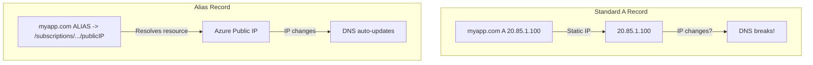

# How to Create Alias Records in Azure DNS to Point to Azure Resources

Author: [nawazdhandala](https://www.github.com/nawazdhandala)

Tags: Azure, Azure DNS, Alias Records, DNS, CDN, Traffic Manager, Azure Networking

Description: Learn how to use Azure DNS alias records to point your domain directly to Azure resources like Traffic Manager, CDN, and public IPs.

---

Standard DNS records point to IP addresses or hostnames. But Azure resources like Traffic Manager profiles, CDN endpoints, and public IPs can change their underlying IP addresses over time. If you hard-code an IP in a DNS A record and it changes, your domain breaks. Azure DNS alias records solve this by pointing directly to the Azure resource rather than its IP. When the resource's IP changes, the DNS record automatically stays in sync.

Alias records also solve the classic "CNAME at zone apex" problem. Standard DNS does not allow CNAME records at the root of a domain (like `myapp.com` without a subdomain). Alias records bypass this limitation by creating A or AAAA records at the apex that point to Azure resources.

## When to Use Alias Records

There are three primary scenarios:

1. **Zone apex domains.** You want `myapp.com` (not `www.myapp.com`) to point to a Traffic Manager profile, Front Door, CDN endpoint, or public IP. Standard CNAME records cannot do this.

2. **Automatic IP updates.** Your public IP is associated with a load balancer or Application Gateway. If the IP changes (due to deallocation or recreation), the alias record automatically reflects the new IP.

3. **Traffic Manager integration.** You want both `www.myapp.com` and `myapp.com` to use Traffic Manager for failover routing.

## How Alias Records Differ from Standard Records



## Prerequisites

- An Azure subscription
- An Azure DNS zone for your domain
- One or more Azure resources to point to (Public IP, Traffic Manager, CDN endpoint, or Front Door)
- Azure CLI installed

## Step 1: Create an Azure DNS Zone

If you already host your DNS in Azure, skip this step.

```bash
# Create a resource group
az group create --name rg-dns-demo --location eastus

# Create a DNS zone
az network dns zone create \
  --resource-group rg-dns-demo \
  --name myapp.com
```

After creating the zone, update your domain registrar's name servers to point to the Azure DNS name servers shown in the zone:

```bash
# Get the name servers for the zone
az network dns zone show \
  --resource-group rg-dns-demo \
  --name myapp.com \
  --query "nameServers" --output tsv
```

## Step 2: Create an Alias Record for a Public IP

The most common use case is pointing the zone apex to an Azure public IP.

```bash
# First, create a public IP (or use an existing one)
az network public-ip create \
  --resource-group rg-dns-demo \
  --name pip-webapp \
  --sku Standard \
  --allocation-method Static \
  --location eastus

# Get the public IP resource ID
PIP_ID=$(az network public-ip show \
  --resource-group rg-dns-demo \
  --name pip-webapp \
  --query id --output tsv)

# Create an alias A record at the zone apex pointing to the public IP
az network dns record-set a create \
  --resource-group rg-dns-demo \
  --zone-name myapp.com \
  --name "@" \
  --target-resource $PIP_ID
```

The `@` symbol represents the zone apex (the bare domain `myapp.com`). The `--target-resource` flag is what makes this an alias record instead of a standard A record.

## Step 3: Create an Alias Record for Traffic Manager

Point your apex domain to a Traffic Manager profile for global load balancing and failover.

```bash
# Get the Traffic Manager profile resource ID
TM_ID=$(az network traffic-manager profile show \
  --resource-group rg-tm \
  --name tm-myapp \
  --query id --output tsv)

# Create an alias record at the apex pointing to Traffic Manager
az network dns record-set a create \
  --resource-group rg-dns-demo \
  --zone-name myapp.com \
  --name "@" \
  --target-resource $TM_ID
```

This is particularly powerful because it gives you Traffic Manager failover on the apex domain, which is impossible with standard CNAME records.

## Step 4: Create an Alias Record for a CDN Endpoint

Point a subdomain or apex to an Azure CDN endpoint.

```bash
# Get the CDN endpoint resource ID
CDN_ID=$(az cdn endpoint show \
  --resource-group rg-cdn \
  --profile-name cdn-profile \
  --name myapp-cdn \
  --query id --output tsv)

# Create an alias record for the CDN endpoint
az network dns record-set a create \
  --resource-group rg-dns-demo \
  --zone-name myapp.com \
  --name "static" \
  --target-resource $CDN_ID
```

Now `static.myapp.com` points to your CDN endpoint and will stay updated if the endpoint's IP changes.

## Step 5: Create an Alias Record for Azure Front Door

```bash
# Get the Front Door endpoint resource ID
FD_ID=$(az afd endpoint show \
  --resource-group rg-fd \
  --profile-name fd-myapp \
  --endpoint-name myapp-endpoint \
  --query id --output tsv)

# Create an alias record for Front Door
az network dns record-set a create \
  --resource-group rg-dns-demo \
  --zone-name myapp.com \
  --name "@" \
  --target-resource $FD_ID
```

## Step 6: Create a Subdomain Alias Record

Alias records work for subdomains too, not just the apex.

```bash
# Create an alias record for www subdomain
az network dns record-set a create \
  --resource-group rg-dns-demo \
  --zone-name myapp.com \
  --name "www" \
  --target-resource $PIP_ID

# Create an alias for the API subdomain pointing to a different resource
az network dns record-set a create \
  --resource-group rg-dns-demo \
  --zone-name myapp.com \
  --name "api" \
  --target-resource $TM_ID
```

## Verifying Alias Records

Check that the alias record is configured correctly.

```bash
# Show the record set details
az network dns record-set a show \
  --resource-group rg-dns-demo \
  --zone-name myapp.com \
  --name "@" \
  --output json
```

The output should show a `targetResource` field with the resource ID. If it shows an `aRecords` array with IP addresses instead, it is a standard A record, not an alias.

Test resolution:

```bash
# Test DNS resolution
nslookup myapp.com
dig myapp.com A
```

## Alias Records vs. CNAME Records

Here is a comparison to help you decide which to use:

| Feature | Alias Record | CNAME Record |
|---|---|---|
| Zone apex support | Yes | No |
| Auto-updates with resource IP | Yes | N/A (points to name) |
| Supported record types | A, AAAA | CNAME only |
| Points to | Azure resource ID | Hostname |
| Works with non-Azure targets | No | Yes |
| Dangling DNS prevention | Yes | No |

Alias records only work with Azure resources. If you need to point to a non-Azure endpoint, use standard A or CNAME records.

## Dangling DNS Prevention

One of the underrated benefits of alias records is dangling DNS prevention. If you have a standard A record pointing to a public IP, and you delete that public IP, the DNS record remains - pointing to an IP that someone else could claim. This is a known attack vector.

With alias records, if the target resource is deleted, the DNS record stops resolving rather than pointing to a potentially hijacked IP.

## Listing All Alias Records

```bash
# List all record sets in the zone
az network dns record-set list \
  --resource-group rg-dns-demo \
  --zone-name myapp.com \
  --output table

# Filter to find alias records (those with targetResource)
az network dns record-set a list \
  --resource-group rg-dns-demo \
  --zone-name myapp.com \
  --query "[?targetResource.id != null].{Name:name, Target:targetResource.id}" \
  --output table
```

## Supported Target Resources

Not all Azure resources can be alias record targets. The supported types are:

- Azure Public IP address (Standard SKU)
- Azure Traffic Manager profile
- Azure CDN endpoint
- Azure Front Door endpoint

Resources like App Services, Storage accounts, and VMs are not directly supported. For App Services, use a CNAME record for subdomains or route through Traffic Manager/Front Door for the apex.

## Cleanup

```bash
# Delete the resource group
az group delete --name rg-dns-demo --yes --no-wait
```

## Wrapping Up

Azure DNS alias records solve two problems elegantly: pointing zone apex domains to Azure resources (which CNAME records cannot do) and keeping DNS records automatically synchronized when Azure resource IPs change. Use them for any Azure resource that has a public IP - Traffic Manager profiles, CDN endpoints, Front Door, and public IPs. They are simple to create, they prevent dangling DNS vulnerabilities, and they save you from the headache of manually updating DNS records when infrastructure changes.
