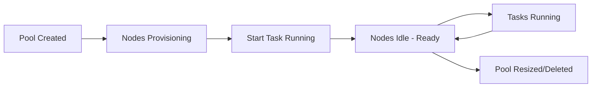

# How to Create an Azure Batch Account and Pool Using the Azure CLI

Author: [nawazdhandala](https://www.github.com/nawazdhandala)

Tags: Azure, Batch, Azure CLI, HPC, Cloud Computing, Pool Management, Compute

Description: A step-by-step guide to creating an Azure Batch account, configuring a compute pool, and preparing it for large-scale parallel workload execution.

---

Azure Batch is Microsoft's managed service for running large-scale parallel and high-performance computing (HPC) workloads. It handles provisioning compute nodes, scheduling tasks, and scaling the pool based on demand. You provide the work, and Batch manages the infrastructure. This post walks through creating a Batch account and pool from scratch using the Azure CLI, with enough detail to get you running real workloads.

## What Is Azure Batch?

At its core, Azure Batch is a job scheduler that runs on pools of virtual machines. You submit jobs that contain tasks (each task is typically a command-line operation or script), and Batch distributes those tasks across available compute nodes. It handles:

- Provisioning and managing VMs (compute nodes)
- Scheduling tasks across nodes
- Auto-scaling the pool based on workload
- File staging and output collection
- Retry logic for failed tasks

Common use cases include video rendering, financial risk modeling, genomic analysis, image processing, and any workload that can be parallelized.

## Step 1: Create a Resource Group

Start with a resource group to hold all the Batch-related resources.

```bash
# Create a resource group for Batch resources
az group create \
  --name batch-rg \
  --location eastus
```

## Step 2: Create a Storage Account

Batch uses Azure Storage for input files, output files, and resource packages. A linked storage account is essential for most workloads.

```bash
# Create a storage account for Batch input/output
az storage account create \
  --name batchstorageacct \
  --resource-group batch-rg \
  --location eastus \
  --sku Standard_LRS
```

## Step 3: Create the Batch Account

The Batch account is the top-level resource that manages pools, jobs, and tasks.

```bash
# Create a Batch account linked to the storage account
az batch account create \
  --name mybatchaccount \
  --resource-group batch-rg \
  --location eastus \
  --storage-account batchstorageacct
```

After creation, set the Batch account as the default for subsequent CLI commands.

```bash
# Log in to the Batch account for CLI operations
az batch account login \
  --name mybatchaccount \
  --resource-group batch-rg \
  --shared-key-auth
```

## Step 4: Choose a VM Image

Before creating a pool, you need to decide which OS image to use. Batch supports various Linux and Windows images.

```bash
# List available VM images for Batch
az batch pool supported-images list \
  --output table \
  --query "[?contains(nodeAgentSkuId, 'ubuntu')]"
```

For most Linux workloads, Ubuntu Server 22.04 LTS is a solid choice. Note the `imageReference` values - you will need the publisher, offer, sku, and node agent SKU ID.

## Step 5: Create a Compute Pool

Now create the pool. This defines the VM size, count, OS image, and networking configuration.

```bash
# Create a pool with 3 dedicated compute nodes
az batch pool create \
  --id my-compute-pool \
  --vm-size Standard_D2s_v3 \
  --target-dedicated-nodes 3 \
  --image "canonical:0001-com-ubuntu-server-jammy:22_04-lts" \
  --node-agent-sku-id "batch.node.ubuntu 22.04"
```

This creates a pool called `my-compute-pool` with 3 VMs, each using the Standard_D2s_v3 size (2 vCPUs, 8 GB RAM).

## Step 6: Configure a Start Task

A start task runs on each node when it joins the pool. Use it to install software, download dependencies, or configure the environment.

```bash
# Create a pool with a start task that installs dependencies
az batch pool create \
  --id worker-pool \
  --vm-size Standard_D4s_v3 \
  --target-dedicated-nodes 5 \
  --image "canonical:0001-com-ubuntu-server-jammy:22_04-lts" \
  --node-agent-sku-id "batch.node.ubuntu 22.04" \
  --start-task-command-line "/bin/bash -c 'apt-get update && apt-get install -y python3-pip ffmpeg && pip3 install numpy pandas'" \
  --start-task-wait-for-success true \
  --start-task-resource-files "https://batchstorageacct.blob.core.windows.net/scripts/setup.sh"
```

The `--start-task-wait-for-success true` flag means the node will not be marked as ready until the start task completes successfully. If the start task fails, the node will be marked as unusable and Batch will try to provision a replacement.

## Step 7: Create a Pool with JSON Configuration

For more complex configurations, use a JSON file.

```json
{
  "id": "advanced-pool",
  "vmSize": "Standard_D8s_v3",
  "targetDedicatedNodes": 3,
  "targetLowPriorityNodes": 10,
  "virtualMachineConfiguration": {
    "imageReference": {
      "publisher": "canonical",
      "offer": "0001-com-ubuntu-server-jammy",
      "sku": "22_04-lts"
    },
    "nodeAgentSkuId": "batch.node.ubuntu 22.04"
  },
  "startTask": {
    "commandLine": "/bin/bash -c 'echo Pool node started at $(date)'",
    "waitForSuccess": true,
    "userIdentity": {
      "autoUser": {
        "scope": "pool",
        "elevationLevel": "admin"
      }
    }
  },
  "taskSlotsPerNode": 4,
  "taskSchedulingPolicy": {
    "nodeFillType": "pack"
  },
  "networkConfiguration": {
    "subnetId": "/subscriptions/{sub-id}/resourceGroups/batch-rg/providers/Microsoft.Network/virtualNetworks/batch-vnet/subnets/batch-subnet"
  }
}
```

```bash
# Create the pool from a JSON file
az batch pool create --json-file pool-config.json
```

Key configuration options in the JSON:

- `taskSlotsPerNode: 4` allows up to 4 tasks to run concurrently on each node
- `nodeFillType: pack` fills nodes to capacity before using the next one (as opposed to "spread" which distributes evenly)
- `targetLowPriorityNodes: 10` uses cheaper spot VMs for cost savings

## Step 8: Monitor Pool Status

After creating the pool, nodes take a few minutes to provision and start.

```bash
# Check pool status
az batch pool show \
  --pool-id my-compute-pool \
  --query "{state:allocationState, dedicated:currentDedicatedNodes, lowPri:currentLowPriorityNodes, targetDedicated:targetDedicatedNodes}"

# List nodes in the pool
az batch node list \
  --pool-id my-compute-pool \
  --output table

# Wait until all nodes are idle (ready for tasks)
az batch pool show \
  --pool-id my-compute-pool \
  --query "allocationState"
```

Node states progress through: `creating` -> `starting` -> `waitingforstarttask` -> `idle` (ready for work).

## Pool Lifecycle



## Step 9: Resize the Pool

You can change the number of nodes at any time.

```bash
# Scale up to 10 dedicated nodes
az batch pool resize \
  --pool-id my-compute-pool \
  --target-dedicated-nodes 10

# Scale down to 2 nodes
az batch pool resize \
  --pool-id my-compute-pool \
  --target-dedicated-nodes 2

# Stop a resize operation in progress
az batch pool resize \
  --pool-id my-compute-pool \
  --abort
```

## Step 10: Delete the Pool

When you are done, delete the pool to stop incurring charges.

```bash
# Delete the pool and all its nodes
az batch pool delete \
  --pool-id my-compute-pool \
  --yes
```

## Choosing the Right VM Size

The VM size significantly impacts both cost and performance. Here are some guidelines:

| Workload Type | Recommended VM Size | Why |
|--------------|-------------------|-----|
| CPU-intensive (rendering, simulation) | Standard_F16s_v2 | High CPU-to-memory ratio |
| Memory-intensive (data analysis) | Standard_E8s_v3 | High memory-to-CPU ratio |
| GPU workloads (ML training, video) | Standard_NC6s_v3 | NVIDIA Tesla V100 GPU |
| General purpose | Standard_D4s_v3 | Balanced CPU and memory |
| Cost-sensitive | Standard_B2ms | Burstable, cheapest option |

## Troubleshooting

**Nodes stuck in "creating" state:** Check the Batch account quotas. You might have reached the core quota for your subscription. Request a quota increase through the Azure portal.

**Start task fails:** Check the start task output logs. On each node, logs are stored in the `startup/stdout.txt` and `startup/stderr.txt` files. You can access them via the portal or CLI.

```bash
# List files on a specific node to find start task logs
az batch node file list \
  --pool-id my-compute-pool \
  --node-id tvm-12345 \
  --output table
```

**Nodes marked as "unusable":** This typically happens when the start task fails. Check the error details and fix the start task command.

## Summary

Creating an Azure Batch account and pool is the foundation for running large-scale parallel workloads. The key decisions are choosing the right VM size for your workload, configuring start tasks to set up the node environment, and deciding between dedicated and low-priority nodes based on your budget and reliability requirements. Once the pool is running, you are ready to submit jobs and tasks, which is where the real work happens.
