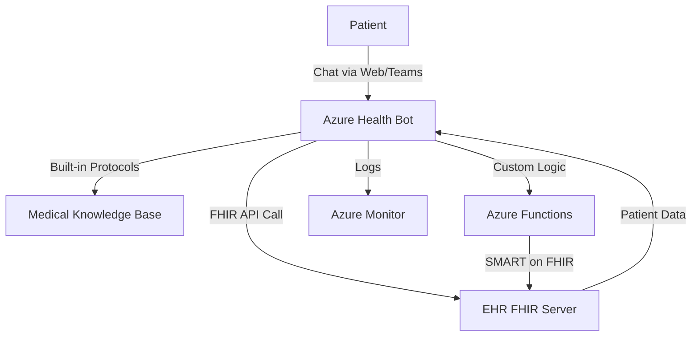

# How to Create an Azure Health Bot That Integrates with Electronic Health Record Systems

Author: [nawazdhandala](https://www.github.com/nawazdhandala)

Tags: Azure Health Bot, EHR, Healthcare, FHIR, Patient Engagement, Chatbot, Azure

Description: Build an Azure Health Bot that connects to electronic health record systems via FHIR APIs to provide patients with personalized health information.

---

Azure Health Bot is a managed service for building healthcare-specific conversational AI. Unlike general-purpose chatbot platforms, Health Bot includes built-in medical knowledge, symptom assessment protocols, and compliance features designed for healthcare. When integrated with an Electronic Health Record (EHR) system through FHIR APIs, the bot can provide patients with personalized information about their appointments, medications, lab results, and care plans.

This guide covers setting up Azure Health Bot, connecting it to an EHR through FHIR, building conversation scenarios that pull clinical data, and handling the compliance requirements of healthcare chatbots.

## Architecture



## Step 1: Create the Azure Health Bot Instance

1. In the Azure portal, search for "Azure Health Bot".
2. Click Create.
3. Configure:
   - Name: Your bot name (e.g., "contoso-health-assistant")
   - Subscription and resource group
   - Region: Choose based on data residency requirements
   - Plan: S1 (Standard) for production, Free for development
4. Click Create.

After deployment, go to the Health Bot management portal:

`https://us.healthbot.microsoft.com/account/{bot-name}`

This is where you build conversation scenarios.

## Step 2: Configure FHIR Data Connection

### Set Up the FHIR Connection in Health Bot

1. In the Health Bot management portal, go to Integration > Data connections.
2. Click New data connection.
3. Configure:
   - Name: `EHR-FHIR`
   - Type: FHIR
   - Base URL: Your FHIR server URL (e.g., `https://my-fhir-server.azurehealthcareapis.com`)
   - Authentication: OAuth 2.0 Client Credentials
   - Token URL: `https://login.microsoftonline.com/{tenant-id}/oauth2/v2.0/token`
   - Client ID: Your app registration client ID
   - Client Secret: Your app registration client secret
   - Scope: `https://my-fhir-server.azurehealthcareapis.com/.default`

### SMART on FHIR for Patient Context

For patient-facing scenarios where the bot should access only the current patient's data, implement SMART on FHIR:

1. Register a SMART on FHIR application with your EHR.
2. Configure the Health Bot to use the SMART launch flow.
3. The patient authenticates with the EHR during the bot conversation.
4. The bot receives a scoped access token that only allows access to that patient's data.

This is more secure than using app-level credentials because the bot never has broad access to all patient data.

## Step 3: Build Conversation Scenarios

Health Bot uses a visual scenario editor. Each scenario is a conversation flow with decision nodes, API calls, and responses.

### Scenario 1: Appointment Lookup

Create a scenario that lets patients check their upcoming appointments.

**Flow:**

1. **Greeting**: "Hi! I can help you check your upcoming appointments, view lab results, or look up your medications. What would you like to do?"
2. **Patient Identification**: Ask for patient ID or use the authenticated patient context.
3. **FHIR Query**: Call the FHIR server to get appointments.
4. **Response**: Format and present the appointments.

The FHIR query for appointments:

```
GET /Appointment?patient={patient-id}&date=ge{today}&status=booked&_sort=date&_count=5
```

In the Health Bot scenario editor, add a "Data connection" action:

- Connection: EHR-FHIR
- FHIR Resource: Appointment
- Parameters:
  - patient: `scenario.patientId`
  - date: `ge` + today's date
  - status: `booked`
  - _sort: `date`
  - _count: `5`

Then add a response action that formats the results:

```javascript
// Format appointment data for the patient
// Extracts key details from the FHIR Appointment resources
var appointments = scenario.fhirResponse.entry || [];
var message = "";

if (appointments.length === 0) {
    message = "You don't have any upcoming appointments scheduled.";
} else {
    message = "Here are your upcoming appointments:\n\n";
    for (var i = 0; i < appointments.length; i++) {
        var appt = appointments[i].resource;
        var date = new Date(appt.start).toLocaleDateString();
        var time = new Date(appt.start).toLocaleTimeString();
        var type = appt.serviceType?.[0]?.text || "General";
        var provider = appt.participant?.find(
            p => p.actor?.reference?.startsWith("Practitioner")
        )?.actor?.display || "Your provider";

        message += (i + 1) + ". " + type + " with " + provider +
                   "\n   Date: " + date + " at " + time + "\n\n";
    }
}

scenario.appointmentMessage = message;
```

### Scenario 2: Medication List

Query the patient's active medications:

```
GET /MedicationRequest?patient={patient-id}&status=active&_include=MedicationRequest:medication
```

Format the response for the patient:

```javascript
// Format medication data in a patient-friendly way
// Includes drug name, dosage, and instructions
var medications = scenario.fhirResponse.entry || [];
var message = "";

if (medications.length === 0) {
    message = "I don't see any active medications on file for you.";
} else {
    message = "Your current medications:\n\n";
    for (var i = 0; i < medications.length; i++) {
        var med = medications[i].resource;
        if (med.resourceType !== "MedicationRequest") continue;

        var name = med.medicationCodeableConcept?.text ||
                   med.medicationCodeableConcept?.coding?.[0]?.display ||
                   "Unknown medication";
        var dosage = med.dosageInstruction?.[0]?.text || "As directed";

        message += "- " + name + "\n  Dosage: " + dosage + "\n\n";
    }
    message += "Please contact your care team if you have questions about your medications.";
}

scenario.medicationMessage = message;
```

### Scenario 3: Lab Results

Query recent lab results:

```
GET /Observation?patient={patient-id}&category=laboratory&_sort=-date&_count=10
```

Present results with appropriate context:

```javascript
// Format lab results with normal range indicators
// Flags results that are outside normal ranges
var observations = scenario.fhirResponse.entry || [];
var message = "Your recent lab results:\n\n";

for (var i = 0; i < observations.length; i++) {
    var obs = observations[i].resource;
    var testName = obs.code?.text || obs.code?.coding?.[0]?.display || "Lab Test";
    var value = obs.valueQuantity ?
        obs.valueQuantity.value + " " + (obs.valueQuantity.unit || "") :
        obs.valueString || "No result";
    var date = new Date(obs.effectiveDateTime).toLocaleDateString();
    var status = "";

    // Check interpretation for abnormal flags
    if (obs.interpretation?.[0]?.coding?.[0]?.code === "H") {
        status = " (HIGH)";
    } else if (obs.interpretation?.[0]?.coding?.[0]?.code === "L") {
        status = " (LOW)";
    }

    message += "- " + testName + ": " + value + status +
               "\n  Date: " + date + "\n\n";
}

message += "Note: Please discuss any questions about your results with your healthcare provider.";
scenario.labMessage = message;
```

### Scenario 4: Symptom Assessment

Health Bot includes built-in symptom assessment using medical protocols:

1. In the scenario editor, add a "Built-in scenario" action.
2. Select "Symptom checker".
3. The bot will guide the patient through a medical triage based on their symptoms.
4. Results include possible conditions and recommended actions (e.g., "See a doctor within 24 hours").

This is a key differentiator of Azure Health Bot - the medical knowledge base is curated and updated by medical professionals.

## Step 4: Implement Patient Authentication

Patient authentication is critical for accessing personal health data.

### Option A: EHR Portal Integration

Embed the Health Bot within the EHR's patient portal. The patient is already authenticated, and you pass their patient ID to the bot session:

```javascript
// Initialize the Health Bot with patient context from the portal
// The patient ID is passed securely from the authenticated portal session
var botConfig = {
    webchatSecret: "YOUR_WEBCHAT_SECRET",
    directLineToken: "YOUR_DL_TOKEN",
    userId: portalSession.patientId,
    customLocale: "en-US",
    sendActivityOnLoad: true,
    customActivity: {
        type: "event",
        name: "setPatientContext",
        value: {
            patientId: portalSession.patientFhirId,
            patientName: portalSession.patientName
        }
    }
};
```

### Option B: Identity Verification

If the bot is accessed outside the EHR portal, verify the patient's identity:

1. Ask for identifying information (date of birth, last 4 of SSN, MRN).
2. Verify against the FHIR server.
3. Only proceed with data access after successful verification.

```javascript
// Verify patient identity using FHIR search
// Matches on multiple identifiers for security
var results = await fhirSearch("Patient", {
    birthdate: scenario.providedDOB,
    identifier: scenario.providedMRN
});

if (results.total === 1) {
    scenario.patientId = results.entry[0].resource.id;
    scenario.verified = true;
} else {
    scenario.verified = false;
}
```

## Step 5: Deploy the Bot

### Web Channel

Embed the bot in a website using the Web Chat widget:

```html
<!-- Embed the Health Bot in your patient portal -->
<!-- The bot handles all conversation logic server-side -->
<div id="healthbot-container"></div>
<script src="https://cdn.botframework.com/botframework-webchat/latest/webchat.js"></script>
<script>
    const store = window.WebChat.createStore();

    window.WebChat.renderWebChat({
        directLine: window.WebChat.createDirectLine({
            token: 'YOUR_DIRECT_LINE_TOKEN'
        }),
        store: store,
        styleOptions: {
            botAvatarImage: '/images/health-bot-avatar.png',
            botAvatarInitials: 'HB',
            userAvatarInitials: 'You',
            backgroundColor: '#f5f5f5'
        }
    }, document.getElementById('healthbot-container'));
</script>
```

### Microsoft Teams

Deploy the bot to Microsoft Teams for internal clinical staff use:

1. In the Health Bot portal, go to Integration > Channels.
2. Enable Microsoft Teams.
3. Follow the registration steps to publish the bot to your Teams tenant.

## Step 6: Compliance and Safety

Healthcare chatbots have strict requirements:

### Disclaimers

Add medical disclaimers at the start of every conversation and before presenting clinical data:

"This bot provides general health information and can show data from your health records. It is not a substitute for professional medical advice. In case of emergency, call 911."

### Audit Logging

Enable audit logging for all bot conversations:

1. In the Health Bot portal, go to Configuration > Conversation logs.
2. Enable conversation logging.
3. Configure log retention based on your compliance requirements.
4. Export logs to Azure Monitor for centralized analysis.

### Data Handling

- Never store PHI in the bot's conversation state longer than the session.
- Use HTTPS for all API calls.
- Encrypt sensitive data in transit and at rest.
- Implement session timeouts for inactive conversations.

### Fallback to Human

Always provide an option to connect with a human agent:

- "Would you like to speak with a care coordinator?"
- Route to a live agent through the Health Bot's human handoff feature.
- Log the conversation context so the human agent has the full history.

## Monitoring

Track these metrics:

- Conversation completion rate (how many patients complete their intended task).
- FHIR API response times (slow responses mean poor patient experience).
- Authentication failure rate (indicates issues with identity verification).
- Escalation rate (how often patients need human help).
- Patient satisfaction scores (if you add a feedback prompt).

## Wrapping Up

Azure Health Bot with EHR integration through FHIR APIs creates a patient engagement channel that provides personalized health information securely. The key components are the Health Bot service for conversation management and medical knowledge, FHIR connections for pulling patient data from the EHR, patient authentication to ensure data privacy, and compliance features including audit logging, disclaimers, and human handoff. Start with simple read-only scenarios like appointment lookup and medication lists, then expand to more complex interactions as you validate the system with real patients.
