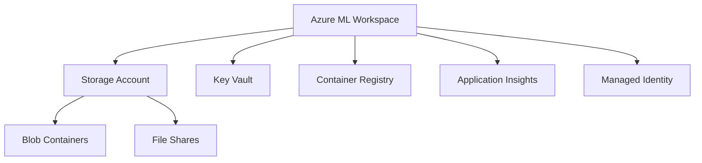

# How to Create an Azure Machine Learning Workspace from Scratch

Author: [nawazdhandala](https://www.github.com/nawazdhandala)

Tags: Azure, Machine Learning, Workspace, Cloud, MLOps, Data Science

Description: A complete guide to creating and configuring an Azure Machine Learning workspace with all the associated resources and security settings.

---

Azure Machine Learning is Microsoft's cloud platform for building, training, and deploying machine learning models. At the center of everything in Azure ML is the workspace. The workspace is the top-level resource that holds all your experiments, models, datasets, compute targets, and endpoints. Think of it as a project folder that lives in the cloud and connects to all the Azure services your ML workflow needs.

In this post, I will walk you through creating an Azure Machine Learning workspace from scratch, including all the supporting resources it depends on, and the configuration decisions you should think about before hitting the create button.

## What Gets Created with a Workspace

When you create an Azure ML workspace, several supporting resources are created automatically:

- **Azure Storage Account**: Stores datasets, model artifacts, experiment outputs, and logs.
- **Azure Key Vault**: Stores secrets like connection strings, API keys, and passwords used by your ML pipelines.
- **Azure Container Registry (optional)**: Stores Docker images for model deployments and custom environments.
- **Azure Application Insights**: Provides monitoring and telemetry for deployed model endpoints.

These resources are created in the same resource group as your workspace unless you specify existing ones.



## Method 1: Create via the Azure Portal

The Azure Portal provides the simplest way to create a workspace for the first time.

### Step 1: Navigate to Create a Resource

Open the Azure Portal (portal.azure.com). Click "Create a resource" and search for "Azure Machine Learning." Select it and click "Create."

### Step 2: Fill in the Basics

- **Subscription**: Select your Azure subscription.
- **Resource group**: Choose an existing group or create a new one. I recommend creating a dedicated resource group for your ML project so all related resources are easy to find and manage.
- **Workspace name**: Pick a meaningful name. This becomes part of the workspace URL and is used in API calls. Use lowercase letters, numbers, and hyphens. For example: `ml-workspace-production` or `ml-recommendation-engine`.
- **Region**: Choose the region closest to your data and team. Important: not all regions support all VM sizes for compute. Check the Azure ML documentation for region-specific compute availability.

### Step 3: Configure Networking

You have two options:

- **Public endpoint**: The workspace is accessible from the internet. Simpler to set up, fine for development and experimentation.
- **Private endpoint**: The workspace is only accessible from within a virtual network. Required for most production scenarios where data sensitivity is a concern.

For a private workspace, you will need to have a Virtual Network (VNet) already set up. The private endpoint creates a private IP address for the workspace within your VNet.

### Step 4: Configure Storage and Associated Resources

You can let Azure create new supporting resources or point to existing ones:

- **Storage account**: A general-purpose v2 storage account works best. If you have an existing storage account with your training data, you can use it, but I recommend creating a dedicated one for the workspace to keep things clean.
- **Key Vault**: If your organization has a centralized Key Vault, you can point to it. Otherwise, let Azure create a new one.
- **Container Registry**: This is optional at creation time. Azure ML will create one automatically when you first deploy a model or create a custom environment. Skipping it saves a few dollars per month until you need it.
- **Application Insights**: This is used for monitoring deployed endpoints. Let Azure create it with the workspace.

### Step 5: Configure Identity

Azure ML workspaces support two identity types:

- **System-assigned managed identity**: Azure creates and manages an identity for the workspace. This is the default and simplest option.
- **User-assigned managed identity**: You provide a pre-created managed identity. This is useful when you need the same identity across multiple resources or when your organization has strict identity management policies.

### Step 6: Review and Create

Review all settings and click "Create." The deployment takes 2-5 minutes.

## Method 2: Create via Azure CLI

For repeatable setups, use the Azure CLI. This is especially useful for CI/CD pipelines and infrastructure-as-code workflows.

```bash
# Install the Azure ML CLI extension if you have not already
az extension add --name ml --version 2.22.0

# Create a resource group
az group create \
    --name ml-project-rg \
    --location eastus

# Create the workspace with default associated resources
az ml workspace create \
    --name ml-workspace-production \
    --resource-group ml-project-rg \
    --location eastus \
    --display-name "Production ML Workspace" \
    --description "Workspace for production machine learning workloads"
```

This creates the workspace along with all the default supporting resources.

## Method 3: Create via Python SDK

The Azure ML Python SDK (v2) provides a programmatic way to create workspaces, which is handy when you want to include workspace creation in a setup script.

```python
from azure.ai.ml import MLClient
from azure.ai.ml.entities import Workspace
from azure.identity import DefaultAzureCredential

# Authenticate using default credentials (az login, managed identity, etc.)
credential = DefaultAzureCredential()

# Define the workspace configuration
workspace = Workspace(
    name="ml-workspace-production",
    location="eastus",
    display_name="Production ML Workspace",
    description="Workspace for production machine learning workloads",
    tags={"environment": "production", "team": "data-science"}
)

# Create an MLClient at the subscription level to create the workspace
ml_client = MLClient(
    credential=credential,
    subscription_id="your-subscription-id",
    resource_group_name="ml-project-rg"
)

# Create the workspace (this may take a few minutes)
workspace = ml_client.workspaces.begin_create(workspace).result()
print(f"Workspace created: {workspace.name}")
print(f"Workspace ID: {workspace.id}")
```

## Method 4: Create via Terraform

For organizations using Terraform for infrastructure management, here is the configuration:

```hcl
# Configure the Azure provider
provider "azurerm" {
  features {}
}

# Create a resource group
resource "azurerm_resource_group" "ml" {
  name     = "ml-project-rg"
  location = "East US"
}

# Create Application Insights
resource "azurerm_application_insights" "ml" {
  name                = "ml-workspace-insights"
  location            = azurerm_resource_group.ml.location
  resource_group_name = azurerm_resource_group.ml.name
  application_type    = "web"
}

# Create Key Vault
resource "azurerm_key_vault" "ml" {
  name                = "ml-workspace-kv"
  location            = azurerm_resource_group.ml.location
  resource_group_name = azurerm_resource_group.ml.name
  tenant_id           = data.azurerm_client_config.current.tenant_id
  sku_name            = "standard"
}

# Create Storage Account
resource "azurerm_storage_account" "ml" {
  name                     = "mlworkspacestorage"
  location                 = azurerm_resource_group.ml.location
  resource_group_name      = azurerm_resource_group.ml.name
  account_tier             = "Standard"
  account_replication_type = "LRS"
}

# Create the Azure ML Workspace
resource "azurerm_machine_learning_workspace" "ml" {
  name                    = "ml-workspace-production"
  location                = azurerm_resource_group.ml.location
  resource_group_name     = azurerm_resource_group.ml.name
  application_insights_id = azurerm_application_insights.ml.id
  key_vault_id            = azurerm_key_vault.ml.id
  storage_account_id      = azurerm_storage_account.ml.id

  identity {
    type = "SystemAssigned"
  }

  tags = {
    environment = "production"
  }
}
```

## Post-Creation Configuration

After creating the workspace, there are a few things you should configure right away.

### Set Up Role-Based Access Control (RBAC)

Azure ML uses Azure RBAC to control who can do what. The key roles are:

- **Owner**: Full access including managing permissions.
- **Contributor**: Can create and manage resources but cannot manage permissions.
- **AzureML Data Scientist**: Can submit experiments and deploy models but cannot manage compute or workspace settings.
- **Reader**: Can view everything but cannot make changes.

Assign the appropriate roles to your team members in the Azure Portal under Access Control (IAM) for the workspace resource.

### Configure Default Datastore

The workspace comes with a default datastore pointing to the associated storage account. You can add additional datastores that connect to Azure Blob Storage, Azure Data Lake, Azure SQL Database, or other data sources.

### Set Up Compute

Before you can train models, you need compute resources. The main options are:

- **Compute instances**: Personal VMs for development and experimentation.
- **Compute clusters**: Auto-scaling clusters for training jobs.
- **Attached compute**: Existing VMs, Databricks clusters, or Kubernetes clusters.

I will cover compute setup in detail in a separate post, but you should create at least one compute instance for interactive development.

## Wrapping Up

Creating an Azure ML workspace is the first step in any machine learning project on Azure. The workspace ties together storage, secrets management, container registry, and monitoring into a single coherent environment. Whether you create it through the Portal, CLI, Python SDK, or Terraform depends on your team's workflow and automation maturity. For production workloads, invest the time upfront to configure private networking, RBAC, and proper resource naming conventions. These foundational decisions are much harder to change later.
