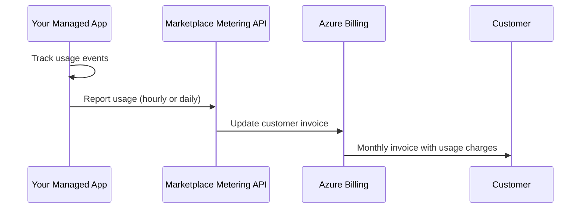

# How to Create an Azure Managed Application with Custom Metering for Usage-Based Billing

Author: [nawazdhandala](https://www.github.com/nawazdhandala)

Tags: Azure Marketplace, Managed Applications, Custom Metering, Usage-Based Billing, SaaS, ARM Templates, Monetization

Description: Learn how to implement custom metering in Azure Managed Applications to enable usage-based billing through the Azure Marketplace metering API.

---

Flat-rate pricing is simple, but it does not work for every product. If your managed application's value scales with usage - number of API calls, data processed, users onboarded, or transactions completed - you need usage-based billing. The Azure Marketplace supports this through the Marketplace Metering Service API, which lets you report custom usage dimensions and bill customers based on actual consumption.

In this guide, I will show you how to create an Azure Managed Application that tracks custom usage metrics and reports them to the Marketplace metering API for accurate, usage-based billing.

## How Marketplace Metering Works

The flow is straightforward:



Your application tracks usage internally, then reports it to Microsoft's metering API at regular intervals. Microsoft handles the actual billing, invoice generation, and payment collection. You get paid through your Partner Center payout account.

## Defining Custom Metering Dimensions

Before writing any code, you need to define your billing dimensions in Partner Center. These are the units you charge for. Here are some examples:

| Dimension ID | Display Name | Unit | Included Quantity | Price per Unit |
|---|---|---|---|---|
| api-calls | API Calls | per 1000 | 50000 | $0.50 |
| data-processed | Data Processed | per GB | 10 | $0.15 |
| active-users | Active Users | per user | 25 | $2.00 |

The "Included Quantity" is the amount bundled with the base plan price. Charges only apply for usage above this threshold.

## Building the Usage Tracking Component

Your managed application needs a component that tracks usage events and aggregates them for reporting. Here is a usage tracker built as an Azure Function that runs inside the managed resource group:

```csharp
// Service that tracks and aggregates usage events for metering
public class UsageTrackingService
{
    private readonly CosmosClient _cosmosClient;
    private readonly Container _usageContainer;
    private readonly ILogger<UsageTrackingService> _logger;

    public UsageTrackingService(CosmosClient cosmosClient, ILogger<UsageTrackingService> logger)
    {
        _cosmosClient = cosmosClient;
        _usageContainer = cosmosClient.GetContainer("MeteringDb", "UsageEvents");
        _logger = logger;
    }

    // Record a single usage event
    public async Task RecordUsageAsync(string dimensionId, double quantity, string details = null)
    {
        var usageEvent = new UsageEvent
        {
            Id = Guid.NewGuid().ToString(),
            DimensionId = dimensionId,
            Quantity = quantity,
            Timestamp = DateTime.UtcNow,
            HourBucket = DateTime.UtcNow.ToString("yyyy-MM-ddTHH"),
            Details = details,
            Reported = false
        };

        await _usageContainer.CreateItemAsync(
            usageEvent,
            new PartitionKey(usageEvent.HourBucket));

        _logger.LogInformation(
            "Recorded usage: {Dimension} = {Quantity}",
            dimensionId, quantity);
    }

    // Aggregate unreported usage for a specific hour
    public async Task<Dictionary<string, double>> GetHourlyAggregateAsync(string hourBucket)
    {
        var query = new QueryDefinition(
            @"SELECT c.dimensionId, SUM(c.quantity) as total
              FROM c
              WHERE c.hourBucket = @hour AND c.reported = false
              GROUP BY c.dimensionId")
            .WithParameter("@hour", hourBucket);

        var results = new Dictionary<string, double>();
        using var iterator = _usageContainer.GetItemQueryIterator<dynamic>(query);

        while (iterator.HasMoreResults)
        {
            var response = await iterator.ReadNextAsync();
            foreach (var item in response)
            {
                results[(string)item.dimensionId] = (double)item.total;
            }
        }

        return results;
    }

    // Mark usage events as reported after successful metering API call
    public async Task MarkAsReportedAsync(string hourBucket)
    {
        var query = new QueryDefinition(
            "SELECT * FROM c WHERE c.hourBucket = @hour AND c.reported = false")
            .WithParameter("@hour", hourBucket);

        using var iterator = _usageContainer.GetItemQueryIterator<UsageEvent>(query);
        while (iterator.HasMoreResults)
        {
            var response = await iterator.ReadNextAsync();
            foreach (var item in response)
            {
                item.Reported = true;
                await _usageContainer.ReplaceItemAsync(
                    item, item.Id, new PartitionKey(item.HourBucket));
            }
        }
    }
}
```

## Reporting Usage to the Marketplace Metering API

The metering API accepts usage reports on an hourly basis. Build a scheduled function that runs at the end of each hour:

```csharp
// Azure Function that reports aggregated usage to the Marketplace Metering API
public class MeteringReporter
{
    private readonly UsageTrackingService _usageTracker;
    private readonly HttpClient _httpClient;
    private readonly IConfiguration _config;
    private readonly ILogger<MeteringReporter> _logger;

    public MeteringReporter(
        UsageTrackingService usageTracker,
        IHttpClientFactory httpClientFactory,
        IConfiguration config,
        ILogger<MeteringReporter> logger)
    {
        _usageTracker = usageTracker;
        _httpClient = httpClientFactory.CreateClient("MeteringApi");
        _config = config;
        _logger = logger;
    }

    [FunctionName("ReportUsageToMarketplace")]
    public async Task Run(
        [TimerTrigger("0 5 * * * *")] TimerInfo timer, // 5 minutes past each hour
        ILogger log)
    {
        // Get the previous hour bucket
        var previousHour = DateTime.UtcNow.AddHours(-1).ToString("yyyy-MM-ddTHH");
        var effectiveTime = DateTime.UtcNow.AddHours(-1)
            .ToString("yyyy-MM-ddTHH:00:00");

        // Get aggregated usage for the previous hour
        var aggregates = await _usageTracker.GetHourlyAggregateAsync(previousHour);

        if (aggregates.Count == 0)
        {
            log.LogInformation("No usage to report for {Hour}", previousHour);
            return;
        }

        // Get an access token for the metering API
        var token = await GetMeteringApiTokenAsync();

        foreach (var (dimensionId, quantity) in aggregates)
        {
            // Build the metering request
            var meteringEvent = new
            {
                resourceId = _config["ManagedApp:ResourceId"],
                quantity = quantity,
                dimension = dimensionId,
                effectiveStartTime = effectiveTime,
                planId = _config["ManagedApp:PlanId"]
            };

            var content = new StringContent(
                JsonSerializer.Serialize(meteringEvent),
                Encoding.UTF8,
                "application/json");

            // Call the Marketplace Metering API
            _httpClient.DefaultRequestHeaders.Authorization =
                new AuthenticationHeaderValue("Bearer", token);

            var response = await _httpClient.PostAsync(
                "https://marketplaceapi.microsoft.com/api/usageEvent?api-version=2018-08-31",
                content);

            if (response.IsSuccessStatusCode)
            {
                log.LogInformation(
                    "Reported usage: {Dimension} = {Quantity} for {Hour}",
                    dimensionId, quantity, previousHour);
            }
            else
            {
                var error = await response.Content.ReadAsStringAsync();
                log.LogError(
                    "Metering API error for {Dimension}: {StatusCode} - {Error}",
                    dimensionId, response.StatusCode, error);

                // Do not mark as reported so we retry next hour
                continue;
            }
        }

        // Mark all successfully reported events
        await _usageTracker.MarkAsReportedAsync(previousHour);
    }

    private async Task<string> GetMeteringApiTokenAsync()
    {
        // Get a token using the managed identity of the Azure Function
        var credential = new DefaultAzureCredential();
        var token = await credential.GetTokenAsync(
            new TokenRequestContext(new[]
            {
                "20e940b3-4c77-4b0b-9a53-9e16a1b010a7/.default"
            }));

        return token.Token;
    }
}
```

The resource scope `20e940b3-4c77-4b0b-9a53-9e16a1b010a7` is the well-known application ID for the Azure Marketplace metering API.

## Integrating Usage Tracking into Your Application

Now wire the usage tracking into your application's business logic. Here is an example of tracking API calls in a middleware:

```csharp
// Middleware that records API call usage for metering
public class ApiUsageMeteringMiddleware
{
    private readonly RequestDelegate _next;

    public ApiUsageMeteringMiddleware(RequestDelegate next)
    {
        _next = next;
    }

    public async Task InvokeAsync(HttpContext context, UsageTrackingService usageTracker)
    {
        // Execute the request
        await _next(context);

        // Only meter successful API calls
        if (context.Response.StatusCode >= 200 && context.Response.StatusCode < 300)
        {
            // Record 1 API call (metering uses per-1000 units, so we track individual calls)
            await usageTracker.RecordUsageAsync("api-calls", 0.001);
        }
    }
}
```

For data processing metering:

```csharp
// Service that processes data and records usage
public class DataProcessingService
{
    private readonly UsageTrackingService _usageTracker;

    public DataProcessingService(UsageTrackingService usageTracker)
    {
        _usageTracker = usageTracker;
    }

    public async Task ProcessDataAsync(Stream dataStream)
    {
        // Calculate the data size in GB
        var sizeInGb = dataStream.Length / (1024.0 * 1024.0 * 1024.0);

        // Process the data
        await DoActualProcessing(dataStream);

        // Record the usage
        await _usageTracker.RecordUsageAsync("data-processed", sizeInGb,
            $"Processed {dataStream.Length} bytes");
    }

    private Task DoActualProcessing(Stream data)
    {
        // Your data processing logic here
        return Task.CompletedTask;
    }
}
```

## Handling Metering Failures and Retries

The metering API can fail for various reasons - network issues, throttling, or invalid data. You need a robust retry mechanism:

```csharp
// Retry service for failed metering reports
public class MeteringRetryService
{
    private readonly UsageTrackingService _usageTracker;
    private readonly ILogger<MeteringRetryService> _logger;

    [FunctionName("RetryFailedMetering")]
    public async Task Run(
        [TimerTrigger("0 30 * * * *")] TimerInfo timer, // 30 minutes past each hour
        ILogger log)
    {
        // Look for unreported usage from previous hours (up to 24 hours back)
        for (int hoursBack = 2; hoursBack <= 24; hoursBack++)
        {
            var hourBucket = DateTime.UtcNow
                .AddHours(-hoursBack)
                .ToString("yyyy-MM-ddTHH");

            var unreported = await _usageTracker.GetHourlyAggregateAsync(hourBucket);

            if (unreported.Count > 0)
            {
                log.LogWarning(
                    "Found unreported usage for {Hour}: {Count} dimensions",
                    hourBucket, unreported.Count);

                // Attempt to report again using the same logic
                // The metering API accepts reports up to 24 hours after the usage period
                await ReportUsageAsync(hourBucket, unreported);
            }
        }
    }

    private async Task ReportUsageAsync(
        string hourBucket, Dictionary<string, double> aggregates)
    {
        // Same reporting logic as the main reporter
        // Omitted for brevity - reuse the MeteringReporter logic
    }
}
```

The metering API accepts usage reports up to 24 hours after the effective time. After that window, unreported usage cannot be billed, so your retry logic is important.

## ARM Template for the Metering Infrastructure

Include the Cosmos DB and Function App in your managed application's ARM template:

```json
{
    "type": "Microsoft.DocumentDB/databaseAccounts",
    "apiVersion": "2023-04-15",
    "name": "[variables('cosmosAccountName')]",
    "location": "[variables('location')]",
    "kind": "GlobalDocumentDB",
    "properties": {
        "databaseAccountOfferType": "Standard",
        "capabilities": [
            { "name": "EnableServerless" }
        ],
        "locations": [
            {
                "locationName": "[variables('location')]",
                "failoverPriority": 0
            }
        ]
    }
}
```

Using serverless Cosmos DB keeps costs low for the metering database since it only incurs charges when usage events are being written and read.

## Testing Custom Metering

Before going live, test your metering integration against the metering API sandbox:

```bash
# Test a metering event against the sandbox
curl -X POST \
  "https://marketplaceapi.microsoft.com/api/usageEvent?api-version=2018-08-31" \
  -H "Authorization: Bearer $TOKEN" \
  -H "Content-Type: application/json" \
  -d '{
    "resourceId": "your-managed-app-resource-id",
    "quantity": 5.0,
    "dimension": "api-calls",
    "effectiveStartTime": "2026-02-16T10:00:00",
    "planId": "standard-plan"
  }'
```

A successful response returns a `usageEventId` and `status: Accepted`. Check Partner Center's analytics dashboard to verify the usage appears correctly.

## Wrapping Up

Custom metering transforms your managed application from a flat-fee product into a usage-based offering that aligns your revenue with the value customers receive. The implementation requires three pieces: usage tracking in your application logic, aggregation and storage in Cosmos DB, and hourly reporting to the Marketplace Metering API. The 24-hour reporting window gives you a buffer for retries, but building a robust retry mechanism from the start saves you from lost revenue. Once the metering pipeline is running reliably, you can add new billing dimensions without changing the reporting infrastructure - just define the new dimension in Partner Center and start recording events against it.
