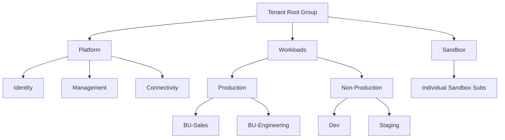

# How to Create an Azure Management Group Hierarchy for Enterprise Subscriptions

Author: [nawazdhandala](https://www.github.com/nawazdhandala)

Tags: Azure, Management Groups, Governance, Enterprise, Subscriptions, Cloud Architecture, Organization

Description: Learn how to design and implement an Azure management group hierarchy that organizes your subscriptions for governance, policy, and access control at scale.

---

When you have more than a handful of Azure subscriptions, managing them individually becomes unsustainable. Applying policies one subscription at a time, managing access across dozens of subscriptions, and trying to get a unified cost view turns into a full-time job. Azure management groups solve this by letting you organize subscriptions into a hierarchy and apply governance controls (policies, RBAC, budgets) at any level. Controls applied to a management group automatically flow down to all subscriptions and resources beneath it.

In this post, I will walk through how to design a management group hierarchy that works for enterprise organizations, then show you how to create it.

## Understanding the Management Group Hierarchy

Every Azure AD tenant has a single root management group called the "Tenant Root Group." All subscriptions in the tenant are descendants of this root group, either directly or through intermediate management groups.



You can nest management groups up to 6 levels deep (not counting the root). Each management group can contain subscriptions and child management groups.

## Designing Your Hierarchy

There is no single correct hierarchy. It depends on your organization. But there are well-established patterns that work for most enterprises.

### The Enterprise-Scale Pattern (Azure Landing Zone)

Microsoft's recommended pattern from the Azure Cloud Adoption Framework organizes management groups by function:

**Platform** - shared infrastructure services
- Identity (Azure AD, domain controllers)
- Management (monitoring, logging, automation)
- Connectivity (hub networking, DNS, firewalls)

**Workloads** - application subscriptions
- Production (business-critical workloads)
- Non-Production (dev, test, staging)

**Sandbox** - experimental subscriptions with relaxed policies

**Decommissioned** - subscriptions being retired (policies prevent new resource creation)

This is a solid starting point for most organizations. Adapt it based on your specific needs.

### Organizing by Business Unit

For large enterprises with distinct business units that need separate governance:

```
Tenant Root
  Platform
    Identity
    Management
    Connectivity
  Business-Unit-A
    BU-A-Production
    BU-A-Non-Production
  Business-Unit-B
    BU-B-Production
    BU-B-Non-Production
  Sandbox
```

### Organizing by Environment

For organizations where environment-level governance is more important than business unit separation:

```
Tenant Root
  Platform
  Production
    Sales-Prod
    Engineering-Prod
    Finance-Prod
  Non-Production
    Dev
    Staging
    QA
  Sandbox
```

## Creating the Hierarchy

### Step 1: Enable Management Groups for Your Tenant

The first time you create a management group, Azure sets up the Tenant Root Group. You need the appropriate permissions (Global Administrator must elevate access, or you need Management Group Contributor role at the root level).

```bash
# Elevate access for Global Administrator (one-time setup)
# This grants the Global Admin user access to the root management group
az rest --method post \
  --url "https://management.azure.com/providers/Microsoft.Authorization/elevateAccess?api-version=2016-07-01"
```

### Step 2: Create Top-Level Management Groups

```bash
# Create the Platform management group
az account management-group create \
  --name "Platform" \
  --display-name "Platform" \
  --parent "Tenant Root Group"

# Create the Workloads management group
az account management-group create \
  --name "Workloads" \
  --display-name "Workloads" \
  --parent "Tenant Root Group"

# Create the Sandbox management group
az account management-group create \
  --name "Sandbox" \
  --display-name "Sandbox" \
  --parent "Tenant Root Group"

# Create the Decommissioned management group
az account management-group create \
  --name "Decommissioned" \
  --display-name "Decommissioned" \
  --parent "Tenant Root Group"
```

### Step 3: Create Second-Level Groups

```bash
# Platform sub-groups
az account management-group create \
  --name "Identity" \
  --display-name "Identity" \
  --parent "Platform"

az account management-group create \
  --name "Management" \
  --display-name "Management" \
  --parent "Platform"

az account management-group create \
  --name "Connectivity" \
  --display-name "Connectivity" \
  --parent "Platform"

# Workloads sub-groups
az account management-group create \
  --name "Production" \
  --display-name "Production" \
  --parent "Workloads"

az account management-group create \
  --name "NonProduction" \
  --display-name "Non-Production" \
  --parent "Workloads"
```

### Step 4: Create Business Unit Groups (If Applicable)

```bash
# Business unit groups under Production
az account management-group create \
  --name "Prod-Sales" \
  --display-name "Sales - Production" \
  --parent "Production"

az account management-group create \
  --name "Prod-Engineering" \
  --display-name "Engineering - Production" \
  --parent "Production"

# Business unit groups under Non-Production
az account management-group create \
  --name "NonProd-Dev" \
  --display-name "Development" \
  --parent "NonProduction"

az account management-group create \
  --name "NonProd-Staging" \
  --display-name "Staging" \
  --parent "NonProduction"
```

### Step 5: Move Subscriptions into the Hierarchy

```bash
# Move a subscription into the appropriate management group
# Replace with your actual subscription ID
az account management-group subscription add \
  --name "Prod-Engineering" \
  --subscription "<subscription-id>"

# Move another subscription
az account management-group subscription add \
  --name "NonProd-Dev" \
  --subscription "<dev-subscription-id>"
```

## Creating the Hierarchy with ARM Templates

For infrastructure as code, use an ARM template to create the entire hierarchy in one deployment:

```json
{
  "$schema": "https://schema.management.azure.com/schemas/2019-08-01/tenantDeploymentTemplate.json#",
  "contentVersion": "1.0.0.0",
  "resources": [
    {
      "type": "Microsoft.Management/managementGroups",
      "apiVersion": "2021-04-01",
      "name": "Platform",
      "properties": {
        "displayName": "Platform"
      }
    },
    {
      "type": "Microsoft.Management/managementGroups",
      "apiVersion": "2021-04-01",
      "name": "Identity",
      "dependsOn": [
        "[tenantResourceId('Microsoft.Management/managementGroups', 'Platform')]"
      ],
      "properties": {
        "displayName": "Identity",
        "details": {
          "parent": {
            "id": "[tenantResourceId('Microsoft.Management/managementGroups', 'Platform')]"
          }
        }
      }
    },
    {
      "type": "Microsoft.Management/managementGroups",
      "apiVersion": "2021-04-01",
      "name": "MgmtGroup",
      "dependsOn": [
        "[tenantResourceId('Microsoft.Management/managementGroups', 'Platform')]"
      ],
      "properties": {
        "displayName": "Management",
        "details": {
          "parent": {
            "id": "[tenantResourceId('Microsoft.Management/managementGroups', 'Platform')]"
          }
        }
      }
    },
    {
      "type": "Microsoft.Management/managementGroups",
      "apiVersion": "2021-04-01",
      "name": "Connectivity",
      "dependsOn": [
        "[tenantResourceId('Microsoft.Management/managementGroups', 'Platform')]"
      ],
      "properties": {
        "displayName": "Connectivity",
        "details": {
          "parent": {
            "id": "[tenantResourceId('Microsoft.Management/managementGroups', 'Platform')]"
          }
        }
      }
    },
    {
      "type": "Microsoft.Management/managementGroups",
      "apiVersion": "2021-04-01",
      "name": "Workloads",
      "properties": {
        "displayName": "Workloads"
      }
    },
    {
      "type": "Microsoft.Management/managementGroups",
      "apiVersion": "2021-04-01",
      "name": "Production",
      "dependsOn": [
        "[tenantResourceId('Microsoft.Management/managementGroups', 'Workloads')]"
      ],
      "properties": {
        "displayName": "Production",
        "details": {
          "parent": {
            "id": "[tenantResourceId('Microsoft.Management/managementGroups', 'Workloads')]"
          }
        }
      }
    },
    {
      "type": "Microsoft.Management/managementGroups",
      "apiVersion": "2021-04-01",
      "name": "NonProduction",
      "dependsOn": [
        "[tenantResourceId('Microsoft.Management/managementGroups', 'Workloads')]"
      ],
      "properties": {
        "displayName": "Non-Production",
        "details": {
          "parent": {
            "id": "[tenantResourceId('Microsoft.Management/managementGroups', 'Workloads')]"
          }
        }
      }
    },
    {
      "type": "Microsoft.Management/managementGroups",
      "apiVersion": "2021-04-01",
      "name": "Sandbox",
      "properties": {
        "displayName": "Sandbox"
      }
    }
  ]
}
```

Deploy with:

```bash
# Deploy at the tenant level (requires appropriate permissions)
az deployment tenant create \
  --location eastus \
  --template-file management-groups.json
```

## Best Practices

### Keep the Hierarchy Shallow

Do not go deeper than 3-4 levels. Deep hierarchies are harder to understand and make policy inheritance harder to debug. If you find yourself going beyond 4 levels, reconsider whether you are organizing by too many dimensions at once.

### Use Consistent Naming

Establish a naming convention for management groups. The `name` property (the ID) cannot be changed after creation, so get it right the first time. Use short, meaningful names like `Platform`, `Prod-Sales`, or `NonProd-Dev`.

### Plan for Growth

Design your hierarchy to accommodate future business units, workload types, and regulatory requirements. It is easier to add a new management group than to restructure an existing hierarchy.

### Document the Hierarchy

Maintain documentation that explains why each management group exists, what policies are applied at each level, and which teams own which groups. This is especially important when team members change.

### Protect the Root Group

Apply minimal policies at the Tenant Root Group level. Policies applied here affect every subscription in your organization, including platform subscriptions. Be very careful and conservative with root-level policies.

### Use the Decommissioned Group

When retiring subscriptions, move them to the Decommissioned group instead of deleting them immediately. Apply a policy to this group that prevents creation of new resources. This gives you time to ensure nothing critical depends on the subscription before final deletion.

## Viewing Your Hierarchy

```bash
# List all management groups
az account management-group list --output table

# Show the hierarchy tree
az account management-group show \
  --name "Tenant Root Group" \
  --recurse \
  --expand \
  --query "children" \
  --output json
```

In the portal, go to "Management groups" to see an interactive tree view that you can expand and collapse.

## Wrapping Up

A well-designed management group hierarchy is the foundation for Azure governance at scale. It lets you apply policies, manage access, and track costs at the right level of granularity without duplicating effort across individual subscriptions. Start with the Azure Landing Zone pattern, adapt it to your organization's structure, and create it using infrastructure as code so your hierarchy is documented and reproducible. The time you invest in getting this right pays dividends every time you need to apply a new policy, onboard a new team, or audit your governance posture.
