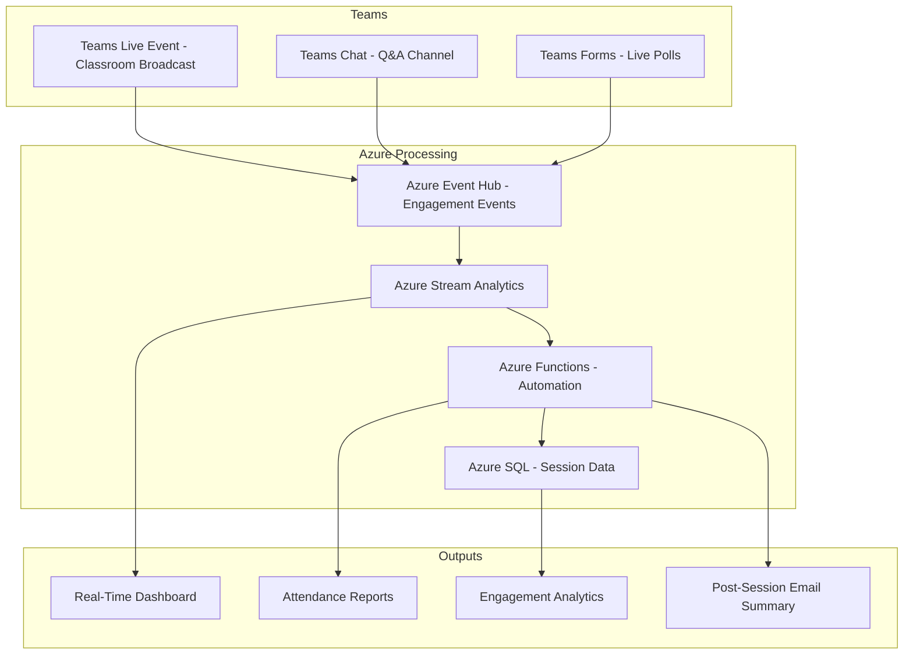

# How to Create an Azure-Powered Virtual Classroom with Teams Live Events and Stream Analytics

Author: [nawazdhandala](https://www.github.com/nawazdhandala)

Tags: Azure, Microsoft Teams, Virtual Classroom, Live Events, Stream Analytics, Education, Online Learning

Description: Create an Azure-powered virtual classroom using Teams Live Events for broadcasting and Stream Analytics for real-time engagement tracking.

---

Virtual classrooms have become a standard part of education. But most implementations are just video calls with screen sharing. A proper virtual classroom needs more - live polling, attendance tracking, engagement analytics, breakout activities, and post-session reporting. You can build all of this by combining Teams Live Events for the broadcast layer with Azure services for the analytics and automation layer.

In this guide, I will show you how to set up a virtual classroom system that goes beyond basic video conferencing. Teachers broadcast through Teams Live Events. Azure Stream Analytics monitors engagement in real time. Azure Functions automates attendance and follow-up actions.

## Architecture



Teams Live Events handles the video broadcast. Engagement events (joins, leaves, chat messages, poll responses) flow into Event Hub. Stream Analytics processes these events in real time for the instructor dashboard. Azure Functions generates reports and triggers follow-up actions after the session ends.

## Step 1 - Configure Teams Live Events

Teams Live Events supports broadcasts to up to 20,000 attendees, which is more than enough for any classroom. Configure the event programmatically using the Microsoft Graph API.

```python
import requests
from datetime import datetime, timedelta

def create_virtual_classroom(
    title: str,
    instructor_email: str,
    start_time: datetime,
    duration_hours: float = 1.5,
    access_token: str = ""
):
    """Create a Teams Live Event for a virtual classroom session."""
    url = "https://graph.microsoft.com/v1.0/communications/onlineMeetings"

    headers = {
        "Authorization": f"Bearer {access_token}",
        "Content-Type": "application/json"
    }

    end_time = start_time + timedelta(hours=duration_hours)

    payload = {
        "subject": title,
        "startDateTime": start_time.isoformat() + "Z",
        "endDateTime": end_time.isoformat() + "Z",
        "isBroadcast": True,
        "broadcastSettings": {
            "allowedAudience": "organization",  # Restrict to your tenant
            "isRecordingEnabled": True,
            "isAttendeeReportEnabled": True,
            "isQuestionAndAnswerEnabled": True,
            "isVideoOnDemandEnabled": True  # Allows replay after the session
        },
        "participants": {
            "organizer": {
                "identity": {
                    "user": {
                        "id": get_user_id(instructor_email, access_token),
                        "displayName": get_display_name(instructor_email, access_token)
                    }
                },
                "role": "presenter"
            }
        },
        "lobbyBypassSettings": {
            "scope": "organization"  # Organization members skip the lobby
        }
    }

    response = requests.post(url, headers=headers, json=payload)
    meeting = response.json()

    return {
        "meetingId": meeting["id"],
        "joinUrl": meeting["joinWebUrl"],
        "attendeeUrl": meeting.get("attendeeUrl", meeting["joinWebUrl"]),
        "recordingEnabled": True,
        "startTime": start_time.isoformat()
    }

def get_user_id(email: str, token: str) -> str:
    """Look up a user's Azure AD object ID by email."""
    url = f"https://graph.microsoft.com/v1.0/users/{email}"
    response = requests.get(url, headers={"Authorization": f"Bearer {token}"})
    return response.json()["id"]

def get_display_name(email: str, token: str) -> str:
    """Get the display name for a user."""
    url = f"https://graph.microsoft.com/v1.0/users/{email}"
    response = requests.get(url, headers={"Authorization": f"Bearer {token}"})
    return response.json()["displayName"]
```

## Step 2 - Track Engagement Events

During a live session, you want to track when students join, leave, ask questions, and respond to polls. Send these events to Event Hub for processing.

```python
from azure.eventhub import EventHubProducerClient, EventData
import json
from datetime import datetime

# Event Hub client for publishing engagement events
producer = EventHubProducerClient.from_connection_string(
    conn_str=os.environ["EVENT_HUB_CONNECTION"],
    eventhub_name="classroom-events"
)

def track_student_join(session_id: str, student_id: str, student_name: str):
    """Record when a student joins the virtual classroom."""
    event = {
        "eventType": "student_joined",
        "sessionId": session_id,
        "studentId": student_id,
        "studentName": student_name,
        "timestamp": datetime.utcnow().isoformat(),
        "metadata": {
            "device": "web",
            "browser": "Chrome"
        }
    }
    send_event(event)

def track_chat_message(session_id: str, student_id: str, message_type: str):
    """Record chat activity (question, answer, or comment)."""
    event = {
        "eventType": "chat_message",
        "sessionId": session_id,
        "studentId": student_id,
        "messageType": message_type,  # "question", "answer", "comment"
        "timestamp": datetime.utcnow().isoformat()
    }
    send_event(event)

def track_poll_response(session_id: str, student_id: str, poll_id: str, response_time_seconds: float):
    """Record when a student responds to a live poll."""
    event = {
        "eventType": "poll_response",
        "sessionId": session_id,
        "studentId": student_id,
        "pollId": poll_id,
        "responseTimeSeconds": response_time_seconds,
        "timestamp": datetime.utcnow().isoformat()
    }
    send_event(event)

def send_event(event: dict):
    """Send an engagement event to Event Hub."""
    batch = producer.create_batch()
    batch.add(EventData(json.dumps(event)))
    producer.send_batch(batch)
```

## Step 3 - Process Events with Stream Analytics

Stream Analytics provides the instructor with a real-time view of classroom engagement during the session.

```sql
-- Count active students in a rolling 5-minute window
SELECT
    sessionId,
    COUNT(DISTINCT studentId) as activeStudents,
    System.Timestamp() as windowEnd
INTO ActiveStudentsOutput
FROM ClassroomEvents TIMESTAMP BY timestamp
WHERE eventType = 'student_joined'
GROUP BY sessionId, HoppingWindow(minute, 5, 1)

-- Calculate engagement score based on recent activity
SELECT
    sessionId,
    studentId,
    SUM(CASE WHEN eventType = 'chat_message' THEN 2 ELSE 0 END) +
    SUM(CASE WHEN eventType = 'poll_response' THEN 3 ELSE 0 END) +
    SUM(CASE WHEN eventType = 'student_joined' THEN 1 ELSE 0 END) as engagementScore
INTO EngagementScoreOutput
FROM ClassroomEvents TIMESTAMP BY timestamp
GROUP BY sessionId, studentId, TumblingWindow(minute, 10)

-- Detect students who joined but have not participated in 15 minutes
SELECT
    sessionId,
    studentId,
    MAX(timestamp) as lastActivity,
    DATEDIFF(minute, MAX(timestamp), System.Timestamp()) as inactiveMinutes
INTO InactiveStudentsOutput
FROM ClassroomEvents TIMESTAMP BY timestamp
GROUP BY sessionId, studentId, SlidingWindow(minute, 15)
HAVING DATEDIFF(minute, MAX(timestamp), System.Timestamp()) > 15
    AND COUNT(*) = 1  -- Only the join event
```

The inactive student detection is particularly useful. If a student joins but never participates - no chat messages, no poll responses - the instructor sees them flagged on the dashboard and can call on them directly.

## Step 4 - Build the Instructor Dashboard

The instructor dashboard shows real-time metrics during the class. Use SignalR to push updates.

```javascript
// instructor-dashboard.js
const signalR = require('@microsoft/signalr');

class InstructorDashboard {
    constructor(sessionId) {
        this.sessionId = sessionId;
        this.connection = null;
    }

    async connect() {
        // Connect to SignalR for real-time updates
        this.connection = new signalR.HubConnectionBuilder()
            .withUrl('/api/signalr/negotiate')
            .withAutomaticReconnect()
            .build();

        // Handle active student count updates
        this.connection.on('activeStudents', (data) => {
            document.getElementById('active-count').textContent = data.activeStudents;
            this.updateAttendanceBar(data.activeStudents, this.expectedStudents);
        });

        // Handle engagement score updates
        this.connection.on('engagementScores', (data) => {
            this.updateEngagementHeatmap(data.scores);
        });

        // Handle inactive student alerts
        this.connection.on('inactiveAlert', (data) => {
            this.showInactiveWarning(data.studentName, data.inactiveMinutes);
        });

        // Handle poll results in real time
        this.connection.on('pollResults', (data) => {
            this.updatePollChart(data.pollId, data.responses);
        });

        await this.connection.start();
    }

    updateAttendanceBar(current, expected) {
        const pct = Math.min(100, (current / expected) * 100);
        const bar = document.getElementById('attendance-bar');
        bar.style.width = `${pct}%`;
        bar.textContent = `${current}/${expected}`;
    }

    updateEngagementHeatmap(scores) {
        // Update a visual showing engagement levels across the class
        const container = document.getElementById('engagement-heatmap');
        container.innerHTML = scores.map(s => {
            const color = s.score > 5 ? 'green' : s.score > 2 ? 'yellow' : 'red';
            return `<div class="student-dot" style="background:${color}"
                         title="${s.studentName}: ${s.score} points"></div>`;
        }).join('');
    }

    showInactiveWarning(studentName, minutes) {
        const alerts = document.getElementById('inactive-alerts');
        alerts.innerHTML += `<div class="alert">
            ${studentName} has been inactive for ${minutes} minutes
        </div>`;
    }
}
```

## Step 5 - Automate Post-Session Reports

After the class ends, generate attendance reports and send summary emails to both instructors and students.

```python
import azure.functions as func
from datetime import datetime

@app.timer_trigger(schedule="0 */15 * * * *", arg_name="timer")
def generate_session_reports(timer: func.TimerRequest):
    """Check for ended sessions and generate reports."""
    ended_sessions = get_recently_ended_sessions()

    for session in ended_sessions:
        if session_report_exists(session["id"]):
            continue

        # Generate attendance report
        attendance = calculate_attendance(session["id"])
        engagement = calculate_engagement_summary(session["id"])

        report = {
            "sessionId": session["id"],
            "title": session["title"],
            "instructor": session["instructor"],
            "date": session["startTime"],
            "duration": session["duration"],
            "enrolledStudents": attendance["enrolled"],
            "attendedStudents": attendance["attended"],
            "attendanceRate": round(attendance["attended"] / attendance["enrolled"] * 100, 1),
            "averageEngagementScore": engagement["averageScore"],
            "questionsAsked": engagement["totalQuestions"],
            "pollParticipationRate": engagement["pollParticipation"],
            "topParticipants": engagement["topParticipants"],
            "absentStudents": attendance["absent"]
        }

        # Save to database
        save_session_report(report)

        # Email the report to the instructor
        send_instructor_report(session["instructor"], report)

        # Send attendance confirmation to students who attended
        for student in attendance["presentList"]:
            send_attendance_confirmation(student, session)

def calculate_attendance(session_id: str) -> dict:
    """Calculate attendance from engagement events."""
    # Query events from the database
    events = get_session_events(session_id)

    joined_students = set()
    for event in events:
        if event["eventType"] == "student_joined":
            joined_students.add(event["studentId"])

    enrolled = get_enrolled_students(session_id)
    present = joined_students.intersection(set(enrolled))
    absent = set(enrolled) - joined_students

    return {
        "enrolled": len(enrolled),
        "attended": len(present),
        "presentList": list(present),
        "absent": list(absent)
    }
```

## Integration with Grades

Connect the attendance and engagement data with your LMS grading system. Many courses include a participation grade. Instead of tracking it manually, calculate it from the engagement data:

- Session attendance: binary check for each class
- Active participation: derived from chat messages and poll responses
- Engagement score: weighted combination of attendance and participation

This removes subjectivity from participation grading and gives students clear metrics on how their participation is measured.

## Wrapping Up

A virtual classroom built on Teams Live Events with Azure analytics goes well beyond basic video conferencing. The broadcast handles the video delivery. Event Hub and Stream Analytics give instructors real-time visibility into who is engaged and who might be zoning out. Azure Functions automates the tedious parts - attendance tracking, report generation, and follow-up emails. The result is a virtual classroom that provides the same level of engagement insight that an in-person instructor gets from reading the room, translated into data and dashboards.
