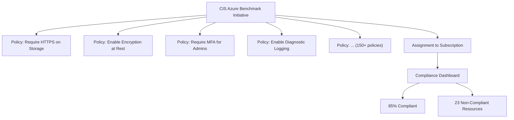

# How to Create and Assign Azure Policy Initiatives for Regulatory Compliance (CIS, NIST, PCI-DSS)

Author: [nawazdhandala](https://www.github.com/nawazdhandala)

Tags: Azure, Azure Policy, Compliance, CIS, NIST, PCI-DSS, Governance, Regulatory

Description: Learn how to assign and customize Azure Policy initiatives for regulatory compliance frameworks like CIS, NIST, and PCI-DSS to meet audit requirements.

---

If your organization needs to comply with regulatory frameworks like CIS Benchmarks, NIST 800-53, or PCI-DSS, you already know that compliance is an ongoing effort, not a one-time checkbox. Azure Policy initiatives (also called policy sets) let you group dozens or hundreds of related policies together and assign them at scale. Microsoft provides built-in compliance initiatives for all major regulatory frameworks, and you can customize them or create your own.

In this guide, I will show you how to find, assign, customize, and monitor compliance initiatives in Azure.

## Understanding Policy Initiatives

A policy initiative is a collection of policy definitions grouped together toward a single compliance goal. Instead of assigning 150 individual policies for CIS compliance, you assign one initiative that contains all 150 policies.



Each policy within the initiative maps to specific controls in the regulatory framework. The compliance dashboard shows you exactly which controls are satisfied and which need attention.

## Prerequisites

You need:

- Azure subscription with Owner or Policy Contributor role
- Microsoft Defender for Cloud (recommended for the regulatory compliance dashboard)
- Understanding of which frameworks apply to your organization

## Step 1: Browse Available Built-In Initiatives

Microsoft provides built-in initiatives for many regulatory frameworks. Let us see what is available:

```powershell
# List all built-in compliance initiatives
# These are ready to assign without any modification
$initiatives = Get-AzPolicySetDefinition -BuiltIn |
    Where-Object {
        $_.Properties.Metadata.category -eq "Regulatory Compliance"
    } |
    Select-Object Name,
        @{N='DisplayName';E={$_.Properties.DisplayName}},
        @{N='PolicyCount';E={$_.Properties.PolicyDefinitions.Count}}

$initiatives | Format-Table -AutoSize

# Common results include:
# - CIS Microsoft Azure Foundations Benchmark
# - NIST SP 800-53 Rev. 5
# - PCI DSS v4.0
# - ISO 27001:2013
# - HIPAA HITRUST 9.2
# - Azure Security Benchmark
# - SOC 2 Type 2
```

Each initiative contains dozens to hundreds of policy definitions. For example, the NIST SP 800-53 Rev. 5 initiative contains over 200 policy definitions covering all the control families.

## Step 2: Assign a Built-In Compliance Initiative

Let us assign the CIS Microsoft Azure Foundations Benchmark initiative to a subscription:

### Via the Azure Portal

1. Navigate to the Azure portal and go to Policy.
2. Click Definitions in the left menu.
3. Filter by Type "Initiative" and Category "Regulatory Compliance."
4. Find "CIS Microsoft Azure Foundations Benchmark" and click on it.
5. Click Assign.
6. On the Basics tab:
   - Set the scope to your subscription (or a management group for broader coverage).
   - Optionally exclude specific resource groups that should not be evaluated.
   - Give the assignment a descriptive name.
7. On the Parameters tab, review and set any parameters. Some policies have configurable thresholds.
8. On the Remediation tab, leave this as default for audit mode (no remediation tasks yet).
9. Click Review + create, then Create.

### Via PowerShell

```powershell
# Get the CIS Benchmark initiative definition
$cisInitiative = Get-AzPolicySetDefinition -BuiltIn |
    Where-Object { $_.Properties.DisplayName -like "*CIS Microsoft Azure*" } |
    Select-Object -First 1

# Assign the initiative to a subscription
$subscriptionId = "/subscriptions/YOUR_SUBSCRIPTION_ID"

New-AzPolicyAssignment `
    -Name "cis-benchmark-audit" `
    -DisplayName "CIS Azure Foundations Benchmark - Audit" `
    -PolicySetDefinition $cisInitiative `
    -Scope $subscriptionId `
    -Description "Audits compliance with CIS Azure Foundations Benchmark controls." `
    -EnforcementMode Default

Write-Host "CIS Benchmark initiative assigned successfully."
```

## Step 3: Assign Multiple Frameworks

Most organizations need to comply with multiple frameworks. You can assign several initiatives to the same scope:

```powershell
# Get initiative definitions for multiple frameworks
$frameworks = @(
    "*CIS Microsoft Azure*",
    "*NIST SP 800-53*",
    "*PCI DSS*"
)

foreach ($pattern in $frameworks) {
    $initiative = Get-AzPolicySetDefinition -BuiltIn |
        Where-Object { $_.Properties.DisplayName -like $pattern } |
        Select-Object -First 1

    if ($initiative) {
        $name = ($initiative.Properties.DisplayName -replace '[^a-zA-Z0-9]', '-').ToLower().Substring(0, [Math]::Min(24, ($initiative.Properties.DisplayName -replace '[^a-zA-Z0-9]', '-').Length))

        New-AzPolicyAssignment `
            -Name "$name-audit" `
            -DisplayName "$($initiative.Properties.DisplayName) - Audit" `
            -PolicySetDefinition $initiative `
            -Scope "/subscriptions/YOUR_SUBSCRIPTION_ID" `
            -EnforcementMode Default

        Write-Host "Assigned: $($initiative.Properties.DisplayName)"
    }
}
```

## Step 4: View Compliance Results

After assigning the initiatives, Azure needs 24-48 hours for the initial compliance evaluation. Once complete, you can view results in two places:

### Azure Policy Compliance Dashboard

1. Go to Policy in the Azure portal.
2. Click Compliance.
3. Select the initiative assignment.
4. You will see the overall compliance percentage and a breakdown by control.
5. Click on a non-compliant control to see which specific policies failed and which resources are affected.

### Microsoft Defender for Cloud Regulatory Compliance

If you have Defender for Cloud enabled:

1. Go to Microsoft Defender for Cloud.
2. Click Regulatory compliance.
3. You will see a dashboard with all assigned compliance standards.
4. Click on a standard to see the control-by-control breakdown.
5. Click on a control to see the specific recommendations.

The Defender for Cloud dashboard is often more useful because it provides remediation guidance alongside the compliance data.

## Step 5: Create a Custom Compliance Initiative

Sometimes the built-in initiatives do not cover all your requirements, or you need to combine policies from multiple frameworks with your own custom policies. Here is how to create a custom initiative:

```powershell
# Define a custom compliance initiative
# This example combines selected policies for a custom internal standard
$policyDefinitions = @(
    @{
        # Require HTTPS on storage accounts
        policyDefinitionId = "/providers/Microsoft.Authorization/policyDefinitions/404c3081-a854-4457-ae30-26a93ef643f9"
        policyDefinitionReferenceId = "require-https-storage"
        parameters = @{}
    },
    @{
        # Require encryption at rest for SQL databases
        policyDefinitionId = "/providers/Microsoft.Authorization/policyDefinitions/a8bef009-a5c9-4d0f-90d7-6018734e8a16"
        policyDefinitionReferenceId = "require-sql-encryption"
        parameters = @{}
    },
    @{
        # Require network security groups on subnets
        policyDefinitionId = "/providers/Microsoft.Authorization/policyDefinitions/e71308d3-144b-4262-b144-efdc3cc90517"
        policyDefinitionReferenceId = "require-nsg-subnets"
        parameters = @{}
    }
    # Add more policy definitions as needed
)

# Create the custom initiative definition
$initiativeParams = @{
    Name = "custom-security-standard"
    DisplayName = "Organization Security Standard v1.0"
    Description = "Custom compliance initiative combining CIS, NIST, and internal security requirements."
    PolicyDefinition = ($policyDefinitions | ConvertTo-Json -Depth 10)
    Metadata = '{"category": "Regulatory Compliance", "version": "1.0.0"}'
}

$customInitiative = New-AzPolicySetDefinition @initiativeParams

Write-Host "Custom initiative created: $($customInitiative.Properties.DisplayName)"

# Assign the custom initiative
New-AzPolicyAssignment `
    -Name "org-security-standard" `
    -DisplayName "Organization Security Standard v1.0 - Audit" `
    -PolicySetDefinition $customInitiative `
    -Scope "/subscriptions/YOUR_SUBSCRIPTION_ID"
```

## Step 6: Handle Exemptions for Non-Applicable Controls

Not every control in a regulatory framework applies to every resource or every scenario. Create exemptions for controls that are legitimately not applicable:

```powershell
# Create an exemption for a specific policy within an initiative
# For example, exempt a dev resource group from PCI-DSS data encryption requirements
New-AzPolicyExemption `
    -Name "dev-rg-pci-encryption-exempt" `
    -PolicyAssignment (Get-AzPolicyAssignment -Name "pci-dss-audit") `
    -Scope "/subscriptions/SUB_ID/resourceGroups/dev-resources" `
    -ExemptionCategory "Waiver" `
    -Description "Development environment does not process cardholder data. Exempted per security team approval." `
    -PolicyDefinitionReferenceId "require-sql-encryption" `
    -ExpiresOn (Get-Date).AddMonths(12)
```

Document every exemption with a clear justification. Auditors will ask why certain controls are not met, and "waived because dev environment" with proper documentation is an acceptable answer.

## Step 7: Automate Remediation for Specific Policies

Some policies within compliance initiatives support automatic remediation. For example, if a policy audits for missing diagnostic logging, you can create a remediation task that automatically enables it:

```powershell
# Create a remediation task for a specific policy within the initiative
# This will automatically fix non-compliant resources
$assignment = Get-AzPolicyAssignment -Name "cis-benchmark-audit"

# Start a remediation task for the diagnostic logging policy
Start-AzPolicyRemediation `
    -Name "remediate-diagnostic-logging" `
    -PolicyAssignmentId $assignment.PolicyAssignmentId `
    -PolicyDefinitionReferenceId "diagnostics-logging-policy-ref" `
    -ResourceGroupName "production-rg"

Write-Host "Remediation task started for diagnostic logging."
```

Not all policies support remediation. Policies with the "Deny" effect prevent non-compliant resources from being created but cannot fix existing ones. Policies with the "DeployIfNotExists" or "Modify" effects can automatically remediate.

## Step 8: Generate Compliance Reports

For audit purposes, you need to export compliance data:

```powershell
# Export compliance state for all policies in an initiative
$assignment = Get-AzPolicyAssignment -Name "cis-benchmark-audit"

$complianceStates = Get-AzPolicyState `
    -PolicyAssignmentName $assignment.Name `
    -Top 1000

# Group by compliance state
$summary = $complianceStates | Group-Object ComplianceState

foreach ($group in $summary) {
    Write-Host "$($group.Name): $($group.Count) resources"
}

# Export detailed results to CSV for audit documentation
$complianceStates |
    Select-Object ResourceId, PolicyDefinitionName, ComplianceState, Timestamp |
    Export-Csv -Path "compliance-report.csv" -NoTypeInformation

Write-Host "Compliance report exported to compliance-report.csv"
```

## Ongoing Compliance Management

Compliance is not a one-time setup. Build these practices into your routine:

- **Weekly**: Review new non-compliant resources and assign remediation tasks.
- **Monthly**: Generate compliance reports and track trends.
- **Quarterly**: Review exemptions and renew or remove them as needed.
- **Annually**: Update initiative assignments when Microsoft releases new versions of the frameworks.

When Microsoft updates a built-in initiative (for example, when CIS releases a new version of their benchmark), you may need to update your assignment to use the new version and review any new policies that were added.

## Conclusion

Azure Policy initiatives for regulatory compliance give you a structured, automated way to measure and enforce your compliance posture. Start by assigning the built-in initiatives for the frameworks your organization must comply with, review the initial compliance results, and systematically work through non-compliant resources. Use exemptions for legitimately non-applicable controls, automate remediation where possible, and generate regular reports for audit documentation. The compliance dashboard in Defender for Cloud provides the best visualization of your progress across multiple frameworks, making it easy to demonstrate compliance to auditors and track improvement over time.
