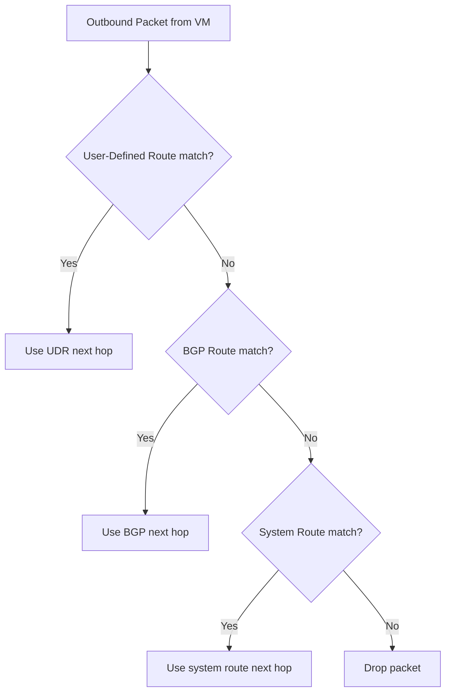
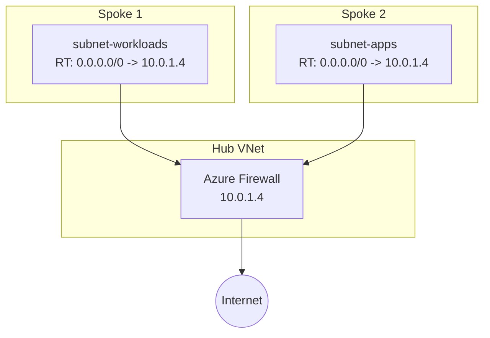

# How to Create and Associate a Route Table with an Azure Subnet

Author: [nawazdhandala](https://www.github.com/nawazdhandala)

Tags: Azure, Route Tables, Azure Networking, UDR, Subnet Routing, Cloud Infrastructure

Description: A practical guide to creating user-defined routes in Azure and associating route tables with subnets to control traffic flow.

---

Azure automatically creates system routes that handle traffic between subnets, virtual networks, and the internet. These default routes work fine for simple deployments. But as soon as you need to force traffic through a firewall, redirect packets to a network virtual appliance (NVA), or override Azure's default routing behavior, you need user-defined routes (UDRs) and custom route tables.

This article shows you how to create a route table, add custom routes, and associate it with a subnet so that traffic flows exactly where you want it.

## How Azure Routing Works

Every subnet in an Azure virtual network has a set of system routes. These routes handle basic scenarios like routing between subnets in the same VNet, sending internet-bound traffic to Azure's default gateway, and dropping traffic destined for private address ranges.

When you create a custom route table and attach it to a subnet, your user-defined routes take precedence over the default system routes for matching destinations. Azure evaluates routes using longest-prefix matching - the most specific route wins.

Here is how route evaluation works:



## Step 1: Create a Route Table

Start by creating a route table in your resource group.

```bash
# Create a resource group
az group create --name rg-routing-demo --location eastus

# Create a route table
az network route-table create \
  --resource-group rg-routing-demo \
  --name rt-custom-routes \
  --location eastus \
  --disable-bgp-route-propagation false
```

The `--disable-bgp-route-propagation` flag controls whether BGP routes from a VPN or ExpressRoute gateway are propagated to the subnet. Setting it to `false` means BGP routes will still be injected. If you want your UDRs to be the only routes (common in forced tunneling scenarios), set it to `true`.

## Step 2: Add a Route to Send Traffic Through a Firewall

Let us say you have an Azure Firewall or network virtual appliance at IP `10.0.1.4` and you want all internet-bound traffic from a subnet to go through it instead of directly to the internet.

```bash
# Add a route that sends internet traffic through a firewall NVA
az network route-table route create \
  --resource-group rg-routing-demo \
  --route-table-name rt-custom-routes \
  --name route-to-firewall \
  --address-prefix 0.0.0.0/0 \
  --next-hop-type VirtualAppliance \
  --next-hop-ip-address 10.0.1.4
```

The `0.0.0.0/0` address prefix is a default route that matches all traffic not covered by a more specific route. By pointing this at a virtual appliance, you are forcing all internet-bound traffic through your firewall.

## Step 3: Add a Route for Specific Subnet Traffic

Maybe you need traffic destined for a specific on-premises network to go through a different appliance.

```bash
# Route traffic for on-premises network through a VPN appliance
az network route-table route create \
  --resource-group rg-routing-demo \
  --route-table-name rt-custom-routes \
  --name route-to-onprem \
  --address-prefix 192.168.0.0/16 \
  --next-hop-type VirtualAppliance \
  --next-hop-ip-address 10.0.2.4
```

## Step 4: Add a Route to Drop Traffic

You can also create routes that black-hole traffic. This is useful for preventing certain subnets from reaching specific destinations.

```bash
# Drop all traffic destined for a specific range
az network route-table route create \
  --resource-group rg-routing-demo \
  --route-table-name rt-custom-routes \
  --name route-blackhole \
  --address-prefix 10.99.0.0/16 \
  --next-hop-type None
```

Setting `--next-hop-type None` means packets matching this prefix are silently dropped.

## Step 5: Create a VNet and Subnet

If you do not already have a VNet, create one now.

```bash
# Create a virtual network with two subnets
az network vnet create \
  --resource-group rg-routing-demo \
  --name vnet-demo \
  --location eastus \
  --address-prefixes 10.0.0.0/16 \
  --subnet-name subnet-workloads \
  --subnet-prefixes 10.0.0.0/24

# Create a second subnet for the firewall
az network vnet subnet create \
  --resource-group rg-routing-demo \
  --vnet-name vnet-demo \
  --name subnet-firewall \
  --address-prefixes 10.0.1.0/24
```

## Step 6: Associate the Route Table with the Subnet

This is the step that actually activates your custom routes. Until you associate the route table with a subnet, the routes have no effect.

```bash
# Associate the route table with the workloads subnet
az network vnet subnet update \
  --resource-group rg-routing-demo \
  --vnet-name vnet-demo \
  --name subnet-workloads \
  --route-table rt-custom-routes
```

From this point on, every VM in `subnet-workloads` will use the routes in `rt-custom-routes` for traffic forwarding decisions.

## Step 7: Verify Effective Routes

You can check what routes a specific VM NIC is actually using with the effective routes command.

```bash
# Check the effective routes on a NIC
az network nic show-effective-route-table \
  --resource-group rg-routing-demo \
  --name nic-vm01 \
  --output table
```

This shows both system routes and your custom routes, along with which one is active for each destination prefix. It is incredibly useful for debugging when traffic is not flowing the way you expect.

## Next Hop Types

Azure supports several next hop types in user-defined routes:

| Next Hop Type | Description |
|---|---|
| VirtualAppliance | Send traffic to a specific IP (firewall, NVA) |
| VirtualNetworkGateway | Send traffic through a VPN or ExpressRoute gateway |
| VnetLocal | Route to the local virtual network |
| Internet | Route directly to the internet |
| None | Drop the traffic (black hole) |

The most common one you will use is `VirtualAppliance`, typically pointing at a firewall's private IP address.

## Important: Enable IP Forwarding

If you are routing traffic through a VM acting as a network virtual appliance, that VM's NIC must have IP forwarding enabled. By default, Azure drops packets that are not destined for the NIC's own IP address.

```bash
# Enable IP forwarding on the NVA's NIC
az network nic update \
  --resource-group rg-routing-demo \
  --name nic-firewall \
  --ip-forwarding true
```

You also need to enable IP forwarding inside the guest operating system. On Linux, this means setting `net.ipv4.ip_forward = 1` in sysctl.

## Common Architecture: Hub-Spoke with Forced Tunneling

A typical use case for route tables is the hub-spoke topology. The hub VNet contains a firewall, and spoke VNets have route tables that force all traffic through the hub.



Each spoke subnet has a route table with a `0.0.0.0/0` route pointing to the firewall. The firewall inspects traffic and either allows or blocks it based on its rule set.

## Cleanup

Remove the demo resources when you are done.

```bash
# Delete the resource group
az group delete --name rg-routing-demo --yes --no-wait
```

## Wrapping Up

Route tables give you fine-grained control over traffic flow in Azure virtual networks. The key steps are simple: create a route table, add your routes, and associate the table with the right subnet. The tricky part is understanding how Azure evaluates routes and making sure your NVAs have IP forwarding enabled. Start with a clear network diagram, plan your routes on paper first, and use the effective routes tool to verify everything works as intended.
