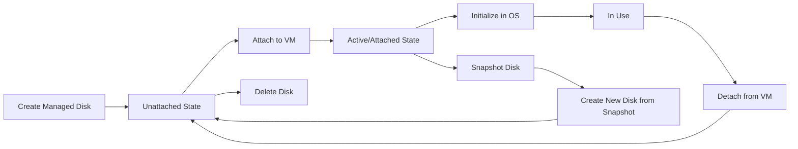

# How to Create and Attach Azure Managed Disks to Virtual Machines

Author: [nawazdhandala](https://www.github.com/nawazdhandala)

Tags: Azure, Managed Disks, Virtual Machines, Storage, IaaS, Cloud Infrastructure

Description: Step-by-step guide to creating Azure Managed Disks and attaching them to virtual machines using Azure CLI, PowerShell, and the Azure portal.

---

Azure Managed Disks are block-level storage volumes that Azure manages for you. Unlike unmanaged disks where you had to manage storage accounts yourself, managed disks handle the underlying storage infrastructure automatically. In this post, I will cover how to create managed disks and attach them to virtual machines using several methods.

## Managed Disk Basics

Before creating a disk, you need to understand the key parameters.

**Disk Type** determines the performance tier: Standard HDD, Standard SSD, Premium SSD, or Ultra Disk. Premium SSD is the most common choice for production workloads.

**Size** is specified in GiB. The size determines both capacity and performance (IOPS and throughput scale with disk size for Standard and Premium tiers).

**Location** must match the location of the VM you want to attach it to.

**Availability Zone** is optional but should match the VM's zone if the VM is zone-deployed.

## Creating a Managed Disk with Azure CLI

```bash
# Create a Premium SSD managed disk with 128 GiB capacity
az disk create \
  --name data-disk-01 \
  --resource-group my-resource-group \
  --location eastus \
  --sku Premium_LRS \
  --size-gb 128 \
  --os-type Linux

# Create a disk in a specific availability zone
az disk create \
  --name data-disk-02 \
  --resource-group my-resource-group \
  --location eastus \
  --zone 1 \
  --sku Premium_LRS \
  --size-gb 256

# Verify the disk was created
az disk show \
  --name data-disk-01 \
  --resource-group my-resource-group \
  --query "{name:name, size:diskSizeGb, sku:sku.name, state:diskState}" \
  --output table
```

## Creating a Managed Disk with PowerShell

```powershell
# Define the disk configuration
$diskConfig = New-AzDiskConfig `
  -Location "eastus" `
  -CreateOption "Empty" `
  -DiskSizeGB 128 `
  -SkuName "Premium_LRS" `
  -Zone 1

# Create the managed disk
$disk = New-AzDisk `
  -ResourceGroupName "my-resource-group" `
  -DiskName "data-disk-01" `
  -Disk $diskConfig

Write-Output "Disk created: $($disk.Name), Size: $($disk.DiskSizeGB) GB"
```

## Creating a Managed Disk with ARM Template

For infrastructure-as-code deployments, use an ARM template.

```json
{
    "$schema": "https://schema.management.azure.com/schemas/2019-04-01/deploymentTemplate.json#",
    "contentVersion": "1.0.0.0",
    "resources": [
        {
            "type": "Microsoft.Compute/disks",
            "apiVersion": "2023-04-02",
            "name": "data-disk-01",
            "location": "eastus",
            "sku": {
                "name": "Premium_LRS"
            },
            "properties": {
                "creationData": {
                    "createOption": "Empty"
                },
                "diskSizeGB": 128
            },
            "zones": ["1"]
        }
    ]
}
```

## Attaching a Disk to an Existing VM

Once the disk is created, you can attach it to a running VM. The VM does not need to be stopped.

```bash
# Attach an existing managed disk to a VM
# The LUN (Logical Unit Number) identifies the disk within the VM
az vm disk attach \
  --vm-name my-vm \
  --resource-group my-resource-group \
  --name data-disk-01 \
  --lun 0

# Verify the disk is attached
az vm show \
  --name my-vm \
  --resource-group my-resource-group \
  --query "storageProfile.dataDisks[*].{Name:name, LUN:lun, Size:diskSizeGb, Caching:caching}" \
  --output table
```

## Creating and Attaching a Disk in One Step

You can create a new disk and attach it to a VM in a single command.

```bash
# Create and attach a new 64 GiB Standard SSD in one command
az vm disk attach \
  --vm-name my-vm \
  --resource-group my-resource-group \
  --name new-data-disk \
  --size-gb 64 \
  --sku StandardSSD_LRS \
  --lun 1 \
  --new
```

## Attaching a Disk with PowerShell

```powershell
# Get the VM object
$vm = Get-AzVM -ResourceGroupName "my-resource-group" -Name "my-vm"

# Get the managed disk
$disk = Get-AzDisk -ResourceGroupName "my-resource-group" -DiskName "data-disk-01"

# Attach the disk to the VM at LUN 0
$vm = Add-AzVMDataDisk `
  -VM $vm `
  -Name "data-disk-01" `
  -ManagedDiskId $disk.Id `
  -Lun 0 `
  -CreateOption "Attach" `
  -Caching "ReadWrite"

# Apply the change
Update-AzVM -ResourceGroupName "my-resource-group" -VM $vm
Write-Output "Disk attached successfully"
```

## Initializing the Disk Inside the VM

After attaching the disk, you need to initialize it within the operating system before you can use it.

### Linux

```bash
# SSH into the VM and run these commands

# List all disks to find the new one
# The new disk will typically show up as /dev/sdc or similar
lsblk

# Create a partition on the new disk
sudo fdisk /dev/sdc <<EOF
n
p
1


w
EOF

# Format the partition with ext4
sudo mkfs.ext4 /dev/sdc1

# Create a mount point
sudo mkdir -p /data

# Mount the disk
sudo mount /dev/sdc1 /data

# Add to fstab for persistence across reboots
# Use the UUID to ensure the correct disk is mounted
UUID=$(sudo blkid -s UUID -o value /dev/sdc1)
echo "UUID=$UUID /data ext4 defaults,nofail 0 2" | sudo tee -a /etc/fstab

# Verify the mount
df -h /data
```

### Windows

```powershell
# Run inside the Windows VM

# Initialize the disk, create a partition, and format it
# This script finds the first raw disk and sets it up
Get-Disk | Where-Object PartitionStyle -eq 'RAW' |
  Initialize-Disk -PartitionStyle GPT -PassThru |
  New-Partition -AssignDriveLetter -UseMaximumSize |
  Format-Volume -FileSystem NTFS -NewFileSystemLabel "DataDisk" -Confirm:$false
```

## Setting Disk Caching

Disk caching can significantly affect performance. The options are:

- **None**: No caching. Best for write-heavy workloads like database logs.
- **ReadOnly**: Caches reads. Good for read-heavy workloads.
- **ReadWrite**: Caches both reads and writes. Best for OS disks. Not recommended for data disks in most cases.

```bash
# Change the caching policy on an attached disk
az vm disk attach \
  --vm-name my-vm \
  --resource-group my-resource-group \
  --name data-disk-01 \
  --lun 0 \
  --caching ReadOnly
```

## Detaching a Disk

You can detach a disk from a VM without deleting it. The data stays on the disk.

```bash
# Detach a disk from a VM
az vm disk detach \
  --vm-name my-vm \
  --resource-group my-resource-group \
  --name data-disk-01

# The disk is now in an "Unattached" state
az disk show \
  --name data-disk-01 \
  --resource-group my-resource-group \
  --query "diskState"
```

## Disk Lifecycle Overview



## Creating a Disk from an Existing Source

You can create a managed disk from several sources: a snapshot, another managed disk, a VHD file in a storage account, or a marketplace image.

```bash
# Create a disk from a snapshot
az disk create \
  --name restored-disk \
  --resource-group my-resource-group \
  --source my-snapshot-name \
  --sku Premium_LRS

# Create a copy of an existing managed disk
az disk create \
  --name disk-copy \
  --resource-group my-resource-group \
  --source data-disk-01 \
  --sku Premium_LRS
```

## Best Practices

Choose the right disk type for your workload. Premium SSD for production databases, Standard SSD for general purpose, Standard HDD only for backups and infrequently accessed data.

Size your disks for performance, not just capacity. A 128 GiB Premium SSD has much better IOPS and throughput than a 32 GiB disk. Sometimes it makes sense to over-provision size just for the performance benefits.

Always set up disk caching correctly. ReadOnly caching for data disks that are mostly read. No caching for write-heavy database log disks.

Use the nofail option in Linux fstab entries. Without it, the VM might fail to boot if the disk is detached.

Managed disks are the standard way to add persistent storage to Azure VMs. They are simpler to manage than unmanaged disks, provide better reliability through built-in replication, and offer predictable performance at each tier.
