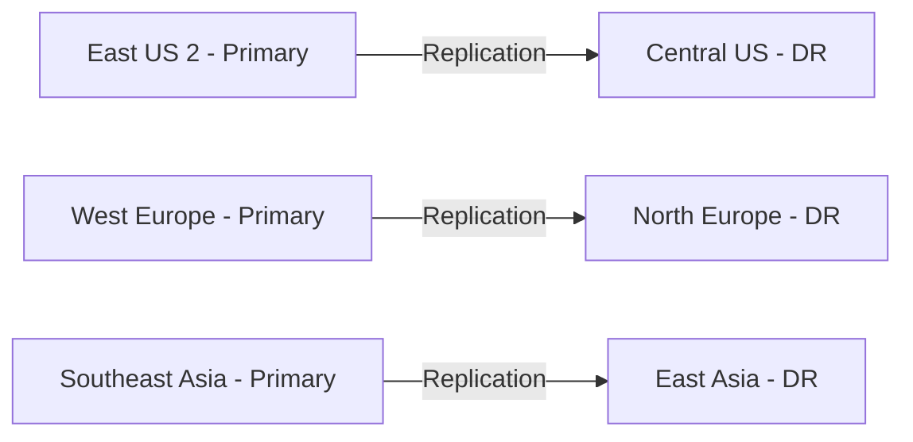

# How to Create and Configure a Recovery Services Vault for Azure Site Recovery

Author: [nawazdhandala](https://www.github.com/nawazdhandala)

Tags: Azure Site Recovery, Recovery Services Vault, Disaster Recovery, Azure, Business Continuity, Backup, Infrastructure

Description: Learn how to create and configure an Azure Recovery Services vault for Site Recovery, including storage replication, access policies, and network settings.

---

A Recovery Services vault is the foundation for both Azure Site Recovery and Azure Backup. It is the container that holds your replication data, backup data, and configuration metadata. Getting the vault set up correctly from the start saves you from headaches later, especially around storage redundancy, security settings, and access control.

This guide walks through creating a Recovery Services vault and configuring it specifically for Azure Site Recovery use cases.

## What a Recovery Services Vault Does

Think of the vault as a management plane for your disaster recovery and backup operations. It:

- Stores replication metadata for Site Recovery
- Holds backup data for Azure Backup
- Manages encryption keys
- Defines storage redundancy (how many copies of your data exist and where)
- Enforces access control through Azure RBAC
- Provides a single pane for monitoring all protected items

One vault can handle both Site Recovery and Backup, but many organizations create separate vaults to keep concerns isolated and apply different access policies.

## Prerequisites

Before creating the vault:

- You need an Azure subscription with Contributor or Owner access
- Decide on the Azure region for the vault (this matters for Site Recovery)
- Plan your resource group naming convention
- Understand your RPO (Recovery Point Objective) and RTO (Recovery Time Objective) requirements

## Step 1: Choose the Right Region

For Azure Site Recovery, the vault must be in a different region than the VMs you are protecting. This is because Site Recovery replicates VMs to a secondary region - if the primary region goes down, you fail over to the secondary region where the vault lives.

For example:
- Primary VMs in East US 2 - vault in Central US
- Primary VMs in West Europe - vault in North Europe

Here is a common region pairing strategy:



Azure has recommended region pairs that are optimized for low-latency replication and coordinated maintenance. Stick with these pairs when possible.

## Step 2: Create the Vault via Azure Portal

1. Open the Azure portal
2. Search for "Recovery Services vaults"
3. Click "Create"
4. Fill in the details:
   - **Subscription**: Select your subscription
   - **Resource group**: Create a new one or use an existing one (e.g., `rg-dr-centralus`)
   - **Vault name**: Use a descriptive name like `rsv-dr-centralus-001`
   - **Region**: Select the secondary/DR region
5. Click "Review + Create" and then "Create"

Alternatively, use Azure CLI for a scriptable, repeatable setup:

```bash
# Create a resource group in the DR region
az group create \
    --name rg-dr-centralus \
    --location centralus

# Create the Recovery Services vault
# The vault stores replication metadata and serves as the DR management plane
az backup vault create \
    --resource-group rg-dr-centralus \
    --name rsv-dr-centralus-001 \
    --location centralus

# Alternatively, using the dedicated recovery services command
az recoveryservices vault create \
    --resource-group rg-dr-centralus \
    --name rsv-dr-centralus-001 \
    --location centralus
```

Or if you prefer Bicep for infrastructure-as-code:

```bicep
// Bicep template for creating a Recovery Services vault
// Deploy this to the DR region resource group
resource recoveryServicesVault 'Microsoft.RecoveryServices/vaults@2023-06-01' = {
  name: 'rsv-dr-centralus-001'
  location: 'centralus'
  sku: {
    name: 'RS0'  // Standard SKU for Recovery Services
    tier: 'Standard'
  }
  properties: {
    publicNetworkAccess: 'Enabled'  // Can be 'Disabled' if using Private Endpoints
  }
}
```

## Step 3: Configure Storage Replication

The vault's storage replication setting determines how your replication and backup data is stored. You have three options:

**Geo-redundant storage (GRS)** - Data is replicated to a paired region. This gives you protection against an entire region going down. This is the default and recommended for most production scenarios.

**Locally redundant storage (LRS)** - Data is replicated within a single data center. Cheaper than GRS but no cross-region protection. Suitable for dev/test environments or when you have other DR mechanisms.

**Zone-redundant storage (ZRS)** - Data is replicated across availability zones within a region. Protects against zone-level failures without the cost of full geo-redundancy.

Configure this setting immediately after creating the vault, because you cannot change it once protected items are added.

```bash
# Set storage replication type to GRS (recommended for production DR)
az backup vault backup-properties set \
    --resource-group rg-dr-centralus \
    --name rsv-dr-centralus-001 \
    --backup-storage-redundancy GeoRedundant
```

To set it via the portal:
1. Open the vault
2. Go to "Properties"
3. Under "Backup Configuration," click "Update"
4. Select the storage replication type
5. Save

## Step 4: Configure Access Control (RBAC)

Limit who can manage the vault and its protected items. Azure provides built-in roles specifically for Recovery Services:

- **Backup Contributor** - Can manage backups but cannot delete the vault or grant access to others
- **Backup Operator** - Same as Contributor but cannot remove backups or manage backup policies
- **Backup Reader** - Read-only access to vault operations
- **Site Recovery Contributor** - Can manage Site Recovery operations except vault creation and access management
- **Site Recovery Operator** - Can execute failover and failback operations
- **Site Recovery Reader** - Read-only access to Site Recovery operations

Assign roles at the vault level:

```bash
# Grant Site Recovery Contributor to the DR operations team
# This allows them to manage replication without full vault admin access
az role assignment create \
    --assignee "dr-ops-team@company.com" \
    --role "Site Recovery Contributor" \
    --scope "/subscriptions/<sub-id>/resourceGroups/rg-dr-centralus/providers/Microsoft.RecoveryServices/vaults/rsv-dr-centralus-001"

# Grant Site Recovery Operator to the on-call team
# They can execute failover but cannot modify replication settings
az role assignment create \
    --assignee "oncall-team@company.com" \
    --role "Site Recovery Operator" \
    --scope "/subscriptions/<sub-id>/resourceGroups/rg-dr-centralus/providers/Microsoft.RecoveryServices/vaults/rsv-dr-centralus-001"
```

Follow the principle of least privilege. The team that runs failover drills does not need the ability to modify replication policies.

## Step 5: Enable Soft Delete

Soft delete prevents accidental or malicious deletion of recovery data. When enabled, deleted backup data is retained for an additional 14 days, giving you time to recover from mistakes.

```bash
# Enable soft delete on the vault
# This prevents permanent data loss from accidental deletion
az backup vault backup-properties set \
    --resource-group rg-dr-centralus \
    --name rsv-dr-centralus-001 \
    --soft-delete-feature-state Enable
```

For enhanced security, you can also enable multi-user authorization, which requires approval from a second person before critical operations like disabling soft delete or stopping protection.

## Step 6: Configure Network Access

By default, the vault is accessible over the public internet. For environments with strict network policies, configure private endpoints.

1. In the vault, go to "Networking"
2. Choose "Private access" to restrict to private endpoints only
3. Create a private endpoint in your virtual network
4. Link the private endpoint to the vault

This ensures that replication traffic between your VMs and the vault travels over Microsoft's backbone network rather than the public internet.

For Site Recovery specifically, the VMs being replicated also need connectivity to Site Recovery service endpoints. If you are using private endpoints, you need to configure DNS resolution for the following domains:

- `*.hypervrecoverymanager.windowsazure.com`
- `*.blob.core.windows.net`
- `*.queue.core.windows.net`

## Step 7: Set Up Monitoring and Alerts

Configure alerts so you know immediately when something goes wrong with replication or backup.

1. In the vault, go to "Alerts"
2. Configure built-in alerts for:
   - Replication health warnings
   - Failover failures
   - Backup job failures
   - RPO threshold breaches

You can also route these alerts to Azure Monitor and integrate with your existing incident management tools:

```bash
# Create an action group for DR alerts
az monitor action-group create \
    --resource-group rg-dr-centralus \
    --name ag-dr-alerts \
    --short-name DRAlerts \
    --action email dr-team dr-team@company.com

# Create an alert rule for Site Recovery critical events
az monitor metrics alert create \
    --resource-group rg-dr-centralus \
    --name "site-recovery-rpo-breach" \
    --scopes "/subscriptions/<sub-id>/resourceGroups/rg-dr-centralus/providers/Microsoft.RecoveryServices/vaults/rsv-dr-centralus-001" \
    --condition "avg RPOInSeconds > 3600" \
    --action ag-dr-alerts \
    --description "Alert when RPO exceeds 1 hour"
```

## Step 8: Apply Resource Locks

For a production DR vault, add a resource lock to prevent accidental deletion:

```bash
# Apply a delete lock to prevent accidental vault deletion
# This lock must be explicitly removed before the vault can be deleted
az lock create \
    --name "DoNotDelete-DR-Vault" \
    --resource-group rg-dr-centralus \
    --resource-name rsv-dr-centralus-001 \
    --resource-type Microsoft.RecoveryServices/vaults \
    --lock-type CanNotDelete \
    --notes "Production DR vault - do not delete"
```

## Naming Conventions and Tagging

Apply tags to the vault for cost tracking and governance:

```bash
# Tag the vault with environment and purpose metadata
az resource tag \
    --tags Environment=Production Purpose=DisasterRecovery Team=Infrastructure CostCenter=IT-OPS \
    --resource-group rg-dr-centralus \
    --name rsv-dr-centralus-001 \
    --resource-type Microsoft.RecoveryServices/vaults
```

## Wrapping Up

The Recovery Services vault is the backbone of your Azure DR and backup strategy. Taking the time to configure it properly - choosing the right region, setting appropriate storage redundancy, locking down access with RBAC, enabling soft delete, and setting up monitoring - ensures that when you actually need to use Site Recovery for a disaster, everything is in place and working. Once the vault is configured, you are ready to start enabling replication for your VMs, which is covered in the next guide on setting up disaster recovery for Azure VMs.
