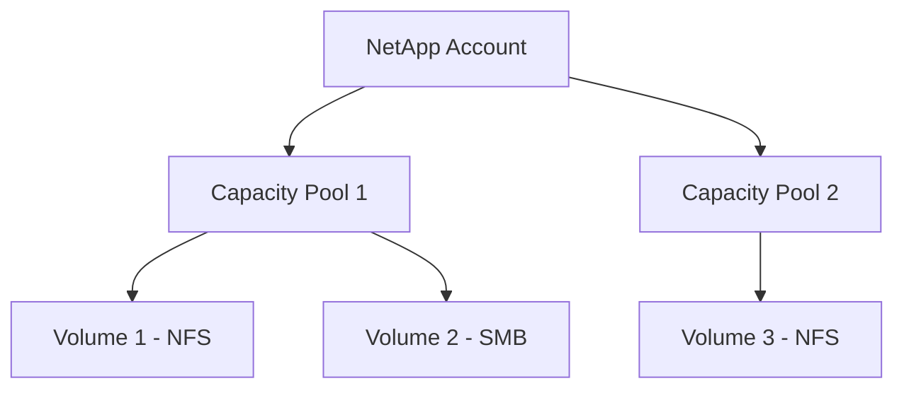

# How to Create and Configure Azure NetApp Files Volumes

Author: [nawazdhandala](https://www.github.com/nawazdhandala)

Tags: Azure, NetApp Files, NFS, SMB, Enterprise Storage, File Storage, Cloud Volumes

Description: A complete walkthrough for creating Azure NetApp Files accounts, capacity pools, and volumes for enterprise file storage workloads.

---

Azure NetApp Files is a fully managed, enterprise-grade file storage service built on NetApp's ONTAP technology. It delivers sub-millisecond latency and supports NFS, SMB, and dual-protocol access, making it a solid choice for workloads like SAP HANA, databases, VDI, and any application that needs high-performance shared file storage. This guide walks you through the entire setup process from registering the provider to mounting volumes on your compute instances.

## Understanding the Resource Hierarchy

Before creating anything, it helps to understand how Azure NetApp Files resources are organized:



- **NetApp Account**: The top-level resource. It is a logical container for capacity pools. You typically have one per region.
- **Capacity Pool**: A pool of storage capacity with a specific service level (Standard, Premium, or Ultra). Minimum size is 4 TiB.
- **Volume**: The actual file share that clients mount. It draws capacity from its parent pool.

## Prerequisites

Register the Azure NetApp Files resource provider and request capacity:

```bash
# Register the NetApp resource provider
az provider register --namespace Microsoft.NetApp

# Wait for registration to complete
az provider show --namespace Microsoft.NetApp --query "registrationState" -o tsv
```

You also need a virtual network with a delegated subnet for Azure NetApp Files. The subnet delegation ensures that only NetApp Files resources use that subnet.

```bash
# Create a resource group
az group create --name netapp-rg --location eastus2

# Create a virtual network
az network vnet create \
  --resource-group netapp-rg \
  --name netapp-vnet \
  --address-prefix 10.10.0.0/16 \
  --location eastus2

# Create a delegated subnet for Azure NetApp Files
# The delegation is critical - without it, volume creation fails
az network vnet subnet create \
  --resource-group netapp-rg \
  --vnet-name netapp-vnet \
  --name netapp-subnet \
  --address-prefix 10.10.1.0/24 \
  --delegations "Microsoft.NetApp/volumes"
```

## Creating the NetApp Account

The NetApp account is a simple resource - just a name and a location:

```bash
# Create the NetApp account
az netappfiles account create \
  --resource-group netapp-rg \
  --account-name mynetappaccount \
  --location eastus2
```

If you plan to use SMB volumes, you need to join the NetApp account to an Active Directory domain at this stage:

```bash
# Add Active Directory configuration for SMB support
az netappfiles account ad add \
  --resource-group netapp-rg \
  --account-name mynetappaccount \
  --dns "10.10.0.4" \
  --domain "corp.contoso.com" \
  --smb-server-name "netappsmb" \
  --username "adjoin-svc" \
  --password "YourPassword"
```

## Creating a Capacity Pool

The capacity pool defines the performance tier and total capacity available to your volumes.

```bash
# Create a Premium capacity pool with 4 TiB
# Service levels: Standard (16 MiB/s per TiB), Premium (64 MiB/s per TiB), Ultra (128 MiB/s per TiB)
az netappfiles pool create \
  --resource-group netapp-rg \
  --account-name mynetappaccount \
  --pool-name premium-pool \
  --size 4 \
  --service-level Premium \
  --location eastus2
```

The service levels determine the throughput per TiB of provisioned capacity:

| Service Level | Throughput per TiB | Typical Use Case |
|--------------|-------------------|-----------------|
| Standard | 16 MiB/s | File shares, dev/test |
| Premium | 64 MiB/s | Databases, SAP, general production |
| Ultra | 128 MiB/s | Latency-sensitive workloads, HPC |

The pool size can be expanded later, but the minimum is 4 TiB and it goes up in 1 TiB increments.

## Creating an NFS Volume

Now create a volume within the capacity pool. Here is an NFS v4.1 volume:

```bash
# Create an NFS v4.1 volume with 1 TiB capacity
# The volume pulls from the parent capacity pool
az netappfiles volume create \
  --resource-group netapp-rg \
  --account-name mynetappaccount \
  --pool-name premium-pool \
  --volume-name app-data-vol \
  --location eastus2 \
  --service-level Premium \
  --usage-threshold 1024 \
  --file-path "appdata" \
  --vnet netapp-vnet \
  --subnet netapp-subnet \
  --protocol-types NFSv4.1 \
  --allowed-clients "10.10.0.0/16" \
  --rule-index 1 \
  --unix-read-write true
```

Key parameters explained:

- **usage-threshold**: Volume size in GiB. This must not exceed the pool capacity.
- **file-path**: The export path used in the mount command. Must be unique within the account.
- **protocol-types**: NFSv3, NFSv4.1, or CIFS (for SMB). You can also create dual-protocol volumes.
- **allowed-clients**: CIDR range of clients allowed to mount the volume.

## Creating an SMB Volume

For Windows workloads, create an SMB volume (requires Active Directory configuration on the account):

```bash
# Create an SMB volume for Windows file sharing
az netappfiles volume create \
  --resource-group netapp-rg \
  --account-name mynetappaccount \
  --pool-name premium-pool \
  --volume-name smb-share-vol \
  --location eastus2 \
  --service-level Premium \
  --usage-threshold 512 \
  --file-path "smbshare" \
  --vnet netapp-vnet \
  --subnet netapp-subnet \
  --protocol-types CIFS
```

## Mounting the NFS Volume

After the volume is created, get the mount instructions:

```bash
# Get the volume's mount target IP address
az netappfiles volume show \
  --resource-group netapp-rg \
  --account-name mynetappaccount \
  --pool-name premium-pool \
  --volume-name app-data-vol \
  --query "mountTargets[0].ipAddress" -o tsv
```

On a Linux client, install the NFS client and mount:

```bash
# Install NFS client utilities
sudo apt-get update && sudo apt-get install -y nfs-common

# Create the mount point
sudo mkdir -p /mnt/appdata

# Mount the volume using NFSv4.1
# Replace the IP with the mount target IP from the previous command
sudo mount -t nfs -o rw,hard,rsize=65536,wsize=65536,vers=4.1,tcp \
  10.10.1.4:/appdata /mnt/appdata

# Verify the mount
df -h /mnt/appdata
```

The mount options matter for performance:

- **hard**: Retries NFS requests indefinitely instead of failing (important for data integrity)
- **rsize/wsize=65536**: Sets the read and write buffer size to 64 KB for better throughput
- **vers=4.1**: Explicitly requests NFSv4.1 protocol

Add to `/etc/fstab` for persistence:

```bash
# Add to fstab for automatic mounting on boot
echo "10.10.1.4:/appdata /mnt/appdata nfs rw,hard,rsize=65536,wsize=65536,vers=4.1,tcp 0 0" | sudo tee -a /etc/fstab
```

## Configuring Volume Export Policies

Export policies control which clients can access the volume and what operations they can perform. You can have multiple rules with different permissions for different client ranges:

```bash
# Add an export policy rule that gives read-only access to a specific subnet
az netappfiles volume export-policy add \
  --resource-group netapp-rg \
  --account-name mynetappaccount \
  --pool-name premium-pool \
  --volume-name app-data-vol \
  --rule-index 2 \
  --allowed-clients "10.10.2.0/24" \
  --nfsv41 true \
  --unix-read-only true
```

## Snapshot and Backup Configuration

Snapshots are point-in-time copies of a volume that are space-efficient (they only store changed blocks). Set up an automatic snapshot policy:

```bash
# Create a snapshot policy with daily and weekly snapshots
az netappfiles snapshot policy create \
  --resource-group netapp-rg \
  --account-name mynetappaccount \
  --snapshot-policy-name "daily-weekly-policy" \
  --location eastus2 \
  --daily-snapshots-to-keep 7 \
  --daily-hour 23 \
  --daily-minute 0 \
  --weekly-snapshots-to-keep 4 \
  --weekly-day Monday \
  --weekly-hour 1 \
  --weekly-minute 0 \
  --enabled true
```

Assign the policy to a volume:

```bash
# Apply the snapshot policy to a volume
az netappfiles volume update \
  --resource-group netapp-rg \
  --account-name mynetappaccount \
  --pool-name premium-pool \
  --volume-name app-data-vol \
  --snapshot-policy-id "/subscriptions/{sub-id}/resourceGroups/netapp-rg/providers/Microsoft.NetApp/netAppAccounts/mynetappaccount/snapshotPolicies/daily-weekly-policy"
```

## Resizing Volumes and Pools

One of the nice things about Azure NetApp Files is that you can resize volumes and pools without downtime.

```bash
# Resize a volume to 2 TiB (from 1 TiB)
# This takes effect immediately, no remount needed
az netappfiles volume update \
  --resource-group netapp-rg \
  --account-name mynetappaccount \
  --pool-name premium-pool \
  --volume-name app-data-vol \
  --usage-threshold 2048

# Resize the capacity pool if needed
az netappfiles pool update \
  --resource-group netapp-rg \
  --account-name mynetappaccount \
  --pool-name premium-pool \
  --size 8
```

Volume resizing is non-disruptive. Clients see the new capacity immediately without unmounting.

## Monitoring Performance

Azure NetApp Files exposes metrics through Azure Monitor. The key metrics to watch are:

- **Volume consumed size**: How much of the provisioned capacity is used
- **Read/write throughput**: Actual data transfer rates
- **Read/write latency**: Average operation latency
- **Read/write IOPS**: Operations per second

You can view these in the Azure Portal under the volume's Metrics blade, or query them with Azure CLI for alerting.

Azure NetApp Files gives you enterprise-grade file storage that just works. The setup is more involved than a simple file share, but the performance and features justify it for production workloads that need reliable, high-speed file access. Start with a Premium pool, size it for your needs, and expand from there as your workload grows.
