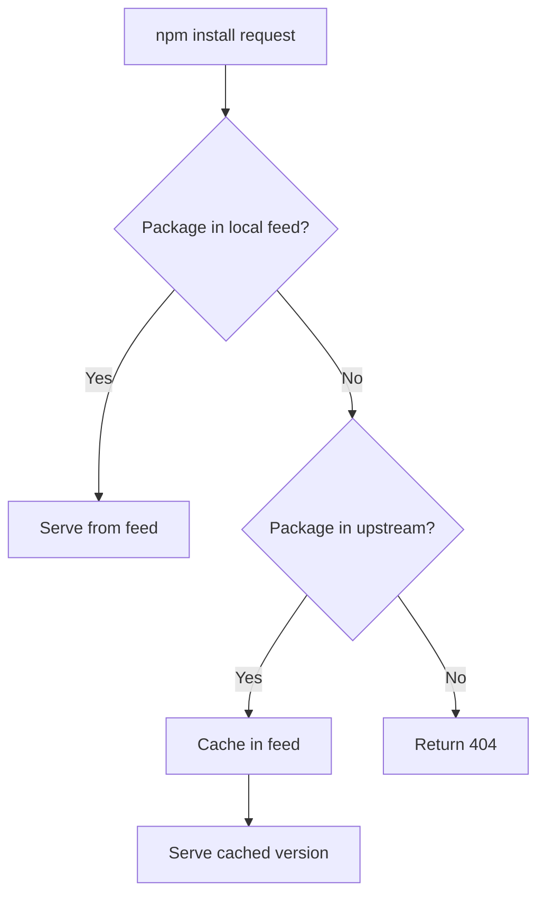

# How to Create and Manage Azure Artifacts Upstream Sources for npm Packages

Author: [nawazdhandala](https://www.github.com/nawazdhandala)

Tags: Azure Artifacts, npm, Package Management, Upstream Sources, Azure DevOps, Node.js, DevOps

Description: Configure Azure Artifacts upstream sources to proxy npm packages from public registries alongside your private internal packages.

---

Managing npm packages in an organization creates a common challenge: developers need packages from both the public npm registry and your internal private packages. You could configure multiple registries and scope your packages, but that adds complexity to every project's `.npmrc` file and confuses new developers who wonder why `npm install` is not finding packages.

Azure Artifacts upstream sources solve this elegantly. Your Azure Artifacts feed acts as a proxy for the public npm registry. When someone requests a package that does not exist in your feed, Azure Artifacts fetches it from the upstream registry, caches it, and serves it. Your developers point at one registry and get everything they need.

In this post, I will walk through setting up upstream sources, configuring your projects, publishing internal packages, and managing the lifecycle of cached packages.

## How Upstream Sources Work

When your feed has upstream sources configured, the package resolution follows this order:

1. Check the local feed for the package
2. If not found locally, check each upstream source in order
3. If found upstream, cache the package locally and serve it
4. If not found anywhere, return a 404



The caching behavior is important. Once a package version is cached from an upstream source, it is stored in your feed permanently (subject to retention policies). This means your builds do not break if npmjs.com has an outage, because you have a local copy of every version you have used.

## Setting Up a Feed with Upstream Sources

### Creating the Feed

Go to **Artifacts** in your Azure DevOps project and click **Create Feed**.

Configure it as follows:

- **Name**: Something like `npm-packages` or your team name
- **Visibility**: Organization-scoped if you want to share across projects
- **Include packages from common public sources**: Check this box

If you checked the public sources box, Azure Artifacts automatically adds upstream sources for npmjs.com and other common registries. If you did not, or you want to add them manually, continue to the next step.

### Adding Upstream Sources Manually

Go to your feed settings (gear icon), then **Upstream sources**. Click **Add Upstream**.

For npm, configure:

- **Type**: Public registry
- **Upstream source**: npmjs
- **Name**: npmjs (or whatever you prefer)

You can also add other Azure Artifacts feeds as upstream sources. This is useful if you have a shared feed in another project that publishes common packages.

```bash
# You can also configure upstream sources via the Azure CLI
az artifacts universal upstream add \
  --feed npm-packages \
  --name npmjs \
  --type npmjs \
  --organization https://dev.azure.com/myorg \
  --project myproject
```

### Upstream Source Priority

If you have multiple upstream sources, their order matters. Azure Artifacts checks them in the configured order. Put your internal feeds first (highest priority) and public registries last.

This prevents a scenario where someone publishes a malicious package to npmjs with the same name as your internal package. Since your internal feed is checked first, the internal version is always preferred.

## Configuring Your Project

Each developer and CI/CD pipeline needs an `.npmrc` file that points to your Azure Artifacts feed.

### For Local Development

Create a `.npmrc` file in your project root.

```ini
# .npmrc - Configure npm to use Azure Artifacts feed
registry=https://pkgs.dev.azure.com/myorg/myproject/_packaging/npm-packages/npm/registry/
always-auth=true
```

For authentication, developers need to run a one-time setup.

```bash
# Install the Azure Artifacts credential provider
npx vsts-npm-auth -config .npmrc

# Or use the Azure CLI approach
az artifacts npm login --feed npm-packages --scope myorg
```

The credential provider stores authentication tokens that npm uses when communicating with the feed.

### For Azure Pipelines

In a pipeline, authentication is handled by the `npmAuthenticate` task.

```yaml
# azure-pipelines.yml - npm pipeline with Azure Artifacts
trigger:
  - main

pool:
  vmImage: 'ubuntu-latest'

steps:
  # Authenticate with Azure Artifacts
  - task: npmAuthenticate@0
    displayName: 'Authenticate with npm feed'
    inputs:
      workingFile: '.npmrc'

  # Install packages (pulls from Azure Artifacts, which proxies npmjs)
  - script: npm ci
    displayName: 'Install dependencies'

  # Run tests
  - script: npm test
    displayName: 'Run tests'
```

The `npmAuthenticate` task modifies the `.npmrc` file in place, adding the authentication token for the pipeline run. After the pipeline finishes, the token expires.

## Publishing Internal Packages

To publish your own packages to the feed, configure the publish registry in your `.npmrc` and use `npm publish`.

### Setting Up Package Publishing

First, make sure your `package.json` has the correct metadata.

```json
{
  "name": "@mycompany/shared-utils",
  "version": "1.0.0",
  "description": "Shared utility functions for internal projects",
  "main": "dist/index.js",
  "types": "dist/index.d.ts",
  "scripts": {
    "build": "tsc",
    "test": "jest",
    "prepublishOnly": "npm run build && npm test"
  },
  "files": [
    "dist/**/*"
  ],
  "publishConfig": {
    "registry": "https://pkgs.dev.azure.com/myorg/myproject/_packaging/npm-packages/npm/registry/"
  }
}
```

The `publishConfig.registry` ensures that `npm publish` sends the package to your Azure Artifacts feed, not to the public npmjs registry.

### Publishing from a Pipeline

Automate publishing with a pipeline.

```yaml
# azure-pipelines.yml - Publish npm package to Azure Artifacts
trigger:
  branches:
    include:
      - main
  paths:
    include:
      - packages/shared-utils/**

pool:
  vmImage: 'ubuntu-latest'

steps:
  - task: NodeTool@0
    displayName: 'Use Node.js 20'
    inputs:
      versionSpec: '20.x'

  # Authenticate for both install and publish
  - task: npmAuthenticate@0
    displayName: 'Authenticate'
    inputs:
      workingFile: 'packages/shared-utils/.npmrc'

  # Install, build, and test
  - script: |
      cd packages/shared-utils
      npm ci
      npm run build
      npm test
    displayName: 'Build and test'

  # Publish to Azure Artifacts
  - script: |
      cd packages/shared-utils
      npm publish
    displayName: 'Publish package'
```

### Versioning Strategy

For internal packages, you need a versioning strategy that avoids conflicts and makes it clear what changed.

```bash
# Bump version before publishing
# Patch version for bug fixes
npm version patch

# Minor version for new features (backward compatible)
npm version minor

# Major version for breaking changes
npm version major
```

You can also automate version bumping in your pipeline based on commit messages.

```yaml
# Automatic version bump based on commit messages
- script: |
    cd packages/shared-utils

    # Get the latest commit message
    COMMIT_MSG=$(git log -1 --pretty=%B)

    # Determine version bump type from commit message
    if echo "$COMMIT_MSG" | grep -qE "^feat.*!:|BREAKING CHANGE"; then
      npm version major --no-git-tag-version
    elif echo "$COMMIT_MSG" | grep -qE "^feat"; then
      npm version minor --no-git-tag-version
    else
      npm version patch --no-git-tag-version
    fi
  displayName: 'Bump version'
```

## Managing Cached Packages

Over time, your feed accumulates cached packages from upstream sources. This is generally good - it protects you from upstream outages - but it uses storage.

### Retention Policies

Configure retention policies to manage feed size.

Go to your feed settings and configure:

- **Maximum versions per package**: Keeps only the N most recent versions. I set this to 20-50 for cached packages.
- **Days to keep recently downloaded packages**: Keeps packages that have been used recently, even if they exceed the version limit.

### Viewing Upstream Packages

In the Azure Artifacts UI, you can filter packages by source:

- **This feed**: Packages published directly to your feed
- **Upstream sources**: Packages cached from upstream registries

This helps you understand what is in your feed and where it came from.

## Scoped Packages

If your organization uses npm scopes (like `@mycompany/package-name`), you can configure scope-specific registries.

```ini
# .npmrc - Scope-specific registry configuration
# Internal packages use Azure Artifacts
@mycompany:registry=https://pkgs.dev.azure.com/myorg/myproject/_packaging/npm-packages/npm/registry/

# Everything else uses the Azure Artifacts feed with upstream sources
registry=https://pkgs.dev.azure.com/myorg/myproject/_packaging/npm-packages/npm/registry/

always-auth=true
```

This approach routes `@mycompany/*` packages to your feed while also routing all other packages through the same feed (which proxies to npmjs via upstream sources).

## Dependency Confusion Protection

Upstream sources create a potential attack vector called dependency confusion. If your internal package is named `my-utils` (without a scope), an attacker could publish a package with the same name to npmjs with a higher version number. Without proper configuration, npm might prefer the public version.

Azure Artifacts mitigates this by:

1. Checking the local feed first before upstream sources
2. Supporting upstream source priority ordering
3. Allowing you to block specific packages from upstream sources

The best protection is to use scoped packages (`@mycompany/my-utils`) for all internal packages. Scoped packages are namespaced and cannot conflict with unscoped public packages.

## Troubleshooting Common Issues

**Packages not resolving from upstream**: Check that the upstream source is enabled and has the correct URL. Also verify that your feed's upstream source configuration includes npm.

**Authentication failures in pipelines**: Make sure the `npmAuthenticate` task runs before any npm commands and that the `.npmrc` file path is correct.

**Version conflicts between local and upstream**: If the same package name exists in both your feed and an upstream source, the local version always wins. This is by design and protects against dependency confusion.

**Slow package restores**: The first time a package is fetched from an upstream source, it might be slow because Azure Artifacts is fetching and caching it. Subsequent installs are fast since they serve from the cache.

## Wrapping Up

Azure Artifacts upstream sources give you a single, reliable npm registry that serves both your internal packages and public ones from npmjs. Developers configure one registry URL and everything just works. You get the bonus of cached packages (protecting against upstream outages), dependency confusion protection, and a clear view of every package your organization depends on. Set it up once, and your team never has to think about registry configuration again.
