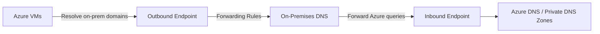

# How to Create and Manage Azure DNS Private Resolver for Hybrid Name Resolution

Author: [nawazdhandala](https://www.github.com/nawazdhandala)

Tags: Azure, DNS, Private Resolver, Hybrid Cloud, Name Resolution, Networking, DNS Forwarding

Description: A complete guide to deploying Azure DNS Private Resolver for hybrid name resolution between on-premises networks and Azure virtual networks.

---

DNS in hybrid environments is one of those problems that looks simple on a whiteboard but turns into a tangled mess in production. Your on-premises servers need to resolve Azure private DNS zones, your Azure VMs need to resolve on-premises Active Directory domains, and somehow everything needs to work seamlessly without manual hosts file entries.

Azure DNS Private Resolver was built specifically for this problem. It provides inbound and outbound DNS endpoints inside your VNet, eliminating the need for custom DNS forwarder VMs that you have been running and maintaining.

## The Problem with DNS Forwarder VMs

Before Private Resolver, the standard approach for hybrid DNS was to deploy a pair of VMs running DNS services (BIND, Windows DNS, or CoreDNS) that would forward queries between on-premises and Azure. This worked, but it came with baggage:

- You had to manage and patch those VMs
- You needed to handle high availability yourself (two VMs, health monitoring, load balancing)
- Scaling was manual
- Each forwarder was another potential point of failure

Azure DNS Private Resolver is a fully managed service that replaces these forwarder VMs.

## How Private Resolver Works

Private Resolver has two types of endpoints:

- **Inbound endpoints** receive DNS queries from external networks (on-premises, other VNets) and resolve them using Azure DNS, including private DNS zones linked to the VNet.
- **Outbound endpoints** send DNS queries from Azure VMs to external DNS servers (on-premises DNS, third-party DNS) based on forwarding rules.



## Prerequisites

1. A VNet with at least two dedicated subnets for the resolver endpoints
2. The subnets must be delegated to `Microsoft.Network/dnsResolvers`
3. Each subnet needs at least a /28 address range
4. The VNet must be in a region where Private Resolver is available

## Step 1: Create Dedicated Subnets

The resolver endpoints need their own subnets that are delegated to the DNS resolver service. These subnets cannot host any other resources.

```bash
# Create the inbound endpoint subnet with delegation
az network vnet subnet create \
  --resource-group myResourceGroup \
  --vnet-name myVNet \
  --name inbound-dns-subnet \
  --address-prefixes 10.0.10.0/28 \
  --delegations Microsoft.Network/dnsResolvers

# Create the outbound endpoint subnet with delegation
az network vnet subnet create \
  --resource-group myResourceGroup \
  --vnet-name myVNet \
  --name outbound-dns-subnet \
  --address-prefixes 10.0.11.0/28 \
  --delegations Microsoft.Network/dnsResolvers
```

## Step 2: Create the DNS Private Resolver

```bash
# Create the DNS Private Resolver in the VNet
az dns-resolver create \
  --resource-group myResourceGroup \
  --name myDNSResolver \
  --location eastus \
  --id "/subscriptions/<sub-id>/resourceGroups/myResourceGroup/providers/Microsoft.Network/virtualNetworks/myVNet"
```

Wait - that syntax looks odd. The `--id` parameter takes the VNet resource ID. Let me show the full command with the proper approach:

```bash
# Get VNet resource ID
VNET_ID=$(az network vnet show \
  --resource-group myResourceGroup \
  --name myVNet \
  --query id \
  --output tsv)

# Create the DNS Private Resolver
az dns-resolver create \
  --resource-group myResourceGroup \
  --name myDNSResolver \
  --location eastus \
  --id $VNET_ID
```

## Step 3: Create the Inbound Endpoint

The inbound endpoint gets a private IP address that external DNS servers will forward queries to:

```bash
# Create the inbound endpoint
az dns-resolver inbound-endpoint create \
  --resource-group myResourceGroup \
  --dns-resolver-name myDNSResolver \
  --name myInboundEndpoint \
  --location eastus \
  --ip-configurations '[{"private-ip-allocation-method":"Dynamic","id":"/subscriptions/<sub-id>/resourceGroups/myResourceGroup/providers/Microsoft.Network/virtualNetworks/myVNet/subnets/inbound-dns-subnet"}]'
```

After creation, note the assigned private IP address. You will configure your on-premises DNS servers to forward Azure-related queries to this IP.

```bash
# Get the inbound endpoint IP address
az dns-resolver inbound-endpoint show \
  --resource-group myResourceGroup \
  --dns-resolver-name myDNSResolver \
  --name myInboundEndpoint \
  --query "ipConfigurations[0].privateIpAddress" \
  --output tsv
```

## Step 4: Create the Outbound Endpoint

The outbound endpoint handles DNS queries going from Azure to external DNS servers:

```bash
# Create the outbound endpoint
az dns-resolver outbound-endpoint create \
  --resource-group myResourceGroup \
  --dns-resolver-name myDNSResolver \
  --name myOutboundEndpoint \
  --location eastus \
  --id "/subscriptions/<sub-id>/resourceGroups/myResourceGroup/providers/Microsoft.Network/virtualNetworks/myVNet/subnets/outbound-dns-subnet"
```

## Step 5: Create DNS Forwarding Rule Set

The outbound endpoint uses forwarding rules to decide where to send queries. Create a rule set and link it to the VNet:

```bash
# Create a DNS forwarding rule set
az dns-resolver forwarding-ruleset create \
  --resource-group myResourceGroup \
  --name myForwardingRules \
  --location eastus \
  --outbound-endpoints '[{"id":"/subscriptions/<sub-id>/resourceGroups/myResourceGroup/providers/Microsoft.Network/dnsResolvers/myDNSResolver/outboundEndpoints/myOutboundEndpoint"}]'

# Link the rule set to the VNet
az dns-resolver vnet-link create \
  --resource-group myResourceGroup \
  --ruleset-name myForwardingRules \
  --name myVNetLink \
  --id "/subscriptions/<sub-id>/resourceGroups/myResourceGroup/providers/Microsoft.Network/virtualNetworks/myVNet"
```

## Step 6: Add Forwarding Rules

Now add rules that tell the outbound endpoint where to forward specific domain queries. For example, forward all `corp.contoso.com` queries to your on-premises DNS servers:

```bash
# Forward corp.contoso.com queries to on-premises DNS servers
az dns-resolver forwarding-rule create \
  --resource-group myResourceGroup \
  --ruleset-name myForwardingRules \
  --name corpContosoRule \
  --domain-name "corp.contoso.com." \
  --forwarding-rule-state Enabled \
  --target-dns-servers '[{"ip-address":"192.168.1.10","port":53},{"ip-address":"192.168.1.11","port":53}]'
```

Note the trailing dot in the domain name - this is required. The target DNS servers are your on-premises DNS servers reachable through VPN or ExpressRoute.

You can add multiple rules for different domains:

```bash
# Forward internal.example.com queries to a different set of DNS servers
az dns-resolver forwarding-rule create \
  --resource-group myResourceGroup \
  --ruleset-name myForwardingRules \
  --name internalExampleRule \
  --domain-name "internal.example.com." \
  --forwarding-rule-state Enabled \
  --target-dns-servers '[{"ip-address":"10.100.1.5","port":53}]'
```

## Step 7: Configure On-Premises DNS

On your on-premises DNS server, create a conditional forwarder for Azure private DNS zones. Forward these zones to the inbound endpoint IP:

- `privatelink.database.windows.net`
- `privatelink.blob.core.windows.net`
- `privatelink.azurewebsites.net`
- Any custom private DNS zones you have created

For Windows DNS Server, you would add a conditional forwarder for each zone pointing to the inbound endpoint IP (for example, 10.0.10.4).

For BIND:

```
# BIND conditional forwarding configuration for Azure private zones
zone "privatelink.database.windows.net" {
    type forward;
    forward only;
    forwarders { 10.0.10.4; };
};

zone "privatelink.blob.core.windows.net" {
    type forward;
    forward only;
    forwarders { 10.0.10.4; };
};
```

## Testing the Configuration

From an Azure VM in the linked VNet, test resolution of an on-premises domain:

```bash
# Test resolving an on-premises domain from Azure VM
nslookup server1.corp.contoso.com
```

From an on-premises server, test resolution of an Azure private endpoint:

```bash
# Test resolving Azure private endpoint from on-premises
nslookup mysqlserver.privatelink.database.windows.net
```

Both should return the correct private IP addresses.

## High Availability

Private Resolver is zone-redundant by default in regions that support availability zones. You do not need to deploy multiple resolvers for HA within a region. The service handles failover automatically.

For multi-region deployments, deploy a resolver in each region and configure your forwarding rules accordingly.

## Pricing Considerations

Private Resolver charges based on the number of endpoints (inbound and outbound) per hour. Each endpoint costs roughly $0.18 per hour. An inbound plus outbound setup runs about $260 per month, which is comparable to running two small VMs but without the management overhead.

## Summary

Azure DNS Private Resolver eliminates the need for maintaining DNS forwarder VMs in hybrid environments. Deploy it in a VNet with dedicated subnets, create inbound endpoints for external-to-Azure resolution, create outbound endpoints with forwarding rules for Azure-to-external resolution, and update your on-premises DNS to forward Azure zone queries to the inbound endpoint. The result is a fully managed, zone-redundant DNS forwarding solution that handles the complexity of hybrid name resolution cleanly.
