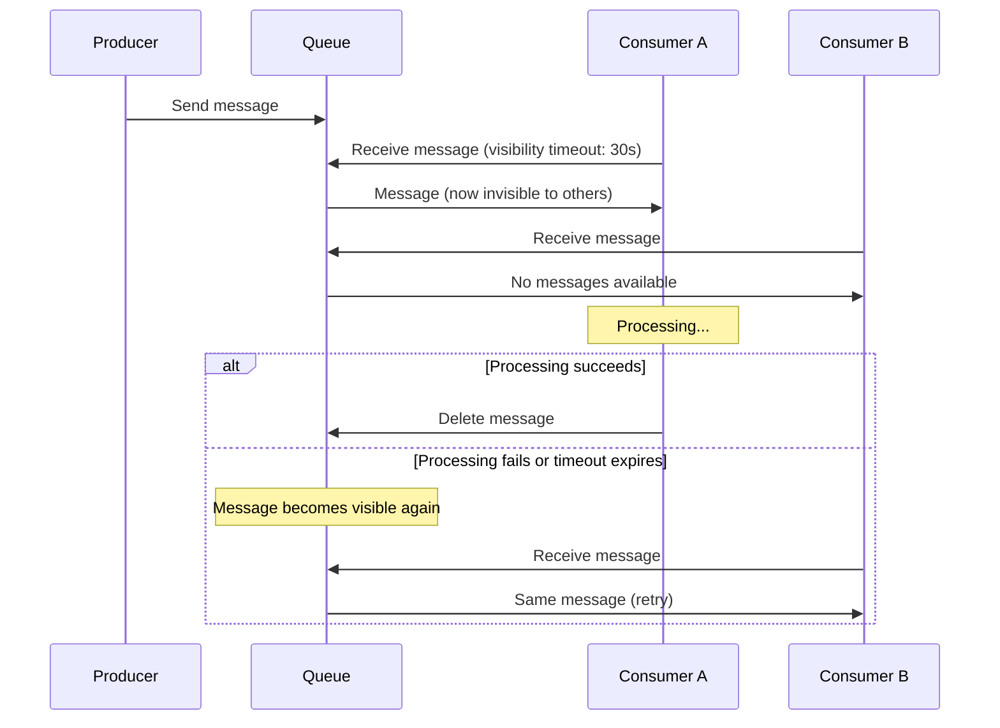

# How to Create and Manage Azure Queue Storage Messages Programmatically

Author: [nawazdhandala](https://www.github.com/nawazdhandala)

Tags: Azure, Queue Storage, Messaging, Azure Storage, Distributed Systems, Cloud Architecture, Microservices

Description: A practical guide to creating, reading, and managing messages in Azure Queue Storage using Python, C#, and the Azure CLI for building decoupled distributed applications.

---

Azure Queue Storage is a simple, reliable message queuing service built on top of Azure Storage. It lets you decouple components of your application by passing messages between them asynchronously. A web frontend can drop a message in a queue, and a background worker picks it up and processes it later. Neither component needs to know about the other or be running at the same time.

Compared to Azure Service Bus, Queue Storage is simpler and cheaper. It does not have advanced features like topics, subscriptions, or dead-letter queues built in, but for many workloads, its simplicity is exactly what you need. Let me walk through how to work with it programmatically.

## When to Use Queue Storage

Queue Storage fits scenarios where you need:

- **Work distribution.** A web app queues tasks that background workers process at their own pace.
- **Load leveling.** Buffer incoming requests during traffic spikes and process them gradually.
- **Loose coupling.** Separate components that produce work from components that consume work.
- **Reliable delivery.** Messages persist in the queue until explicitly deleted after processing.

If you need guaranteed ordering, message sessions, or complex routing, look at Azure Service Bus instead. Queue Storage provides at-least-once delivery with visibility timeout-based processing, which is good enough for many use cases.

## Creating a Queue

### Azure CLI

```bash
# Create a queue in a storage account
az storage queue create \
  --account-name mystorageaccount \
  --name task-queue
```

### Python SDK

```python
from azure.storage.queue import QueueServiceClient

# Connect to the storage account
queue_service_client = QueueServiceClient.from_connection_string("your-connection-string")

# Create a new queue
queue_client = queue_service_client.create_queue("task-queue")
print("Queue created successfully")
```

### C# SDK

```csharp
using Azure.Storage.Queues;

// Create a queue client and ensure the queue exists
var queueClient = new QueueClient("your-connection-string", "task-queue");
await queueClient.CreateIfNotExistsAsync();
Console.WriteLine("Queue created successfully");
```

## Sending Messages

### Python SDK

```python
from azure.storage.queue import QueueClient
import json

# Connect to the queue
queue_client = QueueClient.from_connection_string(
    conn_str="your-connection-string",
    queue_name="task-queue"
)

# Send a simple text message
queue_client.send_message("Process order #12345")

# Send a structured message as JSON
task = {
    "type": "image-resize",
    "source_blob": "uploads/photo.jpg",
    "target_sizes": [800, 400, 200],
    "priority": "normal"
}
queue_client.send_message(json.dumps(task))
print("Messages sent to queue")
```

### C# SDK

```csharp
using Azure.Storage.Queues;
using System.Text.Json;

var queueClient = new QueueClient("your-connection-string", "task-queue");

// Send a simple text message
await queueClient.SendMessageAsync("Process order #12345");

// Send a JSON message
var task = new {
    Type = "image-resize",
    SourceBlob = "uploads/photo.jpg",
    TargetSizes = new[] { 800, 400, 200 },
    Priority = "normal"
};
string jsonMessage = JsonSerializer.Serialize(task);
await queueClient.SendMessageAsync(jsonMessage);
Console.WriteLine("Messages sent to queue");
```

### Message Options

You can control when a message becomes visible and how long it lives in the queue:

```python
from azure.storage.queue import QueueClient

queue_client = QueueClient.from_connection_string(
    conn_str="your-connection-string",
    queue_name="task-queue"
)

# Send a message that becomes visible after 60 seconds (delayed processing)
queue_client.send_message(
    "Delayed task",
    visibility_timeout=60  # seconds before the message becomes visible
)

# Send a message with a custom TTL (time-to-live)
queue_client.send_message(
    "Expiring task",
    time_to_live=3600  # message expires after 1 hour if not processed
)
```

## Receiving and Processing Messages

Messages in Azure Queue Storage follow a two-step process: receive (makes the message invisible to other consumers) and delete (permanently removes it after successful processing).

### Python SDK

```python
from azure.storage.queue import QueueClient
import json

queue_client = QueueClient.from_connection_string(
    conn_str="your-connection-string",
    queue_name="task-queue"
)

# Receive up to 10 messages with a 30-second visibility timeout
# During this timeout, no other consumer can see these messages
messages = queue_client.receive_messages(
    messages_per_page=10,
    visibility_timeout=30
)

for message in messages:
    try:
        # Parse and process the message content
        content = message.content
        print(f"Processing: {content}")

        # If the content is JSON, parse it
        try:
            task = json.loads(content)
            print(f"Task type: {task.get('type', 'unknown')}")
        except json.JSONDecodeError:
            print(f"Plain text message: {content}")

        # After successful processing, delete the message
        queue_client.delete_message(message)
        print(f"Message processed and deleted: {message.id}")

    except Exception as e:
        # If processing fails, the message becomes visible again after the timeout
        # Another consumer (or this one on retry) will pick it up
        print(f"Error processing message: {e}")
```

### C# SDK

```csharp
using Azure.Storage.Queues;
using Azure.Storage.Queues.Models;

var queueClient = new QueueClient("your-connection-string", "task-queue");

// Receive up to 10 messages with a 30-second visibility timeout
QueueMessage[] messages = await queueClient.ReceiveMessagesAsync(
    maxMessages: 10,
    visibilityTimeout: TimeSpan.FromSeconds(30)
);

foreach (var message in messages)
{
    try
    {
        // Process the message
        Console.WriteLine($"Processing: {message.MessageText}");

        // Delete the message after successful processing
        await queueClient.DeleteMessageAsync(message.MessageId, message.PopReceipt);
        Console.WriteLine($"Message processed and deleted: {message.MessageId}");
    }
    catch (Exception ex)
    {
        // Message will become visible again after the timeout
        Console.WriteLine($"Error processing message: {ex.Message}");
    }
}
```

## The Visibility Timeout Pattern

The visibility timeout is crucial for reliable message processing. Here is how it works:



If a consumer crashes while processing a message, the message automatically becomes visible again after the timeout expires. Another consumer picks it up and tries again. This is how Queue Storage provides at-least-once delivery.

### Extending the Visibility Timeout

If your processing takes longer than expected, you can extend the timeout:

```python
from azure.storage.queue import QueueClient

queue_client = QueueClient.from_connection_string(
    conn_str="your-connection-string",
    queue_name="task-queue"
)

# Receive a message with an initial 30-second timeout
messages = queue_client.receive_messages(visibility_timeout=30)

for message in messages:
    # Start processing...
    # If we need more time, extend the timeout
    updated = queue_client.update_message(
        message,
        visibility_timeout=120  # extend to 2 minutes
    )
    print(f"Visibility timeout extended for message: {message.id}")

    # Continue processing with more time...

    # Delete after processing
    queue_client.delete_message(updated)
```

## Peeking at Messages

Peeking lets you look at messages without removing them from the queue or making them invisible:

```python
from azure.storage.queue import QueueClient

queue_client = QueueClient.from_connection_string(
    conn_str="your-connection-string",
    queue_name="task-queue"
)

# Peek at up to 5 messages without affecting their visibility
peeked = queue_client.peek_messages(max_messages=5)

for msg in peeked:
    print(f"Message ID: {msg.id}, Content: {msg.content}")
    print(f"Enqueued at: {msg.inserted_on}, Dequeue count: {msg.dequeue_count}")
```

Peeking is useful for monitoring and debugging. The `dequeue_count` tells you how many times a message has been received, which helps identify messages that keep failing.

## Getting Queue Metadata

Check the approximate message count and other properties:

```python
from azure.storage.queue import QueueClient

queue_client = QueueClient.from_connection_string(
    conn_str="your-connection-string",
    queue_name="task-queue"
)

# Get queue properties including approximate message count
properties = queue_client.get_queue_properties()
print(f"Approximate message count: {properties.approximate_message_count}")
```

```bash
# Get the approximate message count via CLI
az storage queue metadata show \
  --account-name mystorageaccount \
  --name task-queue \
  --query "approximateMessageCount"
```

Note the word "approximate" - the count is eventually consistent and may not reflect very recent additions or deletions.

## Clearing a Queue

To remove all messages from a queue:

```python
from azure.storage.queue import QueueClient

queue_client = QueueClient.from_connection_string(
    conn_str="your-connection-string",
    queue_name="task-queue"
)

# Clear all messages from the queue
queue_client.clear_messages()
print("All messages cleared")
```

```bash
# Clear all messages via CLI
az storage message clear \
  --account-name mystorageaccount \
  --queue-name task-queue
```

## Building a Simple Worker Loop

Here is a complete worker pattern that continuously processes messages:

```python
from azure.storage.queue import QueueClient
import json
import time
import logging

logging.basicConfig(level=logging.INFO)
logger = logging.getLogger(__name__)

def process_task(task_data):
    """Process a single task. Replace with your actual logic."""
    task = json.loads(task_data)
    logger.info(f"Processing task: {task}")
    # Your processing logic here
    time.sleep(1)  # simulate work
    return True

def run_worker():
    """Main worker loop that polls the queue for messages."""
    queue_client = QueueClient.from_connection_string(
        conn_str="your-connection-string",
        queue_name="task-queue"
    )

    logger.info("Worker started. Polling for messages...")

    while True:
        # Receive a batch of messages
        messages = queue_client.receive_messages(
            messages_per_page=5,
            visibility_timeout=60
        )

        message_found = False
        for message in messages:
            message_found = True
            try:
                process_task(message.content)
                queue_client.delete_message(message)
                logger.info(f"Message {message.id} processed and deleted")
            except Exception as e:
                logger.error(f"Failed to process message {message.id}: {e}")
                # Message becomes visible again after timeout for retry

        if not message_found:
            # No messages available - back off to avoid burning CPU
            time.sleep(5)

if __name__ == "__main__":
    run_worker()
```

## Message Size and Encoding

Azure Queue Storage messages have a maximum size of 64 KB. If you need to pass larger payloads, store the data in Blob Storage and put the blob reference in the queue message:

```python
from azure.storage.queue import QueueClient
from azure.storage.blob import BlobServiceClient
import json

# Upload large data to blob storage
blob_service = BlobServiceClient.from_connection_string("your-connection-string")
blob_client = blob_service.get_blob_client("data-container", "large-payload-123.json")
blob_client.upload_blob(large_data, overwrite=True)

# Put a reference to the blob in the queue message
queue_client = QueueClient.from_connection_string("your-connection-string", "task-queue")
message = {
    "type": "process-large-dataset",
    "blob_container": "data-container",
    "blob_name": "large-payload-123.json"
}
queue_client.send_message(json.dumps(message))
```

## Wrapping Up

Azure Queue Storage provides straightforward message queuing without the complexity of a full messaging service. The programming model is simple: send messages, receive them with a visibility timeout, process them, and delete them. The visibility timeout pattern gives you at-least-once delivery with automatic retry on failure. For most background processing and work distribution scenarios, this is all you need. When your requirements grow beyond what Queue Storage offers, you can graduate to Azure Service Bus without changing your overall architecture.
