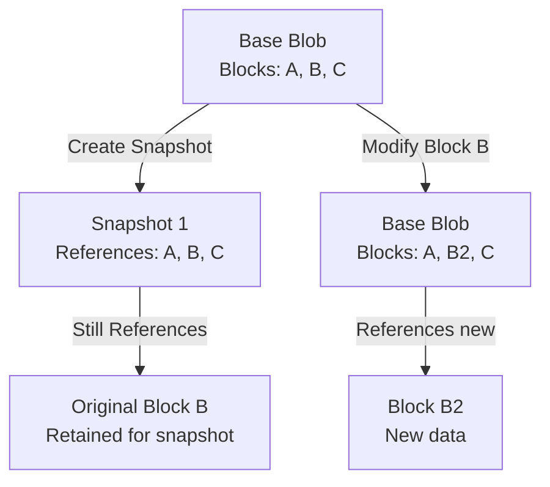

# How to Create and Manage Blob Snapshots in Azure Storage

Author: [nawazdhandala](https://www.github.com/nawazdhandala)

Tags: Azure, Blob Storage, Snapshots, Data Protection, Backup, Azure Storage, Cloud Storage

Description: Learn how to create, manage, and restore blob snapshots in Azure Storage for point-in-time data protection and backup scenarios.

---

Blob snapshots in Azure Storage give you a read-only copy of a blob at a specific point in time. Unlike versioning, which happens automatically on every write, snapshots are intentional checkpoints that you create when you want them. They are useful for backing up data before a risky operation, keeping a consistent view of a blob for processing, or maintaining historical records at specific intervals.

I find snapshots particularly handy when I need to make changes to a blob and want a safety net to roll back to if something goes wrong. Let me show you how to work with them.

## How Snapshots Work

When you create a snapshot, Azure does not make a full copy of the blob. Instead, it uses a copy-on-write mechanism. The snapshot initially points to the same data blocks as the base blob. Only when the base blob gets modified does Azure store the changed blocks separately. This makes snapshot creation nearly instantaneous and storage-efficient.



Each snapshot is identified by a timestamp that Azure assigns when the snapshot is created. The combination of the blob URI plus the snapshot timestamp uniquely identifies the snapshot.

## Creating a Snapshot

### Azure CLI

```bash
# Create a snapshot of a specific blob
az storage blob snapshot \
  --account-name mystorageaccount \
  --container-name mycontainer \
  --name important-data.json
```

This returns the snapshot timestamp, which you will need to reference the snapshot later.

### Python SDK

```python
from azure.storage.blob import BlobServiceClient

# Connect to the storage account
blob_service_client = BlobServiceClient.from_connection_string("your-connection-string")
blob_client = blob_service_client.get_blob_client(
    container="mycontainer",
    blob="important-data.json"
)

# Create a snapshot - returns a dictionary with the snapshot timestamp
snapshot_props = blob_client.create_snapshot()
snapshot_id = snapshot_props["snapshot"]
print(f"Snapshot created with ID: {snapshot_id}")
```

### C# SDK

```csharp
using Azure.Storage.Blobs;

// Get a reference to the blob
var blobServiceClient = new BlobServiceClient("your-connection-string");
var containerClient = blobServiceClient.GetBlobContainerClient("mycontainer");
var blobClient = containerClient.GetBlobClient("important-data.json");

// Create the snapshot
var snapshotResponse = await blobClient.CreateSnapshotAsync();
var snapshotTimestamp = snapshotResponse.Value.Snapshot;
Console.WriteLine($"Snapshot created: {snapshotTimestamp}");
```

### Adding Metadata to Snapshots

You can attach metadata to a snapshot at creation time. This is useful for labeling snapshots with the reason they were created:

```python
from azure.storage.blob import BlobServiceClient

blob_service_client = BlobServiceClient.from_connection_string("your-connection-string")
blob_client = blob_service_client.get_blob_client(
    container="mycontainer",
    blob="important-data.json"
)

# Create a snapshot with metadata describing why it was taken
snapshot_metadata = {
    "reason": "pre-migration-backup",
    "created_by": "data-pipeline",
    "ticket": "OPS-4521"
}

snapshot_props = blob_client.create_snapshot(metadata=snapshot_metadata)
print(f"Snapshot with metadata created: {snapshot_props['snapshot']}")
```

## Listing Snapshots

To see all snapshots of a blob:

### Azure CLI

```bash
# List all snapshots for a specific blob
az storage blob list \
  --account-name mystorageaccount \
  --container-name mycontainer \
  --prefix "important-data.json" \
  --include s \
  --output table
```

The `--include s` flag tells Azure to include snapshots in the listing.

### Python SDK

```python
from azure.storage.blob import BlobServiceClient

blob_service_client = BlobServiceClient.from_connection_string("your-connection-string")
container_client = blob_service_client.get_container_client("mycontainer")

# List all blobs and snapshots with the given prefix
blob_list = container_client.list_blobs(
    name_starts_with="important-data.json",
    include=["snapshots"]
)

for blob in blob_list:
    if blob.snapshot:
        # This is a snapshot
        print(f"Snapshot: {blob.name} at {blob.snapshot}")
    else:
        # This is the base blob
        print(f"Base blob: {blob.name}")
```

## Reading a Snapshot

Snapshots are read-only. You can download their content using the snapshot timestamp:

```python
from azure.storage.blob import BlobServiceClient

blob_service_client = BlobServiceClient.from_connection_string("your-connection-string")

# Access a specific snapshot by providing the snapshot timestamp
blob_client = blob_service_client.get_blob_client(
    container="mycontainer",
    blob="important-data.json",
    snapshot="2026-02-16T14:30:00.0000000Z"
)

# Download the snapshot content
download_stream = blob_client.download_blob()
content = download_stream.readall()
print(f"Snapshot content size: {len(content)} bytes")
```

Via URL, you append `?snapshot=<timestamp>` to the blob URL:

```
https://mystorageaccount.blob.core.windows.net/mycontainer/important-data.json?snapshot=2026-02-16T14:30:00.0000000Z
```

## Restoring from a Snapshot

To restore a blob to a previous state captured in a snapshot, you copy the snapshot over the base blob:

```python
from azure.storage.blob import BlobServiceClient

blob_service_client = BlobServiceClient.from_connection_string("your-connection-string")

# Get the base blob client (destination for the restore)
base_blob = blob_service_client.get_blob_client(
    container="mycontainer",
    blob="important-data.json"
)

# Build the source URL pointing to the snapshot
snapshot_url = (
    "https://mystorageaccount.blob.core.windows.net/"
    "mycontainer/important-data.json"
    "?snapshot=2026-02-16T14:30:00.0000000Z"
)

# Copy the snapshot content to the base blob
base_blob.start_copy_from_url(snapshot_url)
print("Blob restored from snapshot")
```

This creates a new version of the base blob (if versioning is enabled) with the content from the snapshot. The snapshot itself is not affected.

### Azure CLI Restore

```bash
# Copy a snapshot back to the base blob to restore it
az storage blob copy start \
  --account-name mystorageaccount \
  --destination-container mycontainer \
  --destination-blob important-data.json \
  --source-uri "https://mystorageaccount.blob.core.windows.net/mycontainer/important-data.json?snapshot=2026-02-16T14:30:00.0000000Z"
```

## Deleting Snapshots

You can delete individual snapshots or all snapshots of a blob at once.

### Delete a Specific Snapshot

```bash
# Delete a single snapshot by its timestamp
az storage blob delete \
  --account-name mystorageaccount \
  --container-name mycontainer \
  --name important-data.json \
  --snapshot "2026-02-16T14:30:00.0000000Z"
```

### Delete All Snapshots (Keep the Base Blob)

```bash
# Delete all snapshots but keep the base blob
az storage blob delete \
  --account-name mystorageaccount \
  --container-name mycontainer \
  --name important-data.json \
  --delete-snapshots only
```

### Delete the Base Blob and All Snapshots

```bash
# Delete the base blob along with all its snapshots
az storage blob delete \
  --account-name mystorageaccount \
  --container-name mycontainer \
  --name important-data.json \
  --delete-snapshots include
```

Note that you cannot delete a base blob that has snapshots without specifying what to do with them. You must either delete the snapshots first or use `--delete-snapshots include`.

## Automating Snapshot Cleanup

Snapshots consume storage space and accumulate over time. Use lifecycle management policies to automatically clean up old snapshots:

```json
{
  "rules": [
    {
      "enabled": true,
      "name": "cleanup-old-snapshots",
      "type": "Lifecycle",
      "definition": {
        "actions": {
          "snapshot": {
            "delete": {
              "daysAfterCreationGreaterThan": 30
            }
          }
        },
        "filters": {
          "blobTypes": ["blockBlob"],
          "prefixMatch": ["data/"]
        }
      }
    }
  ]
}
```

This automatically deletes snapshots older than 30 days for blobs under the `data/` prefix.

## Snapshots vs. Versioning

This is a common point of confusion. Here is the key difference:

| Feature | Snapshots | Versioning |
|---------|-----------|------------|
| Trigger | Manual (you create them) | Automatic (on every write) |
| Read-only | Yes | Yes (previous versions) |
| Identified by | Timestamp | Version ID |
| Cost | Only changed blocks | Only changed blocks |
| Cleanup | Manual or lifecycle policies | Lifecycle policies |

**Use snapshots when:** You want explicit checkpoints at meaningful moments (before a migration, before a batch update, at the end of a business day).

**Use versioning when:** You want protection against every accidental overwrite or deletion without relying on your application to create checkpoints.

You can use both features simultaneously. They work independently of each other.

## Snapshot Costs

Snapshots are billed based on the unique data they hold. If a snapshot shares all its blocks with the base blob (because the base blob has not been modified since the snapshot), the snapshot costs almost nothing. As the base blob diverges from the snapshot, the snapshot starts holding unique blocks that count toward your storage bill.

You can estimate snapshot costs by looking at the incremental data between snapshots. Azure does not provide a direct "snapshot cost" metric, but you can track total storage capacity and subtract the base blob sizes.

## Wrapping Up

Blob snapshots are a simple but effective tool for creating point-in-time copies of your data. They are quick to create, efficient in storage thanks to copy-on-write, and straightforward to restore from. Pair them with lifecycle management policies for automatic cleanup, and consider using them alongside versioning for comprehensive data protection. The few seconds it takes to create a snapshot before a risky operation can save you hours of recovery work if something goes wrong.
