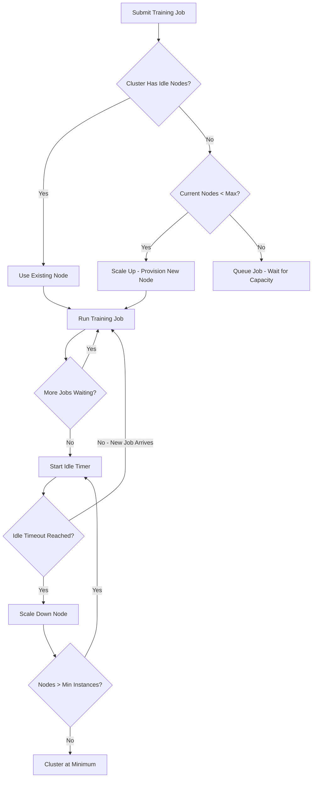

# How to Create and Manage Compute Clusters in Azure Machine Learning

Author: [nawazdhandala](https://www.github.com/nawazdhandala)

Tags: Azure, Machine Learning, Compute Clusters, GPU, Scaling, MLOps, Infrastructure

Description: Learn how to create, configure, and manage compute clusters in Azure Machine Learning for scalable model training and batch inference jobs.

---

Compute clusters in Azure Machine Learning are the workhorses of model training. Unlike compute instances (which are single VMs for interactive development), compute clusters are pools of virtual machines that automatically scale up when you submit training jobs and scale back down to zero when idle. This means you only pay for compute when you are actually using it. In this post, I will cover everything you need to know about creating, configuring, and managing compute clusters effectively.

## Compute Clusters vs. Compute Instances

It is important to understand the difference:

- **Compute instances**: Single VMs for interactive work (Jupyter notebooks, VS Code). Always running (unless you stop them). Think of them as your personal development machine.
- **Compute clusters**: Multi-node pools for training jobs and batch inference. Auto-scale from 0 to N nodes. Think of them as your on-demand training farm.

For cost efficiency, use compute instances for development and compute clusters for training. Set your clusters to scale to zero when idle so you are not paying for idle machines.

## Method 1: Create a Cluster via the Azure Portal

In Azure ML Studio, navigate to "Compute" in the left sidebar and click the "Compute clusters" tab. Click "New."

You will need to configure:

- **Compute name**: A descriptive name like `gpu-training-cluster` or `cpu-batch-cluster`.
- **Virtual machine type**: CPU or GPU. Choose GPU for deep learning and large model training. Choose CPU for classical ML algorithms and data processing.
- **Virtual machine size**: The specific VM size. Common choices include:
  - `Standard_DS3_v2` (4 cores, 14 GB RAM) - good for small to medium CPU jobs
  - `Standard_DS12_v2` (4 cores, 28 GB RAM) - when you need more memory
  - `Standard_NC6s_v3` (6 cores, 112 GB RAM, 1x V100 GPU) - entry-level GPU training
  - `Standard_NC24ads_A100_v4` (24 cores, 220 GB RAM, 1x A100 GPU) - serious deep learning
- **Minimum nodes**: Set to 0 for cost savings (cluster scales to zero when idle). Set to 1 or more if you need instant job start times.
- **Maximum nodes**: The upper limit for scaling. More nodes means more parallelism but higher potential cost.
- **Idle seconds before scale down**: How long to wait before scaling down idle nodes. Default is 120 seconds. Increase this if you submit jobs frequently to avoid repeated scale-up times.

## Method 2: Create a Cluster via Python SDK

```python
from azure.ai.ml import MLClient
from azure.ai.ml.entities import AmlCompute
from azure.identity import DefaultAzureCredential

# Connect to the workspace
credential = DefaultAzureCredential()
ml_client = MLClient(
    credential=credential,
    subscription_id="your-subscription-id",
    resource_group_name="ml-project-rg",
    workspace_name="ml-workspace-production"
)

# Define a CPU cluster for general-purpose training
cpu_cluster = AmlCompute(
    name="cpu-training-cluster",
    type="amlcompute",
    size="Standard_DS3_v2",       # VM size
    min_instances=0,               # Scale to zero when idle
    max_instances=4,               # Maximum 4 nodes
    idle_time_before_scale_down=180,  # Wait 3 minutes before scaling down
    tier="Dedicated",              # "Dedicated" or "LowPriority"
    description="CPU cluster for scikit-learn and data processing jobs"
)

# Create the cluster (or update if it already exists)
ml_client.compute.begin_create_or_update(cpu_cluster).result()
print(f"Cluster '{cpu_cluster.name}' created successfully")
```

### Creating a GPU Cluster

```python
# Define a GPU cluster for deep learning
gpu_cluster = AmlCompute(
    name="gpu-training-cluster",
    type="amlcompute",
    size="Standard_NC6s_v3",       # V100 GPU
    min_instances=0,
    max_instances=2,
    idle_time_before_scale_down=300,  # 5 minutes - GPU jobs often come in bursts
    tier="Dedicated",
    description="GPU cluster for PyTorch and TensorFlow training"
)

ml_client.compute.begin_create_or_update(gpu_cluster).result()
print(f"GPU cluster '{gpu_cluster.name}' created successfully")
```

## Method 3: Create a Cluster via Azure CLI

```bash
# Create a CPU cluster
az ml compute create \
    --name cpu-training-cluster \
    --resource-group ml-project-rg \
    --workspace-name ml-workspace-production \
    --type AmlCompute \
    --size Standard_DS3_v2 \
    --min-instances 0 \
    --max-instances 4 \
    --idle-time-before-scale-down 180

# Create a GPU cluster
az ml compute create \
    --name gpu-training-cluster \
    --resource-group ml-project-rg \
    --workspace-name ml-workspace-production \
    --type AmlCompute \
    --size Standard_NC6s_v3 \
    --min-instances 0 \
    --max-instances 2 \
    --idle-time-before-scale-down 300
```

## Using Low-Priority VMs to Save Money

Azure offers low-priority (spot) VMs at up to 80% discount compared to dedicated VMs. The trade-off is that Azure can reclaim these VMs at any time if it needs the capacity for dedicated customers.

```python
# Low-priority cluster for cost-sensitive workloads
spot_cluster = AmlCompute(
    name="spot-training-cluster",
    type="amlcompute",
    size="Standard_NC6s_v3",
    min_instances=0,
    max_instances=8,                # Can be larger since it is cheaper
    idle_time_before_scale_down=120,
    tier="LowPriority",            # Use spot/low-priority VMs
    description="Low-priority GPU cluster for hyperparameter tuning"
)

ml_client.compute.begin_create_or_update(spot_cluster).result()
```

Low-priority VMs work well for:

- Hyperparameter tuning (individual trials can be restarted if preempted)
- Experimentation and prototyping
- Jobs with checkpointing (the job can resume from a checkpoint after preemption)

They are not a good fit for:

- Long-running single-node training without checkpointing
- Time-sensitive production training jobs

## Configuring Network Isolation

For production workloads, you may need to place your compute cluster inside a virtual network to ensure training data stays within your network boundary.

```python
# Cluster with VNet integration
private_cluster = AmlCompute(
    name="private-training-cluster",
    type="amlcompute",
    size="Standard_DS3_v2",
    min_instances=0,
    max_instances=4,
    # Network configuration
    vnet_name="ml-vnet",
    subnet_name="training-subnet",
    description="Network-isolated cluster for sensitive data processing"
)

ml_client.compute.begin_create_or_update(private_cluster).result()
```

When the cluster is in a VNet, the nodes cannot access the public internet by default. You may need to configure an Azure Firewall or NAT Gateway to allow outbound access for package installation.

## Monitoring Cluster Usage

Track how your clusters are being used so you can right-size them and control costs.

### Check Cluster Status

```python
# Get current cluster status
cluster = ml_client.compute.get("cpu-training-cluster")
print(f"Cluster: {cluster.name}")
print(f"Provisioning state: {cluster.provisioning_state}")
print(f"Current nodes: {cluster.size}")
print(f"VM size: {cluster.size}")
```

### List All Clusters and Their Status

```python
# List all compute resources in the workspace
computes = ml_client.compute.list()

print("Compute resources:")
for compute in computes:
    if hasattr(compute, 'min_instances'):  # It is a cluster
        print(f"  {compute.name} ({compute.size})")
        print(f"    Min/Max instances: {compute.min_instances}/{compute.max_instances}")
        print(f"    State: {compute.provisioning_state}")
```

### Set Up Cost Alerts

Use Azure Cost Management to set up budget alerts for your ML resource group. This prevents runaway costs from clusters that stay scaled up longer than expected.



## Best Practices for Cluster Management

**Create purpose-specific clusters.** Do not use one cluster for everything. Have separate clusters for CPU training, GPU training, and batch inference. This lets you right-size each cluster and apply appropriate networking rules.

**Always set min_instances to 0** unless you have a specific reason not to. Every running node costs money, even when idle. The trade-off is that scaling from zero takes 3-5 minutes, but for most workflows this is acceptable.

**Choose the right idle timeout.** If you submit jobs frequently (every few minutes), set a longer idle timeout (5-10 minutes) to avoid constantly scaling up and down. If jobs are infrequent, keep the default or use a shorter timeout.

**Use tags for cost tracking.** Tag your clusters with team, project, and environment labels so you can break down costs in Azure Cost Management.

```python
cpu_cluster = AmlCompute(
    name="cpu-training-cluster",
    size="Standard_DS3_v2",
    min_instances=0,
    max_instances=4,
    tags={
        "team": "data-science",
        "project": "churn-prediction",
        "environment": "development"
    }
)
```

**Monitor GPU utilization.** GPU VMs are expensive. If your GPU utilization is consistently below 50%, you might be bottlenecked on data loading rather than compute. Consider using a smaller GPU or optimizing your data pipeline before scaling up.

**Schedule cluster scaling.** If you know your team only trains during business hours, you can use Azure Automation to set max_instances to 0 at night and restore it in the morning.

## Wrapping Up

Compute clusters are the backbone of scalable ML training in Azure. The auto-scaling capability means you get the compute power you need without paying for idle resources. Start with small clusters for development, use low-priority VMs for experimentation, and reserve dedicated clusters for production training. Monitor usage closely and adjust configurations as your workload patterns become clear. The goal is to find the sweet spot between job wait time and cost efficiency.
