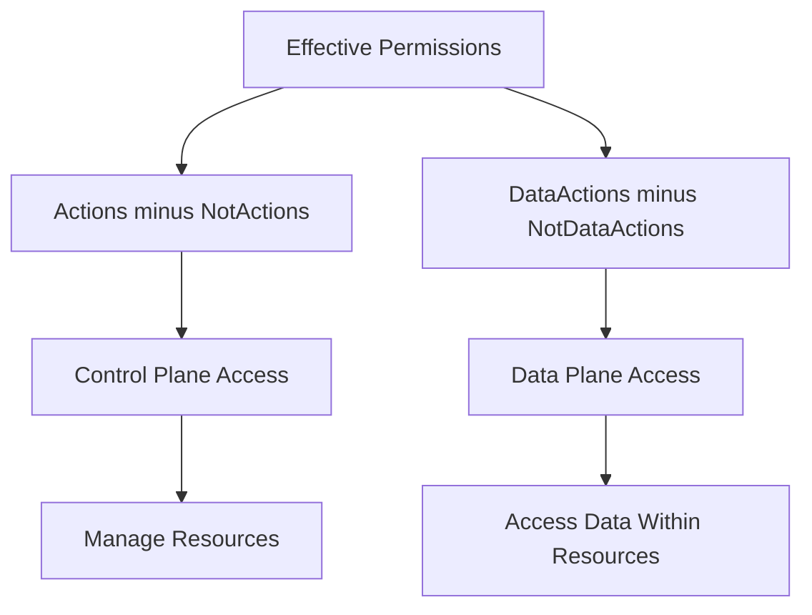

# How to Create and Manage Custom Roles in Azure RBAC Using the Azure Portal and PowerShell

Author: [nawazdhandala](https://www.github.com/nawazdhandala)

Tags: Azure, RBAC, Custom Roles, PowerShell, Access Control, Security, Azure Portal

Description: Learn how to create custom Azure RBAC roles when built-in roles do not fit your needs, using both the portal and PowerShell approaches.

---

Azure Role-Based Access Control (RBAC) comes with over 400 built-in roles, but sometimes none of them give you exactly the permissions you need. Maybe you want a role that allows someone to restart virtual machines but not delete them. Or you need an operator role that can read storage accounts and manage their keys but cannot create new ones. That is where custom roles come in.

In this post, I will show you how to create, test, and manage custom Azure RBAC roles using both the Azure portal and PowerShell.

## Understanding Azure RBAC Role Structure

Before creating custom roles, you need to understand how Azure RBAC roles are structured. Every role, whether built-in or custom, is a JSON definition with these key components:

- **Name**: A unique display name for the role
- **Description**: A human-readable explanation of what the role does
- **Actions**: The control plane operations the role can perform (e.g., Microsoft.Compute/virtualMachines/read)
- **NotActions**: Operations explicitly excluded from the allowed actions
- **DataActions**: Data plane operations the role can perform (e.g., Microsoft.Storage/storageAccounts/blobServices/containers/blobs/read)
- **NotDataActions**: Data plane operations explicitly excluded
- **AssignableScopes**: Where the role can be assigned (management group, subscription, or resource group)

The relationship between these components works as follows:



## Prerequisites

You will need:

- Azure subscription with Owner or User Access Administrator role
- Azure PowerShell module (Az module) installed for the PowerShell approach
- Understanding of the resource provider operations you need to include

## Step 1: Identify Required Permissions

Start by figuring out exactly what permissions your custom role needs. The easiest way is to start from a built-in role that is close to what you want and then modify it.

Let us say you need a "VM Operator" role that can start, stop, and restart virtual machines, read their properties, and view associated resources - but cannot create, delete, or resize VMs.

First, look at the built-in Virtual Machine Contributor role to understand what permissions are available:

```powershell
# Connect to your Azure account
Connect-AzAccount

# Get the definition of the Virtual Machine Contributor built-in role
# This shows all the Actions and DataActions it includes
$vmContributor = Get-AzRoleDefinition "Virtual Machine Contributor"
$vmContributor | ConvertTo-Json -Depth 10
```

This will show you the full list of actions. You can then pick only the ones you need.

You can also list all available resource provider operations for a specific provider:

```powershell
# List all operations available for the Microsoft.Compute resource provider
# This is useful for finding the exact action strings you need
Get-AzProviderOperation "Microsoft.Compute/*" |
    Select-Object Operation, Description |
    Format-Table -AutoSize
```

## Step 2: Create a Custom Role Using the Azure Portal

The Azure portal provides a graphical interface for building custom roles:

1. Navigate to the Azure portal at portal.azure.com.
2. Go to the subscription where you want the custom role to be available.
3. Click Access control (IAM) in the left menu.
4. Click Add, then Add custom role.
5. On the Basics tab, enter a name like "VM Operator" and a description.
6. Under Baseline permissions, you can choose to start from scratch, clone an existing role, or start from JSON.
7. Select Clone a role and search for Virtual Machine Contributor.

On the Permissions tab, remove the permissions you do not want:

- Remove Microsoft.Compute/virtualMachines/write (to prevent creating and modifying VMs)
- Remove Microsoft.Compute/virtualMachines/delete (to prevent deletion)
- Keep Microsoft.Compute/virtualMachines/start/action
- Keep Microsoft.Compute/virtualMachines/powerOff/action
- Keep Microsoft.Compute/virtualMachines/restart/action
- Keep Microsoft.Compute/virtualMachines/read

On the Assignable scopes tab, specify where this role can be used. You can scope it to a subscription or specific resource groups.

Review your changes and click Create.

## Step 3: Create a Custom Role Using PowerShell

For repeatable, version-controlled role definitions, PowerShell is the better approach. Here is how to create the same VM Operator role:

```powershell
# Define the custom role as a PSRoleDefinition object
$role = [Microsoft.Azure.Commands.Resources.Models.Authorization.PSRoleDefinition]::new()

# Set the basic properties
$role.Name = "VM Operator"
$role.Description = "Can start, stop, restart, and read virtual machines but cannot create, delete, or resize them."
$role.IsCustom = $true

# Define the allowed actions (control plane operations)
$role.Actions = @(
    "Microsoft.Compute/virtualMachines/read",
    "Microsoft.Compute/virtualMachines/start/action",
    "Microsoft.Compute/virtualMachines/powerOff/action",
    "Microsoft.Compute/virtualMachines/restart/action",
    "Microsoft.Compute/virtualMachines/deallocate/action",
    "Microsoft.Compute/virtualMachines/instanceView/read",
    "Microsoft.Compute/virtualMachines/vmSizes/read",
    # Allow reading related resources for context
    "Microsoft.Network/networkInterfaces/read",
    "Microsoft.Network/publicIPAddresses/read",
    "Microsoft.Network/virtualNetworks/read",
    "Microsoft.Network/networkSecurityGroups/read",
    "Microsoft.Resources/subscriptions/resourceGroups/read",
    # Allow viewing metrics and diagnostics
    "Microsoft.Insights/alertRules/*",
    "Microsoft.Insights/diagnosticSettings/read",
    "Microsoft.Insights/metrics/read"
)

# No need for NotActions in this case since we are building from a whitelist
$role.NotActions = @()

# No data plane actions needed
$role.DataActions = @()
$role.NotDataActions = @()

# Set the assignable scopes - use your subscription ID
$role.AssignableScopes = @(
    "/subscriptions/YOUR_SUBSCRIPTION_ID"
)

# Create the custom role
New-AzRoleDefinition -Role $role

Write-Host "Custom role 'VM Operator' created successfully."
```

## Step 4: Create a Custom Role from a JSON File

You can also define the role in a JSON file, which is ideal for storing in source control:

```json
{
    "Name": "VM Operator",
    "Description": "Can start, stop, restart, and read virtual machines but cannot create, delete, or resize them.",
    "IsCustom": true,
    "Actions": [
        "Microsoft.Compute/virtualMachines/read",
        "Microsoft.Compute/virtualMachines/start/action",
        "Microsoft.Compute/virtualMachines/powerOff/action",
        "Microsoft.Compute/virtualMachines/restart/action",
        "Microsoft.Compute/virtualMachines/deallocate/action",
        "Microsoft.Compute/virtualMachines/instanceView/read",
        "Microsoft.Network/networkInterfaces/read",
        "Microsoft.Network/publicIPAddresses/read",
        "Microsoft.Resources/subscriptions/resourceGroups/read",
        "Microsoft.Insights/metrics/read"
    ],
    "NotActions": [],
    "DataActions": [],
    "NotDataActions": [],
    "AssignableScopes": [
        "/subscriptions/YOUR_SUBSCRIPTION_ID"
    ]
}
```

Then create it with PowerShell:

```powershell
# Create the custom role from a JSON definition file
# The JSON file should be in the current directory or specify the full path
New-AzRoleDefinition -InputFile "vm-operator-role.json"
```

## Step 5: Assign the Custom Role

Once the role exists, you can assign it like any built-in role:

```powershell
# Assign the custom role to a user at a resource group scope
# This gives them VM Operator permissions only within this resource group
New-AzRoleAssignment `
    -SignInName "operator@contoso.com" `
    -RoleDefinitionName "VM Operator" `
    -ResourceGroupName "production-vms"

# Or assign to a group (recommended for easier management)
New-AzRoleAssignment `
    -ObjectId "GROUP_OBJECT_ID" `
    -RoleDefinitionName "VM Operator" `
    -ResourceGroupName "production-vms"
```

## Step 6: Update an Existing Custom Role

As your needs evolve, you may need to update your custom role. Here is how to add a new permission:

```powershell
# Get the current role definition
$role = Get-AzRoleDefinition "VM Operator"

# Add a new action - for example, allow the operator to redeploy VMs
$role.Actions.Add("Microsoft.Compute/virtualMachines/redeploy/action")

# Apply the update
Set-AzRoleDefinition -Role $role

Write-Host "Custom role 'VM Operator' updated with redeploy permission."
```

## Step 7: Delete a Custom Role

Before you can delete a custom role, you must remove all role assignments that use it:

```powershell
# Find all assignments using the custom role
$assignments = Get-AzRoleAssignment -RoleDefinitionName "VM Operator"
Write-Host "Found $($assignments.Count) assignments to remove."

# Remove each assignment
foreach ($assignment in $assignments) {
    Remove-AzRoleAssignment -ObjectId $assignment.ObjectId `
        -RoleDefinitionName "VM Operator" `
        -Scope $assignment.Scope
}

# Now delete the role definition
Remove-AzRoleDefinition -Name "VM Operator" -Force
Write-Host "Custom role deleted."
```

## Limitations and Best Practices

Custom roles in Azure have several limitations you should be aware of:

- Each tenant can have a maximum of 5000 custom roles.
- Custom roles can take up to a few minutes to propagate after creation or update.
- You cannot use wildcard patterns in AssignableScopes.
- Custom roles can only be assigned within their defined assignable scopes.

For best practices:

- Start with the least privilege principle. Give the role only the permissions it absolutely needs.
- Use descriptive names and detailed descriptions so other administrators understand what the role is for.
- Store role definitions in source control and deploy them through infrastructure-as-code pipelines.
- Regularly audit custom roles to make sure they are still needed and not overly permissive.
- Prefer using NotActions when you want to grant broad access with specific exclusions, rather than listing every individual action.

## Real-World Example: Database Reader with No PII Access

Here is a more complex custom role that allows reading from Azure SQL databases but blocks access to columns containing personally identifiable information through data masking:

```powershell
$role = [Microsoft.Azure.Commands.Resources.Models.Authorization.PSRoleDefinition]::new()
$role.Name = "SQL Data Reader - No PII"
$role.Description = "Can read SQL databases and execute queries but cannot unmask dynamic data masking columns."
$role.IsCustom = $true

$role.Actions = @(
    "Microsoft.Sql/servers/read",
    "Microsoft.Sql/servers/databases/read",
    "Microsoft.Sql/servers/databases/schemas/read",
    "Microsoft.Sql/servers/databases/schemas/tables/read",
    "Microsoft.Sql/servers/databases/schemas/tables/columns/read"
)

# Explicitly deny the ability to unmask data
$role.NotActions = @(
    "Microsoft.Sql/servers/databases/dataMaskingPolicies/*"
)

$role.AssignableScopes = @("/subscriptions/YOUR_SUBSCRIPTION_ID")

New-AzRoleDefinition -Role $role
```

## Conclusion

Custom Azure RBAC roles fill the gap when built-in roles are either too permissive or too restrictive. Whether you use the portal for quick one-off roles or PowerShell and JSON for production-grade definitions, the key is to follow the principle of least privilege and keep your role definitions under version control. Start from a built-in role that is close to what you need, trim the permissions down to what is actually required, and test thoroughly before assigning the role to production users.
