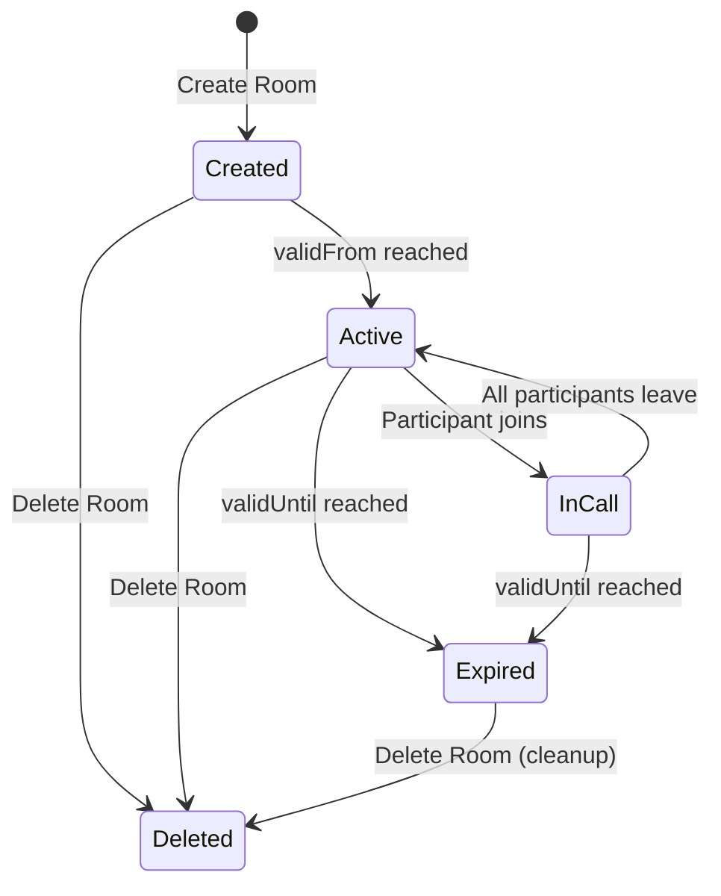

# How to Create and Manage Virtual Rooms for Controlled Calling in Azure Communication Services

Author: [nawazdhandala](https://www.github.com/nawazdhandala)

Tags: Azure Communication Services, Rooms API, Video Calling, Virtual Rooms, Access Control, Meeting Management, Cloud Communication

Description: Learn how to create and manage virtual rooms in Azure Communication Services for controlled calling experiences with participant roles and scheduled meetings.

---

Not every calling scenario should be an open free-for-all. Medical consultations need strict access control. Online classes need a presenter who can share content while students observe. Webinars need a speaker who can broadcast while attendees can only listen. Azure Communication Services Rooms API gives you a way to create virtual rooms with scheduled time windows, participant rosters, and role-based permissions. Instead of ad-hoc calls where anyone with a link can join, rooms let you define exactly who can participate and what they can do.

This guide covers creating rooms, managing participants and roles, joining room calls, and building common controlled-calling scenarios.

## What is a Room

A Room in ACS is a container for a scheduled calling experience. It has:

- **A time window** - Valid from and valid until timestamps. The room only accepts calls during this window.
- **A participant list** - Pre-defined list of users who are allowed to join.
- **Roles** - Each participant is assigned a role (Presenter, Attendee, or Consumer) that determines their capabilities.

| Role | Can Speak | Can Share Screen | Can See Video | Can Send Video |
|---|---|---|---|---|
| Presenter | Yes | Yes | Yes | Yes |
| Attendee | Yes | No | Yes | Yes |
| Consumer | No | No | Yes | No |

This role model maps naturally to scenarios like:

- **Telehealth** - Doctor (Presenter) and Patient (Attendee) in a private consultation
- **Online class** - Instructor (Presenter), students (Attendee), and observers (Consumer)
- **Webinar** - Speaker (Presenter), panelists (Attendee), and audience (Consumer)
- **Interview** - Interviewer (Presenter) and candidate (Attendee)

## Step 1: Create a Room

Rooms are created and managed through the Rooms SDK or REST API.

```bash
# Install the Rooms SDK
npm install @azure/communication-rooms
```

```javascript
// create-room.js - Create a virtual room with participants
const { RoomsClient } = require('@azure/communication-rooms');
const { CommunicationIdentityClient } = require('@azure/communication-identity');

const connectionString = 'endpoint=https://my-acs-resource.communication.azure.com/;accesskey=...';

const roomsClient = new RoomsClient(connectionString);
const identityClient = new CommunicationIdentityClient(connectionString);

async function createRoom() {
    // Create participant identities
    const doctorIdentity = await identityClient.createUser();
    const patientIdentity = await identityClient.createUser();

    console.log('Doctor ID:', doctorIdentity.communicationUserId);
    console.log('Patient ID:', patientIdentity.communicationUserId);

    // Define the room with a 1-hour time window starting now
    const now = new Date();
    const oneHourLater = new Date(now.getTime() + 60 * 60 * 1000);

    // Create the room with participants and their roles
    const room = await roomsClient.createRoom({
        validFrom: now,
        validUntil: oneHourLater,
        participants: [
            {
                id: { communicationUserId: doctorIdentity.communicationUserId },
                role: 'Presenter'  // Doctor has full control
            },
            {
                id: { communicationUserId: patientIdentity.communicationUserId },
                role: 'Attendee'   // Patient can speak and be seen
            }
        ]
    });

    console.log('Room created:');
    console.log(`  Room ID: ${room.id}`);
    console.log(`  Valid from: ${room.validFrom}`);
    console.log(`  Valid until: ${room.validUntil}`);
    console.log(`  Created: ${room.createdAt}`);

    return {
        roomId: room.id,
        doctorId: doctorIdentity.communicationUserId,
        patientId: patientIdentity.communicationUserId
    };
}

createRoom().then(console.log);
```

## Step 2: Manage Room Participants

After creating a room, you can add, remove, or update participants and their roles.

```javascript
// manage-participants.js - Update room participants
async function addParticipant(roomId, userId, role) {
    // Add a new participant to an existing room
    await roomsClient.addOrUpdateParticipants(roomId, [
        {
            id: { communicationUserId: userId },
            role: role
        }
    ]);

    console.log(`Added ${userId} as ${role} to room ${roomId}`);
}

async function changeRole(roomId, userId, newRole) {
    // Update a participant's role
    await roomsClient.addOrUpdateParticipants(roomId, [
        {
            id: { communicationUserId: userId },
            role: newRole
        }
    ]);

    console.log(`Changed ${userId} role to ${newRole} in room ${roomId}`);
}

async function removeParticipant(roomId, userId) {
    // Remove a participant from the room
    await roomsClient.removeParticipants(roomId, [
        { communicationUserId: userId }
    ]);

    console.log(`Removed ${userId} from room ${roomId}`);
}

async function listParticipants(roomId) {
    // List all participants in a room
    const participants = [];
    const iterator = roomsClient.listParticipants(roomId);

    for await (const participant of iterator) {
        participants.push({
            id: participant.id.communicationUserId,
            role: participant.role
        });
    }

    return participants;
}
```

## Step 3: Update Room Properties

Extend or modify the room's time window.

```javascript
async function extendRoom(roomId, additionalMinutes) {
    // Get the current room
    const room = await roomsClient.getRoom(roomId);

    // Extend the valid-until time
    const newValidUntil = new Date(room.validUntil.getTime() + additionalMinutes * 60 * 1000);

    const updatedRoom = await roomsClient.updateRoom(roomId, {
        validUntil: newValidUntil
    });

    console.log(`Room ${roomId} extended to ${updatedRoom.validUntil}`);
    return updatedRoom;
}

async function deleteRoom(roomId) {
    // Delete a room when it is no longer needed
    await roomsClient.deleteRoom(roomId);
    console.log(`Room ${roomId} deleted`);
}
```

## Step 4: Join a Room Call from the Client

The client-side code uses the Calling SDK to join a room call. The key difference from a regular call is that you join using the room ID instead of calling a specific user.

```javascript
// join-room-call.js - Client-side room call joining
const { CallClient, LocalVideoStream } = require('@azure/communication-calling');
const { AzureCommunicationTokenCredential } = require('@azure/communication-common');

let callAgent;
let currentCall;

async function joinRoomCall(token, displayName, roomId, withVideo = true) {
    const callClient = new CallClient();
    const tokenCredential = new AzureCommunicationTokenCredential(token);

    // Create the call agent
    callAgent = await callClient.createCallAgent(tokenCredential, {
        displayName: displayName
    });

    // Get device manager for camera access
    const deviceManager = await callClient.getDeviceManager();
    await deviceManager.askDevicePermission({ audio: true, video: true });

    // Build call options
    const callOptions = {
        audioOptions: { muted: false }
    };

    if (withVideo) {
        const cameras = await deviceManager.getCameras();
        if (cameras.length > 0) {
            const localVideoStream = new LocalVideoStream(cameras[0]);
            callOptions.videoOptions = {
                localVideoStreams: [localVideoStream]
            };
        }
    }

    // Join the room call using the room ID
    // This is the key difference from regular calls
    const roomCallLocator = { roomId: roomId };
    currentCall = callAgent.join(roomCallLocator, callOptions);

    console.log(`Joined room ${roomId}. Call state: ${currentCall.state}`);

    // Set up event handlers
    currentCall.on('stateChanged', function () {
        console.log('Call state:', currentCall.state);

        if (currentCall.state === 'Connected') {
            console.log('Connected to room call');
        }

        if (currentCall.state === 'Disconnected') {
            const reason = currentCall.callEndReason;
            console.log(`Call ended. Code: ${reason?.code}, Subcode: ${reason?.subCode}`);

            // Common end reasons for rooms:
            // 403 - Not authorized (not a room participant)
            // 404 - Room not found
            // 410 - Room expired (outside valid time window)
        }
    });

    // Handle remote participants
    currentCall.on('remoteParticipantsUpdated', function (event) {
        event.added.forEach(function (p) {
            console.log(`${p.displayName} joined (role determined by room config)`);
        });
        event.removed.forEach(function (p) {
            console.log(`${p.displayName} left`);
        });
    });

    return currentCall;
}
```

## Building a Telehealth Scenario

Here is a complete example of building a telehealth consultation room.

```javascript
// telehealth-room.js - Complete telehealth room management
const { RoomsClient } = require('@azure/communication-rooms');
const { CommunicationIdentityClient } = require('@azure/communication-identity');

const connectionString = 'endpoint=https://my-acs-resource.communication.azure.com/;accesskey=...';
const roomsClient = new RoomsClient(connectionString);
const identityClient = new CommunicationIdentityClient(connectionString);

async function scheduleConsultation(doctorAcsId, patientAcsId, scheduledTime, durationMinutes) {
    // Create a room for the scheduled consultation
    const validFrom = new Date(scheduledTime);
    // Add a 15-minute buffer before and after the scheduled time
    validFrom.setMinutes(validFrom.getMinutes() - 15);

    const validUntil = new Date(scheduledTime);
    validUntil.setMinutes(validUntil.getMinutes() + durationMinutes + 15);

    const room = await roomsClient.createRoom({
        validFrom: validFrom,
        validUntil: validUntil,
        participants: [
            {
                id: { communicationUserId: doctorAcsId },
                role: 'Presenter'
            },
            {
                id: { communicationUserId: patientAcsId },
                role: 'Attendee'
            }
        ]
    });

    return {
        roomId: room.id,
        validFrom: room.validFrom,
        validUntil: room.validUntil
    };
}

async function addNurseToConsultation(roomId, nurseAcsId) {
    // Add a nurse as an attendee
    await roomsClient.addOrUpdateParticipants(roomId, [
        {
            id: { communicationUserId: nurseAcsId },
            role: 'Attendee'
        }
    ]);
}

async function addObserverToConsultation(roomId, observerAcsId) {
    // Add a medical student as an observer (consumer role - can watch but not interact)
    await roomsClient.addOrUpdateParticipants(roomId, [
        {
            id: { communicationUserId: observerAcsId },
            role: 'Consumer'
        }
    ]);
}
```

## Room Lifecycle

Here is how a typical room flows from creation to completion.



## Room Management with Python

```python
# room_management.py - Room operations with the Python SDK
from azure.communication.rooms import RoomsClient, RoomParticipant, ParticipantRole
from azure.communication.identity import CommunicationIdentityClient
from datetime import datetime, timedelta, timezone

connection_string = "endpoint=https://my-acs-resource.communication.azure.com/;accesskey=..."
rooms_client = RoomsClient.from_connection_string(connection_string)
identity_client = CommunicationIdentityClient.from_connection_string(connection_string)

def create_classroom(instructor_id: str, student_ids: list, duration_hours: int = 2) -> dict:
    """Create a virtual classroom with an instructor and students."""
    now = datetime.now(timezone.utc)
    valid_until = now + timedelta(hours=duration_hours)

    # Build the participant list
    participants = [
        RoomParticipant(
            communication_identifier={"communication_user_id": instructor_id},
            role=ParticipantRole.PRESENTER
        )
    ]

    for student_id in student_ids:
        participants.append(
            RoomParticipant(
                communication_identifier={"communication_user_id": student_id},
                role=ParticipantRole.ATTENDEE
            )
        )

    room = rooms_client.create_room(
        valid_from=now,
        valid_until=valid_until,
        participants=participants
    )

    return {
        "room_id": room.id,
        "valid_from": str(room.valid_from),
        "valid_until": str(room.valid_until),
        "participant_count": len(participants)
    }

def list_active_rooms() -> list:
    """List all rooms that are currently active."""
    rooms = []
    for room in rooms_client.list_rooms():
        now = datetime.now(timezone.utc)
        if room.valid_from <= now <= room.valid_until:
            rooms.append({
                "room_id": room.id,
                "valid_until": str(room.valid_until),
                "created_at": str(room.created_at)
            })
    return rooms
```

## Access Control Enforcement

The role-based access control is enforced at the platform level, not in your client code. This means:

- A Consumer cannot unmute themselves or turn on their camera, even if the client code tries to do so. The ACS service rejects the operation.
- An Attendee cannot share their screen, even if the UI has a screen-share button. The SDK call will fail.
- Only participants listed in the room can join. Anyone else gets a 403 error.

This is important because it means security does not depend on your frontend code being correct. Even a modified client cannot bypass the room's access controls.

## Cleanup and Cost Management

Rooms persist until they are explicitly deleted or they expire and are automatically cleaned up. To keep costs predictable:

- Delete rooms after consultations or meetings end
- Set reasonable `validUntil` times - do not create rooms that are valid for weeks
- Monitor your room count and clean up stale rooms periodically

```javascript
// Cleanup script - delete expired rooms
async function cleanupExpiredRooms() {
    const rooms = roomsClient.listRooms();
    const now = new Date();

    for await (const room of rooms) {
        if (room.validUntil < now) {
            await roomsClient.deleteRoom(room.id);
            console.log(`Deleted expired room: ${room.id}`);
        }
    }
}
```

## Wrapping Up

The Rooms API in Azure Communication Services fills a gap that the basic calling SDK does not address - controlled, scheduled calling experiences with role-based permissions. Instead of building access control logic in your application layer (which can be bypassed), rooms enforce permissions at the platform level. This makes them ideal for scenarios where access control is not just a feature but a requirement, like healthcare, education, and professional services. Create rooms ahead of time for scheduled events, manage participants through the API, and let the platform handle the permission enforcement during calls.
