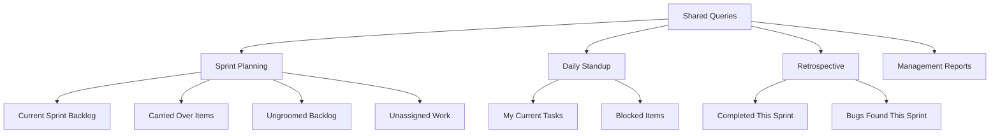

# How to Create and Manage Work Item Queries in Azure Boards for Sprint Planning

Author: [nawazdhandala](https://www.github.com/nawazdhandala)

Tags: Azure Boards, Work Items, Sprint Planning, Agile, Azure DevOps, Project Management, Queries

Description: Learn how to create effective work item queries in Azure Boards to streamline sprint planning and track team progress.

---

Sprint planning is only as good as the information you have going into it. If you cannot quickly answer questions like "What is still in the backlog?", "What did we carry over from last sprint?", or "What bugs are blocking us?", you will spend half your planning session hunting for work items instead of planning work.

Azure Boards queries are the tool that answers these questions. They let you build saved searches that pull up exactly the work items you need, organized the way you need them. In this post, I will walk through creating queries for common sprint planning scenarios, organizing them for your team, and using some lesser-known features that make a real difference.

## Understanding Query Types

Azure Boards supports three types of queries:

**Flat list queries** return a simple list of work items matching your criteria. This is the most common type and works for most sprint planning needs.

**Tree of work items** returns work items with their parent-child relationships. This is useful when you want to see user stories with their child tasks.

**Work items and direct links** returns work items along with their linked items. This helps when you need to see relationships like "blocks/blocked by" or "related to."

For sprint planning, you will mostly use flat lists and trees.

## Creating a Basic Sprint Backlog Query

Let us start with the most fundamental query: "What work items are in the current sprint?"

Navigate to **Boards > Queries** in your Azure DevOps project. Click **New query**. Set up the following clauses:

- `Iteration Path` equals `@CurrentIteration`
- `Work Item Type` is in `User Story, Bug, Task`
- `State` is not in `Done, Closed, Removed`

The `@CurrentIteration` macro is powerful because it automatically adjusts as your sprint changes. You do not have to update the query when a new sprint starts.

Here is what the query definition looks like in the web UI.

```
AND Iteration Path = @CurrentIteration
AND Work Item Type In (User Story, Bug, Task)
AND State Not In (Done, Closed, Removed)
```

## Queries for Sprint Planning Scenarios

### Unfinished Work from Last Sprint

This is the first question in every sprint planning meeting. What did we not finish?

```
AND Iteration Path = @CurrentIteration - 1
AND State Not In (Done, Closed, Removed)
AND Work Item Type In (User Story, Bug)
```

The `@CurrentIteration - 1` macro gives you the previous sprint. Items showing up here are candidates for carrying over into the new sprint.

### High-Priority Bugs

Bugs that need attention before you plan new features.

```
AND Work Item Type = Bug
AND State Not In (Done, Closed, Resolved)
AND Priority <= 2
AND Iteration Path Under @CurrentIteration
```

### Unassigned Work in Current Sprint

Work that is in the sprint but nobody has picked up yet.

```
AND Iteration Path = @CurrentIteration
AND Assigned To = ""
AND State Not In (Done, Closed)
AND Work Item Type In (User Story, Task)
```

### Items Ready for Review

Work items that are in a state where they need someone to review or test them.

```
AND Iteration Path = @CurrentIteration
AND State = "Ready for Review"
AND Work Item Type In (User Story, Bug)
```

## Using Tree Queries for Sprint Structure

A flat list of work items does not show how work is organized. Tree queries fix that by displaying the parent-child hierarchy.

Create a tree query with the following setup:

Top-level filter:
- `Work Item Type` = User Story
- `Iteration Path` = @CurrentIteration
- `State` is not in `Removed`

Child filter (linked items):
- `Work Item Type` = Task
- `Link Type` = Child

This gives you a view like:

```
User Story: Implement user login
  Task: Create login API endpoint
  Task: Build login form component
  Task: Write integration tests
User Story: Add password reset
  Task: Design reset flow
  Task: Implement email service
```

This view is invaluable during sprint planning because it shows which stories have been broken down into tasks and which still need decomposition.

## Organizing Queries into Folders

As you create more queries, organization becomes important. Azure Boards lets you create query folders under two root nodes:

- **My Queries**: Private to you
- **Shared Queries**: Visible to the whole team

For sprint planning, I recommend this folder structure under Shared Queries:



## Using Query Parameters with the @Me Macro

The `@Me` macro makes queries personal. Instead of hardcoding a name, use `@Me` in the Assigned To field, and the query automatically shows items assigned to whoever is viewing it.

This is perfect for a "My Sprint Work" query:

```
AND Iteration Path = @CurrentIteration
AND Assigned To = @Me
AND State Not In (Done, Closed, Removed)
```

Share this query with the team, and everyone sees their own work when they run it. No need for separate queries per person.

## Query-Based Charts for Planning

Queries are not just for lists. You can create charts from any query and pin them to dashboards.

After saving a query, click the **Charts** tab. You can create:

- **Pie charts**: Show distribution of work by state, priority, or assignee
- **Bar charts**: Compare story points across team members
- **Trend charts**: Track how work items change over time (useful for burndown)
- **Stacked bar charts**: Show work items by type and state simultaneously

For sprint planning, I always create these charts:

1. **Work by State** (pie chart): Quick visual of how much work is done vs. in progress vs. not started
2. **Work by Assignee** (bar chart): Check if work is evenly distributed across the team
3. **Story Points by Priority** (stacked bar): See if you are spending sprint capacity on the right things

## Using WIQL for Advanced Queries

If the visual query builder cannot express what you need, you can write queries directly in WIQL (Work Item Query Language). WIQL is a SQL-like language specific to Azure DevOps.

The following WIQL query finds all user stories that were completed in the last two sprints and have linked bugs.

```sql
SELECT [System.Id], [System.Title], [System.State]
FROM WorkItemLinks
WHERE
  (Source.[System.WorkItemType] = 'User Story'
  AND Source.[System.State] = 'Closed'
  AND Source.[System.IterationPath] UNDER 'MyProject\Sprint 10')
  AND ([System.Links.LinkType] = 'Related')
  AND (Target.[System.WorkItemType] = 'Bug')
ORDER BY [System.Id]
MODE (MayContain)
```

You can enter WIQL mode by toggling the query editor. It is not something you need every day, but it is invaluable for complex reporting queries.

## Automating Sprint Planning with Queries

You can also access queries through the Azure DevOps REST API, which opens up automation possibilities.

This script queries for unfinished items from the last sprint and outputs them as a table you can discuss in planning.

```bash
# Fetch unfinished items from the previous sprint using the REST API
curl -s -u ":$PAT" \
  "https://dev.azure.com/myorg/myproject/_apis/wit/wiql?api-version=7.0" \
  -H "Content-Type: application/json" \
  -d '{
    "query": "SELECT [System.Id], [System.Title], [System.State], [Microsoft.VSTS.Scheduling.StoryPoints] FROM WorkItems WHERE [System.IterationPath] = @CurrentIteration - 1 AND [System.State] <> \"Done\" AND [System.WorkItemType] IN (\"User Story\", \"Bug\") ORDER BY [Microsoft.VSTS.Common.Priority]"
  }' | jq '.workItems[].id'
```

## Tips for Effective Sprint Planning Queries

**Keep queries focused.** Each query should answer one question. A query that tries to show everything ends up showing nothing useful.

**Name queries descriptively.** "Query 1" and "My Query" are not helpful. Use names like "Sprint - Carried Over Items" or "Bugs - High Priority Unassigned."

**Review and prune regularly.** Shared queries accumulate over time. Every few months, check which ones are actually being used and remove the rest.

**Use column options wisely.** You can customize which columns appear in query results. For sprint planning, include State, Assigned To, Story Points, Priority, and Tags. Remove columns like Created Date or Changed By that are not relevant during planning.

**Set up query-based alerts.** Azure DevOps can notify you when new items match a saved query. This is useful for queries like "Bugs assigned to me" or "High priority unassigned items."

## Wrapping Up

Work item queries are a foundational tool in Azure Boards that directly impact how effective your sprint planning is. The investment in setting up a good set of shared queries pays off every sprint. Start with the basics - current sprint backlog, carried over items, and unassigned work. Then add more specialized queries as your team's needs evolve. The queries you create today will save you 15-20 minutes of hunting in every planning session going forward.
