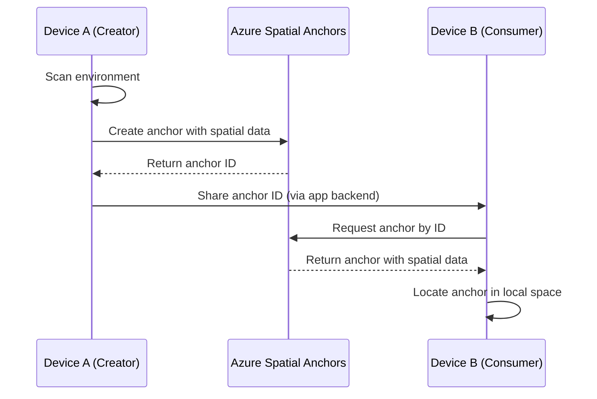

# How to Create and Persist Spatial Anchors Across Devices Using Azure Spatial Anchors SDK

Author: [nawazdhandala](https://www.github.com/nawazdhandala)

Tags: Azure, Spatial Anchors, Augmented Reality, Mixed Reality, HoloLens, Unity, Cross-Platform

Description: A practical guide to creating and persisting spatial anchors across devices using the Azure Spatial Anchors SDK for shared AR experiences.

---

Augmented reality gets genuinely useful when multiple people can see the same virtual content anchored to the same real-world location. Without a shared coordinate system, each device sees things in a different position. Azure Spatial Anchors solves this by letting you create persistent, cloud-backed anchors that any device can discover and align to.

This guide covers the full workflow: creating spatial anchors, persisting them to the cloud, and retrieving them on another device.

## What Azure Spatial Anchors Does

In a nutshell, Azure Spatial Anchors provides a cloud service that stores 3D spatial reference points along with environmental data (visual features of the surrounding area). When a new device scans the same area, the service matches the visual features and returns the precise location of the anchor in the device's coordinate system.

This enables scenarios like:

- Wayfinding in buildings where GPS does not work.
- Industrial maintenance instructions pinned to specific equipment.
- Multi-player AR games where all players see the same objects in the same location.
- Museum tours with information overlays anchored to exhibits.



## Prerequisites

- An Azure subscription with a Spatial Anchors account created.
- Unity 2020.3 or later with AR Foundation installed.
- The Azure Spatial Anchors SDK packages added to your Unity project.
- A physical AR-capable device (HoloLens 2, ARKit-compatible iPhone/iPad, or ARCore-compatible Android device).

## Step 1: Create an Azure Spatial Anchors Account

If you have not already created an account, use the Azure CLI.

```bash
# Create a Spatial Anchors account in your Azure subscription
az spatial-anchors-account create \
  --resource-group myResourceGroup \
  --name mySpatialAnchorsAccount \
  --location eastus2
```

After creation, retrieve the account ID and access key.

```bash
# Get the account ID and keys for your Spatial Anchors account
az spatial-anchors-account show \
  --resource-group myResourceGroup \
  --name mySpatialAnchorsAccount \
  --query "accountId" \
  --output tsv

az spatial-anchors-account key show \
  --resource-group myResourceGroup \
  --name mySpatialAnchorsAccount \
  --query "primaryKey" \
  --output tsv
```

Store these values securely - you will need them in your Unity project.

## Step 2: Set Up the Unity Project

Import the Azure Spatial Anchors SDK into your Unity project. Add the following packages through the Unity Package Manager or your NuGet configuration.

For a Unity project, you need these assemblies:

- `Microsoft.Azure.SpatialAnchors.Unity`
- `Microsoft.Azure.SpatialAnchors.Unity.Android` (for Android builds)
- `Microsoft.Azure.SpatialAnchors.Unity.iOS` (for iOS builds)
- `Microsoft.Azure.SpatialAnchors.Unity.Windows` (for HoloLens builds)

## Step 3: Initialize the Spatial Anchors Session

The first step in your application code is creating and configuring a `CloudSpatialAnchorSession`. This session manages the connection to the Azure service.

```csharp
// SpatialAnchorsManager.cs
// Manages the lifecycle of the Azure Spatial Anchors session
using Microsoft.Azure.SpatialAnchors;
using Microsoft.Azure.SpatialAnchors.Unity;
using UnityEngine;

public class SpatialAnchorsManager : MonoBehaviour
{
    private CloudSpatialAnchorSession cloudSession;

    // Replace with your actual account credentials
    private string accountId = "your-account-id";
    private string accountKey = "your-account-key";
    private string accountDomain = "your-account-domain.mixedreality.azure.com";

    void Start()
    {
        InitializeSession();
    }

    private void InitializeSession()
    {
        // Create the cloud session
        cloudSession = new CloudSpatialAnchorSession();

        // Configure the account credentials
        cloudSession.Configuration.AccountId = accountId;
        cloudSession.Configuration.AccountKey = accountKey;
        cloudSession.Configuration.AccountDomain = accountDomain;

        // Subscribe to session events for debugging and progress tracking
        cloudSession.SessionUpdated += OnSessionUpdated;
        cloudSession.AnchorLocated += OnAnchorLocated;
        cloudSession.LocateAnchorsCompleted += OnLocateAnchorsCompleted;
        cloudSession.Error += OnSessionError;

        // Start the session
        cloudSession.Start();
        Debug.Log("Spatial Anchors session started.");
    }

    // Called periodically with session status updates
    private void OnSessionUpdated(object sender, SessionUpdatedEventArgs args)
    {
        // The ReadyForCreateProgress indicates how much spatial data has been collected
        float progress = args.Status.ReadyForCreateProgress;
        Debug.Log($"Session progress: {progress:P0} ready for anchor creation");
    }

    private void OnSessionError(object sender, SessionErrorEventArgs args)
    {
        Debug.LogError($"Spatial Anchors error: {args.ErrorMessage}");
    }

    void OnDestroy()
    {
        // Clean up the session when the object is destroyed
        if (cloudSession != null)
        {
            cloudSession.Stop();
            cloudSession.Dispose();
        }
    }
}
```

In production, use Azure AD authentication instead of embedding account keys directly. The account key approach works for prototyping but is not secure for released applications.

## Step 4: Create and Save a Spatial Anchor

To create an anchor, the user first places a virtual object in the scene at a physical location. The device needs to collect enough spatial data from the surrounding environment before the anchor can be saved.

```csharp
// Creates a spatial anchor at the specified position and saves it to the cloud
public async void CreateAndSaveAnchor(GameObject anchorObject)
{
    // Create a native anchor on the AR platform (ARKit, ARCore, or WMR)
    anchorObject.AddARAnchor();

    // Create a cloud spatial anchor wrapping the native anchor
    CloudSpatialAnchor cloudAnchor = new CloudSpatialAnchor();
    cloudAnchor.LocalAnchor = anchorObject.FindNativeAnchor().GetPointer();

    // Set optional properties for the anchor
    cloudAnchor.AppProperties["label"] = "Meeting Room Entrance";
    cloudAnchor.AppProperties["createdBy"] = "user-123";

    // Set the anchor's expiration (anchors expire automatically after this date)
    cloudAnchor.Expiration = DateTimeOffset.Now.AddDays(30);

    // Wait until enough spatial data has been collected
    while (!cloudSession.GetSessionStatusAsync().Result.RecommendedForCreateProgress >= 1.0f)
    {
        // Encourage the user to look around to capture more spatial data
        Debug.Log("Please look around to capture more of the environment...");
        await Task.Delay(500);
    }

    try
    {
        // Save the anchor to the cloud
        await cloudSession.CreateAnchorAsync(cloudAnchor);

        // The identifier is what you share with other devices
        string anchorId = cloudAnchor.Identifier;
        Debug.Log($"Anchor saved successfully. ID: {anchorId}");

        // Store the anchor ID in your own backend for other devices to retrieve
        await SaveAnchorIdToBackend(anchorId);
    }
    catch (Exception ex)
    {
        Debug.LogError($"Failed to save anchor: {ex.Message}");
    }
}
```

The `ReadyForCreateProgress` property is critical. It tells you how much environmental data the device has collected. The service needs a good scan of the area around the anchor to reliably relocate it later. Encourage users to slowly look around the anchor point, covering at least 180 degrees.

## Step 5: Retrieve an Anchor on Another Device

On a second device, you use the anchor ID to search for and locate the anchor in the physical environment.

```csharp
// Locates a previously saved anchor using its cloud identifier
public void LocateAnchor(string anchorId)
{
    // Create criteria specifying which anchors to search for
    AnchorLocateCriteria criteria = new AnchorLocateCriteria();
    criteria.Identifiers = new string[] { anchorId };

    // Optionally set the locate strategy for better performance
    criteria.Strategy = LocateStrategy.AnyStrategy;

    // Start watching for the anchor - the device will scan the environment
    // and the AnchorLocated event fires when found
    cloudSession.CreateWatcher(criteria);
    Debug.Log($"Searching for anchor: {anchorId}");
}

// Called when an anchor is found in the environment
private void OnAnchorLocated(object sender, AnchorLocatedEventArgs args)
{
    switch (args.Status)
    {
        case LocateAnchorStatus.Located:
            // The anchor was found - create a visual representation at its location
            CloudSpatialAnchor foundAnchor = args.Anchor;

            // This must run on the Unity main thread
            UnityDispatcher.InvokeOnAppThread(() =>
            {
                // Create a game object at the anchor's position
                Pose anchorPose = foundAnchor.GetPose();
                GameObject anchorVisual = Instantiate(
                    anchorPrefab,
                    anchorPose.position,
                    anchorPose.rotation
                );

                // Read custom properties
                string label = foundAnchor.AppProperties["label"];
                Debug.Log($"Found anchor: {label} at {anchorPose.position}");
            });
            break;

        case LocateAnchorStatus.AlreadyTracked:
            Debug.Log("Anchor is already being tracked.");
            break;

        case LocateAnchorStatus.NotLocatedAnchorDoesNotExist:
            Debug.LogWarning("Anchor does not exist in the cloud.");
            break;

        case LocateAnchorStatus.NotLocated:
            Debug.Log("Anchor not found yet. Keep scanning the environment.");
            break;
    }
}

private void OnLocateAnchorsCompleted(object sender, LocateAnchorsCompletedEventArgs args)
{
    Debug.Log("Anchor search completed.");
}
```

The locating process requires the device to scan the same physical area where the anchor was created. The user should be in approximately the same location and look around to give the service enough visual data to match.

## Step 6: Use Nearby Anchors for Discovery

Instead of sharing individual anchor IDs, you can use the "nearby" feature to discover anchors that are close to a known anchor. This is useful for wayfinding scenarios.

```csharp
// Find anchors near a known anchor
public void FindNearbyAnchors(CloudSpatialAnchor knownAnchor)
{
    // Create criteria to search within 10 meters of the known anchor
    NearAnchorCriteria nearCriteria = new NearAnchorCriteria();
    nearCriteria.SourceAnchor = knownAnchor;
    nearCriteria.DistanceInMeters = 10;
    nearCriteria.MaxResultCount = 20;

    AnchorLocateCriteria criteria = new AnchorLocateCriteria();
    criteria.NearAnchor = nearCriteria;

    // Start searching for nearby anchors
    cloudSession.CreateWatcher(criteria);
    Debug.Log("Searching for nearby anchors...");
}
```

This creates a chain where discovering one anchor leads to finding others nearby, enabling step-by-step navigation through a building.

## Step 7: Delete Expired or Unused Anchors

Anchors have a configurable expiration, but you can also delete them manually.

```csharp
// Delete an anchor from the cloud service
public async void DeleteAnchor(CloudSpatialAnchor anchor)
{
    try
    {
        await cloudSession.DeleteAnchorAsync(anchor);
        Debug.Log("Anchor deleted successfully.");
    }
    catch (Exception ex)
    {
        Debug.LogError($"Failed to delete anchor: {ex.Message}");
    }
}
```

## Best Practices for Reliable Anchors

**Lighting matters**: Spatial anchors rely on visual features. Poor lighting or featureless surfaces (like plain white walls) reduce anchor reliability. Place anchors near visually distinct areas.

**Scan thoroughly**: The more spatial data collected during creation, the more reliable the anchor will be for relocalization. Aim for at least 180 degrees of coverage.

**Handle failures gracefully**: Anchor localization can fail if the physical environment has changed significantly (furniture moved, lighting conditions different). Your app should handle the `NotLocated` status and prompt users to try different positions.

**Set reasonable expirations**: Anchors that are no longer needed consume storage. Set expiration dates appropriate for your use case, and clean up anchors when they are no longer relevant.

## Summary

Azure Spatial Anchors bridges the gap between individual device AR and shared spatial experiences. By creating cloud-backed anchors that persist beyond a single session, you enable scenarios where multiple devices understand the same physical space. The workflow is create, persist, share the ID, and locate on another device. The SDK handles the complex computer vision work, leaving you to focus on the experience you want to build.
