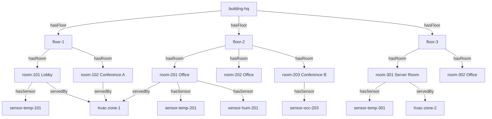

# How to Create and Query the Twin Graph in Azure Digital Twins Using the REST API

Author: [nawazdhandala](https://www.github.com/nawazdhandala)

Tags: Azure Digital Twins, Twin Graph, REST API, Graph Queries, Digital Twin SDK, IoT Modeling, Kusto Query

Description: A practical guide to creating digital twins, establishing relationships, and querying the twin graph in Azure Digital Twins using the REST API and SDKs.

---

Once you have defined your DTDL models in Azure Digital Twins, the next step is to create actual twin instances and connect them with relationships to form a graph. This graph is the core of your digital twin solution - it represents the real-world environment you are modeling. You can create and query this graph using the REST API, the Azure CLI, or the language SDKs for .NET, Java, JavaScript, and Python.

This guide walks through creating twins, setting up relationships, and writing queries against the twin graph using both the REST API directly and the Python SDK.

## Prerequisites

You need an Azure Digital Twins instance with models already uploaded. If you are following along from our DTDL ontology guide, you should have Space, Building, Floor, Room, Sensor, and HVACZone models already in place.

You also need:

- An Azure AD token with the "Azure Digital Twins Data Owner" role
- The instance hostname (e.g., `my-digital-twins.api.eus.digitaltwins.azure.net`)
- Python 3.8+ with the `azure-digitaltwins-core` and `azure-identity` packages installed

```bash
pip install azure-digitaltwins-core azure-identity
```

## Creating Digital Twins via REST API

The REST API for creating a twin uses a PUT request to the `/digitaltwins/{twin-id}` endpoint. Here is a curl example that creates a building twin.

```bash
# Set your variables
ADT_HOST="https://my-digital-twins.api.eus.digitaltwins.azure.net"
TOKEN=$(az account get-access-token --resource https://digitaltwins.azure.net --query accessToken -o tsv)

# Create a Building twin
curl -X PUT "${ADT_HOST}/digitaltwins/building-hq?api-version=2022-05-31" \
  -H "Authorization: Bearer ${TOKEN}" \
  -H "Content-Type: application/json" \
  -d '{
    "$metadata": {
      "$model": "dtmi:com:example:Building;1"
    },
    "name": "Headquarters",
    "area": 5000.0,
    "status": "active",
    "address": {
      "street": "123 Main St",
      "city": "Seattle",
      "state": "WA",
      "zip": "98101",
      "country": "US"
    },
    "yearBuilt": 2020
  }'
```

The twin ID (`building-hq`) is a unique identifier you choose. The `$metadata.$model` field references the DTDL model this twin conforms to. All properties defined in the model can be set in the request body.

## Creating Twins Programmatically with the Python SDK

For building out a full environment, the SDK is more practical than raw REST calls.

```python
# create_twins.py - Build out the twin graph for a building
from azure.digitaltwins.core import DigitalTwinsClient
from azure.identity import DefaultAzureCredential

# Connect to Azure Digital Twins
credential = DefaultAzureCredential()
client = DigitalTwinsClient(
    "https://my-digital-twins.api.eus.digitaltwins.azure.net",
    credential
)

# Helper function to create a twin
def create_twin(twin_id, model_id, properties):
    twin_data = {
        "$metadata": {"$model": model_id},
        **properties
    }
    result = client.upsert_digital_twin(twin_id, twin_data)
    print(f"Created twin: {twin_id} (model: {model_id})")
    return result

# Create the building
create_twin("building-hq", "dtmi:com:example:Building;1", {
    "name": "Headquarters",
    "area": 5000.0,
    "status": "active",
    "address": {
        "street": "123 Main St",
        "city": "Seattle",
        "state": "WA",
        "zip": "98101",
        "country": "US"
    },
    "yearBuilt": 2020
})

# Create floors
for floor_num in range(1, 4):
    create_twin(f"floor-{floor_num}", "dtmi:com:example:Floor;1", {
        "name": f"Floor {floor_num}",
        "area": 1600.0,
        "status": "active",
        "floorNumber": floor_num
    })

# Create rooms on each floor
rooms = [
    {"id": "room-101", "floor": 1, "name": "Lobby", "type": "lobby", "capacity": 50},
    {"id": "room-102", "floor": 1, "name": "Conference A", "type": "conference", "capacity": 12},
    {"id": "room-201", "floor": 2, "name": "Office 201", "type": "office", "capacity": 4},
    {"id": "room-202", "floor": 2, "name": "Office 202", "type": "office", "capacity": 4},
    {"id": "room-203", "floor": 2, "name": "Conference B", "type": "conference", "capacity": 20},
    {"id": "room-301", "floor": 3, "name": "Server Room", "type": "server_room", "capacity": 2},
    {"id": "room-302", "floor": 3, "name": "Office 302", "type": "office", "capacity": 6},
]

for room in rooms:
    create_twin(room["id"], "dtmi:com:example:Room;1", {
        "name": room["name"],
        "area": 40.0,
        "status": "active",
        "capacity": room["capacity"],
        "roomType": room["type"]
    })

# Create sensors
sensors = [
    {"id": "sensor-temp-101", "room": "room-101", "type": "temperature"},
    {"id": "sensor-temp-201", "room": "room-201", "type": "temperature"},
    {"id": "sensor-hum-201", "room": "room-201", "type": "humidity"},
    {"id": "sensor-occ-203", "room": "room-203", "type": "occupancy"},
    {"id": "sensor-temp-301", "room": "room-301", "type": "temperature"},
]

for sensor in sensors:
    create_twin(sensor["id"], "dtmi:com:example:Sensor;1", {
        "manufacturer": "SensorCo",
        "model": "ENV-200",
        "sensorType": sensor["type"],
        "installDate": "2025-06-15"
    })

# Create HVAC zones
create_twin("hvac-zone-1", "dtmi:com:example:HVACZone;1", {
    "setpointTemperature": 22.0,
    "mode": "auto"
})

create_twin("hvac-zone-2", "dtmi:com:example:HVACZone;1", {
    "setpointTemperature": 18.0,
    "mode": "cooling"
})

print("All twins created successfully")
```

## Creating Relationships

Relationships connect twins to form the graph. Each relationship has a source twin, a target twin, a name (defined in the DTDL model), and an optional set of properties.

```python
# create_relationships.py - Connect twins with relationships
from azure.digitaltwins.core import DigitalTwinsClient
from azure.identity import DefaultAzureCredential

credential = DefaultAzureCredential()
client = DigitalTwinsClient(
    "https://my-digital-twins.api.eus.digitaltwins.azure.net",
    credential
)

def create_relationship(source_id, target_id, rel_name, rel_id=None):
    """Create a relationship between two twins."""
    if rel_id is None:
        rel_id = f"{source_id}-{rel_name}-{target_id}"

    relationship = {
        "$relationshipId": rel_id,
        "$sourceId": source_id,
        "$targetId": target_id,
        "$relationshipName": rel_name
    }

    result = client.upsert_relationship(source_id, rel_id, relationship)
    print(f"Created relationship: {source_id} --{rel_name}--> {target_id}")
    return result

# Building has floors
for floor_num in range(1, 4):
    create_relationship("building-hq", f"floor-{floor_num}", "hasFloor")

# Floors have rooms
floor_room_map = {
    "floor-1": ["room-101", "room-102"],
    "floor-2": ["room-201", "room-202", "room-203"],
    "floor-3": ["room-301", "room-302"]
}

for floor_id, room_ids in floor_room_map.items():
    for room_id in room_ids:
        create_relationship(floor_id, room_id, "hasRoom")

# Rooms have sensors
room_sensor_map = {
    "room-101": ["sensor-temp-101"],
    "room-201": ["sensor-temp-201", "sensor-hum-201"],
    "room-203": ["sensor-occ-203"],
    "room-301": ["sensor-temp-301"]
}

for room_id, sensor_ids in room_sensor_map.items():
    for sensor_id in sensor_ids:
        create_relationship(room_id, sensor_id, "hasSensor")

# Rooms served by HVAC zones
create_relationship("room-101", "hvac-zone-1", "servedBy")
create_relationship("room-102", "hvac-zone-1", "servedBy")
create_relationship("room-201", "hvac-zone-1", "servedBy")
create_relationship("room-301", "hvac-zone-2", "servedBy")

print("All relationships created successfully")
```

## The Resulting Twin Graph

Here is what our graph looks like after creating all twins and relationships.



## Querying the Twin Graph

Azure Digital Twins uses a SQL-like query language for graph traversal. Here are practical queries for common scenarios.

**Get all twins of a specific type:**

```sql
SELECT * FROM digitaltwins WHERE IS_OF_MODEL('dtmi:com:example:Room;1')
```

**Find rooms on a specific floor:**

```sql
SELECT room
FROM digitaltwins floor
JOIN room RELATED floor.hasRoom
WHERE floor.$dtId = 'floor-2'
```

**Traverse multiple levels - find all sensors in a building:**

```sql
SELECT sensor
FROM digitaltwins building
JOIN floor RELATED building.hasFloor
JOIN room RELATED floor.hasRoom
JOIN sensor RELATED room.hasSensor
WHERE building.$dtId = 'building-hq'
```

**Find rooms served by a specific HVAC zone:**

```sql
SELECT room
FROM digitaltwins room
JOIN hvac RELATED room.servedBy
WHERE hvac.$dtId = 'hvac-zone-1'
```

**Query with property filters - find conference rooms with capacity over 15:**

```sql
SELECT room
FROM digitaltwins room
WHERE IS_OF_MODEL('dtmi:com:example:Room;1')
AND room.roomType = 'conference'
AND room.capacity > 15
```

## Running Queries with the SDK

```python
# query_twins.py - Run queries against the twin graph
from azure.digitaltwins.core import DigitalTwinsClient
from azure.identity import DefaultAzureCredential

credential = DefaultAzureCredential()
client = DigitalTwinsClient(
    "https://my-digital-twins.api.eus.digitaltwins.azure.net",
    credential
)

# Find all rooms with their floor information
query = """
    SELECT room, floor
    FROM digitaltwins floor
    JOIN room RELATED floor.hasRoom
    WHERE IS_OF_MODEL(floor, 'dtmi:com:example:Floor;1')
"""

results = client.query_twins(query)
for twin in results:
    room = twin.get("room", {})
    floor = twin.get("floor", {})
    print(f"Room: {room.get('name')} (Floor {floor.get('floorNumber')})")

# Count sensors by type
query = """
    SELECT sensor.sensorType, COUNT()
    FROM digitaltwins sensor
    WHERE IS_OF_MODEL('dtmi:com:example:Sensor;1')
"""

results = client.query_twins(query)
for result in results:
    print(result)
```

## Updating Twin Properties

Update a twin's properties using a JSON Patch operation.

```python
# Update the temperature reading for a room
from azure.digitaltwins.core import DigitalTwinsClient
from azure.identity import DefaultAzureCredential

credential = DefaultAzureCredential()
client = DigitalTwinsClient(
    "https://my-digital-twins.api.eus.digitaltwins.azure.net",
    credential
)

# Update using JSON Patch format
patch = [
    {
        "op": "replace",
        "path": "/temperature",
        "value": 24.5
    }
]

client.update_digital_twin("room-201", patch)
print("Twin updated successfully")
```

## REST API for Queries

You can also run queries directly through the REST API if you prefer.

```bash
# Run a query via REST API
curl -X POST "${ADT_HOST}/query?api-version=2022-05-31" \
  -H "Authorization: Bearer ${TOKEN}" \
  -H "Content-Type: application/json" \
  -d '{
    "query": "SELECT * FROM digitaltwins WHERE IS_OF_MODEL('\''dtmi:com:example:Room;1'\'')"
  }'
```

## Pagination for Large Result Sets

Queries that return many results are paginated. The response includes a `continuationToken` that you pass in subsequent requests.

```python
# Handle paginated query results
query = "SELECT * FROM digitaltwins"
query_result = client.query_twins(query)

# The SDK handles pagination automatically when you iterate
count = 0
for twin in query_result:
    count += 1
    print(f"Twin: {twin['$dtId']} (model: {twin['$metadata']['$model']})")

print(f"Total twins: {count}")
```

## Wrapping Up

The twin graph in Azure Digital Twins gives you a queryable, live model of your physical environment. Creating twins and relationships is straightforward through both the REST API and language SDKs. The query language supports graph traversal, property filtering, and aggregations that let you answer questions about your environment programmatically. Start by modeling your physical space hierarchy, then add equipment and sensor twins, connect everything with relationships, and build queries that power your application logic and dashboards.
