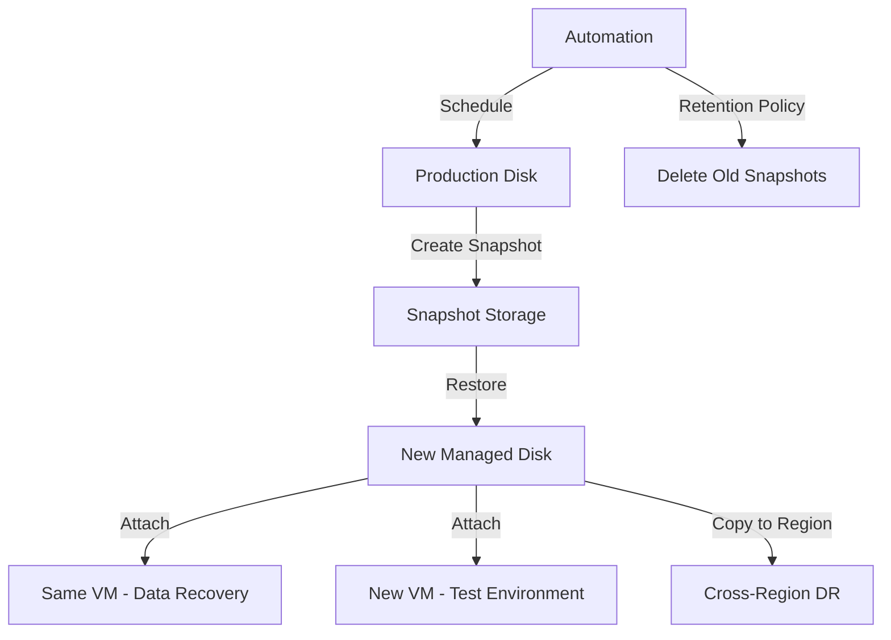

# How to Create and Restore Snapshots of Azure Managed Disks

Author: [nawazdhandala](https://www.github.com/nawazdhandala)

Tags: Azure, Managed Disks, Snapshots, Backup, Disaster Recovery, Cloud Infrastructure

Description: Learn how to create point-in-time snapshots of Azure Managed Disks and restore them to recover data or create new disks from backup copies.

---

Snapshots are point-in-time copies of Azure Managed Disks. They capture the complete state of a disk at the moment the snapshot is taken, and they are stored independently from the source disk. You can use snapshots for backups, disaster recovery, creating test environments from production data, or migrating disks between regions. In this post, I will cover how to create snapshots, manage them, and restore disks from them.

## How Snapshots Work

When you create a snapshot, Azure captures a read-only copy of the disk at that instant. The first snapshot captures all the data on the disk. Subsequent snapshots are incremental - they only store the changes since the last snapshot. This makes them storage-efficient.

A few important details:

- Snapshots are stored in Azure-managed storage, separate from the source disk.
- You can create a snapshot of a disk that is attached to a running VM. Azure will capture a crash-consistent snapshot.
- For application-consistent snapshots, you should flush buffers or stop the application before snapshotting.
- Snapshots persist even after the source disk is deleted.

## Creating a Snapshot with Azure CLI

```bash
# Create a snapshot of an existing managed disk
az snapshot create \
  --name data-disk-snap-20260216 \
  --resource-group my-resource-group \
  --source data-disk-01 \
  --location eastus \
  --sku Standard_LRS

# Verify the snapshot
az snapshot show \
  --name data-disk-snap-20260216 \
  --resource-group my-resource-group \
  --query "{name:name, diskSize:diskSizeGb, timeCreated:timeCreated, provisioningState:provisioningState}" \
  --output table
```

You can choose between Standard_LRS (locally redundant) and Standard_ZRS (zone-redundant) storage for snapshots. Standard_LRS is cheaper and sufficient for most backup scenarios.

## Creating a Snapshot of a Running VM's OS Disk

```bash
# Get the OS disk name from the VM
OS_DISK=$(az vm show \
  --name my-vm \
  --resource-group my-resource-group \
  --query "storageProfile.osDisk.name" -o tsv)

# Create a snapshot of the OS disk
az snapshot create \
  --name os-disk-snap-20260216 \
  --resource-group my-resource-group \
  --source "$OS_DISK" \
  --sku Standard_LRS

echo "Snapshot created from OS disk: $OS_DISK"
```

## Creating Snapshots with PowerShell

```powershell
# Get the managed disk
$disk = Get-AzDisk -ResourceGroupName "my-resource-group" -DiskName "data-disk-01"

# Create a snapshot configuration
$snapshotConfig = New-AzSnapshotConfig `
  -SourceUri $disk.Id `
  -Location "eastus" `
  -CreateOption "Copy" `
  -SkuName "Standard_LRS"

# Create the snapshot
$snapshot = New-AzSnapshot `
  -ResourceGroupName "my-resource-group" `
  -SnapshotName "data-disk-snap-20260216" `
  -Snapshot $snapshotConfig

Write-Output "Snapshot created: $($snapshot.Name), Size: $($snapshot.DiskSizeGB) GB"
```

## Creating Incremental Snapshots

Incremental snapshots only store the delta since the last snapshot, reducing storage costs significantly for large disks.

```bash
# Create an incremental snapshot
az snapshot create \
  --name data-disk-incremental-snap \
  --resource-group my-resource-group \
  --source data-disk-01 \
  --incremental true \
  --sku Standard_LRS

# Check if a snapshot is incremental
az snapshot show \
  --name data-disk-incremental-snap \
  --resource-group my-resource-group \
  --query "{name:name, incremental:incremental, uniqueId:uniqueId}"
```

## Listing and Managing Snapshots

```bash
# List all snapshots in a resource group
az snapshot list \
  --resource-group my-resource-group \
  --query "[].{Name:name, Size:diskSizeGb, Created:timeCreated, Source:creationData.sourceResourceId}" \
  --output table

# List snapshots for a specific disk
DISK_ID=$(az disk show --name data-disk-01 --resource-group my-resource-group --query id -o tsv)
az snapshot list \
  --resource-group my-resource-group \
  --query "[?creationData.sourceResourceId=='$DISK_ID'].{Name:name, Created:timeCreated}" \
  --output table
```

## Restoring a Disk from a Snapshot

The most common use case is creating a new managed disk from a snapshot.

```bash
# Create a new managed disk from a snapshot
az disk create \
  --name restored-data-disk \
  --resource-group my-resource-group \
  --source data-disk-snap-20260216 \
  --sku Premium_LRS \
  --size-gb 128

# Attach the restored disk to a VM
az vm disk attach \
  --vm-name my-vm \
  --resource-group my-resource-group \
  --name restored-data-disk \
  --lun 1
```

## Restoring an OS Disk

To restore a VM's OS disk from a snapshot, you create a new disk and swap it.

```bash
# Step 1: Create a new OS disk from the snapshot
az disk create \
  --name restored-os-disk \
  --resource-group my-resource-group \
  --source os-disk-snap-20260216 \
  --sku Premium_LRS

# Step 2: Stop the VM
az vm deallocate \
  --name my-vm \
  --resource-group my-resource-group

# Step 3: Swap the OS disk
RESTORED_DISK_ID=$(az disk show --name restored-os-disk --resource-group my-resource-group --query id -o tsv)

az vm update \
  --name my-vm \
  --resource-group my-resource-group \
  --os-disk "$RESTORED_DISK_ID"

# Step 4: Start the VM
az vm start \
  --name my-vm \
  --resource-group my-resource-group

echo "VM restored with snapshot OS disk"
```

## Creating a VM from a Snapshot

You can create an entirely new VM from a snapshot.

```bash
# Create an OS disk from the snapshot
az disk create \
  --name new-vm-os-disk \
  --resource-group my-resource-group \
  --source os-disk-snap-20260216 \
  --sku Premium_LRS

# Create a new VM using the restored disk
az vm create \
  --name restored-vm \
  --resource-group my-resource-group \
  --attach-os-disk new-vm-os-disk \
  --os-type Linux \
  --size Standard_DS2_v2
```

## Restoring with PowerShell

```powershell
# Get the snapshot
$snapshot = Get-AzSnapshot -ResourceGroupName "my-resource-group" -SnapshotName "data-disk-snap-20260216"

# Create a disk configuration from the snapshot
$diskConfig = New-AzDiskConfig `
  -Location "eastus" `
  -SourceResourceId $snapshot.Id `
  -CreateOption "Copy" `
  -SkuName "Premium_LRS"

# Create the restored disk
$restoredDisk = New-AzDisk `
  -ResourceGroupName "my-resource-group" `
  -DiskName "restored-disk" `
  -Disk $diskConfig

# Attach to VM
$vm = Get-AzVM -ResourceGroupName "my-resource-group" -Name "my-vm"
$vm = Add-AzVMDataDisk -VM $vm -Name "restored-disk" -ManagedDiskId $restoredDisk.Id -Lun 1 -CreateOption "Attach"
Update-AzVM -ResourceGroupName "my-resource-group" -VM $vm
```

## Snapshot Automation Script

Here is a script that creates daily snapshots with retention management.

```python
from azure.identity import DefaultAzureCredential
from azure.mgmt.compute import ComputeManagementClient
from datetime import datetime, timedelta

credential = DefaultAzureCredential()
subscription_id = "your-subscription-id"
compute_client = ComputeManagementClient(credential, subscription_id)

resource_group = "my-resource-group"
disk_name = "data-disk-01"
retention_days = 30

def create_daily_snapshot():
    """
    Create a daily snapshot with a date-stamped name.
    Uses incremental snapshots to minimize storage costs.
    """
    today = datetime.utcnow().strftime("%Y%m%d")
    snapshot_name = f"{disk_name}-snap-{today}"

    # Get the source disk
    disk = compute_client.disks.get(resource_group, disk_name)

    # Create the snapshot
    snapshot = compute_client.snapshots.begin_create_or_update(
        resource_group,
        snapshot_name,
        {
            "location": disk.location,
            "creation_data": {
                "create_option": "Copy",
                "source_resource_id": disk.id
            },
            "incremental": True,
            "sku": {"name": "Standard_LRS"}
        }
    ).result()

    print(f"Created snapshot: {snapshot.name}")
    return snapshot

def cleanup_old_snapshots():
    """
    Delete snapshots older than the retention period.
    """
    cutoff = datetime.utcnow() - timedelta(days=retention_days)

    snapshots = compute_client.snapshots.list_by_resource_group(resource_group)
    for snap in snapshots:
        if snap.name.startswith(f"{disk_name}-snap-") and snap.time_created < cutoff:
            compute_client.snapshots.begin_delete(resource_group, snap.name).result()
            print(f"Deleted old snapshot: {snap.name}")

# Run the daily snapshot workflow
create_daily_snapshot()
cleanup_old_snapshots()
```

## Snapshot Workflow



## Cross-Region Snapshot Copy

To use snapshots for disaster recovery across regions, you need to copy them.

```bash
# Get the snapshot ID
SNAP_ID=$(az snapshot show --name data-disk-snap-20260216 --resource-group my-resource-group --query id -o tsv)

# Create a copy in another region
az snapshot create \
  --name data-disk-snap-dr-copy \
  --resource-group my-dr-resource-group \
  --location westus2 \
  --source "$SNAP_ID" \
  --sku Standard_LRS
```

## Best Practices

Use incremental snapshots for regular backups. They are dramatically cheaper for large disks with small daily changes.

Tag your snapshots with metadata like the source VM name, disk name, and creation date. This makes it much easier to find the right snapshot when you need to restore.

Automate snapshot creation and cleanup. Manual snapshots get forgotten. Use Azure Automation, Logic Apps, or a simple cron job to create snapshots on a schedule and delete old ones.

For application-consistent snapshots of databases, flush the database buffers before creating the snapshot. Some databases have specific commands for this (like CHECKPOINT in SQL Server).

Test your restore process regularly. A backup you have never tested is not a backup. Restore a snapshot to a test VM at least quarterly to verify your process works.

Snapshots are one of the most practical tools in your Azure infrastructure toolkit. They are fast to create, efficient to store, and straightforward to restore from. Build snapshot automation into your operations workflow and you will have reliable point-in-time recovery whenever you need it.
