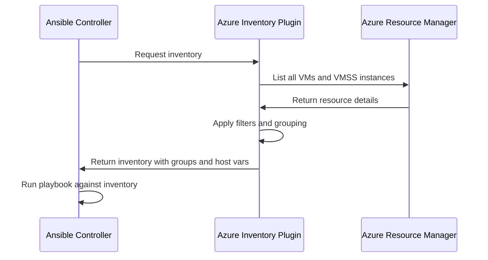

# How to Create Ansible Dynamic Inventory for Azure Virtual Machine Scale Sets

Author: [nawazdhandala](https://www.github.com/nawazdhandala)

Tags: Ansible, Azure, Dynamic Inventory, VMSS, Configuration Management, Automation, DevOps

Description: Build Ansible dynamic inventory configurations that automatically discover and group Azure Virtual Machine Scale Set instances for configuration management.

---

When you manage Azure Virtual Machine Scale Sets (VMSS) with Ansible, you face a fundamental challenge: the instances are ephemeral. They scale up and down, get reimaged, and their IP addresses change. A static inventory file with hardcoded IPs does not work. You need dynamic inventory that queries Azure in real time to discover the current set of instances.

Ansible's Azure dynamic inventory plugin solves this by querying the Azure Resource Manager API to discover VMs and VMSS instances, then organizing them into groups based on tags, resource groups, locations, and other properties. This post covers how to set it up, configure grouping strategies, and handle the specific quirks of VMSS instances.

## How Dynamic Inventory Works

When you run an Ansible playbook, the inventory plugin runs first. It makes API calls to Azure, discovers all the VMs and VMSS instances that match your filters, and builds an inventory with groups and host variables. Your playbook then runs against this dynamically generated inventory.



## Prerequisites

You need the Azure Ansible collection and proper authentication configured.

```bash
# Install the Azure Ansible collection
ansible-galaxy collection install azure.azcollection

# Install the required Python dependencies
pip install azure-identity azure-mgmt-compute azure-mgmt-network azure-mgmt-resource

# Verify the installation
ansible-inventory --list -i azure_rm.yml
```

## Authentication Setup

The inventory plugin supports several authentication methods. The recommended approach for CI/CD is a service principal; for local development, the Azure CLI is easiest.

```bash
# Option 1: Azure CLI authentication (development)
az login

# Option 2: Service principal via environment variables (CI/CD)
export AZURE_SUBSCRIPTION_ID="your-subscription-id"
export AZURE_CLIENT_ID="your-client-id"
export AZURE_SECRET="your-client-secret"
export AZURE_TENANT="your-tenant-id"
```

## Basic Dynamic Inventory Configuration

Create an inventory file with the `.azure_rm.yml` or `.azure_rm.yaml` extension. Ansible recognizes this extension and uses the Azure RM inventory plugin automatically.

```yaml
# azure_rm.yml - Azure dynamic inventory configuration
plugin: azure.azcollection.azure_rm

# Authentication (if not using environment variables)
# auth_source: auto  # auto, cli, msi, env, credential_file

# Only include resources from specific subscriptions
include_vm_resource_groups:
  - "rg-webservers-prod"
  - "rg-webservers-staging"

# Include VMSS instances (this is key for scale sets)
include_vmss_resource_groups:
  - "rg-webservers-prod"
  - "rg-webservers-staging"

# Use private IP addresses for SSH connections
# (use 'public_ipv4_address' for public IPs)
hostvar_expressions:
  ansible_host: private_ipv4_addresses[0] | default("")

# Connection settings
conditional_groups:
  # Group Linux VMs together
  linux: "'linux' in image.offer | lower or 'ubuntu' in image.offer | lower or 'rhel' in image.offer | lower"
  # Group Windows VMs together
  windows: "'windows' in image.offer | lower"

# Group VMs by their tags
keyed_groups:
  # Group by the 'Environment' tag value
  - prefix: env
    key: tags.Environment | default('untagged')
  # Group by the 'Role' tag value
  - prefix: role
    key: tags.Role | default('unknown')
  # Group by resource group name
  - prefix: rg
    key: resource_group
  # Group by Azure region
  - prefix: location
    key: location
  # Group by VMSS name (important for scale sets)
  - prefix: vmss
    key: virtual_machine_scale_set | default('')
    separator: "_"
```

## Advanced VMSS Filtering

For large environments, you want to filter the inventory to only include the VMSS instances you care about. Here is a more targeted configuration.

```yaml
# vmss-inventory.azure_rm.yml - VMSS-specific inventory
plugin: azure.azcollection.azure_rm

# Only look in specific resource groups
include_vmss_resource_groups:
  - "rg-app-prod"
  - "rg-app-staging"

# Exclude regular VMs, only include VMSS instances
include_vm_resource_groups: []

# Filter by tags - only include instances with the 'Managed' tag
# This uses Jinja2 templating
plain_host_names: true

# Use private IPs since VMSS instances typically do not have public IPs
hostvar_expressions:
  ansible_host: private_ipv4_addresses[0] | default("")
  ansible_user: "'azureuser'"
  ansible_ssh_private_key_file: "'~/.ssh/azure_vmss_key'"

# Custom host naming - use VMSS name + instance ID instead of the Azure resource name
# This makes it easier to identify which scale set an instance belongs to
hostvar_expressions:
  ansible_host: private_ipv4_addresses[0] | default("")

# Create useful groups
keyed_groups:
  # Group by VMSS name - each scale set becomes a group
  - prefix: vmss
    key: virtual_machine_scale_set | default('standalone')

  # Group by environment tag
  - prefix: env
    key: tags.Environment | default('unknown')

  # Group by application tier tag
  - prefix: tier
    key: tags.Tier | default('unknown')

# Exclude instances that are deallocated or stopping
exclude_host_filters:
  - powerstate != 'running'
```

## Testing the Inventory

Before using the inventory in a playbook, verify it discovers the right hosts.

```bash
# List all discovered hosts and groups
ansible-inventory -i vmss-inventory.azure_rm.yml --list

# Show the inventory in a graph format
ansible-inventory -i vmss-inventory.azure_rm.yml --graph

# Ping all hosts in a specific VMSS group
ansible -i vmss-inventory.azure_rm.yml vmss_web_servers -m ping

# Show variables for a specific host
ansible-inventory -i vmss-inventory.azure_rm.yml --host vmss_web_000001
```

Sample output from `--graph`:

```
@all:
  |--@env_prod:
  |  |--vmss-web-prod_000000
  |  |--vmss-web-prod_000001
  |  |--vmss-web-prod_000002
  |--@env_staging:
  |  |--vmss-web-staging_000000
  |  |--vmss-web-staging_000001
  |--@vmss_web_servers_prod:
  |  |--vmss-web-prod_000000
  |  |--vmss-web-prod_000001
  |  |--vmss-web-prod_000002
  |--@tier_web:
  |  |--vmss-web-prod_000000
  |  |--vmss-web-prod_000001
  |  |--vmss-web-prod_000002
  |  |--vmss-web-staging_000000
  |  |--vmss-web-staging_000001
```

## Writing Playbooks for VMSS

With dynamic inventory configured, write playbooks that target VMSS groups.

```yaml
# configure-web-servers.yml - Configure web tier VMSS instances
---
- name: Configure VMSS Web Server Instances
  hosts: vmss_web_servers_prod    # Target only the production web VMSS
  become: true
  serial: "30%"                   # Rolling update - 30% at a time

  vars:
    nginx_version: "1.24"
    app_port: 8080

  tasks:
    - name: Update apt cache
      apt:
        update_cache: yes
        cache_valid_time: 3600

    - name: Install nginx
      apt:
        name: "nginx={{ nginx_version }}*"
        state: present

    - name: Deploy nginx configuration
      template:
        src: templates/nginx.conf.j2
        dest: /etc/nginx/sites-available/default
        owner: root
        group: root
        mode: '0644'
      notify: Reload nginx

    - name: Ensure nginx is running
      service:
        name: nginx
        state: started
        enabled: true

    - name: Deploy application configuration
      template:
        src: templates/app-config.json.j2
        dest: /opt/app/config.json
        owner: appuser
        group: appuser
        mode: '0640'
      notify: Restart application

  handlers:
    - name: Reload nginx
      service:
        name: nginx
        state: reloaded

    - name: Restart application
      service:
        name: myapp
        state: restarted
```

The `serial: "30%"` setting is critical for VMSS. It ensures Ansible updates only 30% of the instances at a time, maintaining service availability during the rollout.

## Handling Scale Events

One challenge with VMSS is that new instances created by auto-scaling will not have your Ansible-applied configuration. There are two approaches to handle this:

**Approach 1: Custom Script Extension**

Configure the VMSS to run Ansible on boot using a custom script extension. This works as a pull model.

```bash
#!/bin/bash
# bootstrap.sh - Runs on each new VMSS instance
# Install Ansible
apt-get update && apt-get install -y ansible

# Pull the playbook from a git repository
git clone https://github.com/your-org/ansible-configs.git /opt/ansible
cd /opt/ansible

# Run the playbook locally
ansible-playbook -i localhost, -c local playbooks/web-server.yml
```

**Approach 2: Scheduled Ansible Runs**

Run Ansible on a schedule from a central controller to catch any new instances.

```yaml
# ansible-cron.yml - Run from a cron job every 15 minutes
---
- name: Ensure VMSS instances are configured
  hosts: vmss_web_servers_prod
  become: true

  tasks:
    - name: Check if configuration is applied
      stat:
        path: /opt/app/.configured
      register: config_check

    - name: Apply configuration if missing
      include_tasks: tasks/full-configuration.yml
      when: not config_check.stat.exists

    - name: Mark as configured
      file:
        path: /opt/app/.configured
        state: touch
      when: not config_check.stat.exists
```

## Multiple Inventory Sources

You can combine Azure dynamic inventory with static inventory files for resources not in Azure.

```ini
# inventory/
#   azure_rm.yml          <- Azure dynamic inventory
#   static_hosts.ini      <- Static inventory for on-premises servers
#   group_vars/
#     all.yml
#     env_prod.yml
#     vmss_web_servers.yml
```

Create group variables that apply to dynamically discovered groups.

```yaml
# inventory/group_vars/vmss_web_servers_prod.yml
# Variables applied to all instances in the production web VMSS
---
nginx_worker_processes: auto
nginx_worker_connections: 4096
app_log_level: warn
monitoring_enabled: true
newrelic_license_key: "{{ vault_newrelic_key }}"
```

Run Ansible with the inventory directory instead of a single file.

```bash
# Use the entire inventory directory
ansible-playbook -i inventory/ playbooks/configure-web-servers.yml

# Limit to a specific VMSS
ansible-playbook -i inventory/ playbooks/configure-web-servers.yml \
  --limit vmss_web_servers_prod
```

## Wrapping Up

Ansible dynamic inventory for Azure VMSS eliminates the maintenance burden of static inventory files in auto-scaling environments. The Azure RM inventory plugin discovers instances in real time, groups them by tags and resource properties, and provides the connection details your playbooks need. Combined with rolling updates via the `serial` directive and bootstrap scripts for new instances, you get a robust configuration management setup that keeps pace with your scale set's elasticity.
