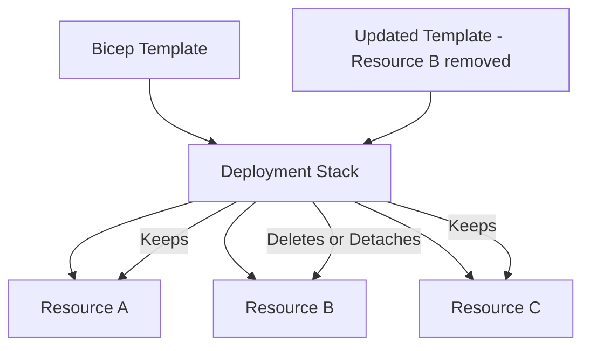

# How to Create Azure Bicep Deployment Stacks for Lifecycle Management of Resources

Author: [nawazdhandala](https://www.github.com/nawazdhandala)

Tags: Azure, Bicep, Deployment Stacks, Resource Management, Infrastructure as Code, Lifecycle Management, ARM

Description: Learn how to use Azure Bicep deployment stacks to manage resource lifecycles including creation, updates, and deletion of resources that are removed from templates.

---

One of the longest-standing complaints about Bicep and ARM template deployments has been the handling of removed resources. When you delete a resource from your template and redeploy, the resource stays in Azure. This is "incremental" deployment mode - it only adds and updates, never removes. Complete mode exists but it is dangerous and only works at the resource group level. Neither option gives you what you actually want: remove resources that are no longer in the template, leave everything else alone.

Azure Deployment Stacks solve this problem. They track which resources belong to a deployment and can automatically clean up resources that you remove from your templates. Think of it as bringing Terraform-like state management to Bicep.

## What Are Deployment Stacks?

A deployment stack is an Azure resource that manages a collection of other resources. When you deploy a template through a stack, Azure tracks which resources the stack owns. On subsequent deployments, if a resource is no longer in the template, the stack can detach it, delete it, or block its deletion based on your configuration.



Deployment stacks work at three scopes: resource group, subscription, and management group. This means you can manage resources across multiple resource groups from a single stack.

## Creating Your First Deployment Stack

Let me start with a simple example. Here is a Bicep template that creates a storage account and a virtual network:

```bicep
// main.bicep - Resources managed by a deployment stack

@description('Azure region for resources')
param location string = resourceGroup().location

@description('Environment name for naming convention')
param environment string = 'dev'

// Storage account for application data
resource storageAccount 'Microsoft.Storage/storageAccounts@2023-01-01' = {
  name: 'st${environment}${uniqueString(resourceGroup().id)}'
  location: location
  sku: {
    name: 'Standard_LRS'
  }
  kind: 'StorageV2'
  properties: {
    minimumTlsVersion: 'TLS1_2'
    allowBlobPublicAccess: false
    supportsHttpsTrafficOnly: true
  }
}

// Virtual network for workloads
resource vnet 'Microsoft.Network/virtualNetworks@2023-09-01' = {
  name: 'vnet-${environment}'
  location: location
  properties: {
    addressSpace: {
      addressPrefixes: [
        '10.0.0.0/16'
      ]
    }
    subnets: [
      {
        name: 'snet-app'
        properties: {
          addressPrefix: '10.0.1.0/24'
        }
      }
      {
        name: 'snet-data'
        properties: {
          addressPrefix: '10.0.2.0/24'
        }
      }
    ]
  }
}

// Log Analytics workspace for monitoring
resource logAnalytics 'Microsoft.OperationalInsights/workspaces@2022-10-01' = {
  name: 'law-${environment}'
  location: location
  properties: {
    sku: {
      name: 'PerGB2018'
    }
    retentionInDays: 30
  }
}

output storageAccountName string = storageAccount.name
output vnetName string = vnet.name
```

Deploy this through a deployment stack instead of a regular deployment:

```bash
# Create a deployment stack at the resource group scope
az stack group create \
  --name "myapp-stack" \
  --resource-group "rg-myapp-dev" \
  --template-file main.bicep \
  --parameters environment=dev \
  --deny-settings-mode "denyWriteAndDelete" \
  --action-on-unmanage "deleteResources" \
  --deny-settings-excluded-principals ""
```

Let me break down the important flags:

- `--deny-settings-mode`: Controls what operations are blocked on managed resources. "denyWriteAndDelete" prevents manual changes outside the stack.
- `--action-on-unmanage`: What happens when a resource is removed from the template. "deleteResources" deletes them, "detachResources" removes them from the stack but leaves them in Azure.
- `--deny-settings-excluded-principals`: Service principals or users exempt from deny settings (useful for emergency access).

## Managing Resource Lifecycle

Now here is where deployment stacks shine. Say you decide the Log Analytics workspace should move to a shared resource group. Remove it from the template:

```bicep
// main.bicep - Updated: Log Analytics workspace removed

@description('Azure region for resources')
param location string = resourceGroup().location

@description('Environment name for naming convention')
param environment string = 'dev'

// Storage account remains
resource storageAccount 'Microsoft.Storage/storageAccounts@2023-01-01' = {
  name: 'st${environment}${uniqueString(resourceGroup().id)}'
  location: location
  sku: {
    name: 'Standard_LRS'
  }
  kind: 'StorageV2'
  properties: {
    minimumTlsVersion: 'TLS1_2'
    allowBlobPublicAccess: false
    supportsHttpsTrafficOnly: true
  }
}

// Virtual network remains
resource vnet 'Microsoft.Network/virtualNetworks@2023-09-01' = {
  name: 'vnet-${environment}'
  location: location
  properties: {
    addressSpace: {
      addressPrefixes: [
        '10.0.0.0/16'
      ]
    }
    subnets: [
      {
        name: 'snet-app'
        properties: {
          addressPrefix: '10.0.1.0/24'
        }
      }
      {
        name: 'snet-data'
        properties: {
          addressPrefix: '10.0.2.0/24'
        }
      }
    ]
  }
}

output storageAccountName string = storageAccount.name
output vnetName string = vnet.name
```

Redeploy the stack:

```bash
# Update the stack - the removed Log Analytics workspace will be handled
# according to the action-on-unmanage setting
az stack group create \
  --name "myapp-stack" \
  --resource-group "rg-myapp-dev" \
  --template-file main.bicep \
  --parameters environment=dev \
  --deny-settings-mode "denyWriteAndDelete" \
  --action-on-unmanage "deleteResources"
```

Because we set `--action-on-unmanage` to "deleteResources", the Log Analytics workspace gets deleted. If we had used "detachResources", it would remain in Azure but no longer be tracked by the stack.

## Subscription-Scoped Stacks

Deployment stacks at the subscription scope can manage resources across multiple resource groups:

```bicep
// subscription-stack.bicep - Manage resources across resource groups
targetScope = 'subscription'

param location string = 'eastus2'
param environment string = 'prod'

// Create resource groups
resource rgNetwork 'Microsoft.Resources/resourceGroups@2023-07-01' = {
  name: 'rg-network-${environment}'
  location: location
}

resource rgCompute 'Microsoft.Resources/resourceGroups@2023-07-01' = {
  name: 'rg-compute-${environment}'
  location: location
}

resource rgData 'Microsoft.Resources/resourceGroups@2023-07-01' = {
  name: 'rg-data-${environment}'
  location: location
}

// Deploy networking resources into the network resource group
module networking 'modules/networking.bicep' = {
  name: 'deploy-networking'
  scope: rgNetwork
  params: {
    location: location
    environment: environment
  }
}

// Deploy compute resources into the compute resource group
module compute 'modules/compute.bicep' = {
  name: 'deploy-compute'
  scope: rgCompute
  params: {
    location: location
    environment: environment
    subnetId: networking.outputs.appSubnetId
  }
}
```

Deploy the subscription-scoped stack:

```bash
# Create a subscription-level deployment stack
az stack sub create \
  --name "platform-stack-prod" \
  --location "eastus2" \
  --template-file subscription-stack.bicep \
  --parameters environment=prod \
  --deny-settings-mode "denyWriteAndDelete" \
  --action-on-unmanage "deleteAll" \
  --deny-settings-excluded-actions "Microsoft.Authorization/locks/delete"
```

The "deleteAll" option for `--action-on-unmanage` deletes both resources and resource groups that are removed from the template. Use this carefully.

## Deny Settings for Protection

Deny settings prevent manual changes to resources managed by the stack. This is powerful for enforcing that all changes go through the template:

```bash
# Strict deny - no manual modifications allowed
az stack group create \
  --name "myapp-stack" \
  --resource-group "rg-myapp-prod" \
  --template-file main.bicep \
  --deny-settings-mode "denyWriteAndDelete" \
  --deny-settings-excluded-principals "aaaaaaaa-bbbb-cccc-dddd-eeeeeeeeeeee" \
  --deny-settings-excluded-actions "Microsoft.Resources/tags/write"
```

The excluded principals and actions are important escape hatches:

- **Excluded principals**: Service accounts or break-glass identities that need to make emergency changes
- **Excluded actions**: Specific operations that should be allowed even with deny settings (like writing tags)

## Viewing Stack State

You can inspect what a stack manages:

```bash
# List all resources managed by a stack
az stack group show \
  --name "myapp-stack" \
  --resource-group "rg-myapp-dev" \
  --output table

# List all stacks in a resource group
az stack group list \
  --resource-group "rg-myapp-dev" \
  --output table

# Export the template from a stack
az stack group export \
  --name "myapp-stack" \
  --resource-group "rg-myapp-dev"
```

## CI/CD Integration

Here is a GitHub Actions workflow for deploying through stacks:

```yaml
# .github/workflows/deploy-stack.yml
name: Deploy Infrastructure Stack

on:
  push:
    branches: [main]
    paths:
      - 'infrastructure/**'

jobs:
  deploy:
    runs-on: ubuntu-latest
    environment: production

    steps:
      - uses: actions/checkout@v4

      - uses: azure/login@v2
        with:
          creds: ${{ secrets.AZURE_CREDENTIALS }}

      - name: Deploy Stack
        run: |
          az stack group create \
            --name "myapp-stack" \
            --resource-group "rg-myapp-prod" \
            --template-file infrastructure/main.bicep \
            --parameters infrastructure/parameters/prod.json \
            --deny-settings-mode "denyWriteAndDelete" \
            --action-on-unmanage "deleteResources" \
            --yes  # Skip confirmation prompt in CI
```

## When to Use Deployment Stacks vs Regular Deployments

Use deployment stacks when:

- You want automatic cleanup of removed resources
- You need protection against manual changes with deny settings
- You are managing resources across multiple resource groups from a single template
- You want a clear inventory of what belongs to a deployment

Stick with regular deployments when:

- You are doing one-off deployments that do not need lifecycle management
- You need complete mode behavior at the resource group level (rare)
- Your team is not ready for the stricter resource management model

## Wrapping Up

Deployment stacks fill a real gap in the Bicep ecosystem. They bring state-aware lifecycle management to a tool that previously lacked it, making Bicep a more viable alternative to Terraform for teams that want resource cleanup on removal. The deny settings add an extra layer of governance that prevents configuration drift from manual changes. Start with detach-on-unmanage in non-production environments to get comfortable, then switch to delete-on-unmanage once you trust the process.
