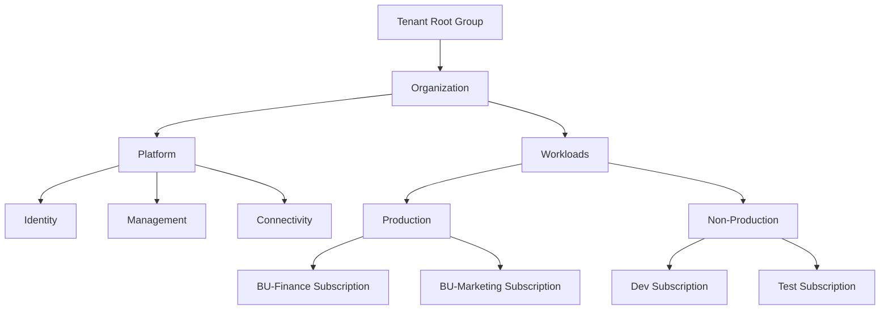

# How to Create Azure CLI Scripts for Automated Subscription and Management Group Setup

Author: [nawazdhandala](https://www.github.com/nawazdhandala)

Tags: Azure, Azure CLI, Automation, Management Groups, Subscriptions, Governance, Shell Scripting

Description: Build robust Azure CLI scripts to automate subscription creation and management group hierarchy setup for enterprise Azure environments.

---

When organizations start scaling their Azure usage, managing subscriptions and management groups by hand quickly becomes painful. You might start with one or two subscriptions, but before long you have dozens of them across different teams, environments, and business units. Management groups provide the hierarchy to organize these subscriptions, apply policies, and control access at scale.

Azure CLI scripts are a straightforward way to automate this setup. Unlike Terraform or Bicep, which sometimes have limited support for tenant-level operations like subscription creation, the Azure CLI gives you direct access to the management APIs. This post walks through building a complete automation script for subscription and management group setup.

## Understanding the Management Group Hierarchy

Azure management groups form a tree structure above subscriptions. Every Azure Active Directory tenant has a root management group, and you can create up to six levels of depth below it. A typical enterprise hierarchy looks something like this:



## Prerequisites

Before running these scripts, you need:

- Azure CLI version 2.40 or later
- An account with the following roles:
  - Management Group Contributor at the root management group level
  - Subscription Creator role (or Owner on an enrollment account for EA subscriptions)
- The `account` CLI extension for subscription management

Verify your setup with these commands.

```bash
# Check Azure CLI version
az version

# Verify you are logged in and have the right context
az account show

# List existing management groups to confirm permissions
az account management-group list --output table
```

## Building the Management Group Hierarchy

The first script creates the management group hierarchy. It is idempotent, meaning you can run it multiple times without creating duplicates. Azure CLI handles this gracefully since management group creation is a PUT operation.

```bash
#!/bin/bash
# create-mg-hierarchy.sh - Create the management group hierarchy
# This script is idempotent and safe to run multiple times

set -euo pipefail   # Exit on error, unset vars, pipe failures

# Configuration - modify these for your organization
TENANT_ROOT_GROUP_ID=$(az account management-group list --query "[?displayName=='Tenant Root Group'].id" -o tsv | head -1)
ORG_NAME="Contoso"

# Color codes for readable output
GREEN='\033[0;32m'
YELLOW='\033[1;33m'
NC='\033[0m'   # No color

# Function to create a management group with error handling
create_mg() {
    local mg_name=$1
    local mg_display_name=$2
    local parent_id=$3

    echo -e "${YELLOW}Creating management group: ${mg_display_name}${NC}"

    # Check if it already exists
    existing=$(az account management-group show --name "$mg_name" 2>/dev/null || echo "")

    if [ -n "$existing" ]; then
        echo -e "${GREEN}  Already exists, skipping.${NC}"
        return 0
    fi

    az account management-group create \
        --name "$mg_name" \
        --display-name "$mg_display_name" \
        --parent "$parent_id" \
        --output none

    echo -e "${GREEN}  Created successfully.${NC}"
}

# Create the top-level organization group
create_mg "${ORG_NAME}" "${ORG_NAME}" "$TENANT_ROOT_GROUP_ID"

# Create Platform management groups
create_mg "${ORG_NAME}-Platform" "Platform" "${ORG_NAME}"
create_mg "${ORG_NAME}-Identity" "Identity" "${ORG_NAME}-Platform"
create_mg "${ORG_NAME}-Management" "Management" "${ORG_NAME}-Platform"
create_mg "${ORG_NAME}-Connectivity" "Connectivity" "${ORG_NAME}-Platform"

# Create Workload management groups
create_mg "${ORG_NAME}-Workloads" "Workloads" "${ORG_NAME}"
create_mg "${ORG_NAME}-Production" "Production" "${ORG_NAME}-Workloads"
create_mg "${ORG_NAME}-NonProduction" "Non-Production" "${ORG_NAME}-Workloads"
create_mg "${ORG_NAME}-Sandbox" "Sandbox" "${ORG_NAME}-Workloads"

# Create Decommissioned group for subscriptions being retired
create_mg "${ORG_NAME}-Decommissioned" "Decommissioned" "${ORG_NAME}"

echo ""
echo -e "${GREEN}Management group hierarchy created successfully.${NC}"
echo ""

# Display the hierarchy
az account management-group list --output table
```

## Automating Subscription Creation

Creating subscriptions programmatically depends on your Azure agreement type. For Enterprise Agreement (EA) customers, you use the enrollment account. For Microsoft Customer Agreement (MCA), the process is different. Here is a script that handles both.

```bash
#!/bin/bash
# create-subscriptions.sh - Create and configure Azure subscriptions
# Supports both EA and MCA agreement types

set -euo pipefail

# Configuration
AGREEMENT_TYPE="${1:-EA}"       # Pass EA or MCA as first argument
BILLING_SCOPE=""

# Determine the billing scope based on agreement type
if [ "$AGREEMENT_TYPE" = "EA" ]; then
    # For Enterprise Agreement - get the enrollment account
    ENROLLMENT_ACCOUNT=$(az billing enrollment-account list --query "[0].name" -o tsv)
    BILLING_SCOPE="/providers/Microsoft.Billing/enrollmentAccounts/${ENROLLMENT_ACCOUNT}"
    echo "Using EA enrollment account: $ENROLLMENT_ACCOUNT"
elif [ "$AGREEMENT_TYPE" = "MCA" ]; then
    # For Microsoft Customer Agreement - get billing profile and invoice section
    BILLING_ACCOUNT=$(az billing account list --query "[0].name" -o tsv)
    BILLING_PROFILE=$(az billing profile list --account-name "$BILLING_ACCOUNT" --query "[0].name" -o tsv)
    INVOICE_SECTION=$(az billing invoice section list \
        --account-name "$BILLING_ACCOUNT" \
        --profile-name "$BILLING_PROFILE" \
        --query "[0].name" -o tsv)
    BILLING_SCOPE="/providers/Microsoft.Billing/billingAccounts/${BILLING_ACCOUNT}/billingProfiles/${BILLING_PROFILE}/invoiceSections/${INVOICE_SECTION}"
    echo "Using MCA billing scope"
fi

# Function to create a subscription and move it to a management group
create_subscription() {
    local sub_name=$1
    local mg_name=$2
    local sub_offer=${3:-"MS-AZR-0017P"}   # Default EA Dev/Test offer

    echo "Creating subscription: $sub_name"

    # Create the subscription using the billing scope
    result=$(az account alias create \
        --name "$sub_name" \
        --billing-scope "$BILLING_SCOPE" \
        --display-name "$sub_name" \
        --workload "Production" \
        --output json 2>&1) || {
        echo "  Warning: Subscription creation returned an error. It may already exist."
        # Try to find existing subscription
        result=$(az account alias show --name "$sub_name" --output json 2>/dev/null || echo "")
    }

    # Extract the subscription ID from the result
    sub_id=$(echo "$result" | python3 -c "import sys,json; print(json.load(sys.stdin).get('properties',{}).get('subscriptionId',''))" 2>/dev/null || echo "")

    if [ -z "$sub_id" ]; then
        echo "  Could not determine subscription ID. Skipping management group assignment."
        return 1
    fi

    echo "  Subscription ID: $sub_id"

    # Move the subscription to the target management group
    echo "  Moving to management group: $mg_name"
    az account management-group subscription add \
        --name "$mg_name" \
        --subscription-id "$sub_id" \
        --output none

    echo "  Done."
    echo "$sub_id"
}

# Define the subscriptions to create
# Format: subscription_name:management_group
SUBSCRIPTIONS=(
    "sub-identity-prod:Contoso-Identity"
    "sub-management-prod:Contoso-Management"
    "sub-connectivity-prod:Contoso-Connectivity"
    "sub-workload-prod-001:Contoso-Production"
    "sub-workload-dev-001:Contoso-NonProduction"
    "sub-workload-test-001:Contoso-NonProduction"
    "sub-sandbox-001:Contoso-Sandbox"
)

echo "Starting subscription creation..."
echo "================================="

for entry in "${SUBSCRIPTIONS[@]}"; do
    IFS=':' read -r sub_name mg_name <<< "$entry"
    create_subscription "$sub_name" "$mg_name"
    echo ""
done

echo "All subscriptions processed."
```

## Post-Creation Configuration

After subscriptions exist and are placed in the right management groups, you typically need to configure resource providers, set budgets, and apply initial tags. Here is a script that handles those tasks.

```bash
#!/bin/bash
# configure-subscriptions.sh - Apply post-creation configuration to subscriptions

set -euo pipefail

# Resource providers that should be registered in every subscription
REQUIRED_PROVIDERS=(
    "Microsoft.Compute"
    "Microsoft.Network"
    "Microsoft.Storage"
    "Microsoft.KeyVault"
    "Microsoft.ManagedIdentity"
    "Microsoft.Monitor"
    "Microsoft.OperationalInsights"
    "Microsoft.PolicyInsights"
    "Microsoft.Security"
)

# Function to configure a single subscription
configure_subscription() {
    local sub_id=$1
    local sub_name=$2
    local environment=$3
    local cost_center=$4
    local monthly_budget=$5

    echo "Configuring subscription: $sub_name ($sub_id)"

    # Set the active subscription context
    az account set --subscription "$sub_id"

    # Register required resource providers
    echo "  Registering resource providers..."
    for provider in "${REQUIRED_PROVIDERS[@]}"; do
        # Check current state before registering
        state=$(az provider show --namespace "$provider" --query "registrationState" -o tsv 2>/dev/null || echo "NotRegistered")
        if [ "$state" != "Registered" ]; then
            az provider register --namespace "$provider" --wait --output none
            echo "    Registered: $provider"
        fi
    done

    # Set subscription-level tags
    echo "  Applying tags..."
    az tag create --resource-id "/subscriptions/$sub_id" \
        --tags \
            Environment="$environment" \
            CostCenter="$cost_center" \
            ManagedBy="automation" \
            CreatedDate="$(date -u +%Y-%m-%d)" \
        --output none

    # Create a budget for cost management
    echo "  Creating monthly budget..."
    budget_name="budget-${sub_name}-monthly"
    az consumption budget create \
        --budget-name "$budget_name" \
        --amount "$monthly_budget" \
        --category "Cost" \
        --time-grain "Monthly" \
        --start-date "$(date -u +%Y-%m-01)" \
        --end-date "2027-12-31" \
        --output none 2>/dev/null || echo "    Budget may already exist, skipping."

    echo "  Configuration complete."
}

# Configure each subscription
# Format: subscription_id, name, environment, cost_center, budget
configure_subscription "xxxxxxxx-xxxx-xxxx-xxxx-xxxxxxxxxxxx" "sub-workload-prod-001" "Production" "CC-1001" "5000"
configure_subscription "yyyyyyyy-yyyy-yyyy-yyyy-yyyyyyyyyyyy" "sub-workload-dev-001" "Development" "CC-1002" "2000"
```

## Making It Data-Driven

For larger organizations, hardcoding subscription details in the script does not scale. A better approach is to drive the automation from a JSON configuration file.

```json
{
  "management_groups": [
    { "name": "Platform", "parent": "root", "children": ["Identity", "Management", "Connectivity"] },
    { "name": "Workloads", "parent": "root", "children": ["Production", "NonProduction", "Sandbox"] }
  ],
  "subscriptions": [
    {
      "name": "sub-identity-prod",
      "management_group": "Identity",
      "environment": "Production",
      "cost_center": "CC-1001",
      "monthly_budget": 3000
    },
    {
      "name": "sub-connectivity-prod",
      "management_group": "Connectivity",
      "environment": "Production",
      "cost_center": "CC-1002",
      "monthly_budget": 8000
    }
  ]
}
```

Then your main script reads from this file using `jq` to parse the JSON.

```bash
#!/bin/bash
# deploy-from-config.sh - Data-driven subscription and MG setup
CONFIG_FILE="azure-config.json"

# Read and iterate over management groups
echo "Creating management groups..."
for mg in $(jq -c '.management_groups[]' "$CONFIG_FILE"); do
    name=$(echo "$mg" | jq -r '.name')
    parent=$(echo "$mg" | jq -r '.parent')
    # Create management group logic here
    echo "  Processing: $name (parent: $parent)"
done

# Read and iterate over subscriptions
echo "Creating subscriptions..."
for sub in $(jq -c '.subscriptions[]' "$CONFIG_FILE"); do
    name=$(echo "$sub" | jq -r '.name')
    mg=$(echo "$sub" | jq -r '.management_group')
    budget=$(echo "$sub" | jq -r '.monthly_budget')
    echo "  Processing: $name -> $mg (budget: $budget)"
done
```

## Error Handling and Logging

Production scripts need proper error handling and logging. Here are a few patterns that work well.

```bash
# Log function that writes to both stdout and a log file
LOG_FILE="azure-setup-$(date +%Y%m%d-%H%M%S).log"

log() {
    local level=$1
    shift
    local message="[$(date -u +%Y-%m-%dT%H:%M:%SZ)] [$level] $*"
    echo "$message" | tee -a "$LOG_FILE"
}

# Retry function for transient failures
retry() {
    local max_attempts=$1
    shift
    local attempt=1

    while [ $attempt -le $max_attempts ]; do
        if "$@"; then
            return 0
        fi
        log "WARN" "Attempt $attempt of $max_attempts failed. Retrying in 10 seconds..."
        sleep 10
        attempt=$((attempt + 1))
    done

    log "ERROR" "All $max_attempts attempts failed for: $*"
    return 1
}

# Usage example
retry 3 az account management-group create --name "test-mg" --display-name "Test"
```

## Wrapping Up

Azure CLI scripts give you fine-grained control over subscription and management group automation. The key is to build your scripts to be idempotent, data-driven, and well-logged. Start with the management group hierarchy, then automate subscription creation and placement, and finish with post-creation configuration like resource provider registration, tagging, and budgets. This foundation supports everything that comes after - policy assignments, RBAC, and the actual workload infrastructure that Terraform or Bicep will deploy into those subscriptions.
