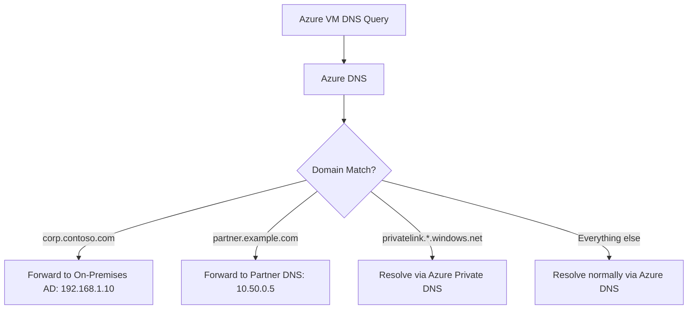
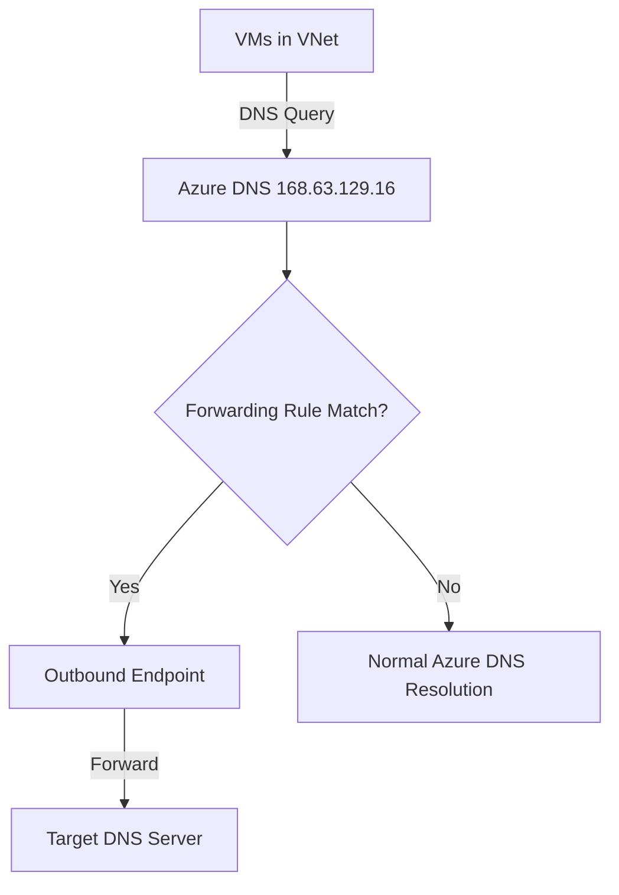

# How to Create Azure DNS Conditional Forwarding with Private Resolver

Author: [nawazdhandala](https://www.github.com/nawazdhandala)

Tags: Azure, DNS, Conditional Forwarding, Private Resolver, Hybrid DNS, Networking, Name Resolution

Description: A hands-on guide to setting up conditional DNS forwarding with Azure DNS Private Resolver for routing specific domain queries to designated DNS servers.

---

In a hybrid environment, not all DNS queries should go to the same place. Queries for `corp.contoso.com` need to go to your on-premises Active Directory DNS servers, queries for Azure private endpoints need to go to Azure DNS, and queries for a partner's domain might need to go to their DNS infrastructure. Conditional forwarding makes this possible by routing DNS queries to different servers based on the domain name.

Azure DNS Private Resolver provides this capability natively in Azure, eliminating the need for custom DNS forwarder VMs. In this post, I will show you how to set up conditional forwarding rules using the Private Resolver's outbound endpoint and forwarding rule sets.

## What is Conditional Forwarding?

Conditional forwarding is a DNS mechanism where queries for specific domains are forwarded to designated DNS servers instead of using the default resolution path. It is essentially an "if domain matches X, ask server Y" configuration.



## Why Use Private Resolver for Conditional Forwarding?

Before Private Resolver, you had to deploy DNS forwarder VMs (typically running BIND, CoreDNS, or Windows DNS) in your VNet. These VMs needed patching, monitoring, and high-availability configuration. Private Resolver is a fully managed service that handles all of this.

Key advantages:
- **No VM management.** No patching, no OS updates, no disk monitoring.
- **Built-in high availability.** Zone-redundant in supported regions.
- **Scales automatically.** Handles up to 10,000 queries per second per endpoint.
- **Integrates with Azure DNS and Private DNS Zones.** Works seamlessly with the rest of the Azure DNS ecosystem.

## Architecture Overview

The setup involves:

1. **Azure DNS Private Resolver** deployed in your VNet
2. **Outbound endpoint** in a dedicated subnet for sending forwarded queries
3. **Forwarding rule set** defining which domains go where
4. **VNet link** connecting the rule set to VNets that should use these rules



## Step 1: Set Up the Private Resolver

Create the resolver and its outbound endpoint. Each endpoint needs a dedicated subnet:

```bash
# Create the outbound endpoint subnet with delegation
az network vnet subnet create \
  --resource-group myResourceGroup \
  --vnet-name myVNet \
  --name outbound-dns-subnet \
  --address-prefixes 10.0.20.0/28 \
  --delegations Microsoft.Network/dnsResolvers

# Get VNet resource ID
VNET_ID=$(az network vnet show \
  --resource-group myResourceGroup \
  --name myVNet \
  --query id --output tsv)

# Create the DNS Private Resolver
az dns-resolver create \
  --resource-group myResourceGroup \
  --name myResolver \
  --location eastus \
  --id $VNET_ID

# Create the outbound endpoint
SUBNET_ID=$(az network vnet subnet show \
  --resource-group myResourceGroup \
  --vnet-name myVNet \
  --name outbound-dns-subnet \
  --query id --output tsv)

az dns-resolver outbound-endpoint create \
  --resource-group myResourceGroup \
  --dns-resolver-name myResolver \
  --name outboundEP \
  --location eastus \
  --id $SUBNET_ID
```

## Step 2: Create the Forwarding Rule Set

The rule set is a container for your forwarding rules. Create it and link it to the outbound endpoint:

```bash
# Get the outbound endpoint ID
OUTBOUND_EP_ID=$(az dns-resolver outbound-endpoint show \
  --resource-group myResourceGroup \
  --dns-resolver-name myResolver \
  --name outboundEP \
  --query id --output tsv)

# Create the forwarding rule set
az dns-resolver forwarding-ruleset create \
  --resource-group myResourceGroup \
  --name myForwardingRules \
  --location eastus \
  --outbound-endpoints "[{\"id\":\"$OUTBOUND_EP_ID\"}]"
```

## Step 3: Add Conditional Forwarding Rules

Now add rules for each domain you want to forward. Each rule specifies a domain name and one or more target DNS servers:

```bash
# Forward Active Directory domain to on-premises DNS servers
az dns-resolver forwarding-rule create \
  --resource-group myResourceGroup \
  --ruleset-name myForwardingRules \
  --name adDomain \
  --domain-name "corp.contoso.com." \
  --forwarding-rule-state Enabled \
  --target-dns-servers '[{"ip-address":"192.168.1.10","port":53},{"ip-address":"192.168.1.11","port":53}]'

# Forward partner domain to their DNS servers
az dns-resolver forwarding-rule create \
  --resource-group myResourceGroup \
  --ruleset-name myForwardingRules \
  --name partnerDomain \
  --domain-name "partner.example.com." \
  --forwarding-rule-state Enabled \
  --target-dns-servers '[{"ip-address":"10.50.0.5","port":53}]'

# Forward internal development domain
az dns-resolver forwarding-rule create \
  --resource-group myResourceGroup \
  --ruleset-name myForwardingRules \
  --name devDomain \
  --domain-name "dev.internal.com." \
  --forwarding-rule-state Enabled \
  --target-dns-servers '[{"ip-address":"10.100.1.5","port":53}]'
```

Important notes about the rules:

- **Trailing dot required.** The domain name must end with a dot (e.g., `corp.contoso.com.`). This is standard DNS notation for a fully qualified domain name.
- **All subdomains included.** A rule for `corp.contoso.com.` also matches `server1.corp.contoso.com.` and `app.prod.corp.contoso.com.`.
- **Multiple target servers.** Listing two target servers provides redundancy. If the first is unavailable, the resolver tries the second.

## Step 4: Link the Rule Set to Your VNets

The forwarding rules only apply to VNets that are linked to the rule set:

```bash
# Link the rule set to your primary VNet
az dns-resolver vnet-link create \
  --resource-group myResourceGroup \
  --ruleset-name myForwardingRules \
  --name primaryVNetLink \
  --id $VNET_ID

# Link to additional VNets if needed
VNET2_ID=$(az network vnet show \
  --resource-group myResourceGroup \
  --name myVNet2 \
  --query id --output tsv)

az dns-resolver vnet-link create \
  --resource-group myResourceGroup \
  --ruleset-name myForwardingRules \
  --name secondaryVNetLink \
  --id $VNET2_ID
```

After linking, any VM in these VNets that queries a domain matching a forwarding rule will have its query forwarded to the specified DNS servers.

## Step 5: Test the Forwarding Rules

From a VM inside a linked VNet, test DNS resolution for each forwarded domain:

```bash
# Test resolution of the on-premises AD domain
nslookup dc01.corp.contoso.com

# Test resolution of the partner domain
nslookup app.partner.example.com

# Test that non-forwarded domains still resolve normally
nslookup www.google.com
```

The forwarded domains should resolve to the IPs returned by the target DNS servers. Non-forwarded domains should resolve through Azure DNS as usual.

## Managing Rules

Forwarding rules can be updated, disabled, or deleted as your needs change:

```bash
# Disable a rule temporarily (traffic goes to default Azure DNS)
az dns-resolver forwarding-rule update \
  --resource-group myResourceGroup \
  --ruleset-name myForwardingRules \
  --name partnerDomain \
  --forwarding-rule-state Disabled

# Re-enable the rule
az dns-resolver forwarding-rule update \
  --resource-group myResourceGroup \
  --ruleset-name myForwardingRules \
  --name partnerDomain \
  --forwarding-rule-state Enabled

# Delete a rule that is no longer needed
az dns-resolver forwarding-rule delete \
  --resource-group myResourceGroup \
  --ruleset-name myForwardingRules \
  --name devDomain \
  --yes

# List all rules in the set
az dns-resolver forwarding-rule list \
  --resource-group myResourceGroup \
  --ruleset-name myForwardingRules \
  --output table
```

## Rule Priority and Specificity

When multiple rules could match a query, the most specific rule wins. For example:

- Rule 1: `contoso.com.` -> forward to 192.168.1.10
- Rule 2: `prod.contoso.com.` -> forward to 10.0.1.5

A query for `app.prod.contoso.com` matches both rules, but Rule 2 is more specific (longer domain name), so it is used.

A query for `dev.contoso.com` only matches Rule 1, so it goes to 192.168.1.10.

## Network Requirements

The outbound endpoint needs network connectivity to the target DNS servers. If the targets are on-premises, you need:

- ExpressRoute or VPN connection between Azure and on-premises
- NSG rules on the outbound endpoint subnet allowing UDP/TCP port 53 outbound
- Routing configured so the outbound endpoint subnet can reach the target DNS servers

If the targets are in another VNet, VNet peering must be in place.

```bash
# Verify NSG allows DNS traffic from the outbound subnet
az network nsg rule create \
  --resource-group myResourceGroup \
  --nsg-name outboundSubnetNSG \
  --name allowDNSOutbound \
  --priority 100 \
  --direction Outbound \
  --protocol "*" \
  --destination-port-ranges 53 \
  --destination-address-prefixes "192.168.1.0/24" \
  --access Allow
```

## Monitoring Forwarding Activity

While Private Resolver does not expose per-query logs directly, you can monitor it through Azure Monitor metrics:

- **Query count** per outbound endpoint
- **Response latency** to target DNS servers
- **Error counts** for failed forwarded queries

Set up alerts for elevated error rates to catch connectivity issues with target DNS servers early.

## Common Issues

**Forwarded queries time out.** Check that the outbound endpoint can reach the target DNS servers. Verify VPN/ExpressRoute connectivity, NSG rules, and routing.

**Rule not matching.** Verify the trailing dot in the domain name. `corp.contoso.com` (without dot) may not work correctly. Always use `corp.contoso.com.`.

**Resolution returns NXDOMAIN.** The target DNS server does not have the record. This is not a forwarding issue. Check the target DNS server directly.

**VNet not using forwarding rules.** Verify the VNet is linked to the rule set. Check `az dns-resolver vnet-link list`.

## Summary

Azure DNS conditional forwarding with Private Resolver lets you route DNS queries for specific domains to designated DNS servers without managing forwarder VMs. Create an outbound endpoint, define forwarding rules for each domain, and link the rule set to your VNets. The most specific rule wins when multiple rules match. For hybrid environments, this is the clean way to integrate on-premises DNS with Azure DNS while keeping everything manageable and highly available.
