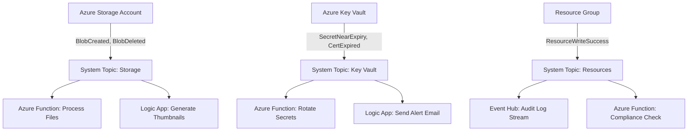

# How to Create Azure Event Grid System Topics for Azure Resource Events

Author: [nawazdhandala](https://www.github.com/nawazdhandala)

Tags: Azure, Event Grid, System Topics, Resource Events, Event-Driven, Automation, Cloud Monitoring

Description: Learn how to create Azure Event Grid system topics to subscribe to events from Azure resources like Storage, Key Vault, and more.

---

Azure services emit events when things happen - a blob gets uploaded, a key vault secret expires, a container registry image gets pushed, a resource gets created or deleted. Azure Event Grid system topics let you subscribe to these events and react to them in real time. Instead of polling for changes, your application gets notified the moment something happens.

## What Are System Topics?

A system topic is an Event Grid topic that represents an Azure service's event source. Unlike custom topics (which you create and publish to), system topics are managed by Azure and automatically emit events when the associated resource changes state.

For example, a system topic for a Storage Account emits events like `Microsoft.Storage.BlobCreated` and `Microsoft.Storage.BlobDeleted`. A system topic for Azure Key Vault emits events like `Microsoft.KeyVault.SecretExpired` and `Microsoft.KeyVault.CertificateNearExpiry`.

## Which Azure Services Support System Topics?

The list grows regularly, but here are some of the most commonly used ones:

- Azure Blob Storage (blob created, deleted, renamed)
- Azure Key Vault (secret/certificate near expiry, expired, new version)
- Azure Container Registry (image pushed, deleted, chart pushed)
- Azure Resource Groups (resource created, updated, deleted)
- Azure Subscriptions (resource write, delete, action)
- Azure IoT Hub (device created, deleted, telemetry)
- Azure App Configuration (key-value modified, deleted)
- Azure Machine Learning (run completed, model registered)
- Azure Media Services (job state changed)
- Azure Maps (geofence entered, exited)
- Azure Communication Services (SMS received, call started)

## Creating a System Topic

Let's create a system topic for an Azure Storage Account to react to blob events.

```bash
# First, create a storage account if you do not have one
az storage account create \
  --name stblobevents2026 \
  --resource-group rg-events \
  --location eastus2 \
  --sku Standard_LRS

# Get the storage account resource ID
STORAGE_ID=$(az storage account show --name stblobevents2026 --resource-group rg-events --query "id" --output tsv)

# Create the system topic
az eventgrid system-topic create \
  --name systopic-storage-events \
  --resource-group rg-events \
  --location eastus2 \
  --topic-type Microsoft.Storage.StorageAccounts \
  --source "$STORAGE_ID"
```

Now create a subscription on the system topic to route events to your handler.

```bash
# Subscribe to blob created events, sending them to an Azure Function
az eventgrid system-topic event-subscription create \
  --name sub-blob-created \
  --resource-group rg-events \
  --system-topic-name systopic-storage-events \
  --endpoint "/subscriptions/{sub-id}/resourceGroups/rg-events/providers/Microsoft.Web/sites/func-blob-processor/functions/ProcessBlob" \
  --endpoint-type azurefunction \
  --included-event-types "Microsoft.Storage.BlobCreated"
```

## System Topic for Key Vault

Key Vault system topics are extremely useful for monitoring certificate and secret expiration.

```bash
# Get the Key Vault resource ID
KV_ID=$(az keyvault show --name kv-myapp-prod --query "id" --output tsv)

# Create a system topic for Key Vault
az eventgrid system-topic create \
  --name systopic-keyvault-events \
  --resource-group rg-events \
  --location eastus2 \
  --topic-type Microsoft.KeyVault.vaults \
  --source "$KV_ID"

# Subscribe to certificate and secret expiration events
az eventgrid system-topic event-subscription create \
  --name sub-kv-expiry-alerts \
  --resource-group rg-events \
  --system-topic-name systopic-keyvault-events \
  --endpoint "https://myapp.azurewebsites.net/api/keyvault-events" \
  --included-event-types \
    "Microsoft.KeyVault.CertificateNearExpiry" \
    "Microsoft.KeyVault.CertificateExpired" \
    "Microsoft.KeyVault.SecretNearExpiry" \
    "Microsoft.KeyVault.SecretExpired"
```

## System Topic for Resource Groups

Monitor all resource changes in a resource group. This is great for compliance and audit logging.

```bash
# Create a system topic for a resource group
RG_ID=$(az group show --name rg-production --query "id" --output tsv)

az eventgrid system-topic create \
  --name systopic-rg-changes \
  --resource-group rg-events \
  --location eastus2 \
  --topic-type Microsoft.Resources.ResourceGroups \
  --source "$RG_ID"

# Subscribe to all resource write events
az eventgrid system-topic event-subscription create \
  --name sub-resource-audit \
  --resource-group rg-events \
  --system-topic-name systopic-rg-changes \
  --endpoint "https://func-audit.azurewebsites.net/api/audit" \
  --included-event-types \
    "Microsoft.Resources.ResourceWriteSuccess" \
    "Microsoft.Resources.ResourceDeleteSuccess"
```

## Creating System Topics with Bicep

For repeatable infrastructure, use Bicep to define your system topics and subscriptions.

```bicep
// Bicep template for a Storage Account system topic with subscriptions
param location string = resourceGroup().location
param storageAccountName string = 'stblobevents2026'
param functionAppName string = 'func-blob-processor'

// Reference the existing storage account
resource storageAccount 'Microsoft.Storage/storageAccounts@2023-01-01' existing = {
  name: storageAccountName
}

// Reference the existing function app
resource functionApp 'Microsoft.Web/sites@2023-01-01' existing = {
  name: functionAppName
}

// Create the system topic
resource systemTopic 'Microsoft.EventGrid/systemTopics@2022-06-15' = {
  name: 'systopic-storage-events'
  location: location
  properties: {
    source: storageAccount.id
    topicType: 'Microsoft.Storage.StorageAccounts'
  }
}

// Subscription for blob created events
resource blobCreatedSub 'Microsoft.EventGrid/systemTopics/eventSubscriptions@2022-06-15' = {
  parent: systemTopic
  name: 'sub-blob-created'
  properties: {
    destination: {
      endpointType: 'AzureFunction'
      properties: {
        resourceId: '${functionApp.id}/functions/ProcessBlob'
        maxEventsPerBatch: 1
      }
    }
    filter: {
      includedEventTypes: [
        'Microsoft.Storage.BlobCreated'
      ]
      // Only trigger for blobs in the 'uploads' container
      subjectBeginsWith: '/blobServices/default/containers/uploads/'
      // Only trigger for .pdf files
      subjectEndsWith: '.pdf'
    }
    retryPolicy: {
      maxDeliveryAttempts: 10
      eventTimeToLiveInMinutes: 1440
    }
  }
}
```

## Handling System Topic Events in Code

Here is an Azure Function that processes blob created events from a Storage Account system topic.

```csharp
using Azure.Messaging.EventGrid;
using Microsoft.Azure.Functions.Worker;
using Microsoft.Extensions.Logging;
using System.Text.Json;

public class BlobEventHandler
{
    private readonly ILogger<BlobEventHandler> _logger;

    public BlobEventHandler(ILogger<BlobEventHandler> logger)
    {
        _logger = logger;
    }

    [Function("ProcessBlob")]
    public async Task Run(
        [EventGridTrigger] EventGridEvent eventGridEvent)
    {
        _logger.LogInformation("Event Type: {Type}", eventGridEvent.EventType);
        _logger.LogInformation("Subject: {Subject}", eventGridEvent.Subject);

        // The data schema depends on the event type
        // For BlobCreated, it includes the blob URL, size, and content type
        var blobData = eventGridEvent.Data.ToObjectFromJson<StorageBlobCreatedEventData>();

        _logger.LogInformation("Blob URL: {Url}", blobData.Url);
        _logger.LogInformation("Content Type: {ContentType}", blobData.ContentType);
        _logger.LogInformation("Content Length: {Length}", blobData.ContentLength);

        // Process the blob based on its content type
        if (blobData.ContentType == "application/pdf")
        {
            await ProcessPdf(blobData.Url);
        }
        else if (blobData.ContentType.StartsWith("image/"))
        {
            await ProcessImage(blobData.Url);
        }
    }

    private async Task ProcessPdf(string url)
    {
        _logger.LogInformation("Processing PDF: {Url}", url);
        // Your PDF processing logic
    }

    private async Task ProcessImage(string url)
    {
        _logger.LogInformation("Processing image: {Url}", url);
        // Your image processing logic
    }
}

// The event data model for BlobCreated events
public class StorageBlobCreatedEventData
{
    public string Api { get; set; }
    public string ClientRequestId { get; set; }
    public string RequestId { get; set; }
    public string ETag { get; set; }
    public string ContentType { get; set; }
    public long ContentLength { get; set; }
    public string BlobType { get; set; }
    public string Url { get; set; }
    public string Sequencer { get; set; }
}
```

## Event Flow Architecture

Here is a typical architecture showing how system topics fit into an event-driven application.



## Listing Available Event Types

To see what event types a specific Azure service emits, use the CLI.

```bash
# List all event types for Storage Accounts
az eventgrid topic-type list-event-types \
  --name Microsoft.Storage.StorageAccounts

# List all event types for Key Vault
az eventgrid topic-type list-event-types \
  --name Microsoft.KeyVault.vaults

# List all supported topic types (all services that emit events)
az eventgrid topic-type list --output table
```

## Permissions and Access

To create a system topic, you need read access to the source resource and contributor access to the resource group where the system topic is created. For the event subscription, you need access to the destination endpoint (webhook, function, queue, etc.).

When using Managed Identity for the system topic, assign the appropriate role on the source resource. For example, for a Storage Account source, the system topic's identity needs `Storage Blob Data Reader` if it needs to access blob content.

## Limits and Considerations

Each Azure resource can have only one system topic. You cannot create two system topics for the same Storage Account. However, you can create multiple subscriptions on a single system topic, each with different filters and destinations.

System topics are regional - the system topic must be in the same region as the source resource. Cross-region event routing is not supported for system topics.

## Summary

System topics are the backbone of event-driven Azure architectures. They give you push-based notifications for changes across Azure services without polling. Create system topics for the resources you care about, add filtered subscriptions to route events to the right handlers, and use Bicep to manage everything as code. Combined with custom topics for your own application events, Event Grid becomes the nervous system of your cloud infrastructure.
