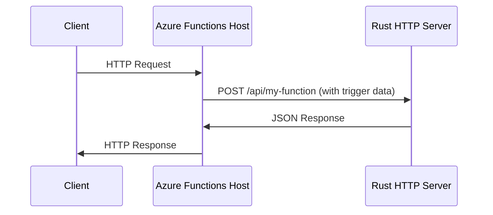

# How to Create Azure Functions Custom Handlers in Rust

Author: [nawazdhandala](https://www.github.com/nawazdhandala)

Tags: Azure Functions, Rust, Custom Handlers, Serverless, Azure, Systems Programming, WebAssembly

Description: Build high-performance Azure Functions using Rust custom handlers for scenarios where you need low-level control and maximum efficiency.

---

Azure Functions natively supports languages like C#, JavaScript, Python, and Java. But what if you want to use Rust? Maybe you need the raw performance, memory safety guarantees, or access to a Rust library that has no equivalent in the supported languages. This is where custom handlers come in.

Custom handlers let you write your Azure Function in any language that can run an HTTP server. The Azure Functions host forwards trigger and binding data to your HTTP server, and your server sends back the response. In this post, I will walk through building an Azure Function entirely in Rust using this approach.

## How Custom Handlers Work

The normal Azure Functions execution model works like this: the Functions host receives a trigger event (HTTP request, queue message, timer tick), processes bindings, and calls your function code through a language-specific worker. With custom handlers, the host instead forwards the event as an HTTP POST request to a local web server that you control.



Your Rust binary starts up, listens on a port, and handles incoming requests from the Functions host. You have complete control over the runtime.

## Setting Up the Project

Start by creating a new Rust project alongside the Azure Functions configuration files.

```bash
# Create the Rust project
cargo init azure-function-rust --name handler
cd azure-function-rust

# Create the Azure Functions structure
mkdir -p api/hello
```

Add the dependencies you need in `Cargo.toml`.

```toml
[package]
name = "handler"
version = "0.1.0"
edition = "2021"

[dependencies]
# Lightweight HTTP framework - perfect for custom handlers
actix-web = "4"
# JSON serialization for request/response handling
serde = { version = "1", features = ["derive"] }
serde_json = "1"
# Async runtime
tokio = { version = "1", features = ["full"] }
# Environment variable support
dotenvy = "0.15"
```

## Azure Functions Configuration

Create the `host.json` file in the project root. This tells the Functions host to use your custom handler.

```json
{
  "version": "2.0",
  "logging": {
    "applicationInsights": {
      "samplingSettings": {
        "isEnabled": true,
        "excludedTypes": "Request"
      }
    }
  },
  "customHandler": {
    "description": {
      "defaultExecutablePath": "handler",
      "workingDirectory": "",
      "arguments": []
    },
    "enableForwardingHttpRequest": true
  },
  "extensionBundle": {
    "id": "Microsoft.Azure.Functions.ExtensionBundle",
    "version": "[4.*, 5.0.0)"
  }
}
```

The key setting here is `enableForwardingHttpRequest`. When this is true, the host forwards the original HTTP request directly to your server instead of wrapping it in a custom payload. This makes HTTP triggers much simpler to handle.

Now create the function configuration file at `api/hello/function.json`.

```json
{
  "bindings": [
    {
      "authLevel": "function",
      "type": "httpTrigger",
      "direction": "in",
      "name": "req",
      "methods": ["get", "post"],
      "route": "hello"
    },
    {
      "type": "http",
      "direction": "out",
      "name": "res"
    }
  ]
}
```

## Writing the Rust Handler

Now write the actual Rust code. Create the main server in `src/main.rs`.

```rust
use actix_web::{web, App, HttpServer, HttpRequest, HttpResponse, middleware};
use serde::{Deserialize, Serialize};
use std::env;

// Response structure for the hello endpoint
#[derive(Serialize)]
struct HelloResponse {
    message: String,
    timestamp: String,
    rust_version: String,
}

// Request body for POST requests
#[derive(Deserialize)]
struct HelloRequest {
    name: Option<String>,
}

// Handler for GET /api/hello?name=World
async fn hello_get(req: HttpRequest) -> HttpResponse {
    // Extract the name from query parameters, defaulting to "World"
    let name = req
        .query_string()
        .split('&')
        .find_map(|pair| {
            let mut parts = pair.splitn(2, '=');
            match (parts.next(), parts.next()) {
                (Some("name"), Some(value)) => Some(value.to_string()),
                _ => None,
            }
        })
        .unwrap_or_else(|| "World".to_string());

    let response = HelloResponse {
        message: format!("Hello, {}! This response was generated by Rust.", name),
        timestamp: chrono::Utc::now().to_rfc3339(),
        rust_version: env!("CARGO_PKG_VERSION").to_string(),
    };

    HttpResponse::Ok().json(response)
}

// Handler for POST /api/hello with a JSON body
async fn hello_post(body: web::Json<HelloRequest>) -> HttpResponse {
    let name = body.name.clone().unwrap_or_else(|| "World".to_string());

    let response = HelloResponse {
        message: format!("Hello, {}! Posted to a Rust Azure Function.", name),
        timestamp: chrono::Utc::now().to_rfc3339(),
        rust_version: env!("CARGO_PKG_VERSION").to_string(),
    };

    HttpResponse::Ok().json(response)
}

#[actix_web::main]
async fn main() -> std::io::Result<()> {
    // Azure Functions custom handler expects the server to listen on
    // the port specified by the FUNCTIONS_CUSTOMHANDLER_PORT env var
    let port: u16 = env::var("FUNCTIONS_CUSTOMHANDLER_PORT")
        .unwrap_or_else(|_| "7071".to_string())
        .parse()
        .expect("FUNCTIONS_CUSTOMHANDLER_PORT must be a valid port number");

    println!("Starting Rust custom handler on port {}", port);

    // Start the HTTP server on the designated port
    HttpServer::new(|| {
        App::new()
            .route("/api/hello", web::get().to(hello_get))
            .route("/api/hello", web::post().to(hello_post))
    })
    .bind(("0.0.0.0", port))?
    .run()
    .await
}
```

Note that you also need to add `chrono` to your dependencies.

```toml
# Add to Cargo.toml under [dependencies]
chrono = { version = "0.4", features = ["serde"] }
```

## Handling Non-HTTP Triggers

When `enableForwardingHttpRequest` is false (the default), the Functions host wraps trigger data in a standardized JSON format. This is necessary for non-HTTP triggers like queue messages or timer events.

```rust
use serde::{Deserialize, Serialize};

// The Azure Functions host sends this structure for non-HTTP triggers
#[derive(Deserialize)]
struct InvocationRequest {
    #[serde(rename = "Data")]
    data: serde_json::Value,
    #[serde(rename = "Metadata")]
    metadata: serde_json::Value,
}

// Your response must follow this structure
#[derive(Serialize)]
struct InvocationResponse {
    #[serde(rename = "Outputs")]
    outputs: serde_json::Value,
    #[serde(rename = "Logs")]
    logs: Vec<String>,
    #[serde(rename = "ReturnValue")]
    return_value: serde_json::Value,
}

// Handler for a queue trigger - processes messages from Azure Storage Queue
async fn process_queue_message(
    body: web::Json<InvocationRequest>,
) -> HttpResponse {
    // Extract the queue message from the trigger data
    let queue_message = body.data.get("queueMessage")
        .and_then(|v| v.as_str())
        .unwrap_or("empty");

    println!("Processing queue message: {}", queue_message);

    // Build the response with output bindings
    let response = InvocationResponse {
        outputs: serde_json::json!({
            "res": {
                "body": format!("Processed: {}", queue_message),
                "statusCode": 200
            }
        }),
        logs: vec![format!("Processed message: {}", queue_message)],
        return_value: serde_json::Value::Null,
    };

    HttpResponse::Ok().json(response)
}
```

## Building and Deploying

For deployment, you need to compile for the target platform. Azure Functions on Windows needs a Windows executable, and on Linux it needs a Linux binary.

```bash
# Build for Linux (used by most Azure Functions plans)
# Cross-compilation from macOS or Windows requires a cross-compiler
cargo build --release --target x86_64-unknown-linux-musl

# Or use Docker for cross-compilation
docker run --rm -v $(pwd):/app -w /app \
  messense/rust-musl-cross:x86_64-musl \
  cargo build --release --target x86_64-unknown-linux-musl
```

Create a deployment package with the binary and configuration files.

```bash
# Create the deployment directory structure
mkdir -p deploy/api/hello

# Copy the compiled binary
cp target/x86_64-unknown-linux-musl/release/handler deploy/

# Copy Azure Functions configuration
cp host.json deploy/
cp api/hello/function.json deploy/api/hello/

# Create the deployment zip
cd deploy && zip -r ../function-app.zip . && cd ..

# Deploy using the Azure CLI
az functionapp deployment source config-zip \
  --name my-rust-function \
  --resource-group my-resource-group \
  --src function-app.zip
```

## Performance Benefits

Rust custom handlers start significantly faster than Python or Java functions because the compiled binary has no runtime initialization overhead. In my benchmarks, a Rust custom handler cold starts in about 500ms compared to 3-5 seconds for a Python function with similar dependencies.

Memory usage is also much lower. A typical Rust handler uses 10-20 MB of memory compared to 100-200 MB for a Python function. On the Consumption plan, this means you are paying less per execution.

## Limitations to Be Aware Of

Custom handlers have some restrictions compared to native language support. You do not get automatic binding data serialization, so you have to parse the JSON yourself. The local development experience is also a bit rougher since `func start` needs your binary to be pre-compiled.

Durable Functions are not supported with custom handlers because the Durable Task framework requires a language-specific SDK. If you need orchestration, you will need to use one of the natively supported languages for that part.

## Testing Locally

You can test your Rust handler locally using the Azure Functions Core Tools.

```bash
# Build the Rust binary first
cargo build --release

# Copy the binary to the project root (or adjust host.json path)
cp target/release/handler .

# Start the Azure Functions host
func start
```

The Functions host will start your Rust binary automatically and forward requests to it.

## Wrapping Up

Rust custom handlers give you the performance characteristics of a systems language within the Azure Functions ecosystem. The tradeoff is more manual setup and less integration with bindings, but for CPU-intensive or latency-sensitive workloads, the performance gains are substantial. Start with HTTP triggers since they are the simplest to implement, then expand to other trigger types as needed.
