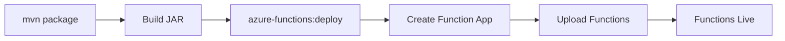

# How to Create Azure Functions in Java with HTTP and Timer Triggers

Author: [nawazdhandala](https://www.github.com/nawazdhandala)

Tags: Azure Functions, Java, Serverless, HTTP Trigger, Timer Trigger, Azure SDK, Cloud Functions

Description: Learn how to create serverless Azure Functions in Java with HTTP and Timer triggers for building lightweight APIs and scheduled tasks.

---

Azure Functions lets you run code without managing servers. You write a function, define what triggers it, and Azure handles provisioning, scaling, and execution. The Java support for Azure Functions is solid, with a familiar annotation-based model that will feel natural if you have worked with JAX-RS or Spring MVC.

In this post, we will build two types of Azure Functions in Java: an HTTP-triggered function that serves as a lightweight API endpoint, and a timer-triggered function that runs on a schedule. We will cover project setup, local development, testing, and deployment to Azure.

## Why Azure Functions for Java?

Serverless functions are a good fit when you have:

- Lightweight API endpoints that do not justify a full Spring Boot application
- Scheduled tasks like data cleanup, report generation, or health checks
- Event-driven processing triggered by queues, blobs, or databases
- Webhook handlers for third-party integrations

You pay only for the time your function runs, and Azure automatically scales instances based on demand. For sporadic workloads, this can be significantly cheaper than running an always-on App Service.

## Setting Up the Project

Azure Functions for Java uses Maven archetypes for project scaffolding.

```bash
# Generate a new Azure Functions project
mvn archetype:generate \
  -DarchetypeGroupId=com.microsoft.azure \
  -DarchetypeArtifactId=azure-functions-archetype \
  -DjavaVersion=17 \
  -DappName=my-java-functions \
  -DresourceGroup=functions-demo-rg \
  -DgroupId=com.example \
  -DartifactId=azure-functions-demo \
  -Dversion=1.0.0 \
  -Dpackage=com.example.functions \
  -DinteractiveMode=false
```

This generates a project with the following structure:

```
azure-functions-demo/
  src/main/java/com/example/functions/
    Function.java            # Sample function
  src/test/java/com/example/functions/
    FunctionTest.java        # Tests
  pom.xml                    # Maven config with Azure Functions plugin
  host.json                  # Functions host configuration
  local.settings.json        # Local development settings
```

The `pom.xml` includes the Azure Functions Maven plugin and the core library.

```xml
<dependencies>
    <!-- Azure Functions Java library -->
    <dependency>
        <groupId>com.microsoft.azure.functions</groupId>
        <artifactId>azure-functions-java-library</artifactId>
        <version>3.1.0</version>
    </dependency>

    <!-- Testing dependencies -->
    <dependency>
        <groupId>org.junit.jupiter</groupId>
        <artifactId>junit-jupiter</artifactId>
        <version>5.10.1</version>
        <scope>test</scope>
    </dependency>
    <dependency>
        <groupId>org.mockito</groupId>
        <artifactId>mockito-core</artifactId>
        <version>5.8.0</version>
        <scope>test</scope>
    </dependency>
</dependencies>
```

## Building an HTTP-Triggered Function

Let's create a function that handles HTTP requests. This works like a lightweight REST endpoint.

```java
package com.example.functions;

import com.microsoft.azure.functions.*;
import com.microsoft.azure.functions.annotation.*;
import java.util.Map;
import java.util.Optional;

public class ProductApi {

    // HTTP-triggered function that responds to GET and POST requests
    @FunctionName("GetProduct")
    public HttpResponseMessage getProduct(
            @HttpTrigger(
                name = "req",
                methods = {HttpMethod.GET},
                authLevel = AuthorizationLevel.ANONYMOUS,  // No auth required
                route = "products/{id}"  // URL pattern with path parameter
            ) HttpRequestMessage<Optional<String>> request,
            @BindingName("id") String productId,  // Extract the path parameter
            final ExecutionContext context) {

        // Log the request
        context.getLogger().info("Getting product with ID: " + productId);

        // Simulate fetching a product from a data store
        if (productId == null || productId.isEmpty()) {
            return request.createResponseBuilder(HttpStatus.BAD_REQUEST)
                .body("Product ID is required")
                .build();
        }

        // Build a response object
        Map<String, Object> product = Map.of(
            "id", productId,
            "name", "Sample Product",
            "price", 29.99,
            "category", "Electronics"
        );

        return request.createResponseBuilder(HttpStatus.OK)
            .header("Content-Type", "application/json")
            .body(product)
            .build();
    }

    // HTTP POST function to create a product
    @FunctionName("CreateProduct")
    public HttpResponseMessage createProduct(
            @HttpTrigger(
                name = "req",
                methods = {HttpMethod.POST},
                authLevel = AuthorizationLevel.FUNCTION,  // Requires function key
                route = "products"
            ) HttpRequestMessage<Optional<String>> request,
            final ExecutionContext context) {

        context.getLogger().info("Creating a new product");

        // Parse the request body
        String body = request.getBody().orElse(null);
        if (body == null || body.isEmpty()) {
            return request.createResponseBuilder(HttpStatus.BAD_REQUEST)
                .body("Request body is required")
                .build();
        }

        context.getLogger().info("Received product data: " + body);

        // In a real app, you would parse the JSON and save to a database
        return request.createResponseBuilder(HttpStatus.CREATED)
            .header("Content-Type", "application/json")
            .body("{\"status\": \"created\", \"data\": " + body + "}")
            .build();
    }
}
```

The `route` parameter lets you define RESTful URL patterns. The `authLevel` controls who can access the function:

- `ANONYMOUS`: Anyone can call it
- `FUNCTION`: Requires a function-specific key
- `ADMIN`: Requires the master key

## Building a Timer-Triggered Function

Timer triggers run functions on a schedule using CRON expressions.

```java
package com.example.functions;

import com.microsoft.azure.functions.*;
import com.microsoft.azure.functions.annotation.*;
import java.time.LocalDateTime;
import java.time.format.DateTimeFormatter;

public class ScheduledTasks {

    // Runs every 5 minutes
    @FunctionName("CleanupExpiredSessions")
    public void cleanupSessions(
            @TimerTrigger(
                name = "timerInfo",
                schedule = "0 */5 * * * *"  // CRON: every 5 minutes
            ) String timerInfo,
            final ExecutionContext context) {

        String timestamp = LocalDateTime.now()
            .format(DateTimeFormatter.ISO_LOCAL_DATE_TIME);

        context.getLogger().info(
            "Session cleanup triggered at: " + timestamp);

        // Simulate cleaning up expired sessions
        int expiredCount = cleanExpiredSessions();
        context.getLogger().info(
            "Cleaned up " + expiredCount + " expired sessions");
    }

    // Runs at midnight every day
    @FunctionName("GenerateDailyReport")
    public void generateReport(
            @TimerTrigger(
                name = "timerInfo",
                schedule = "0 0 0 * * *"  // CRON: midnight daily
            ) String timerInfo,
            final ExecutionContext context) {

        context.getLogger().info("Starting daily report generation");

        try {
            // Generate the report
            generateAndSendReport();
            context.getLogger().info("Daily report generated successfully");
        } catch (Exception e) {
            context.getLogger().severe(
                "Failed to generate daily report: " + e.getMessage());
            throw e;  // Rethrow to mark the execution as failed
        }
    }

    // Runs at 9 AM on weekdays
    @FunctionName("SendMorningDigest")
    public void sendDigest(
            @TimerTrigger(
                name = "timerInfo",
                schedule = "0 0 9 * * 1-5"  // CRON: 9 AM Monday through Friday
            ) String timerInfo,
            final ExecutionContext context) {

        context.getLogger().info("Sending morning digest email");
        // Send digest logic here
    }

    // Simulated helper methods
    private int cleanExpiredSessions() {
        // In a real app, query the database for expired sessions and delete them
        return 42;
    }

    private void generateAndSendReport() {
        // In a real app, aggregate data and send a report via email or store it
    }
}
```

The CRON expression format for Azure Functions is: `{second} {minute} {hour} {day} {month} {day-of-week}`. Note that it includes seconds, which is different from standard Unix CRON.

## Adding Input and Output Bindings

Bindings let your function read from and write to other Azure services without writing integration code.

```java
import com.microsoft.azure.functions.*;
import com.microsoft.azure.functions.annotation.*;

public class OrderProcessor {

    // HTTP trigger with Cosmos DB output binding
    @FunctionName("CreateOrder")
    public HttpResponseMessage createOrder(
            @HttpTrigger(
                name = "req",
                methods = {HttpMethod.POST},
                authLevel = AuthorizationLevel.ANONYMOUS,
                route = "orders"
            ) HttpRequestMessage<Optional<String>> request,

            // Output binding: write to Cosmos DB
            @CosmosDBOutput(
                name = "document",
                databaseName = "OrdersDb",
                containerName = "Orders",
                connection = "CosmosDBConnection"  // Reference to connection string in settings
            ) OutputBinding<String> document,

            final ExecutionContext context) {

        String body = request.getBody().orElse("{}");

        // Write to Cosmos DB through the output binding
        document.setValue(body);

        context.getLogger().info("Order saved to Cosmos DB");

        return request.createResponseBuilder(HttpStatus.CREATED)
            .body("{\"status\": \"order created\"}")
            .build();
    }
}
```

## Local Development and Testing

Azure Functions Core Tools let you run functions locally.

```bash
# Install Azure Functions Core Tools
npm install -g azure-functions-core-tools@4

# Build and run locally
mvn clean package
mvn azure-functions:run
```

Your functions are now available at `http://localhost:7071`. Test them with curl.

```bash
# Test the GET endpoint
curl http://localhost:7071/api/products/123

# Test the POST endpoint
curl -X POST http://localhost:7071/api/products \
  -H "Content-Type: application/json" \
  -d '{"name": "Test Product", "price": 19.99}'
```

For timer triggers, you can manually trigger them using the admin API.

```bash
# Manually trigger a timer function
curl -X POST http://localhost:7071/admin/functions/CleanupExpiredSessions \
  -H "Content-Type: application/json" \
  -d '{}'
```

## Writing Unit Tests

Test your functions without deploying to Azure.

```java
import com.microsoft.azure.functions.*;
import org.junit.jupiter.api.Test;
import org.mockito.Mockito;

import java.util.Optional;
import java.util.logging.Logger;

import static org.junit.jupiter.api.Assertions.*;
import static org.mockito.Mockito.*;

class ProductApiTest {

    @Test
    void testGetProduct_returnsProduct() {
        // Set up the mock request
        HttpRequestMessage<Optional<String>> request = mock(HttpRequestMessage.class);
        ExecutionContext context = mock(ExecutionContext.class);

        when(context.getLogger()).thenReturn(Logger.getLogger("test"));

        // Mock the response builder chain
        HttpResponseMessage.Builder builder = mock(HttpResponseMessage.Builder.class);
        HttpResponseMessage response = mock(HttpResponseMessage.class);

        when(request.createResponseBuilder(HttpStatus.OK)).thenReturn(builder);
        when(builder.header(anyString(), anyString())).thenReturn(builder);
        when(builder.body(any())).thenReturn(builder);
        when(builder.build()).thenReturn(response);
        when(response.getStatus()).thenReturn(HttpStatus.OK);

        // Call the function
        ProductApi api = new ProductApi();
        HttpResponseMessage result = api.getProduct(request, "123", context);

        // Verify the result
        assertEquals(HttpStatus.OK, result.getStatus());
    }
}
```

## Deploying to Azure

Deploy using the Maven plugin.

```bash
# Build and deploy to Azure
mvn clean package azure-functions:deploy
```

The plugin creates the Function App, Storage Account, and App Service Plan if they do not exist. The deployment process uploads your compiled functions and configures the runtime.



## Configuring Application Settings

Store configuration values in Azure instead of hard-coding them.

```bash
# Set application settings (environment variables)
az functionapp config appsettings set \
  --name my-java-functions \
  --resource-group functions-demo-rg \
  --settings \
    "CosmosDBConnection=AccountEndpoint=https://..." \
    "CUSTOM_SETTING=some-value"
```

Access these in your function code using `System.getenv("CUSTOM_SETTING")`.

## Wrapping Up

Azure Functions in Java give you serverless compute with a familiar programming model. HTTP triggers work well for lightweight APIs and webhooks. Timer triggers handle scheduled tasks without the need for a separate scheduling service. The Maven plugin streamlines the development-to-deployment pipeline, and the local development tools let you test everything on your machine before deploying. Start with the Consumption plan for variable workloads and move to the Premium plan if you need faster cold starts, VNET integration, or longer execution times.
