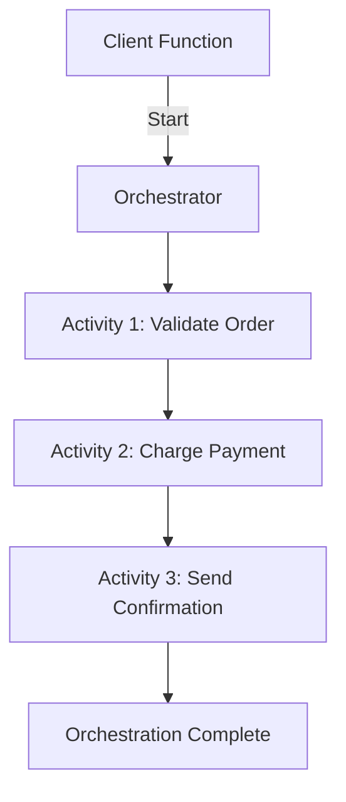
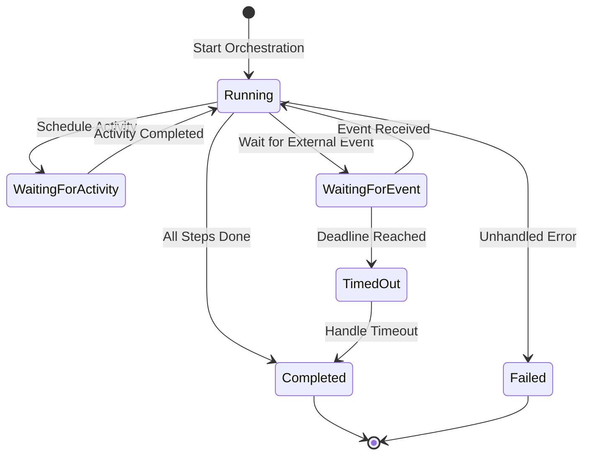

# How to Create Azure Functions in TypeScript with Durable Functions Orchestrations

Author: [nawazdhandala](https://www.github.com/nawazdhandala)

Tags: Azure Functions, TypeScript, Durable Functions, Serverless, Orchestration, Workflow, Node.js

Description: Learn how to create Azure Functions in TypeScript with Durable Functions orchestrations for building reliable, long-running serverless workflows.

---

Standard Azure Functions are stateless. They run, they return, and they forget. This works for simple tasks, but what about workflows that need to coordinate multiple steps, wait for external events, or run for hours? Durable Functions adds stateful orchestrations to Azure Functions. You write your workflow as a regular TypeScript function, and the Durable Functions runtime handles state persistence, checkpointing, and replay.

In this post, we will build Durable Functions in TypeScript. We will create orchestrations that coordinate multiple activities, implement fan-out/fan-in patterns, handle human approval workflows, and set up timers for long-running processes.

## Understanding Durable Functions

Durable Functions introduces three new function types:

- **Orchestrator functions**: Define the workflow logic. They coordinate activities and can pause and resume.
- **Activity functions**: The individual steps in a workflow. They do the actual work.
- **Client functions**: HTTP or queue-triggered functions that start orchestrations.

The orchestrator function does not execute activities directly. It schedules them and the Durable Functions runtime manages execution, checkpointing, and replay. This means your orchestrator code must be deterministic - no random values, no current time, no direct I/O.



## Setting Up the Project

Create a new Azure Functions project with TypeScript and Durable Functions support.

```bash
# Create the project
func init durable-demo --typescript --model V4
cd durable-demo

# Install Durable Functions package
npm install durable-functions
npm install @azure/functions

# Install TypeScript development dependencies
npm install --save-dev @types/node typescript
```

## Creating a Simple Orchestration

Let's build an order processing workflow with three steps: validation, payment, and notification.

First, define the activity functions.

```typescript
// src/functions/activities.ts
import { app, InvocationContext } from "@azure/functions";
import * as df from "durable-functions";

// Activity: Validate the order
df.app.activity("validateOrder", {
    handler: async (order: OrderInput, context: InvocationContext): Promise<ValidationResult> => {
        context.log(`Validating order ${order.orderId}`);

        // Check if the product exists and is in stock
        if (!order.productName || order.productName.trim().length === 0) {
            return { valid: false, reason: "Product name is required" };
        }

        if (order.quantity <= 0) {
            return { valid: false, reason: "Quantity must be positive" };
        }

        if (order.amount <= 0) {
            return { valid: false, reason: "Amount must be positive" };
        }

        // Simulate checking inventory
        await new Promise(resolve => setTimeout(resolve, 500));

        context.log(`Order ${order.orderId} validated successfully`);
        return { valid: true, reason: "Order is valid" };
    }
});

// Activity: Process payment
df.app.activity("processPayment", {
    handler: async (order: OrderInput, context: InvocationContext): Promise<PaymentResult> => {
        context.log(`Processing payment for order ${order.orderId}: $${order.amount}`);

        // Simulate payment processing
        await new Promise(resolve => setTimeout(resolve, 1000));

        // Simulate occasional payment failures
        if (order.amount > 50000) {
            throw new Error("Payment declined: amount exceeds limit");
        }

        const transactionId = `TXN-${Date.now()}`;
        context.log(`Payment processed: ${transactionId}`);

        return {
            success: true,
            transactionId,
            amount: order.amount
        };
    }
});

// Activity: Send confirmation
df.app.activity("sendConfirmation", {
    handler: async (input: ConfirmationInput, context: InvocationContext): Promise<string> => {
        context.log(`Sending confirmation for order ${input.orderId}`);

        // Simulate sending an email
        await new Promise(resolve => setTimeout(resolve, 300));

        context.log(`Confirmation sent to ${input.email}`);
        return `Confirmation sent to ${input.email} for order ${input.orderId}`;
    }
});

// Type definitions
interface OrderInput {
    orderId: string;
    productName: string;
    quantity: number;
    amount: number;
    email: string;
}

interface ValidationResult {
    valid: boolean;
    reason: string;
}

interface PaymentResult {
    success: boolean;
    transactionId: string;
    amount: number;
}

interface ConfirmationInput {
    orderId: string;
    email: string;
    transactionId: string;
}

export { OrderInput, ValidationResult, PaymentResult, ConfirmationInput };
```

Now create the orchestrator function.

```typescript
// src/functions/orderOrchestrator.ts
import * as df from "durable-functions";
import { OrchestrationContext, OrchestrationHandler } from "durable-functions";

// Orchestrator: coordinate the order processing workflow
const orderOrchestrator: OrchestrationHandler = function* (context: OrchestrationContext) {
    const order = context.df.getInput() as any;

    context.df.setCustomStatus("Validating order");

    // Step 1: Validate the order
    const validation = yield context.df.callActivity("validateOrder", order);

    if (!validation.valid) {
        context.df.setCustomStatus("Validation failed");
        return {
            status: "failed",
            reason: validation.reason,
            orderId: order.orderId
        };
    }

    context.df.setCustomStatus("Processing payment");

    // Step 2: Process payment with retry policy
    const retryOptions = new df.RetryOptions(5000, 3);  // 5 second interval, 3 attempts
    retryOptions.backoffCoefficient = 2;  // Exponential backoff

    let payment;
    try {
        payment = yield context.df.callActivityWithRetry(
            "processPayment",
            retryOptions,
            order
        );
    } catch (error) {
        context.df.setCustomStatus("Payment failed");
        return {
            status: "failed",
            reason: "Payment processing failed after retries",
            orderId: order.orderId
        };
    }

    context.df.setCustomStatus("Sending confirmation");

    // Step 3: Send confirmation
    const confirmation = yield context.df.callActivity("sendConfirmation", {
        orderId: order.orderId,
        email: order.email,
        transactionId: payment.transactionId
    });

    context.df.setCustomStatus("Completed");

    return {
        status: "completed",
        orderId: order.orderId,
        transactionId: payment.transactionId,
        confirmation
    };
};

df.app.orchestration("orderOrchestrator", orderOrchestrator);
```

Create the client function that starts orchestrations.

```typescript
// src/functions/httpStart.ts
import { app, HttpRequest, HttpResponse, InvocationContext } from "@azure/functions";
import * as df from "durable-functions";

// HTTP trigger that starts the order processing orchestration
app.http("startOrder", {
    route: "orders/start",
    methods: ["POST"],
    extraInputs: [df.input.durableClient()],
    handler: async (request: HttpRequest, context: InvocationContext): Promise<HttpResponse> => {
        const client = df.getClient(context);
        const body = await request.json() as any;

        // Validate the request
        if (!body.productName || !body.amount) {
            return new HttpResponse({
                status: 400,
                jsonBody: { error: "productName and amount are required" }
            });
        }

        // Create the order input
        const order = {
            orderId: `ORD-${Date.now()}`,
            productName: body.productName,
            quantity: body.quantity || 1,
            amount: body.amount,
            email: body.email || "customer@example.com"
        };

        // Start the orchestration
        const instanceId = await client.startNew("orderOrchestrator", {
            input: order
        });

        context.log(`Started orchestration ${instanceId} for order ${order.orderId}`);

        // Return the management URLs for checking status
        return client.createCheckStatusResponse(request, instanceId);
    }
});
```

## Fan-Out/Fan-In Pattern

When you need to process multiple items in parallel and then aggregate the results, use the fan-out/fan-in pattern.

```typescript
// src/functions/batchOrchestrator.ts
import * as df from "durable-functions";
import { OrchestrationContext, OrchestrationHandler } from "durable-functions";

// Activity to process a single item
df.app.activity("processItem", {
    handler: async (item: any, context: any): Promise<any> => {
        context.log(`Processing item: ${item.id}`);
        await new Promise(resolve => setTimeout(resolve, Math.random() * 2000));
        return { id: item.id, result: `Processed ${item.name}`, processedAt: new Date().toISOString() };
    }
});

// Orchestrator that processes items in parallel
const batchOrchestrator: OrchestrationHandler = function* (context: OrchestrationContext) {
    const items = context.df.getInput() as any[];

    context.df.setCustomStatus(`Processing ${items.length} items in parallel`);

    // Fan out: schedule all activities in parallel
    const parallelTasks = items.map(item =>
        context.df.callActivity("processItem", item)
    );

    // Fan in: wait for all activities to complete
    const results = yield context.df.Task.all(parallelTasks);

    context.df.setCustomStatus("All items processed");

    return {
        totalItems: items.length,
        results,
        completedAt: context.df.currentUtcDateTime.toISOString()
    };
};

df.app.orchestration("batchOrchestrator", batchOrchestrator);
```

## Human Approval Workflow

Durable Functions can pause and wait for external events, making them perfect for approval workflows.

```typescript
// src/functions/approvalOrchestrator.ts
import * as df from "durable-functions";
import { OrchestrationContext, OrchestrationHandler } from "durable-functions";

// Activity to send an approval request
df.app.activity("sendApprovalRequest", {
    handler: async (input: any, context: any): Promise<void> => {
        context.log(`Sending approval request to ${input.approver} for ${input.description}`);
        // In a real app, send an email or Teams message with approve/reject links
    }
});

// Activity to execute the approved action
df.app.activity("executeAction", {
    handler: async (input: any, context: any): Promise<string> => {
        context.log(`Executing approved action: ${input.description}`);
        return `Action "${input.description}" executed successfully`;
    }
});

// Orchestrator that waits for human approval
const approvalOrchestrator: OrchestrationHandler = function* (context: OrchestrationContext) {
    const request = context.df.getInput() as any;

    // Step 1: Send the approval request
    yield context.df.callActivity("sendApprovalRequest", {
        approver: request.approver,
        description: request.description,
        instanceId: context.df.instanceId
    });

    context.df.setCustomStatus("Waiting for approval");

    // Step 2: Wait for the approval event with a timeout
    // Create a timer for the deadline
    const deadline = context.df.currentUtcDateTime;
    deadline.setHours(deadline.getHours() + 72);  // 72-hour timeout

    const approvalEvent = context.df.waitForExternalEvent("ApprovalResponse");
    const timeout = context.df.createTimer(deadline);

    // Race between the approval and the timeout
    const winner = yield context.df.Task.any([approvalEvent, timeout]);

    if (winner === approvalEvent) {
        // Cancel the timer since we got a response
        timeout.cancel();

        const response = approvalEvent.result as any;

        if (response.approved) {
            context.df.setCustomStatus("Approved - executing");

            // Step 3: Execute the approved action
            const result = yield context.df.callActivity("executeAction", {
                description: request.description
            });

            return { status: "approved", result };
        } else {
            context.df.setCustomStatus("Rejected");
            return { status: "rejected", reason: response.reason };
        }
    } else {
        // Timeout - no response within the deadline
        context.df.setCustomStatus("Timed out");
        return { status: "timed_out", message: "No response within 72 hours" };
    }
};

df.app.orchestration("approvalOrchestrator", approvalOrchestrator);
```

Create an endpoint to submit approval responses.

```typescript
// src/functions/approvalResponse.ts
import { app, HttpRequest, HttpResponse, InvocationContext } from "@azure/functions";
import * as df from "durable-functions";

// HTTP endpoint to submit an approval decision
app.http("submitApproval", {
    route: "approvals/{instanceId}/respond",
    methods: ["POST"],
    extraInputs: [df.input.durableClient()],
    handler: async (request: HttpRequest, context: InvocationContext): Promise<HttpResponse> => {
        const client = df.getClient(context);
        const instanceId = request.params.instanceId;
        const body = await request.json() as any;

        // Raise the approval event to the waiting orchestration
        await client.raiseEvent(instanceId, "ApprovalResponse", {
            approved: body.approved,
            reason: body.reason || "",
            approvedBy: body.approvedBy
        });

        return new HttpResponse({
            status: 200,
            jsonBody: {
                message: `Approval response submitted for ${instanceId}`,
                approved: body.approved
            }
        });
    }
});
```

## Checking Orchestration Status

The Durable Functions client provides management endpoints automatically. When you start an orchestration, the response includes URLs for checking status, terminating, and raising events.

```bash
# Start an order orchestration
curl -X POST http://localhost:7071/api/orders/start \
  -H "Content-Type: application/json" \
  -d '{"productName": "Laptop", "amount": 999.99, "email": "user@test.com"}'

# The response includes management URLs:
# - statusQueryGetUri: Check current status
# - sendEventPostUri: Send events (for approval workflows)
# - terminatePostUri: Cancel the orchestration
# - purgeHistoryDeleteUri: Delete history
```

## Deploying to Azure

Deploy your Durable Functions to Azure.

```bash
# Create the function app with a storage account
az functionapp create \
  --name my-durable-functions \
  --resource-group functions-rg \
  --storage-account durablefuncsstore \
  --consumption-plan-location eastus \
  --runtime node \
  --runtime-version 20 \
  --functions-version 4

# Deploy
func azure functionapp publish my-durable-functions
```

## The Orchestration State Machine

Here is how the Durable Functions runtime manages orchestration state.



## Best Practices

Keep your orchestrator functions deterministic. Do not use `Date.now()`, `Math.random()`, or make HTTP calls directly. Use `context.df.currentUtcDateTime` for timestamps and activity functions for I/O.

Keep activities focused and small. Each activity should do one thing. This makes the workflow easier to understand, test, and retry.

Use retry policies on activities that call external services. Network calls fail, services go down temporarily, and retries with backoff handle these gracefully.

Set custom status on your orchestrator so you can monitor progress through the management API. This is especially valuable for long-running workflows where you need visibility into what step is currently executing.

## Wrapping Up

Durable Functions in TypeScript brings stateful workflows to the serverless world. Sequential workflows, parallel processing, human approval loops, and long-running timers are all possible with a straightforward programming model. The Durable Functions runtime handles state persistence, replay, and recovery automatically. You write your workflow as a generator function, schedule activities, and let the framework manage the complexity. Start with simple sequential orchestrations and graduate to more complex patterns like fan-out/fan-in and sub-orchestrations as your workflows grow.
