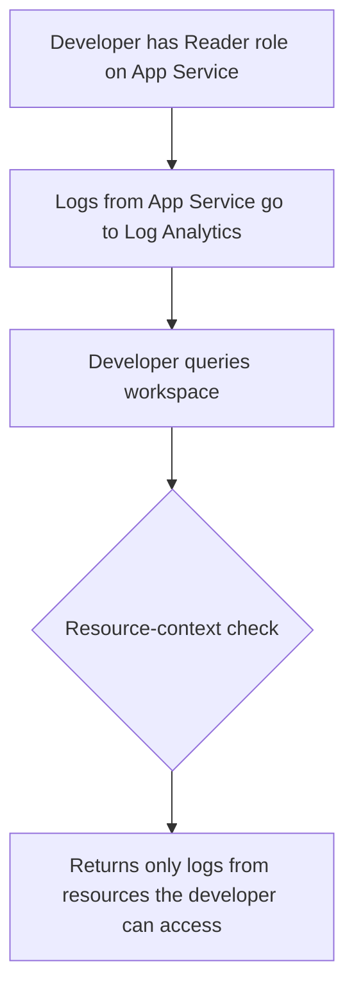

# How to Create Azure Log Analytics Workspace-Level Access Control for Different Teams

Author: [nawazdhandala](https://www.github.com/nawazdhandala)

Tags: Azure Log Analytics, Access Control, RBAC, Security, Azure Monitor, Governance, Multi-Team

Description: Learn how to implement workspace-level and table-level access control in Azure Log Analytics to give different teams appropriate access to log data.

---

When multiple teams share a Log Analytics workspace, you run into a fundamental access control problem. The security team needs access to sign-in logs and audit trails but should not see application performance data. The development team needs their application logs but should not see infrastructure security events. The finance team needs cost data but nothing else.

Azure Log Analytics supports granular access control at the workspace level, table level, and even through custom RBAC roles. This guide covers how to set up access control that gives each team exactly what they need and nothing more.

## Understanding the Access Control Models

Log Analytics supports two access control modes:

**Workspace-context permissions**: Users get access to all data in the workspace based on their role. This is the simpler model and works when all users should see all data.

**Resource-context permissions**: Users get access to log data based on their access to the Azure resources that generated the logs. If a developer has Reader access to a VM, they can see logs from that VM in any workspace where those logs are stored.

You can also combine these models with table-level RBAC for fine-grained control.

## Step 1: Check and Set the Access Control Mode

First, verify your workspace access control mode:

```bash
# Check the current access control mode
az monitor log-analytics workspace show \
  --resource-group myRG \
  --workspace-name myWorkspace \
  --query "features.enableLogAccessUsingOnlyResourcePermissions"
```

If this returns `true`, the workspace uses resource-context permissions. If `false` or null, it uses workspace-context permissions.

To enable resource-context permissions:

```bash
# Enable resource-context access control
az monitor log-analytics workspace update \
  --resource-group myRG \
  --workspace-name myWorkspace \
  --set features.enableLogAccessUsingOnlyResourcePermissions=true
```

With resource-context enabled, users who have access to specific Azure resources can query logs from those resources without needing workspace-level permissions.

## Step 2: Assign Workspace-Level Roles

Azure provides built-in roles for Log Analytics:

- **Log Analytics Reader**: Can view and search all data in the workspace, and view monitoring settings
- **Log Analytics Contributor**: Same as Reader, plus can configure monitoring settings, install solutions, and manage saved searches
- **Monitoring Reader**: Can read all monitoring data (broader than just Log Analytics)
- **Monitoring Contributor**: Can read all monitoring data and update monitoring settings

Assign the appropriate role to each team:

```bash
# Give the security team read access to the workspace
az role assignment create \
  --assignee security-team@company.com \
  --role "Log Analytics Reader" \
  --scope /subscriptions/<sub-id>/resourceGroups/myRG/providers/Microsoft.OperationalInsights/workspaces/myWorkspace

# Give the platform team contributor access
az role assignment create \
  --assignee platform-team@company.com \
  --role "Log Analytics Contributor" \
  --scope /subscriptions/<sub-id>/resourceGroups/myRG/providers/Microsoft.OperationalInsights/workspaces/myWorkspace
```

## Step 3: Implement Table-Level RBAC

Table-level RBAC is the most granular control option. It lets you restrict which tables a user or group can read.

For example, you might want the security team to access `SecurityEvent`, `SigninLogs`, and `AuditLogs` tables, but not `AppPerformanceCounters` or `ContainerLog`.

Set table-level access using Azure CLI:

```bash
# Grant read access to specific tables for the security team
az monitor log-analytics workspace table update \
  --resource-group myRG \
  --workspace-name myWorkspace \
  --name SecurityEvent \
  --plan Analytics

# Create a custom role that grants read on specific tables
az role definition create --role-definition '{
  "Name": "Security Logs Reader",
  "Description": "Can read security-related log tables",
  "Actions": [
    "Microsoft.OperationalInsights/workspaces/read",
    "Microsoft.OperationalInsights/workspaces/query/read",
    "Microsoft.OperationalInsights/workspaces/query/SecurityEvent/read",
    "Microsoft.OperationalInsights/workspaces/query/SigninLogs/read",
    "Microsoft.OperationalInsights/workspaces/query/AuditLogs/read",
    "Microsoft.OperationalInsights/workspaces/query/AADNonInteractiveUserSignInLogs/read"
  ],
  "NotActions": [],
  "AssignableScopes": [
    "/subscriptions/<sub-id>"
  ]
}'
```

Then assign this custom role:

```bash
# Assign the custom role to the security team
az role assignment create \
  --assignee security-team@company.com \
  --role "Security Logs Reader" \
  --scope /subscriptions/<sub-id>/resourceGroups/myRG/providers/Microsoft.OperationalInsights/workspaces/myWorkspace
```

Now the security team can only query the four tables listed in the role definition. Queries against any other table will return an access denied error.

## Step 4: Create Custom Roles for Each Team

Define custom roles that match each team's needs:

**Development team role** - access to application logs:

```json
{
  "Name": "App Logs Reader",
  "Description": "Can read application log tables",
  "Actions": [
    "Microsoft.OperationalInsights/workspaces/read",
    "Microsoft.OperationalInsights/workspaces/query/read",
    "Microsoft.OperationalInsights/workspaces/query/AppRequests/read",
    "Microsoft.OperationalInsights/workspaces/query/AppDependencies/read",
    "Microsoft.OperationalInsights/workspaces/query/AppExceptions/read",
    "Microsoft.OperationalInsights/workspaces/query/AppTraces/read",
    "Microsoft.OperationalInsights/workspaces/query/AppPerformanceCounters/read",
    "Microsoft.OperationalInsights/workspaces/query/AppEvents/read"
  ],
  "NotActions": [],
  "AssignableScopes": [
    "/subscriptions/<sub-id>"
  ]
}
```

**Infrastructure team role** - access to VM and infrastructure logs:

```json
{
  "Name": "Infra Logs Reader",
  "Description": "Can read infrastructure log tables",
  "Actions": [
    "Microsoft.OperationalInsights/workspaces/read",
    "Microsoft.OperationalInsights/workspaces/query/read",
    "Microsoft.OperationalInsights/workspaces/query/Heartbeat/read",
    "Microsoft.OperationalInsights/workspaces/query/Perf/read",
    "Microsoft.OperationalInsights/workspaces/query/InsightsMetrics/read",
    "Microsoft.OperationalInsights/workspaces/query/VMConnection/read",
    "Microsoft.OperationalInsights/workspaces/query/Syslog/read",
    "Microsoft.OperationalInsights/workspaces/query/Event/read",
    "Microsoft.OperationalInsights/workspaces/query/W3CIISLog/read"
  ],
  "NotActions": [],
  "AssignableScopes": [
    "/subscriptions/<sub-id>"
  ]
}
```

## Step 5: Use Resource-Context Access for Developers

Resource-context access is often the most practical approach for development teams. Instead of managing table-level permissions, you give developers access to their resources and they automatically get access to the logs from those resources.

The flow works like this:



This means a developer with Reader access to `web-app-prod` can query the workspace and will only see logs generated by `web-app-prod`. They cannot see logs from `database-prod` or `vm-security-01` unless they also have access to those resources.

To use this approach, make sure resource-context is enabled (Step 1) and that your log data includes the `_ResourceId` column (which it does by default for most Azure resources).

## Step 6: Restrict Access to Sensitive Columns

Some tables contain columns with sensitive data. For example, the `SecurityEvent` table includes the `EventData` column which might contain user information.

While Azure does not support column-level RBAC natively, you can use workspace functions as a data access layer:

```kql
// Create a function that exposes only non-sensitive columns
// Save this as a workspace function called "SafeSecurityEvents"
SecurityEvent
| project TimeGenerated, Computer, EventID, Activity, Level, Task
// Deliberately exclude EventData, Account, and other sensitive fields
```

Teams use the function instead of querying the table directly. This is not a security boundary (users with table access can still query the raw table), but it provides a practical abstraction for dashboards and shared queries.

## Step 7: Audit Access to Log Data

Track who is accessing your log data by enabling diagnostic settings on the workspace:

```bash
# Enable audit logging for the Log Analytics workspace
az monitor diagnostic-settings create \
  --name workspace-audit \
  --resource /subscriptions/<sub-id>/resourceGroups/myRG/providers/Microsoft.OperationalInsights/workspaces/myWorkspace \
  --workspace /subscriptions/<sub-id>/resourceGroups/myRG/providers/Microsoft.OperationalInsights/workspaces/auditWorkspace \
  --logs '[{"category":"Audit","enabled":true}]'
```

Query the audit logs to see who accessed what:

```kql
// See who has been querying the workspace
LAQueryLogs
| where TimeGenerated > ago(7d)
| summarize QueryCount = count(), LastQuery = max(TimeGenerated) by AADEmail
| order by QueryCount desc
```

```kql
// Find queries that accessed sensitive tables
LAQueryLogs
| where TimeGenerated > ago(24h)
| where QueryText has_any ("SecurityEvent", "SigninLogs", "AuditLogs")
| project TimeGenerated, AADEmail, QueryText, ResponseRowCount
| order by TimeGenerated desc
```

## Multi-Workspace Strategy

If table-level RBAC is too complex to manage, consider using multiple workspaces instead:

- **Security workspace**: Contains SecurityEvent, SigninLogs, AuditLogs - accessible only to the security team
- **Application workspace**: Contains Application Insights data - accessible to development teams
- **Infrastructure workspace**: Contains VM metrics, container logs - accessible to the platform team

The trade-off is that cross-workspace queries are slower and more complex, but the access control model is simpler.

You can still run cross-workspace queries when needed:

```kql
// Cross-workspace query (requires access to both workspaces)
union
    workspace("security-workspace").SecurityEvent,
    workspace("app-workspace").AppRequests
| where TimeGenerated > ago(1h)
```

## Best Practices

1. **Start with resource-context**: It is the most natural model for most organizations. Users see logs from resources they manage.
2. **Use custom roles sparingly**: Only create table-level roles when resource-context is not granular enough.
3. **Document your access model**: Create a matrix showing which teams have access to which tables or resources.
4. **Review access regularly**: Use the audit logs to verify that access patterns match your intended policy.
5. **Use Azure AD groups**: Assign roles to groups rather than individual users. This makes management much easier as people join and leave teams.

## Summary

Log Analytics access control ranges from simple workspace-level roles to granular table-level RBAC and resource-context permissions. For most organizations, resource-context permissions combined with a few custom roles provide the right balance of security and simplicity. The key is matching the access model to your organizational structure and data sensitivity requirements, then auditing regularly to ensure the controls are working as intended.
